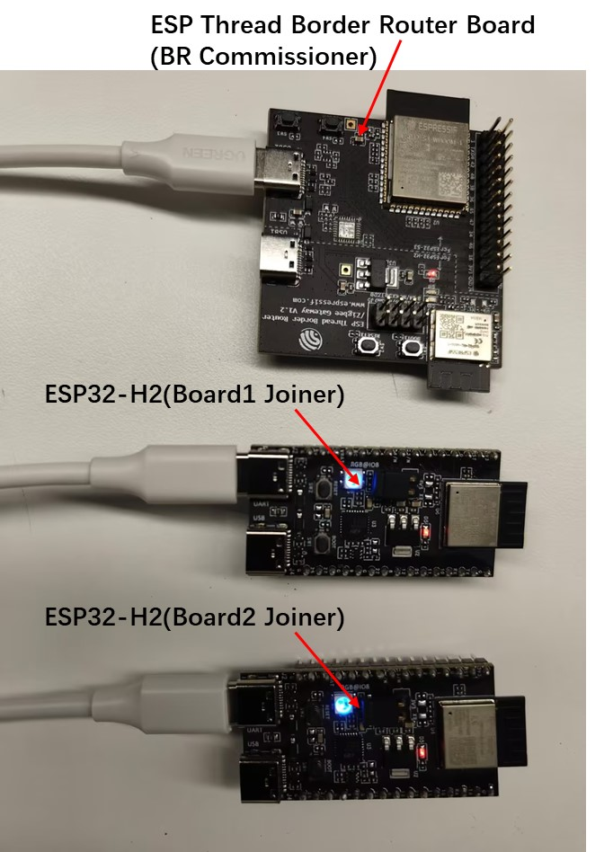
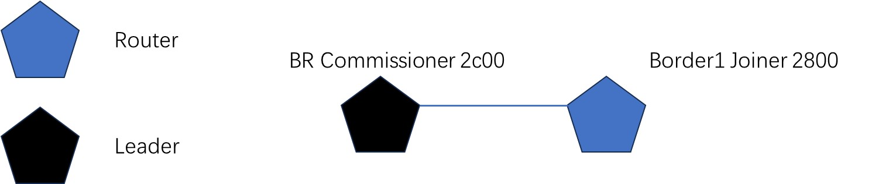
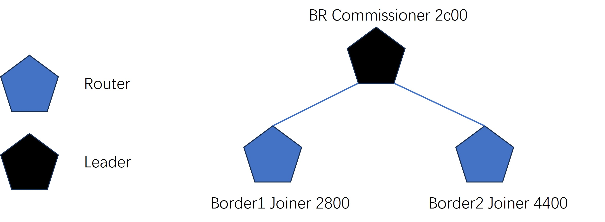
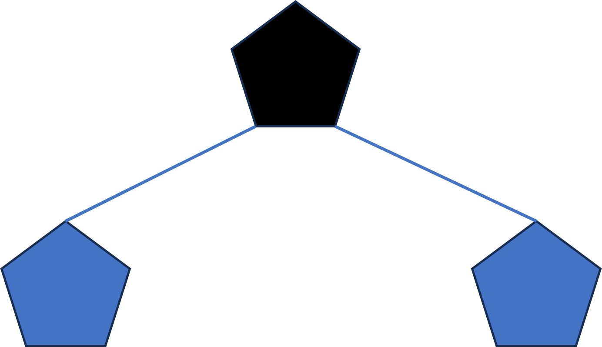

# Build a Thread Network with the ESP32H2 and ESP Thread Border Router Board

[Codelab Feedback](https://github.com/openthread/ot-docs/issues)

## Introduction

Duration: 3:00


[OpenThread](https://openthread.io/), released by the Google Nest team, is an open-source implementation of the [Thread®](http://threadgroup.org/) networking protocol designed to accelerate the development of products for the connected home. The [Thread Specification](https://www.threadgroup.org/support#specifications) defines an IPv6-based reliable, secure, and low-power wireless device-to-device communication protocol for home and commercial building applications.

[Espressif](https://www.espressif.com/) has ported the OpenThread stack based on FreeRTOS and LwIP, enabling developers to rapidly build Thread networks. The related source code can be obtained from [GitHub](https://github.com/espressif/esp-idf/tree/master/examples/openthread). At the same time, Espressif has also implemented a [Thread Border Router](https://github.com/espressif/esp-thread-br) based on RTOS.

In this Codelab, you'll program OpenThread on real hardware, create and manage a Thread network, and pass messages between nodes.



### What you'll learn

* Building and flashing OpenThread CLI binaries to ESP boards.
* Building and flashing border router to ESP Thread Border Router board.
* Manually managing Thread nodes with ESP Monitor and the OpenThread CLI.
* Forming a Thread network on the Thread Border Router.
* Securing commissioning of devices onto a Thread network.
* Pinging IPv6 address between Thread nodes.
* Passing messages between Thread nodes with UDP.


### What you'll need

Hardware:

* 2 ESP boards with IEEE 802.15.4 modules.

   * [ESP32-H2](https://www.espressif.com/en/products/socs/esp32-h2)
   * [ESP32-C6](https://www.espressif.com/en/products/socs/esp32-c6)

* 1 ESP Thread Border Router Board.

Software:

* [ESP-IDF](https://github.com/espressif/esp-idf).
* [ESP-THREAD-BR](https://github.com/espressif/esp-thread-br).

## Getting started

Duration: 15:00

1. ESP-IDF Installation.

Please follow the [ESP-IDF Programming Guide](https://docs.espressif.com/projects/esp-idf/en/latest/esp32/get-started/index.html#manual-installation) to install the software development environment.

> aside positive
>
> **Note:** For the ESP-IDF branch, We highly recommend using version 5.1.1 or later.

2. Clone the ESP Thread Border Router SDK.

[ESP-THREAD-BR](https://github.com/espressif/esp-thread-br) is the official ESP Thread Border Router SDK. It supports all fundamental network features to build a Thread Border Router and integrates rich product level features for quick productization.

   ```console
   $ cd <your-local-workspace>
   $ git clone --recursive https://github.com/espressif/esp-thread-br.git
   ```

> aside positive
>
> **Note:** This document will show how to run this codelab on Linux. For other operating systems or IDEs, you can modify the relevant commands as needed.

## Build and flash

Duration: 5:00

For building and flashing the ot-cli-ftd binary file on ESP boards with IEEE 802.15.4 modules, you can refer to ESP-IDF example [ot_cli](https://github.com/espressif/esp-idf/tree/master/examples/openthread/ot_cli) for more details:

```console
$ cd <your-idf-path>/examples/openthread/ot_cli
$ idf.py set-target <your-board-type>
```

Enable the joiner feature via menuconfig:

```console
$ idf.py menuconfig
```

Component config > OpenThread > Enable Joiner, then build and flash.

> aside positive
>
> **Note:** Connect `UART` port on the ESP boards to the host. To show the serial port number of the ESP boards, you can use `$ ls /dev/ttyUSB*`.

```console
$ idf.py -p <your-local-port> build flash monitor
```

For building and flashing the ot-br binary file on ESP Thread Border Router Board, you need to build the RCP binary file first. This RCP binary file doesn't need to be explicitly flashed to the device on the ESP Thread Border Router Board. It will be included in the Border Router binary file and flashed to the ESP32-H2 chip upon first boot (or the RCP firmware changed). You can refer to [ESP Thread BR docs](https://docs.espressif.com/projects/esp-thread-br/en/latest/dev-guide/build_and_run.html) for more details:

```console
$ cd <your-idf-path>/examples/openthread/ot_rcp
$ idf.py set-target esp32h2
$ idf.py build
$ cd <your-esp-thread-br-path>/examples/basic_thread_border_router
$ idf.py set-target esp32s3
```

Enable the commissioner feature via menuconfig:

```console
$ idf.py menuconfig
```

Component config > OpenThread > Enable Commissioner, then build and flash.

> aside positive
>
> **Note:** Only the `USB2` port on the ESP Thread Border Router Board needs to be connected to the host. To show the serial port number of the ESP Thread Border Router Board, you can use `$ ls /dev/ttyACM*`.

```console
$ idf.py -p <your-local-port> build flash monitor
```

## Forming a Thread network on the Thread Border Router

Duration: 3:00

Now you can form a Thread network using the OpenThread command line on ESP Thread Border Router Board (BR Commissioner):

> aside positive
>
> `dataset init new` creates a new Operational Dataset with random values.
**Your values will differ from the values shown in this Codelab.** Replace the values in the Codelab example commands with the values from your Operational Dataset.

```console
## BR Commissioner ##
----------------------
> dataset init new
Done
> dataset
Active Timestamp: 1
Channel: 21
Channel Mask: 0x07fff800
Ext PAN ID: 151975d11bea97b5
Mesh Local Prefix: fd6a:b54b:d6a3:b05a::/64
Network Key: 731ab6a60a64a0a0b14b259b86b2be01
Network Name: OpenThread-1444
PAN ID: 0x1444
PSKc: 54e7f18d2575014da94db09df29c5df0
Security Policy: 672 onrc 0
Done
```

Commit this dataset as the active one:

```console
> dataset commit active
Done
```

Bring up the IPv6 interface:

```console
> ifconfig up
I (59329) OPENTHREAD: Platform UDP bound to port 49153
Done
I (59329) OT_STATE: netif up
```

Start Thread protocol operation:

```console
> thread start
I(61709) OPENTHREAD:[N] Mle-----------: Role disabled -> detached
Done
> I(62469) OPENTHREAD:[N] Mle-----------: Attach attempt 1, AnyPartition reattaching with Active Dataset
I(69079) OPENTHREAD:[N] RouterTable---: Allocate router id 11
I(69079) OPENTHREAD:[N] Mle-----------: RLOC16 fffe -> 2c00
I(69089) OPENTHREAD:[N] Mle-----------: Role detached -> leader
I(69089) OPENTHREAD:[N] Mle-----------: Partition ID 0x28b518c6
I (69099) OPENTHREAD: Platform UDP bound to port 49154
```

After a moment, check the device state. It should be the Leader.

```console
> state
leader
Done
> 
```

## Join the Thread network via networkkey

Duration: 3:00

In this codelab, two ESP boards with IEEE 802.15.4 modules are prepared for joining the BR formed network. In this session, we will add Board1 to the network.

Get the networkkey from BR:

```console

## BR Commissioner ##
----------------------
> networkkey
731ab6a60a64a0a0b14b259b86b2be01
Done
> 
```

Set this networkkey to one ESP board (Board1 Joiner) with IEEE 802.15.4 modules:

```console
## Board1 Joiner ##
----------------------
> dataset networkkey 731ab6a60a64a0a0b14b259b86b2be01
Done
```

Commit this dataset as the active one:

```console
> dataset commit active
Done
```

Bring up the IPv6 interface:

```console
> ifconfig up
Done
I (20308) OT_STATE: netif up
```

Start Thread protocol operation:

```console
> thread start
I(23058) OPENTHREAD:[N] Mle-----------: Role disabled -> detached
Done
> I(23408) OPENTHREAD:[N] Mle-----------: Attach attempt 1, AnyPartition reattaching with Active Dataset
I(30028) OPENTHREAD:[N] Mle-----------: Attach attempt 1 unsuccessful, will try again in 0.288 seconds
I(30328) OPENTHREAD:[N] Mle-----------: Attach attempt 2, AnyPartition 
I(33498) OPENTHREAD:[N] Mle-----------: Delay processing Announce - channel 21, panid 0x1444
I(33758) OPENTHREAD:[N] Mle-----------: Processing Announce - channel 21, panid 0x1444
I(33758) OPENTHREAD:[N] Mle-----------: Role detached -> disabled
I(33758) OPENTHREAD:[N] Mle-----------: Role disabled -> detached
I(34178) OPENTHREAD:[N] Mle-----------: Attach attempt 1, AnyPartition 
I(35068) OPENTHREAD:[N] Mle-----------: RLOC16 fffe -> 2c01
I(35068) OPENTHREAD:[N] Mle-----------: Role detached -> child
```

After a moment, check the device state. It should be the Child.

```console
> state
child
Done
```

Set the role to Router.

```console
> state router
Done
I(51028) OPENTHREAD:[N] Mle-----------: RLOC16 2c01 -> 2800
I(51028) OPENTHREAD:[N] Mle-----------: Role child -> router
I(51028) OPENTHREAD:[N] Mle-----------: Partition ID 0x28b518c6
> 
```



## Join the Thread network via secure commissioning

Duration: 5:00

In this session, we will add Board2 to the network via security commissioning:

Get the PSKc and panid from BR Commissioner:

```console

## BR Commissioner ##
----------------------
> pskc
54e7f18d2575014da94db09df29c5df0
Done
> panid
0x1444
Done
```

Configure the network information to Board2:


```console

## Board2 Joiner ##
----------------------
> dataset pskc 54e7f18d2575014da94db09df29c5df0
Done
> dataset panid 0x1444
Done
```

Commit this dataset as the active one:

```console

## Board2 Joiner ##
----------------------
> dataset commit active 
Done
```

Bring up the IPv6 interface:

```console

## Board2 Joiner ##
----------------------
> ifconfig up
Done
I (29146) OT_STATE: netif up
```

Get the eui64 from Board2:

```console
## Board2 Joiner ##
----------------------
> eui64
4831b7fffec02be1
Done
```

On the **BR Commissioner**, start the commissioner and specify the `eui64` of the device that can join, along with the Joiner Credential, for example `J01NME`. The Joiner Credential is a device-specific string of all uppercase alphanumeric characters (0-9 and A-Y, excluding I, O, Q and Z for readability), with a length between 6 and 32 characters.

```console

## BR Commissioner ##
----------------------
> commissioner start
Commissioner: petitioning
Done
Commissioner: active
> commissioner joiner add 4831b7fffec02be1 J01NME
Done
```

Switch to the **Board2 Joiner**. Start the joiner role with the Joiner Credential that you just set up on the BR Commissioner:

```console
## Board2 Joiner ##
----------------------
> ifconfig up
Done
> joiner start J01NME
Done
```

Within a minute or so, you get a confirmation of a successful authentication:

```console
## Board2 Joiner ##
----------------------
>
Join success
```

After that, you can start and join the Thread network formed by the BR Commissioner.

Start Thread protocol operation:

```console
> thread start
I(35727) OPENTHREAD:[N] Mle-----------: Role disabled -> detached
Done
> I(36197) OPENTHREAD:[N] Mle-----------: Attach attempt 1, AnyPartition reattaching with Active Dataset
I(37007) OPENTHREAD:[N] Mle-----------: RLOC16 fffe -> 2801
I(37007) OPENTHREAD:[N] Mle-----------: Role detached -> child

```

Set the role to Router.

```console
> state router
Done
I(46057) OPENTHREAD:[N] Mle-----------: RLOC16 2801 -> 4400
I(46057) OPENTHREAD:[N] Mle-----------: Role child -> router
I(46057) OPENTHREAD:[N] Mle-----------: Partition ID 0x28b518c6
> 
```

Now you get a Thread network with the topology shown below:



## Pinging IPv6 address between Thread nodes

Duration: 2:00

You can use the ping command to communicate between any two boards. Use the command `ipaddr` to print the IPv6 address of each board:

> aside positive
>
> A single Thread node has multiple IPv6 addresses. For more information, see [IPv6 Addressing](../../guides/thread-primer/ipv6-addressing.md#unicast-address-types).

```console
## BR Commissioner ##
----------------------
> ipaddr
fd6a:b54b:d6a3:b05a:0:ff:fe00:fc00          # Leader Anycast Locator (ALOC)
fd6a:b54b:d6a3:b05a:0:ff:fe00:2c00          # Routing Locator (RLOC)
fd6a:b54b:d6a3:b05a:a8df:eb43:63d8:bda0     # Mesh-Local EID (ML-EID) 
fe80:0:0:0:687c:7248:cc14:9c4d              # Link-Local Address (LLA)
Done
> 
```

```console
## Board1 Joiner ##
----------------------
> ipaddr
fd6a:b54b:d6a3:b05a:0:ff:fe00:2800          # Routing Locator (RLOC)
fd6a:b54b:d6a3:b05a:e461:db08:c833:1248     # Mesh-Local EID (ML-EID)
fe80:0:0:0:18ac:df04:4671:6a45              # Link-Local Address (LLA)
Done
```

```console
## Board2 Joiner ##
----------------------
> ipaddr
fd6a:b54b:d6a3:b05a:0:ff:fe00:4400          # Routing Locator (RLOC)
fd6a:b54b:d6a3:b05a:d7dc:8e90:9bc9:ecbc     # Mesh-Local EID (ML-EID)
fe80:0:0:0:a8cc:1483:f696:91a2              # Link-Local Address (LLA)
Done
```

For example, to ping Board2 MLE-ID from BR Commissioner, you can run this command on BR Commissioner:

```console
## BR Commissioner ##
----------------------
> ping fd6a:b54b:d6a3:b05a:d7dc:8e90:9bc9:ecbc
16 bytes from fd6a:b54b:d6a3:b05a:d7dc:8e90:9bc9:ecbc: icmp_seq=1 hlim=255 time=123ms
1 packets transmitted, 1 packets received. Packet loss = 0.0%. Round-trip min/avg/max = 123/123.0/123 ms.
Done
```

## Passing messages between Thread nodes with UDP

Duration: 3:00

In this session, you will learn how to send a message between two Thread devices. For example, open udp and bind it on port `20617` and listen for all addresses on BR:

```console
## BR Commissioner ##
----------------------
> udp open
Done
> udp bind :: 20617
I (1298739) OPENTHREAD: Platform UDP bound to port 20617
Done
```

Then send a message from Board1 to BR MLE-ID address and port `20617`:

```console
## Board1 Joiner ##
----------------------
> udp open
Done
> udp send fd6a:b54b:d6a3:b05a:a8df:eb43:63d8:bda0 20617 ESP
```

You can see the message received on BR:

```console
## BR Commissioner ##
----------------------
3 bytes from fd6a:b54b:d6a3:b05a:e461:db08:c833:1248 49154 ESP
```

## Congratulations!

**You've created a physical Thread network using ESP boards!**



You now know:

* Building and flashing OpenThread CLI binaries to ESP boards.
* Building an flashing border router to ESP Thread Border Router board.
* Manually managing Thread nodes with ESP Monitor and the OpenThread CLI.
* Forming a Thread network on the Thread Border Router.
* Securing commissioning of devices onto a Thread network.
* Pinging IPv6 address between Thread nodes.
* Passing messages between Thread nodes with UDP.

### Further reading

Check out [openthread.io](https://openthread.io/) and
[GitHub](https://github.com/openthread) for a variety of OpenThread resources,
including:

*  [Supported Platforms](https://openthread.io/platforms/)
    — discover all the platforms that support OpenThread
*  [Build OpenThread](../../guides/build/index.md)
    — further details on building and configuring OpenThread
*  [Thread Primer](../../guides/thread-primer/index.md)
    — covers all the Thread concepts featured in this Codelab

Reference:

*  [OpenThread CLI reference](https://github.com/openthread/openthread/blob/main/src/cli/README.md)
*  [OpenThread UDP CLI reference](https://github.com/openthread/openthread/blob/main/src/cli/README_UDP.md)
*  [OpenThread UDP API reference](https://openthread.io/reference/group/api-udp)
*  [ESP Thread BR docs](https://docs.espressif.com/projects/esp-thread-br/en/latest/dev-guide/build_and_run.html)

## License

Copyright (c) 2021-2023, The OpenThread Authors.
All rights reserved.

Redistribution and use in source and binary forms, with or without
modification, are permitted provided that the following conditions are met:
1. Redistributions of source code must retain the above copyright
   notice, this list of conditions and the following disclaimer.
2. Redistributions in binary form must reproduce the above copyright
   notice, this list of conditions and the following disclaimer in the
   documentation and/or other materials provided with the distribution.
3. Neither the name of the copyright holder nor the
   names of its contributors may be used to endorse or promote products
   derived from this software without specific prior written permission.

THIS SOFTWARE IS PROVIDED BY THE COPYRIGHT HOLDERS AND CONTRIBUTORS "AS IS"
AND ANY EXPRESS OR IMPLIED WARRANTIES, INCLUDING, BUT NOT LIMITED TO, THE
IMPLIED WARRANTIES OF MERCHANTABILITY AND FITNESS FOR A PARTICULAR PURPOSE
ARE DISCLAIMED. IN NO EVENT SHALL THE COPYRIGHT HOLDER OR CONTRIBUTORS BE
LIABLE FOR ANY DIRECT, INDIRECT, INCIDENTAL, SPECIAL, EXEMPLARY, OR
CONSEQUENTIAL DAMAGES (INCLUDING, BUT NOT LIMITED TO, PROCUREMENT OF
SUBSTITUTE GOODS OR SERVICES; LOSS OF USE, DATA, OR PROFITS; OR BUSINESS
INTERRUPTION) HOWEVER CAUSED AND ON ANY THEORY OF LIABILITY, WHETHER IN
CONTRACT, STRICT LIABILITY, OR TORT (INCLUDING NEGLIGENCE OR OTHERWISE)
ARISING IN ANY WAY OUT OF THE USE OF THIS SOFTWARE, EVEN IF ADVISED OF THE
POSSIBILITY OF SUCH DAMAGE.
