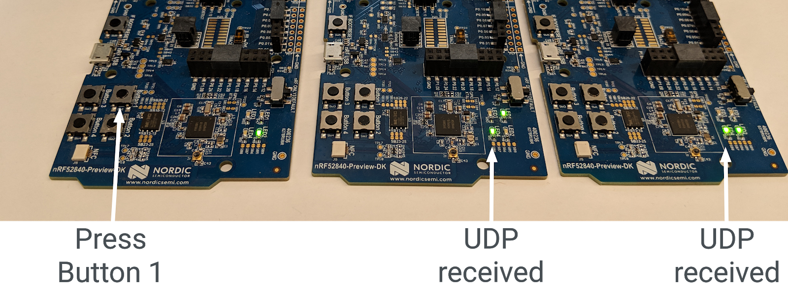

# Developing with OpenThread APIs

[Codelab Feedback](https://github.com/openthread/openthread/issues)


## Introduction


[OpenThread](https://openthread.io/) released by Nest is an open-source
implementation of the  [Thread®](http://threadgroup.org/) networking protocol.
Nest has released OpenThread to make the technology used in Nest products
broadly available to developers to accelerate the development of products for
the connected home.

The  [Thread specification](http://threadgroup.org/ThreadSpec) defines an
IPv6-based reliable, secure and low-power wireless device-to-device
communication protocol for home applications. OpenThread implements all Thread
networking layers including IPv6, 6LoWPAN, IEEE 802.15.4 with MAC security,
Mesh Link Establishment, and Mesh Routing.

In this Codelab, you'll use OpenThread APIs to start a Thread network, monitor
and react to changes in device roles, and send UDP messages, as well as tie
these actions to buttons and LEDs on real hardware.


### What you'll learn

* How to program the buttons and LEDs on Nordic nRF52840 dev boards
* How to use common OpenThread APIs and the `otInstance` class
* How to monitor and react to OpenThread state changes
* How to send UDP messages to all devices in a Thread network
* How to modify Makefiles

### What you'll need

Hardware:

* 3 Nordic Semiconductor nRF52840 dev boards
* 3 USB to Micro-USB cables to connect the boards
* A Linux machine with at least 3 USB ports

Software:

* GNU Toolchain
* Nordic nRF5x command line tools
* Segger J-Link software
* OpenThread
* Git

*Except as otherwise noted, the content of this Codelab is licensed under
the*  [*Creative Commons Attribution 3.0 License*](https://creativecommons.org/licenses/by/3.0/)*,
and code samples are licensed under
the*  [*Apache 2.0 License*](https://www.apache.org/licenses/LICENSE-2.0)*.*


## Getting started
Duration: 10:00


### Complete the Hardware Codelab

Before starting this Codelab, you should complete the
**Build a Thread Network with nRF52840 Boards and OpenThread** Codelab, which:

* Details all the software you need for building and flashing
* Teaches you how to build OpenThread and flash it on Nordic nRF52840 boards
* Demonstrates the basics of a Thread network

None of the environment set up required to build OpenThread and flash the
boards is detailed in this Codelab—only basic instructions for flashing the
boards. It is assumed you have already completed the Build a Thread Network
Codelab.

<button>[Complete the Build a Thread Network Codelab](https://openthread.io/codelabs/openthread-hardware)</button>

### Linux machine

This Codelab was designed to use an i386- or x86-based Linux machine to flash
all Thread development boards. All steps were tested on Ubuntu 14.04.5 LTS
(Trusty Tahr).

### Nordic Semiconductor nRF52840 boards

This Codelab uses three
[nRF52840 PDK boards](https://www.nordicsemi.com/Software-and-Tools/Development-Kits/nRF52840-DK).


> aside positive
>
> **Important:** Make sure the boards have sufficient power. Don't use a USB
port splitter to connect them to the Linux machine, and turn off any sleep
functionality for the Linux machine. Boards with insufficient power may behave
erratically.

### Install Software

To build and flash OpenThread,  you need to install SEGGER J-Link, the nRF5x
Command Line tools, the ARM GNU Toolchain, and various Linux packages. If you
have completed the Build a Thread Network Codelab as required, you will already
have everything you need installed. If not, complete that Codelab before
continuing to ensure you can build and flash OpenThread to nRF52840 dev boards.

<button>[Complete the Build a Thread Network Codelab](https://openthread.io/codelabs/openthread-hardware)</button>


## Clone the repository
Duration: 02:00


OpenThread comes with example application code you can use as a starting point
for this Codelab.

Clone the OpenThread Nordic nRF528xx examples repo and build OpenThread:

```console
$ git clone --recursive https://github.com/openthread/ot-nrf528xx
$ cd ot-nrf528xx
$ ./script/bootstrap
```

> aside positive
>
> **Note**: this is the repo we will be working with throughout this codelab. All
file paths mentioned in this codelab are relative to your local `ot-nrf528xx`
directory containing the cloned repo.

## OpenThread API Basics
Duration: 05:00


OpenThread's public APIs are located at  [`./openthread/include/openthread`](https://github.com/openthread/openthread/tree/main/include/openthread)
in the OpenThread repository. These APIs provide access to a variety of
OpenThread features and functionality at both a Thread- and platform-level
for use in your applications:

* OpenThread instance information and control
* Application services such as IPv6, UDP, and CoAP
* Network credential management, along with Commissioner and Joiner roles
* Border Router management
* Enhanced features such as Child Supervision and Jam Detection

Reference information on all OpenThread APIs are available at
[openthread.io/reference](https://openthread.io/reference).

### Using an API

To use an API, include its header file in one of your application files. Then
call the desired function.

For example, the CLI example app included with OpenThread uses the following API
headers:

####  [./openthread/examples/apps/cli/main.c](https://github.com/openthread/openthread/blob/main/examples/apps/cli/main.c)

```console
#include <openthread/config.h>
#include <openthread/cli.h>
#include <openthread/diag.h>
#include <openthread/tasklet.h>
#include <openthread/platform/logging.h>
```

### The OpenThread instance

The `otInstance` structure is something you'll use frequently when working with
the OpenThread APIs. Once initialized, this structure represents a static
instance of the OpenThread library and allows the user to make OpenThread
API calls.

> aside negative
>
> An OpenThread instance **must** be initialized to use the OpenThread APIs in
an application.

For example, the OpenThread instance is initialized in the `main()` function of
the CLI example app:

####  [./openthread/examples/apps/cli/main.c](https://github.com/openthread/openthread/blob/main/examples/apps/cli/main.c)

```console
int main(int argc, char *argv[])
{
    otInstance *instance

...

#if OPENTHREAD_ENABLE_MULTIPLE_INSTANCES
    // Call to query the buffer size
    (void)otInstanceInit(NULL, &otInstanceBufferLength);

    // Call to allocate the buffer
    otInstanceBuffer = (uint8_t *)malloc(otInstanceBufferLength);
    assert(otInstanceBuffer);

    // Initialize OpenThread with the buffer
    instance = otInstanceInit(otInstanceBuffer, &otInstanceBufferLength);
#else
    instance = otInstanceInitSingle();
#endif

...

    return 0;
}
```

> aside positive
>
> **Note:** Multiple instances can be used for an OpenThread application. In
this Codelab, we are only using a single instance.

### Platform-specific functions

If you want to add platform-specific functions to one of the example
applications included with OpenThread, first declare them in the
`./openthread/examples/platforms/openthread-system.h` header, using the `otSys` namespace for
all functions. Then implement them in a platform-specific source file.
Abstracted this way, you can use the same function headers for other example
platforms.

For example, the GPIO functions we're going to use to hook into the nRF52840
buttons and LEDs must be declared in `openthread-system.h`.

Open the `./openthread/examples/platforms/openthread-system.h` file in your preferred text
editor.

####  [./openthread/examples/platforms/openthread-system.h](https://github.com/openthread/openthread/blob/main/examples/platforms/openthread-system.h)

**ACTION: Add platform-specific GPIO function declarations.**

Add these function declarations after the `#include` for the `openthread/instance.h`
header:

```console
/**
 * Init LED module.
 *
 */
void otSysLedInit(void);
void otSysLedSet(uint8_t aLed, bool aOn);
void otSysLedToggle(uint8_t aLed);

/**
* A callback will be called when GPIO interrupts occur.
*
*/
typedef void (*otSysButtonCallback)(otInstance *aInstance);
void otSysButtonInit(otSysButtonCallback aCallback);
void otSysButtonProcess(otInstance *aInstance);
```

We'll implement these in the next step.

Note that the `otSysButtonProcess` function declaration uses an `otInstance`.
That way the application can access information about the OpenThread instance
when a button is pressed, if needed. It all depends on the needs of your
application. If you don't need it in your implementation of the function, you
can use the `OT_UNUSED_VARIABLE` macro from the OpenThread API to suppress build
errors around unused variables for some toolchains. We'll see examples of this
later.


## Implement GPIO platform abstraction
Duration: 05:00


In the previous step, we went over the platform-specific function declarations
in `./openthread/examples/platforms/openthread-system.h` that can be used for GPIO. In order
to access buttons and LEDs on the nRF52840 dev boards, you need to implement
those functions for the nRF52840 platform. In this code, you'll add functions
that:

* Initialize GPIO pins and modes
* Control the voltage on a pin
* Enable GPIO interrupts and register a callback

In the `./src/src` directory, create a new file named `gpio.c`. In this new
file, add the following content.

#### ./src/src/gpio.c (new file)

**ACTION: Add defines.**

These defines serve as abstractions between nRF52840-specific values and
variables used at the OpenThread application level.

```console
/**
 * @file
 *   This file implements the system abstraction for GPIO and GPIOTE.
 *
 */

#define BUTTON_GPIO_PORT 0x50000300UL
#define BUTTON_PIN 11 // button #1

#define GPIO_LOGIC_HI 0
#define GPIO_LOGIC_LOW 1

#define LED_GPIO_PORT 0x50000300UL
#define LED_1_PIN 13 // turn on to indicate leader role
#define LED_2_PIN 14 // turn on to indicate router role
#define LED_3_PIN 15 // turn on to indicate child role
#define LED_4_PIN 16 // turn on to indicate UDP receive
```

For more information on nRF52840 buttons and LEDs, see the  [Nordic Semiconductor Infocenter](https://infocenter.nordicsemi.com/topic/ug_nrf52840_dk/UG/dk/hw_buttons_leds.html).

**ACTION: Add header includes.**

Next, add the header includes you'll need for GPIO functionality.

```console
/* Header for the functions defined here */
#include "openthread-system.h"

#include <string.h>

/* Header to access an OpenThread instance */
#include <openthread/instance.h>

/* Headers for lower-level nRF52840 functions */
#include "platform-nrf5.h"
#include "hal/nrf_gpio.h"
#include "hal/nrf_gpiote.h"
#include "nrfx/drivers/include/nrfx_gpiote.h"
```

**ACTION: Add callback and interrupt functions for Button 1.**

Add this code next. The `in_pin1_handler` function is the callback that is
registered when the button press functionality is initialized (later in this file).

Note how this callback uses the `OT_UNUSED_VARIABLE` macro, as the variables
passed to `in_pin1_handler` aren't actually used in the function.

```console
/* Declaring callback function for button 1. */
static otSysButtonCallback sButtonHandler;
static bool                sButtonPressed;

/**
 * @brief Function to receive interrupt and call back function
 * set by the application for button 1.
 *
 */
static void in_pin1_handler(uint32_t pin, nrf_gpiote_polarity_t action)
{
    OT_UNUSED_VARIABLE(pin);
    OT_UNUSED_VARIABLE(action);
    sButtonPressed = true;
}
```

**ACTION: Add a function to configure the LEDs.**

Add this code to configure the mode and state of all LEDs during initialization.

```console
/**
 * @brief Function for configuring: PIN_IN pin for input, PIN_OUT pin for output,
 * and configures GPIOTE to give an interrupt on pin change.
 */

void otSysLedInit(void)
{
    /* Configure GPIO mode: output */
    nrf_gpio_cfg_output(LED_1_PIN);
    nrf_gpio_cfg_output(LED_2_PIN);
    nrf_gpio_cfg_output(LED_3_PIN);
    nrf_gpio_cfg_output(LED_4_PIN);

    /* Clear all output first */
    nrf_gpio_pin_write(LED_1_PIN, GPIO_LOGIC_LOW);
    nrf_gpio_pin_write(LED_2_PIN, GPIO_LOGIC_LOW);
    nrf_gpio_pin_write(LED_3_PIN, GPIO_LOGIC_LOW);
    nrf_gpio_pin_write(LED_4_PIN, GPIO_LOGIC_LOW);

    /* Initialize gpiote for button(s) input.
     Button event handlers are set in the application (main.c) */
    ret_code_t err_code;
    err_code = nrfx_gpiote_init();
    APP_ERROR_CHECK(err_code);
}
```

**ACTION: Add a function to set the mode of an LED.**

This function will be used when the device's role changes.

```console
/**
 * @brief Function to set the mode of an LED.
 */

void otSysLedSet(uint8_t aLed, bool aOn)
{
    switch (aLed)
    {
    case 1:
        nrf_gpio_pin_write(LED_1_PIN, (aOn == GPIO_LOGIC_HI));
        break;
    case 2:
        nrf_gpio_pin_write(LED_2_PIN, (aOn == GPIO_LOGIC_HI));
        break;
    case 3:
        nrf_gpio_pin_write(LED_3_PIN, (aOn == GPIO_LOGIC_HI));
        break;
    case 4:
        nrf_gpio_pin_write(LED_4_PIN, (aOn == GPIO_LOGIC_HI));
        break;
    }
}
```

**ACTION: Add a function to toggle the mode of an LED.**

This function will be used to toggle LED4 when the device receives a multicast
UDP message.

```console
/**
 * @brief Function to toggle the mode of an LED.
 */
void otSysLedToggle(uint8_t aLed)
{
    switch (aLed)
    {
    case 1:
        nrf_gpio_pin_toggle(LED_1_PIN);
        break;
    case 2:
        nrf_gpio_pin_toggle(LED_2_PIN);
        break;
    case 3:
        nrf_gpio_pin_toggle(LED_3_PIN);
        break;
    case 4:
        nrf_gpio_pin_toggle(LED_4_PIN);
        break;
    }
}
```

**ACTION: Add functions to initialize and process button presses.**

The first function initializes the board for a button press, and the second
sends the multicast UDP message when Button 1 is pressed.

```console
/**
 * @brief Function to initialize the button.
 */
void otSysButtonInit(otSysButtonCallback aCallback)
{
    nrfx_gpiote_in_config_t in_config = NRFX_GPIOTE_CONFIG_IN_SENSE_LOTOHI(true);
    in_config.pull                    = NRF_GPIO_PIN_PULLUP;

    ret_code_t err_code;
    err_code = nrfx_gpiote_in_init(BUTTON_PIN, &in_config, in_pin1_handler);
    APP_ERROR_CHECK(err_code);

    sButtonHandler = aCallback;
    sButtonPressed = false;

    nrfx_gpiote_in_event_enable(BUTTON_PIN, true);
}

void otSysButtonProcess(otInstance *aInstance)
{
    if (sButtonPressed)
    {
        sButtonPressed = false;
        sButtonHandler(aInstance);
    }
}
```

**ACTION:  Save and close the** `gpio.c` **file.**


## API: React to device role changes
Duration: 05:00


In our application, we want different LEDs to light up depending on the device
role. Let's track the following roles: Leader, Router, End Device. We can assign
them to LEDs like so:

* LED1 = Leader
* LED2 = Router
* LED3 = End Device

To enable this functionality, the application needs to know when the device role
has changed and how to turn on the correct LED in response. We'll use the
OpenThread instance for the first part, and the GPIO platform abstraction for
the second.

Open the `./openthread/examples/apps/cli/main.c` file in your preferred text editor.

####  [./openthread/examples/apps/cli/main.c](https://github.com/openthread/openthread/blob/main/examples/apps/cli/main.c)

**ACTION: Add header includes.**

In the includes section of the `main.c` file, add the API header files you'll
need for the role change feature.

```console
#include <openthread/instance.h>
#include <openthread/thread.h>
#include <openthread/thread_ftd.h>
```

**ACTION: Add handler function declaration for the OpenThread instance state change.**

Add this declaration to `main.c`, after the header includes and before any `#if`
statements. This function will be defined after the main application.

```console
void handleNetifStateChanged(uint32_t aFlags, void *aContext);
```

**ACTION: Add a callback registration for the state change handler function.**

In `main.c`, add this function to the `main()` function after the
`otAppCliInit` call. This callback registration tells OpenThread to call the
`handleNetifStateChange` function whenever the OpenThread instance state changes.

```console
/* Register Thread state change handler */
otSetStateChangedCallback(instance, handleNetifStateChanged, instance);
```

**ACTION: Add the state change implementation.**

In `main.c`, after the `main()` function, implement the
`handleNetifStateChanged` function. This function checks the
`OT_CHANGED_THREAD_ROLE` flag of the OpenThread instance and if it has changed,
turns LEDs on/off as needed.

```console
void handleNetifStateChanged(uint32_t aFlags, void *aContext)
{
   if ((aFlags & OT_CHANGED_THREAD_ROLE) != 0)
   {
       otDeviceRole changedRole = otThreadGetDeviceRole(aContext);

       switch (changedRole)
       {
       case OT_DEVICE_ROLE_LEADER:
           otSysLedSet(1, true);
           otSysLedSet(2, false);
           otSysLedSet(3, false);
           break;

       case OT_DEVICE_ROLE_ROUTER:
           otSysLedSet(1, false);
           otSysLedSet(2, true);
           otSysLedSet(3, false);
           break;

       case OT_DEVICE_ROLE_CHILD:
           otSysLedSet(1, false);
           otSysLedSet(2, false);
           otSysLedSet(3, true);
           break;

       case OT_DEVICE_ROLE_DETACHED:
       case OT_DEVICE_ROLE_DISABLED:
           /* Clear LED4 if Thread is not enabled. */
           otSysLedSet(4, false);
           break;
        }
    }
}
```

> aside positive
>
> **Note:** The Detached state is observed when Thread is enabled but the device
is not attached to a Thread network. The Disabled state is observed when Thread
is disabled on the device.


## API: Use multicast to turn on an LED
Duration: 05:00


In our application, we also want to send UDP messages to all other devices in
the network when Button1 is pressed on one board. To confirm receipt of the
message, we'll toggle LED4 on the other boards in response.

To enable this functionality, the application needs to:

* Initialize a UDP connection upon start up
* Be able to send a UDP message to the mesh-local multicast address
* Handle incoming UDP messages
* Toggle LED4 in response to incoming UDP messages

Open the `./openthread/examples/apps/cli/main.c` file in your preferred text editor.

####  [./openthread/examples/apps/cli/main.c](https://github.com/openthread/openthread/blob/main/examples/apps/cli/main.c)

**ACTION: Add header includes.**

In the includes section at the top of the `main.c` file, add the API header
files you'll need for the multicast UDP feature.

```console
#include <string.h>

#include <openthread/message.h>
#include <openthread/udp.h>

#include "utils/code_utils.h"
```

The `code_utils.h` header is used for the `otEXPECT` and `otEXPECT_ACTION`
macros that validate run-time conditions and gracefully handle errors.

**ACTION: Add defines and constants:**

In the `main.c` file, after the includes section and before any `#if`
statements, add UDP-specific constants and defines:

```console
#define UDP_PORT 1212

static const char UDP_DEST_ADDR[] = "ff03::1";
static const char UDP_PAYLOAD[]   = "Hello OpenThread World!";
```

`ff03::1` is the mesh-local multicast address. Any messages sent to this address
will be sent to all Full Thread Devices in the network. See
[Multicast on openthread.io](https://openthread.io/guides/thread-primer/ipv6-addressing#multicast)
for more information on multicast support in OpenThread.

**ACTION: Add function declarations.**

In the `main.c` file, after the `otTaskletsSignalPending` definition and before
the `main()` function, add UDP-specific functions, as well as a static variable
to represent a UDP socket:

```console
static void initUdp(otInstance *aInstance);
static void sendUdp(otInstance *aInstance);

static void handleButtonInterrupt(otInstance *aInstance);

void handleUdpReceive(void *aContext, otMessage *aMessage, 
                      const otMessageInfo *aMessageInfo);

static otUdpSocket sUdpSocket;
```

> aside positive
>
> Variable and object names in OpenThread code follow specific style and naming
conventions. An `a`, as in `aInstance` or `aContext`, is prepended to any
function or method parameter to denote function scope.  An `s`, as in
`sUdpSocket`, is prepended to denote static data.
> For more information, see  [OpenThread Format and Style](https://github.com/openthread/ot-docs/blob/main/STYLE_GUIDE.md).

**ACTION: Add calls to initialize the GPIO LEDs and button.**

In `main.c`, add these function calls to the `main()` function after the
`otSetStateChangedCallback` call. These functions initialize the GPIO and
GPIOTE pins and set a button handler to handle button push events.

```console
/* init GPIO LEDs and button */
otSysLedInit();
otSysButtonInit(handleButtonInterrupt);
```

**ACTION: Add the UDP initialization call.**

In `main.c`, add this function to the `main()` function after the
`otSysButtonInit` call you just added:

```console
initUdp(instance);
```

This call ensures a UDP socket is initialized upon application start up. Without
this, the device cannot send or receive UDP messages.

**ACTION: Add call to process the GPIO button event.**

In `main.c`, add this function call to the `main()` function after the
`otSysProcessDrivers` call, in the `while` loop. This function, declared in
`gpio.c`, checks if the button was pressed, and if so, calls the handler
(`handleButtonInterrupt`) which was set in the above step.

```console
otSysButtonProcess(instance);
```

**ACTION: Implement Button Interrupt Handler.**

In `main.c`, add the implementation of the `handleButtonInterrupt`
function after the `handleNetifStateChanged` function you added in the previous
step:

```console
/**
 * Function to handle button push event
 */
void handleButtonInterrupt(otInstance *aInstance)
{
    sendUdp(aInstance);
}
```

**ACTION: Implement UDP initialization.**

In `main.c`, add the implementation of the `initUdp` function after the
`handleButtonInterrupt` function you just added:

```console
/**
 * Initialize UDP socket
 */
void initUdp(otInstance *aInstance)
{
    otSockAddr  listenSockAddr;

    memset(&sUdpSocket, 0, sizeof(sUdpSocket));
    memset(&listenSockAddr, 0, sizeof(listenSockAddr));

    listenSockAddr.mPort    = UDP_PORT;

    otUdpOpen(aInstance, &sUdpSocket, handleUdpReceive, aInstance);
    otUdpBind(aInstance, &sUdpSocket, &listenSockAddr, OT_NETIF_THREAD);
}
```

`UDP_PORT` is the port you defined earlier (1212). The `otUdpOpen`
function opens the socket and registers a callback function
(`handleUdpReceive`) for when a UDP message is received. `otUdpBind`
binds the socket to the Thread network interface by passing `OT_NETIF_THREAD`.
For other network interface options, refer to the `otNetifIdentifier`
enumeration in [UDP API Reference](https://openthread.io/reference/group/api-udp). 

**ACTION: Implement UDP messaging.**

In `main.c`, add the implementation of the `sendUdp` function after the
`initUdp` function you just added:

```console
/**
 * Send a UDP datagram
 */
void sendUdp(otInstance *aInstance)
{
    otError       error = OT_ERROR_NONE;
    otMessage *   message;
    otMessageInfo messageInfo;
    otIp6Address  destinationAddr;

    memset(&messageInfo, 0, sizeof(messageInfo));

    otIp6AddressFromString(UDP_DEST_ADDR, &destinationAddr);
    messageInfo.mPeerAddr    = destinationAddr;
    messageInfo.mPeerPort    = UDP_PORT;

    message = otUdpNewMessage(aInstance, NULL);
    otEXPECT_ACTION(message != NULL, error = OT_ERROR_NO_BUFS);

    error = otMessageAppend(message, UDP_PAYLOAD, sizeof(UDP_PAYLOAD));
    otEXPECT(error == OT_ERROR_NONE);

    error = otUdpSend(aInstance, &sUdpSocket, message, &messageInfo);

 exit:
    if (error != OT_ERROR_NONE && message != NULL)
    {
        otMessageFree(message);
    }
}
```

Note the `otEXPECT` and `otEXPECT_ACTION` macros. These make sure that the UDP
message is valid and allocated correctly in the buffer, and if not, the function
gracefully handles errors by jumping to the `exit` block, where it frees up the
buffer.

See the  [IPv6](https://openthread.io/reference/group/api-ip6) and
[UDP](https://openthread.io/reference/group/api-udp) References on
openthread.io for more information about the functions used to initialize UDP.

**ACTION: Implement UDP message handling.**

In `main.c`, add the implementation of the `handleUdpReceive` function after the
`sendUdp` function you just added. This function simply toggles LED4.

```console
/**
 * Function to handle UDP datagrams received on the listening socket
 */
void handleUdpReceive(void *aContext, otMessage *aMessage,
                      const otMessageInfo *aMessageInfo)
{
    OT_UNUSED_VARIABLE(aContext);
    OT_UNUSED_VARIABLE(aMessage);
    OT_UNUSED_VARIABLE(aMessageInfo);

    otSysLedToggle(4);
}
```


## API: Configure the Thread network
Duration: 05:00


For ease of demonstration, we want our devices to immediately start Thread and
join together into a network when they are powered on. To do this, we'll use the
`otOperationalDataset` structure. This structure holds all the parameters needed
to transmit Thread network credentials to a device.

Use of this structure will override the network defaults built into OpenThread,
to make our application more secure and limit Thread nodes in our network to
only those running the application.

> aside positive
>
> **Note:** In a production application, you should enable Joiner or
Commissioner roles for each device, and securely commission them to the network
using the `otOperationalDataset`, which might be populated by information from
a QR code on the device. In this Codelab, we'll hardcode the parameters into the
application.

Again, open the `./openthread/examples/apps/cli/main.c` file in your preferred text editor.

####  [./openthread/examples/apps/cli/main.c](https://github.com/openthread/openthread/blob/main/examples/apps/cli/main.c)

**ACTION: Add header include.**

Within the includes section at the top of the `main.c` file, add the API header
file you'll need to configure the Thread network:

```console
#include <openthread/dataset_ftd.h>
```

**ACTION: Add function declaration for setting the network configuration.**

Add this declaration to `main.c`, after the header includes and before any `#if`
statements. This function will be defined after the main application function.

```console
static void setNetworkConfiguration(otInstance *aInstance);
```

**ACTION: Add the network configuration call.**

In `main.c`, add this function call to the `main()` function after the
`otSetStateChangedCallback` call. This function configures the Thread network
dataset.

```console
/* Override default network credentials */
setNetworkConfiguration(instance);
```

**ACTION: Add calls to enable the Thread network interface and stack.**

In `main.c`, add these function calls to the `main()` function after the
`otSysButtonInit` call.

```console
/* Start the Thread network interface (CLI cmd > ifconfig up) */
otIp6SetEnabled(instance, true);

/* Start the Thread stack (CLI cmd > thread start) */
otThreadSetEnabled(instance, true);
```

**ACTION: Implement Thread network configuration.**

In `main.c`, add the implementation of the `setNetworkConfiguration` function
after the `main()` function:

```console
/**
 * Override default network settings, such as panid, so the devices can join a
 network
 */
void setNetworkConfiguration(otInstance *aInstance)
{
    static char          aNetworkName[] = "OTCodelab";
    otOperationalDataset aDataset;

    memset(&aDataset, 0, sizeof(otOperationalDataset));

    /*
     * Fields that can be configured in otOperationDataset to override defaults:
     *     Network Name, Mesh Local Prefix, Extended PAN ID, PAN ID, Delay Timer,
     *     Channel, Channel Mask Page 0, Network Key, PSKc, Security Policy
     */
    aDataset.mActiveTimestamp.mSeconds             = 1;
    aDataset.mActiveTimestamp.mTicks               = 0;
    aDataset.mActiveTimestamp.mAuthoritative       = false;
    aDataset.mComponents.mIsActiveTimestampPresent = true;

    /* Set Channel to 15 */
    aDataset.mChannel                      = 15;
    aDataset.mComponents.mIsChannelPresent = true;

    /* Set Pan ID to 2222 */
    aDataset.mPanId                      = (otPanId)0x2222;
    aDataset.mComponents.mIsPanIdPresent = true;

    /* Set Extended Pan ID to C0DE1AB5C0DE1AB5 */
    uint8_t extPanId[OT_EXT_PAN_ID_SIZE] = {0xC0, 0xDE, 0x1A, 0xB5, 0xC0, 0xDE, 0x1A, 0xB5};
    memcpy(aDataset.mExtendedPanId.m8, extPanId, sizeof(aDataset.mExtendedPanId));
    aDataset.mComponents.mIsExtendedPanIdPresent = true;

    /* Set network key to 1234C0DE1AB51234C0DE1AB51234C0DE */
    uint8_t key[OT_NETWORK_KEY_SIZE] = {0x12, 0x34, 0xC0, 0xDE, 0x1A, 0xB5, 0x12, 0x34, 0xC0, 0xDE, 0x1A, 0xB5, 0x12, 0x34, 0xC0, 0xDE};
    memcpy(aDataset.mNetworkKey.m8, key, sizeof(aDataset.mNetworkKey));
    aDataset.mComponents.mIsNetworkKeyPresent = true;

    /* Set Network Name to OTCodelab */
    size_t length = strlen(aNetworkName);
    assert(length <= OT_NETWORK_NAME_MAX_SIZE);
    memcpy(aDataset.mNetworkName.m8, aNetworkName, length);
    aDataset.mComponents.mIsNetworkNamePresent = true;

    otDatasetSetActive(aInstance, &aDataset);
    /* Set the router selection jitter to override the 2 minute default.
       CLI cmd > routerselectionjitter 20
       Warning: For demo purposes only - not to be used in a real product */
    uint8_t jitterValue = 20;
    otThreadSetRouterSelectionJitter(aInstance, jitterValue);
}
```

As detailed in the function, the Thread network parameters we're using for this
application are:

* Channel = 15
* PAN ID = 0x2222
* Extended PAN ID = C0DE1AB5C0DE1AB5
* Network Key = 1234C0DE1AB51234C0DE1AB51234C0DE
* Network Name = OTCodelab

In addition, this is where we decrease the Router Selection Jitter, so our
devices change roles quicker for demo purposes. Note that this is only done
if the node is an FTD (Full Thread Device). More about that in the next step.


## API: Restricted functions
Duration: 03:00


Some of OpenThread's APIs modify settings that should only be modified for demo
or testing purposes.
**These APIs should not be used in a production deployment of an application
using OpenThread.**

For example, the `otThreadSetRouterSelectionJitter` function adjusts the time
(in seconds) that it takes for an End Device to promote itself to a Router. The
default for this value is 120, per the Thread Specification. For ease of use in
this Codelab, we're going to change it to 20, so you don't have to wait very
long for a Thread node to change roles.

Note: MTD devices do not become routers, and support for a function like
`otThreadSetRouterSelectionJitter` is not included in an MTD build. Later we need
to specify CMake option `-DOT_MTD=OFF`, otherwise we will encounter a build failure.

You can confirm this by looking at the `otThreadSetRouterSelectionJitter`
function definition, which is contained within a preprocessor directive of
`OPENTHREAD_FTD`:

####  [./openthread/src/core/api/thread_ftd_api.cpp](https://github.com/openthread/openthread/blob/main/src/core/api/thread_ftd_api.cpp)

```console
#if OPENTHREAD_FTD

#include <openthread/thread_ftd.h>

...

void otThreadSetRouterSelectionJitter(otInstance *aInstance, uint8_t aRouterJitter)
{
    Instance &instance = *static_cast<Instance *>(aInstance);

    instance.GetThreadNetif().GetMle().SetRouterSelectionJitter(aRouterJitter);
}

...

#endif // OPENTHREAD_FTD
```

> aside positive
>
> Check the [OpenThread Reference](https://openthread.io/reference) to see
which APIs are restricted to demo and testing purposes.


## CMake updates
Duration: 05:00


Before you build your application, there are a few minor updates needed for
three CMake files. These are used by the build system to compile and link your
application.

#### [./third_party/NordicSemiconductor/CMakeLists.txt](https://github.com/openthread/ot-nrf528xx/blob/main/third_party/NordicSemiconductor/CMakeLists.txt)

Now add some flags to the NordicSemiconductor `CMakeLists.txt`, to ensure GPIO functions are
defined in the application.

**ACTION: Add flags to the** `CMakeLists.txt` **file.**

Open `./third_party/NordicSemiconductor/CMakeLists.txt` in your preferred text editor, and add the
following lines in `COMMON_FLAG` section.

```console
...
set(COMMON_FLAG
    -DSPIS_ENABLED=1
    -DSPIS0_ENABLED=1
    -DNRFX_SPIS_ENABLED=1
    -DNRFX_SPIS0_ENABLED=1
    ...

    # Defined in ./third_party/NordicSemiconductor/nrfx/templates/nRF52840/nrfx_config.h
    -DGPIOTE_ENABLED=1
    -DGPIOTE_CONFIG_IRQ_PRIORITY=7
    -DGPIOTE_CONFIG_NUM_OF_LOW_POWER_EVENTS=1
)

...
```

####  [./src/CMakeLists.txt](https://github.com/openthread/ot-nrf528xx/blob/main/src/CMakeLists.txt)

Edit the `./src/CMakeLists.txt` file to add the new `gpio.c` source file:

**ACTION: Add the gpio source to the** `./src/CMakeLists.txt` **file.**

Open `./src/CMakeLists.txt` in your preferred text editor, and add the file to
the `NRF_COMM_SOURCES` section.

```console
...

set(NRF_COMM_SOURCES
  ...
  src/gpio.c
  ...
)

...
```

####  [./third_party/NordicSemiconductor/CMakeLists.txt](https://github.com/openthread/ot-nrf528xx/blob/main/third_party/NordicSemiconductor/CMakeLists.txt)

Lastly, add the `nrfx_gpiote.c` driver file to the NordicSemiconductor
`CMakeLists.txt` file, so it's included with the library build of the Nordic
drivers.

**ACTION: Add the gpio driver to the NordicSemiconductor** `CMakeLists.txt` **file.**

Open `./third_party/NordicSemiconductor/CMakeLists.txt` in your preferred text
editor, and add the file to the `COMMON_SOURCES` section.

```console
...

set(COMMON_SOURCES
  ...
  nrfx/drivers/src/nrfx_gpiote.c
  ...
)
...
```


## Set up the devices
Duration: 07:00


With all the code updates done, you're ready to build and flash the application
to all three Nordic nRF52840 dev boards. Each device will function as a Full
Thread Device (FTD).

### Build OpenThread

Build the OpenThread FTD binaries for nRF52840 platform.

```console
$ cd ~/ot-nrf528xx
$ ./script/build nrf52840 UART_trans -DOT_MTD=OFF -DOT_APP_RCP=OFF -DOT_RCP=OFF
```

> aside positive
> `ot-cli-radio` does not provide the necessary APIs used in this Codelab. For
> more information on building and configuring OpenThread, see
[Build OpenThread](https://openthread.io/guides/build/).

> aside negative
>
> **If you need to rebuild the example**, clean the previous output, then rebuild:
>
> `$ rm -r build`
>
> `$ ./script/build nrf52840 UART_trans -DOT_MTD=OFF -DOT_APP_RCP=OFF -DOT_RCP=OFF`

Navigate to the directory with the OpenThread FTD CLI binary, and convert it to
hex format with the ARM Embedded Toolchain:

```console
$ cd build/bin
$ arm-none-eabi-objcopy -O ihex ot-cli-ftd ot-cli-ftd.hex
```

### Flash the boards

Flash the `ot-cli-ftd.hex` file to each nRF52840 board.

Attach the USB cable to the Micro-USB **debug port** next to the external power
pin on the nRF52840 board, and then plug it into your Linux machine. Set the
correctly, **LED5** is on.


As before, note the serial number of the nRF52840 board:


Navigate to the location of the nRFx Command Line Tools, and flash the
OpenThread CLI FTD hex file onto the nRF52840 board, using the board's
serial number:

```console
$ cd ~/nrfjprog
$ ./nrfjprog -f nrf52 -s 683704924 --verify --chiperase --program \
       ~/openthread/output/nrf52840/bin/ot-cli-ftd.hex --reset
```

> aside positive
>
> To quickly get the serial numbers of all nRF52840 boards connected to your
machine, use the `-i` option:
>
> `./nrfjprog -i`

LED5 will briefly turn off during flashing. The following output is generated
upon success:

```console
Parsing hex file.
Erasing user available code and UICR flash areas.
Applying system reset.
Checking that the area to write is not protected.
Programing device.
Applying system reset.
Run.
```

**Repeat this "Flash the boards" step for the other two boards.** Each board
should be connected to the Linux machine the same way, and the command to flash
is the same, except for the board's serial number. **Make sure to use each
board's unique serial number in the** **`nrfjprog`** **flashing command.**

If successful, either LED1, LED2, or LED3 will be lit on each board. You might
even see the lit LED switch from 3 to 2 (or 2 to 1) soon after flashing (the
device role change feature).

> aside negative
>
> If one of those three LEDs is not lit after flashing, go through the flashing
process again for that board, using its unique serial number.


## Application functionality
Duration: 02:00


All three nRF52840 boards should now be powered and running our OpenThread
application. As detailed earlier, this application has two primary features.

### Device role indicators

The lit LED on each board reflects the current role of the Thread node:

* LED1 = Leader
* LED2 = Router
* LED3 = End Device

**As the role changes, so does the lit LED.** You should have already seen these
changes on a board or two within 20 seconds of each device powering up.

### UDP Multicast

When Button1 is pressed on a board, a UDP message is sent to the mesh-local
multicast address, which includes all other nodes in the Thread network. In
response to receiving this message, **LED4 on all the other boards toggles on
or off**. LED4 remains on or off for each board until it receives another UDP
message.

> aside positive
>
> While this application doesn't care about the actual contents of the UDP
message, it serves as an example of how a device can send / receive a UDP
message and react to it.


## Demo: Observe device role changes
Duration: 03:00


The devices you've flashed are a specific kind of Full Thread Device (FTD)
called a Router Eligible End Device (REED). This means they can function as
either a Router or End Device, and can promote themselves from an End Device to
a Router.

Thread can support up to 32 Routers, but tries to keep the number of Routers
between 16 and 23. If a REED attaches as an End Device and the number of Routers
is below 16, it automatically promotes itself to a Router. This change should
occur at a random time within the number of seconds that you set the
`otThreadSetRouterSelectionJitter` value to in the application (20 seconds).

Every Thread network also has a Leader, which is a Router that is responsible
for managing the set of Routers in a Thread network. With all the devices on,
after 20 seconds one of them should be a Leader (LED1 on) and the other two
should be Routers (LED2 on).


### Remove the Leader

If the Leader is removed from the Thread network, a different Router promotes
itself to a Leader, to ensure the network still has a Leader.

Turn off the Leader board (the one with LED1 lit) using the **Power** switch.
Wait about 20  seconds. On one of the remaining two boards, LED2 (Router) will
turn off and LED1 (Leader) will turn on. This device is now the Leader of the
Thread network.


Turn the original Leader board back on. It should automatically rejoin the
Thread network as an End Device (LED3 is lit). Within 20 seconds (the Router
Selection Jitter) it promotes itself to a Router (LED2 is lit).


### Reset the boards

Turn off all three boards, then turn them back on again and observe the LEDs.
The first board that was powered up should start in the Leader role
(LED1 is lit)—the first Router in a Thread network automatically becomes the
Leader.

The other two boards initially connect to the network as End Devices
(LED3 is lit) but should promote themselves to Routers (LED2 is lit) within 20
seconds.

### Network partitions

If your boards aren't receiving sufficient power, or the radio connection
between them is weak, the Thread network may split into partitions and you might
have more than one device showing as Leader.

Thread is self-healing, so partitions should eventually merge back into a single
partition with one Leader.


## Demo: Send UDP multicast
Duration: 03:00


If continuing from the previous exercise, LED4 should not be lit on any device.

Pick any board and press Button1. LED4 on all other boards in the Thread network
running the application should toggle their state. If continuing from the
previous exercise, they should now be on.



Press Button1 for the same board again. LED4 on all other boards should toggle
again.

Press Button1 on a different board and observe how LED4 toggles on the other
boards. Press Button1 on one of the boards where LED4 is currently on. LED4
remains on for that board but toggles on the others.


### Network partitions

If your boards have partitioned and there is more than one Leader among them,
the result of the multicast message will differ between boards. If you press
Button1 on a board that has partitioned (and thus is the only member of the
partitioned Thread network), LED4 on the other boards will not light up in
response. If this happens, reset the boards—ideally they will reform a single
Thread network and UDP messaging should work correctly.


## Congratulations!


**You've created an application that use OpenThread APIs!**

 You now know:

* How to program the buttons and LEDs on Nordic nRF52840 dev boards
* How to use common OpenThread APIs and the `otInstance` class
* How to monitor and react to OpenThread state changes
* How to send UDP messages to all devices in a Thread network
* How to modify Makefiles

### Next steps

Building off of this Codelab, try the following exercises:

* Modify the GPIO module to use GPIO pins instead of the onboard LEDs, and
  connect external RGB LEDs that change color based on Router role
* Add GPIO support for a different example platform
* Instead of using multicast to ping all devices from a button press, use the
  [Router/Leader API](https://openthread.io/reference/group/api-thread-router)
  to locate and ping an individual device
* Connect your mesh network to the internet by using an
  [OpenThread Border Router](https://openthread.io/guides/border-router/build)
  and multicast them from outside the Thread network to light the LEDs

### Further reading

Check out  [openthread.io](https://openthread.io/) and
[GitHub](https://github.com/openthread) for a variety of OpenThread resources,
including:

*  [Supported Platforms](https://openthread.io/platforms/)
    — discover all the platforms that support OpenThread
*  [Build OpenThread](https://openthread.io/guides/build/)
    — further details on building and configuring OpenThread
*  [Thread Primer](https://openthread.io/guides/thread-primer/)
    — a great reference on Thread concepts

Reference:

*  [OpenThread API reference](https://openthread.io/reference)
*  [Nordic nRF52840 board buttons and LEDs](https://infocenter.nordicsemi.com/topic/ug_nrf52840_dk/UG/dk/hw_buttons_leds.html)

## License

Copyright (c) 2021, The OpenThread Authors.
All rights reserved.

Redistribution and use in source and binary forms, with or without
modification, are permitted provided that the following conditions are met:
1. Redistributions of source code must retain the above copyright
   notice, this list of conditions and the following disclaimer.
2. Redistributions in binary form must reproduce the above copyright
   notice, this list of conditions and the following disclaimer in the
   documentation and/or other materials provided with the distribution.
3. Neither the name of the copyright holder nor the
   names of its contributors may be used to endorse or promote products
   derived from this software without specific prior written permission.

THIS SOFTWARE IS PROVIDED BY THE COPYRIGHT HOLDERS AND CONTRIBUTORS "AS IS"
AND ANY EXPRESS OR IMPLIED WARRANTIES, INCLUDING, BUT NOT LIMITED TO, THE
IMPLIED WARRANTIES OF MERCHANTABILITY AND FITNESS FOR A PARTICULAR PURPOSE
ARE DISCLAIMED. IN NO EVENT SHALL THE COPYRIGHT HOLDER OR CONTRIBUTORS BE
LIABLE FOR ANY DIRECT, INDIRECT, INCIDENTAL, SPECIAL, EXEMPLARY, OR
CONSEQUENTIAL DAMAGES (INCLUDING, BUT NOT LIMITED TO, PROCUREMENT OF
SUBSTITUTE GOODS OR SERVICES; LOSS OF USE, DATA, OR PROFITS; OR BUSINESS
INTERRUPTION) HOWEVER CAUSED AND ON ANY THEORY OF LIABILITY, WHETHER IN
CONTRACT, STRICT LIABILITY, OR TORT (INCLUDING NEGLIGENCE OR OTHERWISE)
ARISING IN ANY WAY OUT OF THE USE OF THIS SOFTWARE, EVEN IF ADVISED OF THE
POSSIBILITY OF SUCH DAMAGE.
