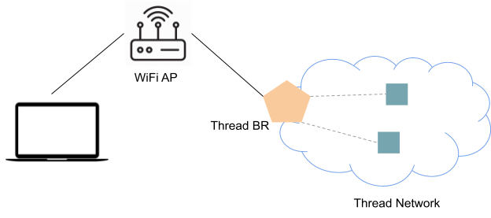
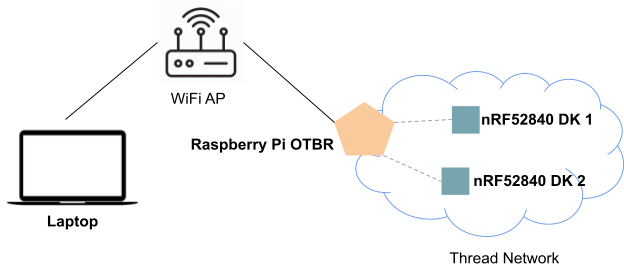
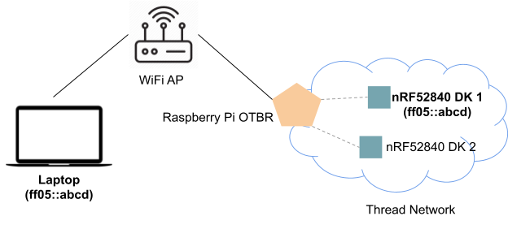

# Thread Border Router - Thread 1.2 Multicast

[Codelab Feedback](https://github.com/openthread/ot-br-posix/issues)


## Introduction




### **What is Thread?**

Thread is an IP-based low-power wireless mesh networking protocol that enables secure device-to-device and device-to-cloud communications. Thread networks can adapt to topology changes to avoid single-point failures.

> aside positive
> 
> Dive Deeper: Refer to  [Thread Overview](https://www.threadgroup.org/What-is-Thread/Overview) for more on Thread.

### **What is OpenThread?**

[OpenThread released by Google](https://github.com/openthread/openthread) is an open-source implementation of Thread®.

### What is an OpenThread Border Router?

[OpenThread Border Router](https://openthread.io/guides/border-router) (OTBR) released by Google is an open-source implementation of the Thread Border Router.

### **Thread 1.2 Multicast**

Thread 1.2 defines a series of features to support multicast across a heterogeneous network (Thread and Wi-Fi/Ethernet Network segments) for multicast addresses with scope larger than realm local.

A Thread 1.2 Border Router registers its Backbone Router (BBR) Dataset, and the selected BBR service is the Primary Backbone Router (PBBR), which is responsible for the multicast inbounding/outbounding forward.

A Thread 1.2 Device sends a CoAP message to register the multicast address to the PBBR (Multicast Listener Registration, MLR for short) if the address is larger than realm local. PBBR uses MLDv2 on its External Interface to communicate to the wider IPv6 LAN/WAN about IPv6 multicast groups it needs to listen to, on behalf of its local Thread Network. And PBBR only forwards multicast traffic into the Thread Network if the destination is subscribed to by at least one Thread device.

For Thread 1.2 Minimal End Devices, they may depend on their parent to aggregate the multicast address and do MLR on their behalf, or register themselves if their parent is of Thread 1.1.

For more details, please refer to **Thread 1.2 Specification Section 5.24 Multicast Forwarding  for larger than Realm-Local Scope**.

### **What you will build**

In this codelab, you're going to set up a Thread Border Router and two Thread devices, then enable and verify Multicast features on Thread devices and Wi-Fi devices. 

### **What you will learn**

* How to build nRF52840 firmware with Thread 1.2 Multicast features.
* How to subscribe to IPv6 multicast addresses on Thread devices.

### **What you will need**

* A Raspberry Pi 3/4 device and a SD card with at least 8 GB capability.
* 3 Nordic Semiconductor  [nRF52840 DK](https://www.nordicsemi.com/Software-and-Tools/Development-Kits/nRF52840-DK) boards.
* A Wi-Fi AP without  [IPv6 Router Advertisement Guard](https://tools.ietf.org/html/rfc6105) enabled on the router.
* Linux/macOS Laptop (Raspberry Pi also works) with Python3 installed.


## Setup OTBR
Duration: 05:00


**Follow the**  [**Thread Border Router - Bidirectional IPv6 Connectivity and DNS-Based Service Discovery**](https://openthread.io/codelabs/openthread-border-router#1) **codelab to set up a Thread Border Router on the Raspberry Pi.**

When completed, the Raspberry Pi should have created a working Thread network and be connected to a Wi-Fi network.

OTBR should become the Primary Backbone Router within seconds.

```console
$ sudo ot-ctl bbr state
Primary
Done
$ sudo ot-ctl bbr
BBR Primary:
server16: 0xD800
seqno:    23
delay:    1200 secs
timeout:  3600 secs
Done
```

> aside positive
> 
> Dive Deeper: 
> 
> The BBR dataset shows that the OTBR has become the Primary Backbone Router (PBBR):
> 
> * `server16` is the RLOC16 of the PBBR.
> * `seqno` is the randomly generated BBR sequence number. PBBR can change seqno to trigger reregistrations.
> * `delay` is the value of Registration Delay, by which Thread devices should delay before reregistrations. 
> * `timeout` is the default duration in seconds for which a Multicast Listener Registration (MLR) remains valid. Thread devices will automatically renew their MLR registrations before expiration if they still subscribe to the multicast address. 
> 
> Refer to  [OpenThread CLI Reference](https://github.com/openthread/openthread/blob/main/src/cli/README.md#bbr-config-seqno-seqno-delay-delay-timeout-timeout) for more on BBR dataset configuration. 


## Build and Flash Thread devices
Duration: 05:00


Build the Thread 1.2 CLI application with Multicast and flash the two nRF52840 DK boards. 

### **Build nRF52840 DK firmware**

Follow instructions to clone the project and build nRF52840 firmware.

```console
$ mkdir -p ~/src
$ cd ~/src
$ git clone --recurse-submodules --depth 1 https://github.com/openthread/ot-nrf528xx.git
$ cd ot-nrf528xx/
$ script/build nrf52840 USB_trans -DOT_MLR=ON -DOT_THREAD_VERSION=1.2
$ arm-none-eabi-objcopy -O ihex build/bin/ot-cli-ftd ot-cli-ftd.hex
```

We can find the successfully built HEX firmware at `ot-cli-ftd.hex`.

### **Flash nRF52840 DK firmware**

Flash the firmware onto nRF52840 DK using `nrfjprog`, which is part of the  [nRF Command Line Tools](https://www.nordicsemi.com/Software-and-Tools/Development-Tools/nRF-Command-Line-Tools).

```console
$ nrfjprog -f nrf52 --chiperase --program ot-cli-ftd.hex --reset
```

> aside positive
> 
> TIP: Refer to the  [OpenThread on nRF52840 Example](https://github.com/openthread/ot-nrf528xx/blob/main/src/nrf52840/README.md) for more details.


## Attach Thread devices to the Thread network
Duration: 03:00


OTBR has created a Thread network in previous steps. We can now add the nRF52840 DKs to the Thread network:

Get raw Active Dataset from OTBR:

```console
$ sudo ot-ctl dataset active -x
0e080000000000000000000300000b35060004001fffc00208dead00beef00cafe0708fddead00beef00000510e50d3d0931b3430a59c261c684585a07030a4f70656e54687265616401022715041021cf5e5f1d80d2258d5cfd43416525e90c0302a0ff
```

Connect to a nRF52840 DK board:

```console
$ screen /dev/ttyACM0 115200
```

Configure the Active Dataset for the nRF52840 DK:

```console
> dataset set active 0e080000000000000000000300000b35060004001fffc00208dead00beef00cafe0708fddead00beef00000510e50d3d0931b3430a59c261c684585a07030a4f70656e54687265616401022715041021cf5e5f1d80d2258d5cfd43416525e90c0302a0ff
Done
```

Start the Thread stack and wait for a few seconds and verify the device has successfully attached:

```console
> ifconfig up
Done
> thread start
Done
> state
child
```

Repeat the above steps to attach the other nRF52840 DK board to the Thread network.

We have now successfully set up the Thread network with 3 Thread devices: OTBR and two nRF52840 DK boards. 


## Setup Wi-Fi Network
Duration: 03:00


Setup the Wi-Fi network on OTBR and the Laptop so that they are connected to the same Wi-Fi AP.

We can use  [raspi-config](https://www.raspberrypi.org/documentation/configuration/raspi-config.md) to setup the Wi-Fi SSID and passphrase on the Raspberry Pi OTBR. 

The final network topology is shown below:




> aside positive
> 
> NOTE: From this step on, the two nRF52840 DKs are used for different purposes. We refer to one as nRF52840 End Device 1 and the other nRF52840 End Device 2.


## Subscribe to the IPv6 multicast address
Duration: 02:00


> aside positive
> 
> NOTE: This codelab uses a IPv6 multicast address of `ff05::abcd`, but any IPv6 multicast address with scope &gt;= `Admin-local scope (4)` will also work.

**Subscribe to ff05::abcd on nRF52840 End Device 1:**

```console
> ipmaddr add ff05::abcd
Done
```

Verify `ff05::abcd` is successfully subscribed:

```console
> ipmaddr
ff33:40:fdde:ad00:beef:0:0:1
ff32:40:fdde:ad00:beef:0:0:1
ff05:0:0:0:0:0:0:abcd            <--- ff05::abcd subscribed
ff02:0:0:0:0:0:0:2
ff03:0:0:0:0:0:0:2
ff02:0:0:0:0:0:0:1
ff03:0:0:0:0:0:0:1
ff03:0:0:0:0:0:0:fc
Done
```

**Subscribe to ff05::abcd on the Laptop:**

We need a Python script `subscribe6.py` to subscribe to a multicast address on the Laptop.

Copy the code below and save it as `subscribe6.py`: 

```
import ctypes
import ctypes.util
import socket
import struct
import sys

libc = ctypes.CDLL(ctypes.util.find_library('c'))
ifname, group = sys.argv[1:]
addrinfo = socket.getaddrinfo(group, None)[0]
assert addrinfo[0] == socket.AF_INET6
s = socket.socket(addrinfo[0], socket.SOCK_DGRAM)
group_bin = socket.inet_pton(addrinfo[0], addrinfo[4][0])
interface_index = libc.if_nametoindex(ifname.encode('ascii'))
mreq = group_bin + struct.pack('@I', interface_index)
s.setsockopt(socket.IPPROTO_IPV6, socket.IPV6_JOIN_GROUP, mreq)
print("Subscribed %s on interface %s." % (group, ifname))
input('Press ENTER to quit.')
```

Run `subscribe6.py` to subscribe `ff05::abcd` on the Wi-Fi network interface (e.g. wlan0):

```console
$ sudo python3 subscribe6.py wlan0 ff05::abcd
Subscribed ff05::abcd on interface wlan0.
Press ENTER to quit.
```

> aside positive
> 
> NOTE: If you press ENTER, the subscription ends.

The final network topology with multicast subscriptions are shown below:



Now that we have subscribed the IPv6 multicast address on both the nRF52840 End Device 1 in Thread network and the Laptop in the Wi-Fi network, we are going to verify bi-directional IPv6 multicast reachability in the following sections.


## Verify Inbound IPv6 Multicast
Duration: 02:00


Now, we should be able to reach both nRF52840 End Device 1 in the Thread network and the Laptop using IPv6 multicast address `ff05::abcd` from the Wi-Fi network.

**Ping ff05::abcd on OTBR via the Wi-Fi interface:**

```console
$ ping -6 -b -t 5 -I wlan0 ff05::abcd
PING ff05::abcd(ff05::abcd) from 2401:fa00:41:801:83c1:a67:ae22:5346 wlan0: 56 data bytes
64 bytes from fdb5:8d36:6af9:7669:e43b:8e1b:6f2a:b8fa: icmp_seq=1 ttl=64 time=57.4 ms
64 bytes from 2401:fa00:41:801:8c09:1765:4ba8:48e8: icmp_seq=1 ttl=64 time=84.9 ms (DUP!)
64 bytes from fdb5:8d36:6af9:7669:e43b:8e1b:6f2a:b8fa: icmp_seq=2 ttl=64 time=54.8 ms
64 bytes from 2401:fa00:41:801:8c09:1765:4ba8:48e8: icmp_seq=2 ttl=64 time=319 ms (DUP!)
64 bytes from fdb5:8d36:6af9:7669:e43b:8e1b:6f2a:b8fa: icmp_seq=3 ttl=64 time=57.5 ms
64 bytes from 2401:fa00:41:801:8c09:1765:4ba8:48e8: icmp_seq=3 ttl=64 time=239 ms (DUP!)
```

We can see that OTBR can receive two ping replies from both the nRF52840 End Device 1 and the Laptop because they both have subscribed to `ff05::abcd`. This shows that the OTBR can forward the IPv6 Ping Request multicast packets from the Wi-Fi network to the Thread network.

> aside positive
> 
> NOTE: We need to use `-t ttl` to set the IP Time to Live, which is 1 by default on Linux, otherwise the multicast ping can not reach nRF52840 End Device 1.

> aside positive
> 
> NOTE: `ip -6 mroute show table all` is a helpful tool to view active multicast groups on a Linux host and their input/output interface(s).


## Verify Outbound IPv6 Multicast
Duration: 02:00


**Ping ff05::abcd on nRF52840 End Device 2:**

```console
$ ping ff05::abcd 100 10 1
108 bytes from fdb5:8d36:6af9:7669:e43b:8e1b:6f2a:b8fa: icmp_seq=12 hlim=64 time=297ms
108 bytes from 2401:fa00:41:801:64cb:6305:7c3a:d704: icmp_seq=12 hlim=63 time=432ms
108 bytes from fdb5:8d36:6af9:7669:e43b:8e1b:6f2a:b8fa: icmp_seq=13 hlim=64 time=193ms
108 bytes from 2401:fa00:41:801:64cb:6305:7c3a:d704: icmp_seq=13 hlim=63 time=306ms
108 bytes from fdb5:8d36:6af9:7669:e43b:8e1b:6f2a:b8fa: icmp_seq=14 hlim=64 time=230ms
108 bytes from 2401:fa00:41:801:64cb:6305:7c3a:d704: icmp_seq=14 hlim=63 time=279ms
```

nRF52840 End Device 2 can receive ping replies from both the nRF52840 End Device 1 and the Laptop. This shows that the OTBR can forward the IPv6 Ping Reply multicast packages from the Thread network to the Wi-Fi network.

> aside positive
> 
> NOTE: We rely on the OTBR Border Routing to forward unicast ping replies.


## Congratulations
Duration: 01:00


Congratulations, you've successfully set up a Thread Border Router and verified bi-directional IPv6 multicast!

For more on OpenThread, visit  [openthread.io](https://openthread.io/).

Reference docs:

*  [Thread Border Router - Bidirectional IPv6 Connectivity and DNS-Based Service Discovery](https://docs.google.com/document/d/1M5o-u9PK3z8P2a4W2qJl7ueFS-KJnfkRwWzT5nPEiAc/edit?resourcekey=0-VSLF6zxOJc-71hov962NWw#heading=h.8s8krlrp7f4l)
*  [Thread Primer](https://openthread.io/guides/thread-primer)
*  [OpenThread Guide](https://openthread.io/guides)
*  [OpenThread CLI Reference](https://github.com/openthread/openthread/blob/main/src/cli/README.md#openthread-cli-reference)

## License

Copyright (c) 2021, The OpenThread Authors.
All rights reserved.

Redistribution and use in source and binary forms, with or without
modification, are permitted provided that the following conditions are met:
1. Redistributions of source code must retain the above copyright
   notice, this list of conditions and the following disclaimer.
2. Redistributions in binary form must reproduce the above copyright
   notice, this list of conditions and the following disclaimer in the
   documentation and/or other materials provided with the distribution.
3. Neither the name of the copyright holder nor the
   names of its contributors may be used to endorse or promote products
   derived from this software without specific prior written permission.

THIS SOFTWARE IS PROVIDED BY THE COPYRIGHT HOLDERS AND CONTRIBUTORS "AS IS"
AND ANY EXPRESS OR IMPLIED WARRANTIES, INCLUDING, BUT NOT LIMITED TO, THE
IMPLIED WARRANTIES OF MERCHANTABILITY AND FITNESS FOR A PARTICULAR PURPOSE
ARE DISCLAIMED. IN NO EVENT SHALL THE COPYRIGHT HOLDER OR CONTRIBUTORS BE
LIABLE FOR ANY DIRECT, INDIRECT, INCIDENTAL, SPECIAL, EXEMPLARY, OR
CONSEQUENTIAL DAMAGES (INCLUDING, BUT NOT LIMITED TO, PROCUREMENT OF
SUBSTITUTE GOODS OR SERVICES; LOSS OF USE, DATA, OR PROFITS; OR BUSINESS
INTERRUPTION) HOWEVER CAUSED AND ON ANY THEORY OF LIABILITY, WHETHER IN
CONTRACT, STRICT LIABILITY, OR TORT (INCLUDING NEGLIGENCE OR OTHERWISE)
ARISING IN ANY WAY OUT OF THE USE OF THIS SOFTWARE, EVEN IF ADVISED OF THE
POSSIBILITY OF SUCH DAMAGE.
