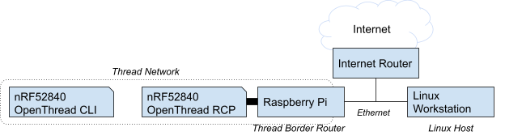

# Thread Border Router - Provide Internet access via NAT64

[Codelab Feedback](https://github.com/openthread/ot-br-posix/issues)


## Introduction


### What is Thread?

Thread is an IP-based low-power wireless mesh networking protocol that enables secure device-to-device and device-to-cloud communications. Thread networks can adapt to topology changes to avoid single-point failures.

### What is OpenThread?

[OpenThread released by Google](https://github.com/openthread/openthread) is an open-source implementation of Thread®.

### What is an OpenThread Border Router?

[OpenThread Border Router](https://openthread.io/guides/border-router) (OTBR) released by Google is an open-source implementation of the Thread Border Router.

### NAT64

NAT64 is a mechanism that enables hosts in IPv6-only networks to access resources in IPv4 networks. The NAT64 gateway is a translator between IPv4 protocols and IPv6 protocols.

The NAT64 translator, as a part of OpenThread Border Router, supports translating TCP, UDP, and ICMP (ICMPv6) protocols.

### What you'll build

In this codelab, you are going to set up a OpenThread Border Router and a Thread device, then enable and verify communication between Thread devices and IPv4 hosts on the Internet via OpenThread Border Router.

### What you'll learn

* How to build an OpenThread Border Router with NAT64 features.
* How to communicate with IPv4 hosts from Thread end devices.

### What you'll need

* A Linux workstation, for building and flashing a Thread NCP, the OpenThread CLI, and testing IPv4 connectivity.
* A Raspberry Pi 4 with 4GB RAM for the Thread border router. Your Linux workstation should be reachable over IPv4 from this device.
* 2 Nordic Semiconductor nRF52840 DK boards.

The network topology for this codelab:




## Setup OpenThread Border Router
Duration: 07:00


Follow the  [Setup OTBR step of the Thread Border Router - Bidirectional IPv6 Connectivity and DNS-Based Service Discovery codelab](https://openthread.io/codelabs/openthread-border-router#1) to build the OpenThread border router, with the following change:

In **Build and install OTBR**, you need to tell the script to enable the NAT64 translator in OpenThread by setting the environment variable `NAT64` to `1` and `NAT64_SERVICE` to `openthread`. Run the following command before the step:

```console
$ export NAT64=1 NAT64_SERVICE=openthread
```

Continue with the  [Thread Border Router - Bidirectional IPv6 Connectivity and DNS-Based Service Discovery](https://openthread.io/codelabs/openthread-border-router#1) codelab as written. After **Form a Thread network**, you can verify the border router is publishing a NAT64 prefix by the OpenThread CLI commands.

Firstly, ensure our border router is up and running, and NAT64 is enabled on the border router:

```console
$ sudo ot-ctl state
leader
Done
$ sudo ot-ctl nat64 enable
Done
$ sudo ot-ctl nat64 state
PrefixManager: Active
Translator: Active
Done
```

> aside negative
> 
> **Note:** If you did not see "`Active`" for the "`nat64 state`" command, wait for a few seconds and try again.

We should be able to see that OTBR is acting as a Thread leader and there is a NAT64 prefix (`fd4c:9574:3720:2:0:0::/96` in our case) in the Thread Network Data:

```console
$ sudo ot-ctl netdata show
Prefixes:
fd4c:9574:3720:1::/64 paos low 0800
Routes:
fd49:7770:7fc5:0::/64 s med 0800
fd4c:9574:3720:2:0:0::/96 sn low 0800
Services:
44970 01 41000500000e10 s 0800
44970 5d fdd20e532b87b93f50ad4eea0450f1bfd11f s 0800
Done
```

The NAT64 prefix will be used by Thread devices when communicating with an IPv4 host.

> aside negative
> 
> **Note:** You may need to ensure IPv4 packet forwarding is enabled in  the system config. The content of `/proc/sys/net/ipv4/conf/default/forwarding` should be `1`.


## Setup Thread end device
Duration: 05:00


Follow the  [Set up the FTDs step of the Build a Thread network with nRF52840 boards and OpenThread codelab](https://openthread.io/codelabs/openthread-hardware#4) to build and flash a nRF52840 CLI end device, with a change to the following step:

In **Build and flash**, you have to append `-DOT_DNS_CLIENT=ON` to the command line when calling `script/build`:

```console
$ cd ~/src/ot-nrf528xx
$ rm -rf build
$ script/build nrf52840 USB_trans -DOT_JOINER=ON -DOT_COMMISSIONER=ON -DOT_DNS_CLIENT=ON
```

Continue with the  [Build a Thread network with nRF52840 boards and OpenThread codelab](https://openthread.io/codelabs/openthread-hardware#4) as written. After the end device is flashed with the CLI image, follow  [Thread Border Router - Bidirectional IPv6 Connectivity and DNS-Based Service Discovery](https://openthread.io/codelabs/openthread-border-router#3) to set up the Thread end device.

Wait for a few seconds after setting up the Thread end device and verify if joining the Thread network is successful. You should be able to find a NAT64 prefix from the network data (`fd4c:9574:3720:2:0:0::/96` in our case):

```console
> netdata show
Prefixes:
fd4c:9574:3720:1::/64 paos low 0800
Routes:
fd49:7770:7fc5:0::/64 s med 0800
fd4c:9574:3720:2:0:0::/96 sn low 0800
Services:
44970 01 41000500000e10 s 0800
44970 5d fdd20e532b87b93f50ad4eea0450f1bfd11f s 0800
Done
```

Make sure that the network data matches the one from OTBR.


## Communicate with IPv4 hosts from the Thread end device
Duration: 05:00


You can now communicate with hosts on the IPv4 network from the end device we just set up.

### Send ICMP echo requests to IPv4 hosts

From the CLI of our Thread end device:

```console
> ping 8.8.8.8
Pinging synthesized IPv6 address: fd4c:9574:3720:2:0:0:808:808
16 bytes from fd4c:9574:3720:2:0:0:808:808: icmp_seq=15 hlim=119 time=48ms
1 packets transmitted, 1 packets received. Packet loss = 0.0%. Round-trip min/avg/max = 48/48.0/48 ms.
Done
```

The border router creates a NAT64 mapping item for this device by the `nat64 mappings` command:

```console
$ sudo ot-ctl nat64 mappings
|                  | Address                                                     |        | 4 to 6                  | 6 to 4                  |
+------------------+-------------------------------------------------------------+--------+-------------------------+-------------------------+
| ID               | IPv6                                     | IPv4             | Expiry | Pkts     | Bytes        | Pkts     | Bytes        |
+------------------+------------------------------------------+------------------+--------+----------+--------------+----------+--------------+
| 377ee63dd3127f1a |     fd4c:9574:3720:1:1d61:b4c1:494f:f975 |  192.168.255.254 |  7190s |        1 |           16 |        1 |           16 |
|                  |                                                                  TCP |        0 |            0 |        0 |            0 |
|                  |                                                                  UDP |        0 |            0 |        0 |            0 |
|                  |                                                                 ICMP |        1 |           16 |        1 |           16 |
Done
```

The `fd4c:9574:3720:1:1d61:b4c1:494f:f975` should be the IPv6 address of your Thread device.

> aside negative
> 
> **Note:**  The **IPv4** field is the temporary IPv4 address allocated to the Thread device for sending packets. This address is not meaningful for other hosts.

Run this command on the border router at any time to see how it counts the traffic.

### Send DNS queries to IPv4 DNS servers

Use `dns resolve4` to resolve a hostname on the IPv4 network. The DNS server address can also be an IPv4 address:

```console
> dns resolve4 example.com 8.8.8.8
Synthesized IPv6 DNS server address: fd4c:9574:3720:2:0:0:808:808
DNS response for example.com. - fd4c:9574:3720:2:0:0:5db8:d822 TTL:20456 
Done
```

> aside positive
> 
> **Note:** The DNS response for `resolve4` command is a set of synthesized IPv6 addresses.

### Communicate via TCP

It is possible to establish TCP connections between the end device and hosts in the IPv4 network.

Assume the IP address of your Linux IPv4 host is `192.168.0.2`.

On your Linux IPv4 host, use `nc` to listen for TCP connections:

```console
$ nc -l 0.0.0.0 12345
```

From your Thread end device, establish a TCP connection and send messages to your Linux IPv4 host:

```console
> tcp init
Done
> tcp connect 192.168.0.2 12345
Connecting to synthesized IPv6 address: fd4c:9574:3720:2:0:0:c0a8:2
Done
> tcp send hello
```

Your Linux IPv4 host outputs:

```console
hello
```

You can also send messages from your Linux IPv4 host to Thread end device. Type "world" and press Enter on your Linux IPv4 host running `nc`, and your Thread end device outputs:

```console
TCP: Received 6 bytes: world
```

### Communicate via UDP

It is possible to communicate using UDP between Thread devices and hosts in the IPv4 network.

Assume the IP address of your Linux IPv4 host is `192.168.0.2`.

Use `nc` to listen for UDP connections:

```console
$ nc -u -l 0.0.0.0 12345
```

From your Thread end device, establish a UDP connection and send messages to your Linux IPv4 host:

```console
> udp open
Done
> udp connect 192.168.0.2 12345
Connecting to synthesized IPv6 address: fd4c:9574:3720:2:0:0:c0a8:2
Done
> udp send hello
Done
```

Your Linux IPv4 host outputs:

```console
hello
```

You can also send messages from your Linux IPv4 host to Thread end device. Type "world" and press Enter on your Linux IPv4 host running `nc`, and your Thread end device outputs:

```console
6 bytes from fd4c:9574:3720:2:0:0:c0a8:2 12345 world
```


## Toggle NAT64 on Border Router
Duration: 03:00


You can enable or disable NAT64 any time you want. Use `nat64 disable` to disable NAT64. And use `nat64 state` to check the state of NAT64.

```console
$ sudo ot-ctl nat64 disable
Done
$ sudo ot-ctl nat64 state
PrefixManager: Disabled
Translator: Disabled
Done
```

> aside positive
> 
> **Note:** You can find the means of the states from the  [OpenThread CLI reference](https://openthread.io/reference/cli/commands#nat64_state).

After disabling, the device is no longer publishing a NAT64 prefix:

```console
$ sudo ot-ctl netdata show
Prefixes:
fd4c:9574:3720:1::/64 paos low 0800
Routes:
fd49:7770:7fc5:0::/64 s med 0800
Services:
44970 01 41000500000e10 s 0800
44970 5d fdd20e532b87b93f50ad4eea0450f1bfd11f s 0800
Done
```

Also the devices in the Thread network can no longer access the IPv4 host via this border router.

From the CLI of our Thread end device:

```console
> ping 8.8.8.8
Error 13: InvalidState
```

Use `nat64 enable` to enable NAT64. It may take a while before the prefix manager starts advertising a NAT64 prefix:

```console
$ sudo ot-ctl nat64 enable
Done
$ sudo ot-ctl nat64 state
PrefixManager: Idle
Translator: NotWorking
Done
```

After a few seconds, the NAT64 components should be up and running:

```console
$ sudo ot-ctl nat64 state
PrefixManager: Active
Translator: Active
Done
$ sudo ot-ctl netdata show
Prefixes:
fd4c:9574:3720:1::/64 paos low 0800
Routes:
fd49:7770:7fc5:0::/64 s med 0800
fd4c:9574:3720:2:0:0::/96 sn low 0800
Services:
44970 01 41000500000e10 s 0800
44970 5d fdd20e532b87b93f50ad4eea0450f1bfd11f s 0800
Done
```

Note that disabling NAT64 will clear the mapping table:

```console
$ sudo ot-ctl nat64 mappings
|                  | Address                                                     |        | 4 to 6                  | 6 to 4                  |
+------------------+-------------------------------------------------------------+--------+-------------------------+-------------------------+
| ID               | IPv6                                     | IPv4             | Expiry | Pkts     | Bytes        | Pkts     | Bytes        |
+------------------+------------------------------------------+------------------+--------+----------+--------------+----------+--------------+
Done
```


## Congratulations


Congratulations, you've successfully set up a border router with NAT64 support and used it to provide internet access to Thread end devices! 

### Further reading

*  [OpenThread Guides](https://openthread.io/guides)
*  [OpenThread CLI Reference](https://openthread.io/reference/cli/commands#nat64_enabledisable)
*  [OpenThread API Reference for NAT64](https://openthread.io/reference/group/api-nat64)

### Reference docs

*  [RFC 6146: Stateful NAT64: Network Address and Protocol Translation from IPv6 Clients to IPv4 Servers](https://datatracker.ietf.org/doc/html/rfc6146)
