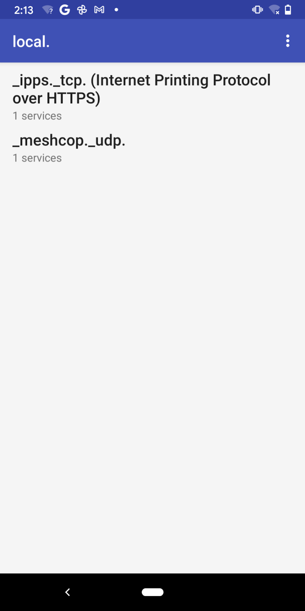
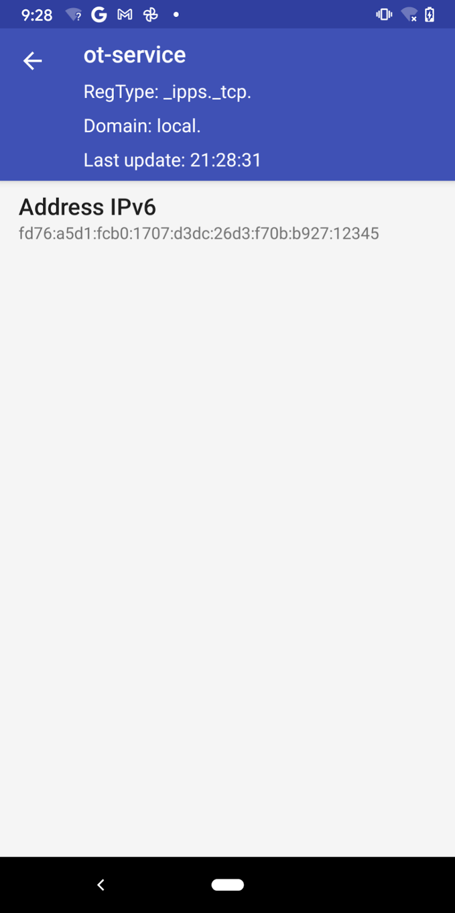
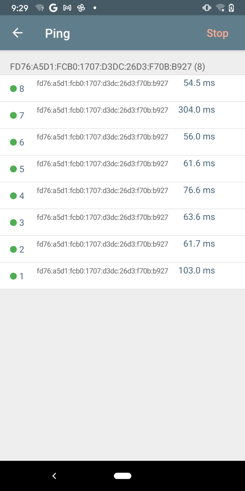

# Thread Border Router - Bidirectional IPv6 Connectivity and DNS-Based Service Discovery

[Codelab Feedback](https://github.com/openthread/ot-br-posix/issues)


## Introduction


### **What is a Thread Border Router?**

Thread is an IP-based low-power wireless mesh networking protocol that enables secure device-to-device and device-to-cloud communications. Thread networks can adapt to topology changes to avoid single point of failure. 

> aside positive
> 
> Dive Deeper: Refer to  [Thread Overview](https://www.threadgroup.org/What-is-Thread/Overview) for more on Thread.

A Thread Border Router connects a Thread network to other IP-based networks, such as Wi-Fi or Ethernet. A Thread network requires a Border Router to connect to other networks. A Thread  Border Router minimally supports the following functions:

* Bidirectional IP connectivity between Thread and Wi-Fi/Ethernet networks.
* Bidirectional service discovery via  [mDNS](https://tools.ietf.org/html/rfc6762) (on Wi-Fi/Ethernet link) and  [SRP](https://tools.ietf.org/html/draft-ietf-dnssd-srp-09) (on Thread network).
* Thread-over-infrastructure that merges Thread partitions over IP-based links.
* External Thread Commissioning (for example, a mobile phone) to authenticate and join a Thread device to a Thread network.

[OpenThread Border Router](https://openthread.io/guides/border-router) (OTBR) released by Google is an open-source implementation of the Thread Border Router.

### **What you'll build**

In this codelab, you're going to set up a Thread Border Router and connect your mobile phone to a Thread End Device via the Border Router.

### What you'll learn

* How to set up OTBR
* How to form a Thread network with OTBR
* How to build an OpenThread CLI device with the SRP feature
* How to register a service with SRP
* How to discover and reach a Thread end device.

### What you'll need

* A Raspberry Pi 3/4 device and a SD card with at least 8 GB capability.
* 2 Nordic Semiconductor  [nRF52840](https://www.nordicsemi.com/Software-and-Tools/Development-Kits/nRF52840-DK) dev boards.
* A Wi-Fi AP without  [IPv6 Router Advertisement Guard](https://tools.ietf.org/html/rfc6105) enabled on the router.
* An  iOS phone with at least iOS 14 or Android phone with at least Android 8.1.


## Setup OTBR
Duration: 05:00


### Setup Raspberry Pi

It is simple to set up a fresh Raspberry Pi device with the `rpi-imager` tool by following the instructions on  [raspberrypi.org](https://www.raspberrypi.org/software/) (instead of using the latest Raspberry Pi OS in the tool, download  [2021-05-07-raspios-buster-armhf-lite](https://downloads.raspberrypi.org/raspios_lite_armhf/images/raspios_lite_armhf-2021-05-28/2021-05-07-raspios-buster-armhf-lite.zip) by yourself). To complete the mobile phone steps in this codelab, you need to connect the Raspberry Pi to a Wi-Fi AP. Follow  [this](https://www.raspberrypi.org/documentation/configuration/wireless/) guide to set up wireless connectivity. It is convenient to log in to the Raspberry Pi with SSH, you can find instructions  [here](https://www.raspberrypi.org/documentation/remote-access/ssh/README.md).

> aside positive
> 
> **Note:** Make sure that  [RA-guard](https://tools.ietf.org/html/rfc6105) is not enabled on your Wi-Fi router! RA-guard is enabled in many enterprise networks for security. But for your personal/home Wi-Fi router, it is usually disabled by default. Consult the network administrator if you are not sure about it.

### Get OTBR code

Log in to your Raspberry Pi and clone `ot-br-posix` from GitHub:

```console
$ git clone https://github.com/openthread/ot-br-posix.git --depth 1
```

### **Build and install OTBR**

OTBR has two scripts that bootstrap and set up the Thread Border Router:

```console
$ cd ot-br-posix
$ ./script/bootstrap
$ INFRA_IF_NAME=wlan0 ./script/setup
```

OTBR works on both a Thread interface and infrastructure network interface (e.g. Wi-Fi/Ethernet) which is specified with `INFRA_IF_NAME`. The Thread interface is created by OTBR itself and named `wpan0` by default and the infrastructure interface has a default value of `wlan0` if `INFRA_IF_NAME` is not explicitly specified. If your Raspberry Pi is connected by an Ethernet cable, specify the Ethernet interface name (e.g. `eth0`):

```console
$ INFRA_IF_NAME=eth0 ./script/setup
```

Check if OTBR is successfully installed:

```console
$ sudo service otbr-agent status
● otbr-agent.service - Border Router Agent
   Loaded: loaded (/lib/systemd/system/otbr-agent.service; enabled; vendor preset: enabled)
   Active: activating (auto-restart) (Result: exit-code) since Mon 2021-03-01 05:43:38 GMT; 2s ago
  Process: 2444 ExecStart=/usr/sbin/otbr-agent $OTBR_AGENT_OPTS (code=exited, status=2)
 Main PID: 2444 (code=exited, status=2)
```

It is expected that the `otbr-agent` service is not active, because it requires an `RCP` chip to run. 

Reboot the Raspberry Pi to take the changes to effect.

### **Build and flash RCP firmware**

OTBR supports a 15.4 radio chip in  [Radio Co-Processor](https://openthread.io/platforms#radio-co-processor-rcp) (RCP) mode. In this mode, the OpenThread stack is running on the host side and transmits/receives frames over the IEEE802.15.4 transceiver.

Follow  [step 4 of the *Build a Thread network with nRF52840 boards and OpenThread* codelab](https://openthread.io/codelabs/openthread-hardware#3) to build and flash a nRF52840 RCP device. You need an additional option `-DOT_THREAD_VERSION=1.2` for the build step:

```console
$ script/build nrf52840 USB_trans -DOT_THREAD_VERSION=1.2
```

> aside positive
> 
> The OTBR has the Thread 1.2 backbone router features enabled by default, option `-DOT_THREAD_VERSION=1.2` is required to be compatible with the OTBR.

### Start OTBR and verify status

Connect the nRF52840 board to your Raspberry Pi and start the `otbr-agent` service:

```console
$ sudo service otbr-agent restart
```

Verify that the `otbr-agent` service is active:

```console
$ sudo service otbr-agent status
● otbr-agent.service - Border Router Agent
   Loaded: loaded (/lib/systemd/system/otbr-agent.service; enabled; vendor preset: enabled)
   Active: active (running) since Mon 2021-03-01 05:46:26 GMT; 2s ago
 Main PID: 2997 (otbr-agent)
    Tasks: 1 (limit: 4915)
   CGroup: /system.slice/otbr-agent.service
           └─2997 /usr/sbin/otbr-agent -I wpan0 -B wlan0 spinel+hdlc+uart:///dev/ttyACM0

Mar 01 05:46:26 raspberrypi otbr-agent[2997]: Stop publishing service
Mar 01 05:46:26 raspberrypi otbr-agent[2997]: [adproxy] Stopped
Mar 01 05:46:26 raspberrypi otbr-agent[2997]: PSKc is not initialized
Mar 01 05:46:26 raspberrypi otbr-agent[2997]: Check if PSKc is initialized: OK
Mar 01 05:46:26 raspberrypi otbr-agent[2997]: Initialize OpenThread Border Router Agent: OK
Mar 01 05:46:26 raspberrypi otbr-agent[2997]: Border router agent started.
Mar 01 05:46:26 raspberrypi otbr-agent[2997]: [INFO]-CORE----: Notifier: StateChanged (0x00038200) [NetData PanId NetName ExtPanId]
Mar 01 05:46:26 raspberrypi otbr-agent[2997]: [INFO]-PLAT----: Host netif is down
```

> aside positive
> 
> If you receive an "InvalidArguments" error, make sure your RCP board is connected as `/dev/ttyACM0`. It happens that the device path may change to `/dev/ttyACM1` after flashing the nRF board. Re-plugging the nRF board should solve this.


## Form a Thread network
Duration: 02:00


There is an `ot-ctl` command which can be used to control the `otbr-agent` service. `ot-ctl` accepts all OpenThread CLI commands, see  [OpenThread CLI Guide](https://github.com/openthread/openthread/blob/main/src/cli/README.md) for more details.

Form a Thread network with OTBR:

```console
$ sudo ot-ctl dataset init new
Done
$ sudo ot-ctl dataset commit active
Done
$ sudo ot-ctl ifconfig up
Done
$ sudo ot-ctl thread start
Done
```

Wait a few seconds, we should be able to see that OTBR is acting as a Thread `leader` and there is an `off-mesh-routable` (OMR) prefix in the Thread Network Data:

```console
$ sudo ot-ctl state
leader
Done
$ sudo ot-ctl netdata show
Prefixes:
Prefixes:
fd76:a5d1:fcb0:1707::/64 paos med 4000
Routes:
fd49:7770:7fc5:0::/64 s med 4000
Services:
44970 5d c000 s 4000
44970 01 9a04b000000e10 s 4000
Done
$ sudo ot-ctl ipaddr      
fda8:5ce9:df1e:6620:0:ff:fe00:fc11
fda8:5ce9:df1e:6620:0:0:0:fc38
fda8:5ce9:df1e:6620:0:ff:fe00:fc10
fd76:a5d1:fcb0:1707:f3c7:d88c:efd1:24a9
fda8:5ce9:df1e:6620:0:ff:fe00:fc00
fda8:5ce9:df1e:6620:0:ff:fe00:4000
fda8:5ce9:df1e:6620:3593:acfc:10db:1a8d
fe80:0:0:0:a6:301c:3e9f:2f5b
Done
```

> aside positive
> 
> The example output of the `netdata show` command gives
> 
> * an OMR prefix `fd76:a5d1:fcb0:1707::/64` for creating an OMR address that can be reached from the Wi-Fi/Ethernet network (you may notice that there is an IPv6 address `fd76:a5d1:fcb0:1707:f3c7:d88c:efd1:24a9` that starts with the OMR prefix);
> * an external route for the on-link prefix `fd49:7770:7fc5:0::/64` which is created by OTBR when no IPv6 network is already present on the Wi-Fi/Ethernet link.
> * a SRP server Service with service number `5d` and SRP server UDP port which will be used by a Thread SRP end device.
> * a BBR Service with service number `0x01`;


## Set Up SRP Client End Device
Duration: 05:00


### **Build and flash OT CLI**

Follow [step 5 of the *Build a Thread network with nRF52840 boards and OpenThread* codelab](https://openthread.io/codelabs/openthread-hardware#4) to build and flash a nRF52840 CLI end device.

But instead of having `OT_COMMISSIONER` and `OT_JOINER` enabled, the CLI node requires `OT_SRP_CLIENT` and `OT_ECDSA` features.

> aside positive
> 
> **Note:** The `OT_SRP_CLIENT` build option enables the SRP client side implementation on the end device, while the option `OT_ECDSA` is required by `OT_SRP_CLIENT` to create signatures.

So the full build invocation should look like this:

```console
$ script/build nrf52840 USB_trans -DOT_SRP_CLIENT=ON -DOT_ECDSA=ON -DOT_JOINER=ON -DOT_THREAD_VERSION=1.2
```

### Join the OTBR network

To join the Thread network created by the `otbr-agent` service, we need to get the Active Operational Dataset from the OTBR device. Let's go back to the `otbr-agent` command line and get the active dataset:

```console
$ sudo ot-ctl dataset active -x
0e080000000000010000000300001235060004001fffe002083d3818dc1c8db63f0708fda85ce9df1e662005101d81689e4c0a32f3b4aa112994d29692030f4f70656e5468726561642d35326532010252e204103f23f6b8875d4b05541eeb4f9718d2f40c0302a0ff
Done
```

Return to the SRP client node screen session and set the active dataset:

```console
> dataset set active 0e080000000000010000000300001235060004001fffe002083d3818dc1c8db63f0708fda85ce9df1e662005101d81689e4c0a32f3b4aa112994d29692030f4f70656e5468726561642d35326532010252e204103f23f6b8875d4b05541eeb4f9718d2f40c0302a0ff
Done
```

Then, start the Thread interface:

```console
> ifconfig up
Done
> thread start
Done
```

Wait for a few seconds and verify if joining the Thread network is successful:

```console
> state
child
Done
> netdata show
Prefixes:
fd76:a5d1:fcb0:1707::/64 paos med 4000
Routes:
fd49:7770:7fc5:0::/64 s med 4000
Services:
44970 5d c000 s 4000
44970 01 9a04b000000e10 s 4000
Done
> ipaddr
fd76:a5d1:fcb0:1707:d3dc:26d3:f70b:b927
fda8:5ce9:df1e:6620:0:ff:fe00:4001
fda8:5ce9:df1e:6620:ed74:123:cc5d:74ba
fe80:0:0:0:d4a9:39a0:abce:b02e
Done
```

Make sure that the network data matches the one printed on OTBR. We can now ping OTBR's OMR address:

```console
> ping fd76:a5d1:fcb0:1707:f3c7:d88c:efd1:24a9
Done
> 16 bytes from fd76:a5d1:fcb0:1707:f3c7:d88c:efd1:24a9: icmp_seq=1 hlim=64 time=49ms
```


## Publish the Service on the End Device
Duration: 05:00


mDNS has been widely used for publishing DNS-SD service on link-local. But multicast messages consume too much bandwidth and will exhaust the battery for low power devices quickly. Thread uses the unicast  [SRP](https://tools.ietf.org/html/draft-ietf-dnssd-srp-09) protocol to register their services with the Border Router and relies on the Border Router to advertise the services on the Wi-Fi or Ethernet link.

> aside positive
> 
> **Note:** If you just want to reach the Thread end device from the Wi-Fi/Ethernet network, you can skip this step and go to the "Ping the End Device" step.

We can register a service with the  [`srp client`](https://github.com/openthread/openthread/blob/main/src/cli/README_SRP_CLIENT.md) command.

Go to the SRP client node screen session and auto-start the SRP client:

```console
> srp client autostart enable
Done
```

Set the hostname that will be advertised on the Wi-Fi/Ethernet link:

```console
> srp client host name ot-host
Done
```

For a device on the Wi-Fi/Ethernet link to reach a Thread end device, the OMR address of the end device needs to be advertised:

```console
> srp client host address fd76:a5d1:fcb0:1707:d3dc:26d3:f70b:b927
Done
```

At the end, register a fake `_ipps._tcp` service:

```console
> srp client service add ot-service _ipps._tcp 12345
Done
```

Wait a few seconds and we should be able to see the service registered:

```console
> srp client service
instance:"ot-service", name:"_ipps._tcp", state:Registered, port:12345, priority:0, weight:0
Done
```

We have completed all setup work and the `_ipps._tcp` service should have been advertised on the Wi-Fi/Ethernet link. It's time to discover and reach the end device now!

> aside positive
> 
> **Note:** It is important to set the OMR address. Otherwise, we will not be able to ping the hostname in the next steps.


## Discover the Service
Duration: 03:00


### **Discover the service with a mobile phone**



We use the  [Service Browser](https://play.google.com/store/apps/details?id=com.druk.servicebrowser) App to discover mDNS services with the Android phone, an  [equivalent App](https://apps.apple.com/cn/app/discovery-dns-sd-browser/id305441017) can also be found for iOS mobile devices. Open the App and the service  `_ipps._tcp` should just show up.

### **Discover the service with a Linux host**

If you want to discover the service from another Linux host, you can use the `avahi-browse` command.

Install `avahi-daemon` and `avahi-utils`:

```console
$ sudo apt-get install -y avahi-daemon avahi-utils
```

Resolve the service:

```console
$ sudo service avahi-daemon start # Ensure the avahi daemon is started.
$ avahi-browse -r _ipps._tcp
+ wlan0 IPv6 ot-service                                    Secure Internet Printer local
= wlan0 IPv6 ot-service                                    Secure Internet Printer local
   hostname = [ot-host.local]
   address = [fd76:a5d1:fcb0:1707:d3dc:26d3:f70b:b927]
   port = [12345]
   txt = []
...
```

### **Discover the service with a macOS host**

You can use `dns-sd` on macOS to resolve the service:

```console
$ dns-sd -Z _ipps._tcp local.
Browsing for _ipps._tcp.local.
DATE: ---Sun 14 Mar 2021---
21:31:42.125  ...STARTING...

; To direct clients to browse a different domain, substitute that domain in place of '@'
lb._dns-sd._udp                                 PTR     @

; In the list of services below, the SRV records will typically reference dot-local Multicast DNS names.
; When transferring this zone file data to your unicast DNS server, you'll need to replace those dot-local
; names with the correct fully-qualified (unicast) domain name of the target host offering the service.

_ipps._tcp                                      PTR     ot-service._ipps._tcp
ot-service._ipps._tcp                           SRV     0 0 12345 ot-host.local. ; Replace with unicast FQDN of target host
ot-service._ipps._tcp                           TXT     ""
...
```


## Ping the End Device
Duration: 02:00


### **Ping from a mobile phone**

Take the Pixel phone as an example, we can find out the OMR address of the previously registered service "ot-service" in the details page of the service instance in the Service Browser App.

                                             

We can now ping the OMR address with another  [Network Analyzer](https://play.google.com/store/apps/details?id=net.techet.netanalyzerlite.an) App.

Unfortunately, the Android version of the Network Analyzer App doesn't support mDNS queries for the ping utility and we cannot ping the hostname `ot-host.local` directly (we can ping the hostname with the iOS version of the App).

### Ping from a Linux/macOS host

Thread Border Router sends ICMPv6 Router Advertisements (RA) to advertise prefixes (via Prefix Information Option) and routes (via Route Information Option) on the Wi-Fi/Ethernet link. 

#### **Prepare Linux host**

It is important to make sure that RA and RIO are enabled on your host:

1. `net.ipv6.conf.wlan0.accept_ra` should be at least `1` if ip forwarding is not enabled, and `2` otherwise.
2. `net.ipv6.conf.wlan0.accept_ra_rt_info_max_plen` should not be smaller than `64`.

the `accept_ra` is defaulted to `1` for most distributions. But there may be other network daemons which will override this option (for example, `dhcpcd` on Raspberry Pi will override `accept_ra` to `0`). You can check the `accept_ra` value with:

```console
$ sudo sysctl -n net.ipv6.conf.wlan0.accept_ra
0
```

And set the value to `1` (or `2` in case IP forwarding is enabled) with:

```console
$ sudo sysctl -w net.ipv6.conf.wlan0.accept_ra=1
Net.ipv6.conf.wlan0.accept_ra = 1
```

The `accept_ra_rt_info_max_plen` option on most Linux distributions is default to `0`, set it to `64` with:

```console
$ sudo sysctl -w net.ipv6.conf.wlan0.accept_ra_rt_info_max_plen=64
net.ipv6.conf.wlan0.accept_ra_rt_info_max_plen = 64
```

> aside positive
> 
> **Note:** Remember to replace `wlan0` with your specific Wi-Fi/Ethernet interface.

The change will be lost after rebooting the host. For example, append below commands to `/etc/sysctl.conf` to permanently enable RIO:

```console
$ net.ipv6.conf.wlan0.accept_ra_rt_info_max_plen = 64
```

It may be too late to change those configurations because the OTBR has already been sending RA messages and the interval between two unsolicited RA messages could be several hundred seconds. One way is to disconnect and reconnect to Wi-Fi AP to send Router Solicitation messages so that OTBR will respond with solicited RAs. Another option is to restart the Border Routing function on the Border Router:

```console
$ sudo ot-ctl br disable
Done
$ sudo ot-ctl br enable
Done
```

> aside positive
> 
> **Note:** Restarting the Border Routing function may take around ten seconds. Because if there is no IPv6 network on the Wi-Fi/Ethernet interface yet, it needs to wait for the Router Solicitation messages to time out before it starts sending Router Advertisement messages.

If you are trying to reconnect Wi-Fi or restart Ethernet interface, make sure that  [dhcpcd](https://roy.marples.name/projects/dhcpcd/) is not used for managing your WiFi-/Ethernet IPv6 network. Because dhcpcd always overrides the `accept_ra` option everytime the interface is restarted and your `accept_ra` configuration will be lost. Append below lines to the dhcpcd configuration file (e.g. `/etc/dhcpcd.conf`) to explicitly disable IPv6 in dhcpcd:

```console
noipv6
noipv6rs
```

You need to reboot to take the change into effect.

> aside positive
> 
> **Note:**  Remember to persist your `accept_ra_rt_info_max_plen` configuration in `/etc/sysctl.conf` before rebooting.

#### **Prepare macOS host**

Both `accept_ra*` options are enabled by default, but you need to upgrade your system to at least macOS Big Sur.

#### **Ping the hostname or IPv6 address**

We can now ping the hostname `ot-host.local` with command `ping -6` (`ping6` for macOS):

```console
$ ping -6 ot-host.local.
PING ot-host.local.(fd76:a5d1:fcb0:1707:d3dc:26d3:f70b:b927 (fd76:a5d1:fcb0:1707:d3dc:26d3:f70b:b927)) 56 data bytes
64 bytes from fd76:a5d1:fcb0:1707:d3dc:26d3:f70b:b927 (fd76:a5d1:fcb0:1707:d3dc:26d3:f70b:b927): icmp_seq=1 ttl=63 time=170 ms
64 bytes from fd76:a5d1:fcb0:1707:d3dc:26d3:f70b:b927 (fd76:a5d1:fcb0:1707:d3dc:26d3:f70b:b927): icmp_seq=2 ttl=63 time=64.2 ms
64 bytes from fd76:a5d1:fcb0:1707:d3dc:26d3:f70b:b927 (fd76:a5d1:fcb0:1707:d3dc:26d3:f70b:b927): icmp_seq=3 ttl=63 time=22.8 ms
64 bytes from fd76:a5d1:fcb0:1707:d3dc:26d3:f70b:b927 (fd76:a5d1:fcb0:1707:d3dc:26d3:f70b:b927): icmp_seq=4 ttl=63 time=37.7 ms
64 bytes from fd76:a5d1:fcb0:1707:d3dc:26d3:f70b:b927 (fd76:a5d1:fcb0:1707:d3dc:26d3:f70b:b927): icmp_seq=5 ttl=63 time=28.7 ms
...
```

This command may fail on Linux hosts with the `"Name or service not known"` error. That's because the `ping` command is not resolving the `ot-host.local.` name with mDNS queries. Open `/etc/nsswitch.conf` and add `mdns6_minimal` to the line starts with `hosts`:

```console
hosts:          files mdns4_minimal mdns6_minimal dns
```

Of course, you can always ping the IPv6 address directly:

```console
$ ping -6 fd76:a5d1:fcb0:1707:d3dc:26d3:f70b:b927
PING fd76:a5d1:fcb0:1707:d3dc:26d3:f70b:b927(fd76:a5d1:fcb0:1707:d3dc:26d3:f70b:b927) 56 data bytes
64 bytes from fd76:a5d1:fcb0:1707:d3dc:26d3:f70b:b927: icmp_seq=1 ttl=63 time=32.9 ms
64 bytes from fd76:a5d1:fcb0:1707:d3dc:26d3:f70b:b927: icmp_seq=2 ttl=63 time=27.8 ms
64 bytes from fd76:a5d1:fcb0:1707:d3dc:26d3:f70b:b927: icmp_seq=3 ttl=63 time=29.9 ms
64 bytes from fd76:a5d1:fcb0:1707:d3dc:26d3:f70b:b927: icmp_seq=4 ttl=63 time=73.5 ms
64 bytes from fd76:a5d1:fcb0:1707:d3dc:26d3:f70b:b927: icmp_seq=5 ttl=63 time=26.4 ms
...
```

> aside positive
> 
> It is not necessary to publish a SRP service if you only want connectivity: you can always get the OMR address of the Thread end device with the `ipaddr` CLI command and just ping the address.


## End Device Unpublish the Service
Duration: 02:00


To remove the address and service registered from the SRP client node:

```console
> srp client host remove
Done
```

You should **not** be able to discover the `_ipps._tcp` service now.


## Congratulations


Congratulations, you've successfully set up OTBR as a Thread Border Router to provide bidirectional IP connectivity and service discovery for Thread end devices.

### **What's next?**

Check out some of these codelabs...

*  [Build a Thread network with nRF52840 boards and OpenThread](https://openthread.io/codelabs/openthread-hardware/#0)

### **Reference docs**

*  [Thread Primer](https://openthread.io/guides/thread-primer)
*  [OpenThread Guides](https://openthread.io/guides)
*  [OpenThread CLI Reference](https://github.com/openthread/openthread/blob/main/src/cli/README.md#openthread-cli-reference)
*  [OpenThread SRP Client CLI](https://github.com/openthread/openthread/blob/main/src/cli/README_SRP_CLIENT.md)
*  [OpenThread SRP Server CLI](https://github.com/openthread/openthread/blob/main/src/cli/README_SRP_SERVER.md)

## License

Copyright (c) 2021, The OpenThread Authors.
All rights reserved.

Redistribution and use in source and binary forms, with or without
modification, are permitted provided that the following conditions are met:
1. Redistributions of source code must retain the above copyright
   notice, this list of conditions and the following disclaimer.
2. Redistributions in binary form must reproduce the above copyright
   notice, this list of conditions and the following disclaimer in the
   documentation and/or other materials provided with the distribution.
3. Neither the name of the copyright holder nor the
   names of its contributors may be used to endorse or promote products
   derived from this software without specific prior written permission.

THIS SOFTWARE IS PROVIDED BY THE COPYRIGHT HOLDERS AND CONTRIBUTORS "AS IS"
AND ANY EXPRESS OR IMPLIED WARRANTIES, INCLUDING, BUT NOT LIMITED TO, THE
IMPLIED WARRANTIES OF MERCHANTABILITY AND FITNESS FOR A PARTICULAR PURPOSE
ARE DISCLAIMED. IN NO EVENT SHALL THE COPYRIGHT HOLDER OR CONTRIBUTORS BE
LIABLE FOR ANY DIRECT, INDIRECT, INCIDENTAL, SPECIAL, EXEMPLARY, OR
CONSEQUENTIAL DAMAGES (INCLUDING, BUT NOT LIMITED TO, PROCUREMENT OF
SUBSTITUTE GOODS OR SERVICES; LOSS OF USE, DATA, OR PROFITS; OR BUSINESS
INTERRUPTION) HOWEVER CAUSED AND ON ANY THEORY OF LIABILITY, WHETHER IN
CONTRACT, STRICT LIABILITY, OR TORT (INCLUDING NEGLIGENCE OR OTHERWISE)
ARISING IN ANY WAY OUT OF THE USE OF THIS SOFTWARE, EVEN IF ADVISED OF THE
POSSIBILITY OF SUCH DAMAGE.

