# Simulate Thread Networks using OTNS

[Codelab Feedback](https://github.com/openthread/ot-ns/issues)


## Introduction


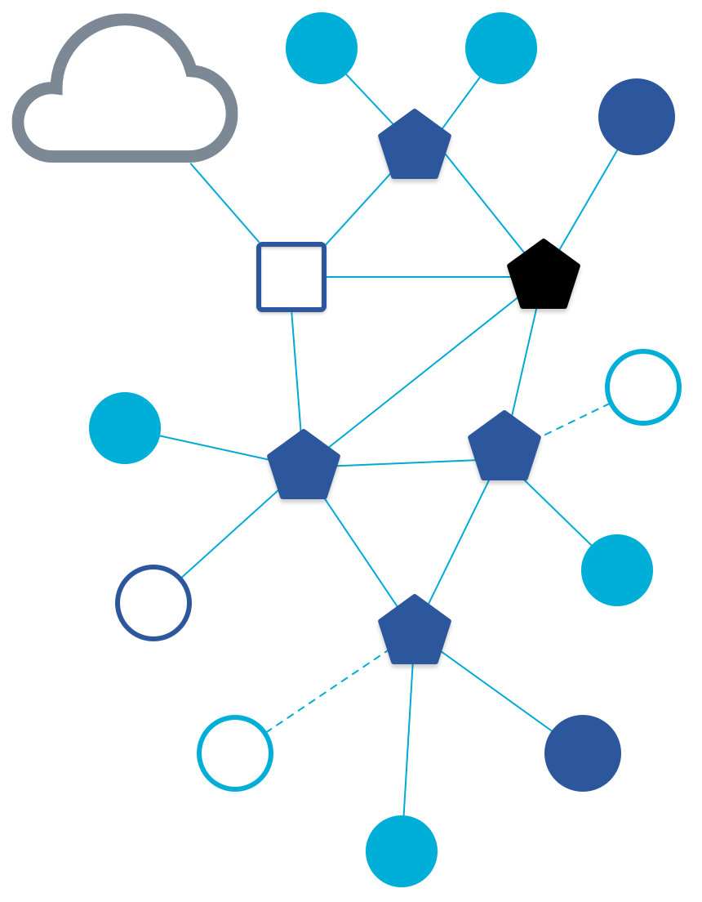

### What is Thread & OTNS

Thread is an IP-based low-power wireless mesh networking protocol that enables
secure device-to-device and device-to-cloud communications. Thread networks can
adapt to topology changes to avoid single point of failure.

> aside positive
>
> **Dive Deeper:** Refer to
[Thread Overview](https://www.threadgroup.org/What-is-Thread/Overview)
for more on Thread.

[OpenThread](https://openthread.io/) released by Google is an open-source
implementation of Thread. Despite its small code size and memory footprint,
OpenThread supports all features defined in the
[Thread 1.1.1 Specification](https://www.threadgroup.org/ThreadSpec).

[OpenThread Network Simulator (OTNS)](http://github.com/openthread/ot-ns) can be
used to simulate Thread networks by running simulated OpenThread nodes on posix
platforms. OTNS provides an easy-to-use Web interface (OTNS-Web) for visualizing
and operating simulated Thread networks.

### What you'll learn

* Install OTNS and its dependencies
* Build OpenThread for OTNS
* How to add/move/delete nodes in OTNS-Web
* Use OTNS-Web's other useful features to operate the network simulation
* Verify OpenThread's no-single-point-of-failure

This codelab is focused on OTNS-CLI and OTNS-Web. OTNS's other features, such as
Python scripting, are not covered.

### What you'll need

* Linux x86_64 or Mac OS.
*  [Git](https://git-scm.com/downloads).
*  [Go 1.11+](https://golang.org/dl/).
* Web browser. OTNS-Web uses a web browser for displaying simulations.
*  [Thread Primer](https://openthread.io/guides/thread-primer). You will need to
   know the basic concepts of Thread to understand what is taught in this
   Codelab.


## Installation
Duration: 05:00


### Install Go

OTNS requires Go 1.11+ to build.

1. Install Go from [https://golang.org/dl/](https://golang.org/dl/)
2. Add `$(go env GOPATH)/bin` (normally `$HOME/go/bin`) to `$PATH`:

```console
$ export PATH=$PATH:$(go env GOPATH)/bin
```

### Get OTNS code

```console
$ git clone https://github.com/openthread/ot-ns.git ./otns
$ cd otns
```

### Install Dependencies

```console
$ ./script/install-deps
grpcwebproxy installed: /usr/local/google/home/simonlin/go/bin/grpcwebproxy
```

You might be asked to input a password for `sudo`.

### **Install otns**

Install `otns` to `$GOPATH/bin`:

```console
$ ./script/install
otns installed: /usr/local/google/home/simonlin/go/bin/otns
```

#### Let's check if `otns` is properly installed

1. Run `which otns` to check if the `otns` executable is searchable in `$PATH.`
2. If the `otns` command is not found, verify that you have added
   `$(go env GOPATH)/bin` to `$PATH.`


## Build OpenThread for OTNS
Duration: 05:00


### Get OpenThread code from GitHub

```console
$ mkdir -p ~/src
$ git clone https://github.com/openthread/openthread ~/src/openthread
```

### Build OpenThread with `OTNS=1`

```console
$ cd ~/src/openthread
$ ./script/bootstrap
$ ./bootstrap
$ make -f examples/Makefile-simulation OTNS=1
```

You can find the OpenThread executables in the `output` directory:

### Linux

```console
$ ls ~/src/openthread/output/simulation/bin
ot-cli-ftd        ot-cli-mtd        ot-ncp-ftd        ot-ncp-mtd        ot-rcp
```

### macOS

```console
$ ls ~/src/openthread/output/simulation/bin
ot-cli-ftd        ot-cli-mtd        ot-ncp-ftd        ot-ncp-mtd        ot-rcp
```

Now it's time to run OTNS...


## Run OTNS
Duration: 01:00


Run `otns`:

```console
$ cd ~/src/openthread/output/simulation/bin
$ otns
> ← OTNS-CLI prompt
```

When successfully started, OTNS will enter a CLI console (`OTNS-CLI`) and
launch a web browser for network visualization and management (`OTNS-Web`):

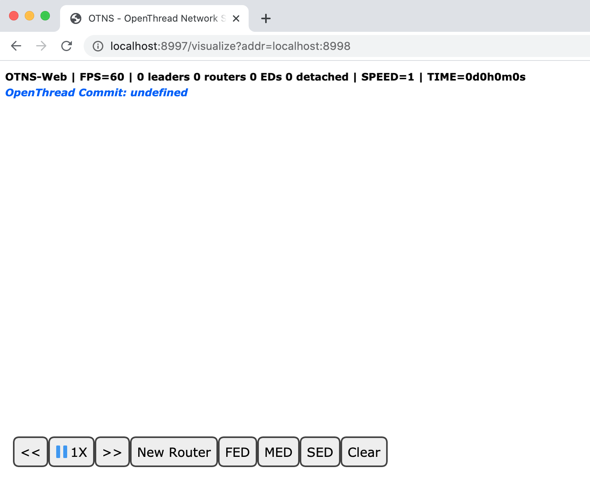

**If you can only see a blank page for OTNS-Web, chances are WebGL is not
enabled in your browser. Please refer to**
[**https://superuser.com/a/836833**](https://superuser.com/a/836833) **on how to
enable WebGL.**

In the following sections, you are going to learn to manage OTNS simulations
through `OTNS-CLI` and `OTNS-Web`.


## Get to Know OTNS-CLI & OTNS-Web
Duration: 02:00


### OTNS-CLI

`OTNS-CLI` provides a Command Line Interface (CLI) for managing OTNS simulations.

```console
$ cd ~/src/openthread/output/simulation/bin
$ otns
> ← OTNS-CLI prompt
```

You can type in commands through `OTNS-CLI`. Refer to the
[OTNS CLI reference](https://github.com/openthread/ot-ns/blob/main/cli/README.md#otns-cli-reference)
for a full list of commands. Don't worry, you are only going to use a few of
these commands in this Codelab.

### OTNS-Web

`OTNS-Web` is OTNS's network visualization and management tool. It provides a
visual representation of the nodes, messages, and links of the simulated Thread
network. Note the various elements of `OTNS-Web`:

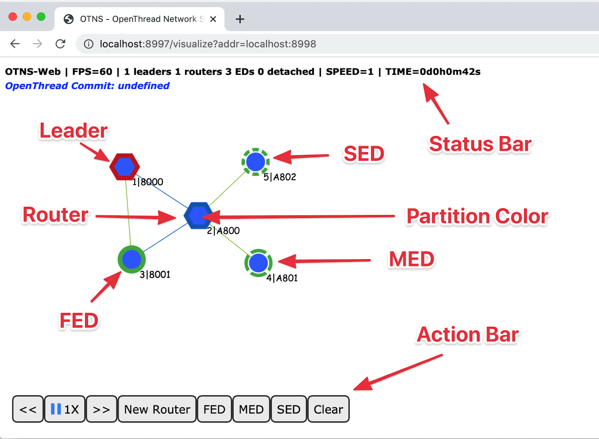


## Add Nodes
Duration: 05:00


### Add nodes through OTNS-CLI

Add a Router at position (300, 100)

```console
> add router x 300 y 100
1
Done
```

You should see a node created in `OTNS-Web`. The node starts as a Router and
becomes a Leader in a few seconds:

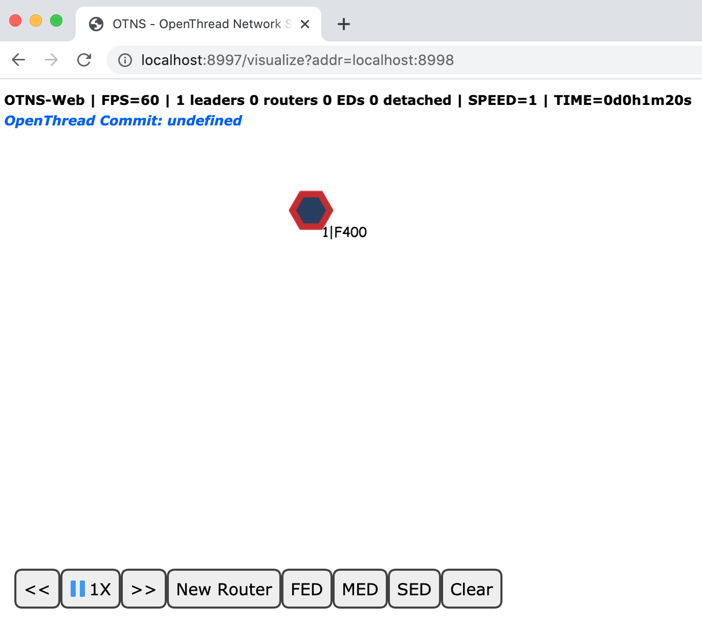

> aside positive
>
> **Tip:** The red hexagonal border of the node indicates it's a Leader.

### Add more nodes through `OTNS-CLI`

```console
> add fed x 200 y 100
2
Done
> add med x 400 y 100
3
Done
> add sed x 300 y 200
4
Done
```

Wait a few seconds for nodes to merge into one partition. You should see the
nodes in `OTNS-WEB`:

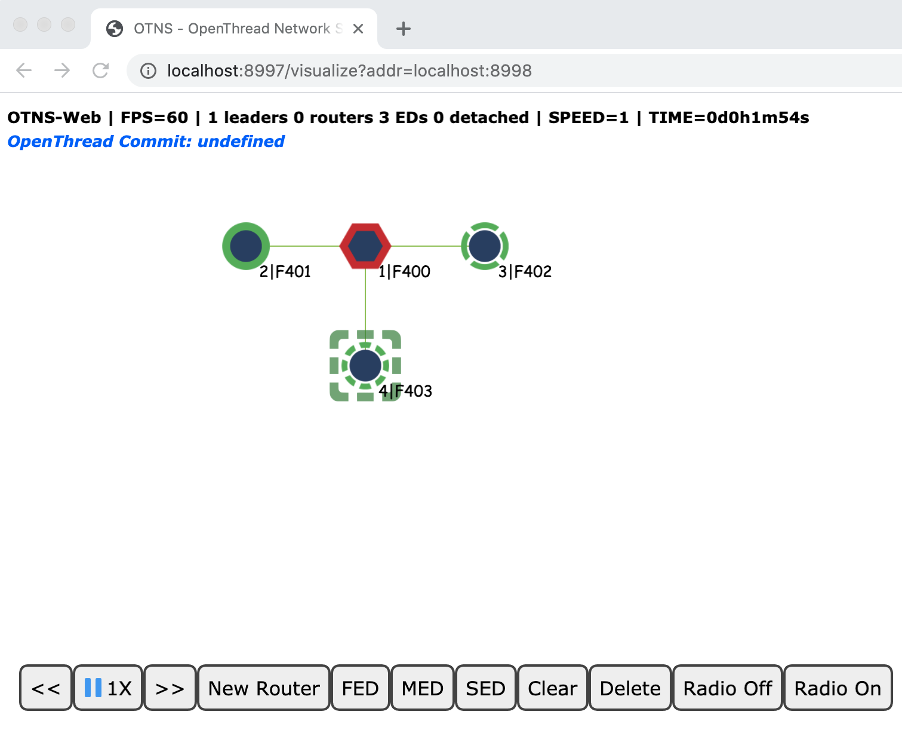

> aside positive
>
> **Tip:** The green line between nodes indicates that the nodes are linked and
the Leader is the parent of FED, MED, and SED.

> aside positive
>
> **Tip:** The last added node is selected by default and highlighted using a
green dashed square.

### Add nodes by `OTNS-Web`

You can also add nodes through `OTNS-Web`. Click the `New Router` button of the
`Action Bar`. You should see a node being created right above the `New Router`
button. Drag the node to be near the Leader you created through `OTNS-CLI`. All
the nodes should eventually merge into one partition:

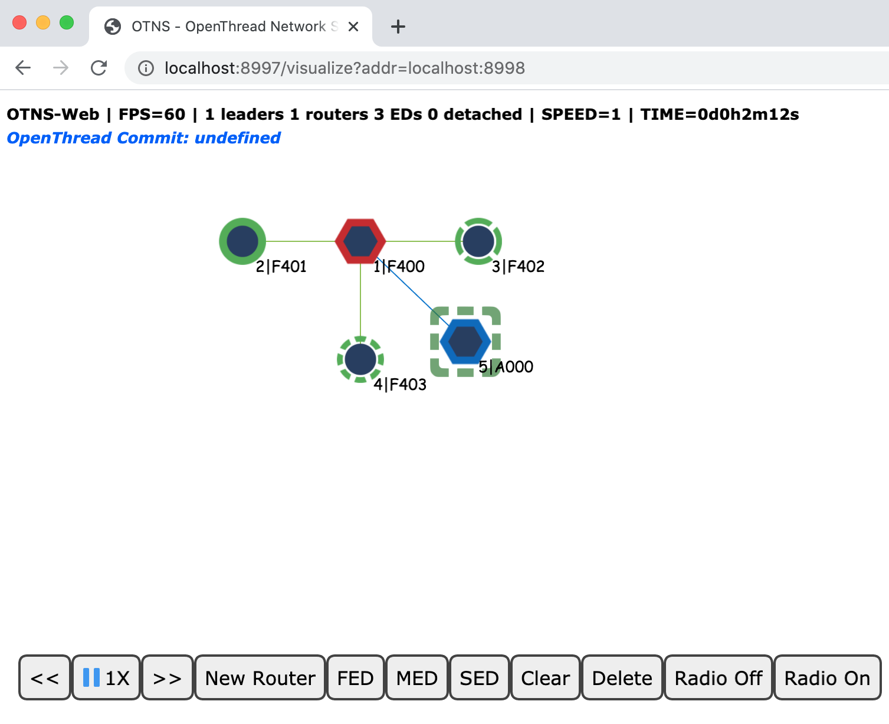

Also click the FED, MED, and SED buttons on the Action Bar to create other types
of nodes. Drag them to positions near existing nodes to attach them to that
Thread network:

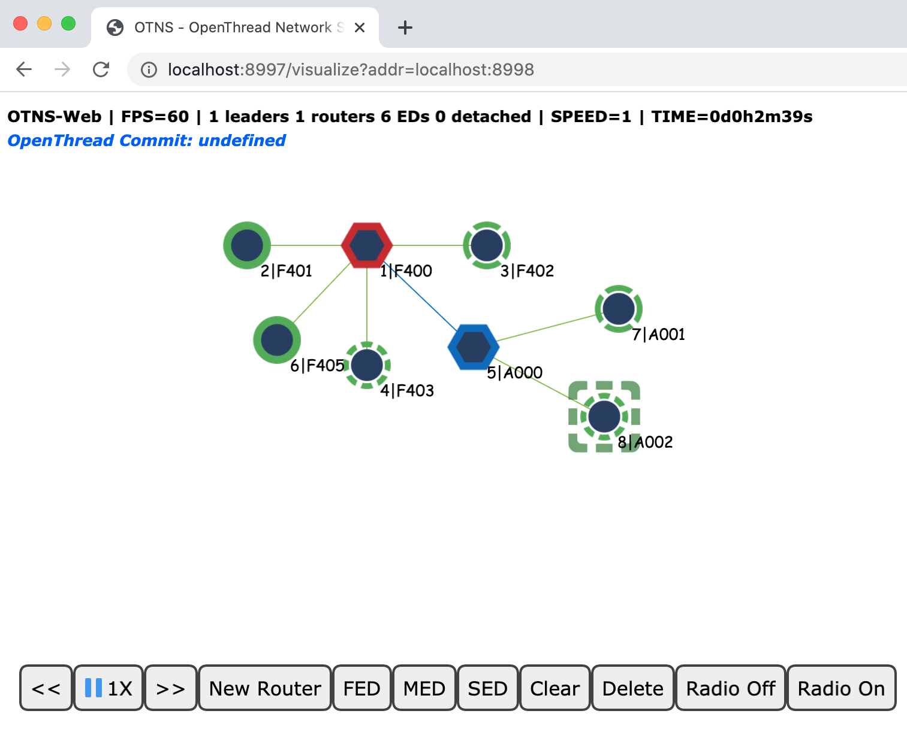

> aside positive
>
> **Tip:** The blue line between Leader and Router indicates that they're linked.

Now you have created a Thread network of one partition that contains many nodes.
In the next section, we are going to adjust the simulating speed to make the
simulation run faster.


## Adjust Speed
Duration: 02:00


Currently, the simulation should be running at `1X` speed, meaning that the
simulating time elapsed so far is the same as the actual time since we created
the first node.

### Adjust speed through `OTNS-CLI`

You can adjust the simulating speed through `OTNS-CLI`.

#### Set simulating speed to `100X`

```console
> speed 100
Done
```

You should see the nodes send messages much more frequently than before.

#### Set simulating speed to `MAX`

```console
> speed max
Done
```

Now, OTNS is trying it's best to simulate as fast as it can, so you should see
nodes sending a great number of messages.

#### Pause simulation

```console
> speed 0
Done
```

Setting simulating speed to `0` pauses the simulation.

#### Restore simulation at normal speed

```console
> speed 1
Done
```

Setting simulating speed to a value larger than `0` resumes the simulation.

### Adjust speed through `OTNS-Web`

#### Speed control buttons

Find the speed control buttons 
on the `Action Bar`. The buttons show the current simulating
speed and can be used to adjust simulating speed and pause/resume the simulation.

#### Speed up simulation

You can speed up the simulation by clicking the

button until the speed reaches
`MAX`: .

#### Slow down simulation

You can slow down the simulation by clicking the

button.

#### Pause simulation

Click the 
button to pause the simulation when it's running. The button will be changed to
.

#### Resume simulation

Click the

button to resume the simulation when it's paused. The button will be changed
back to
.

### Set simulating speed to `10X`

**In order to save time, use** **`OTNS-CLI`** **to adjust the simulating speed
to** **`10X`** **so that we can observe topology changes in the network much
faster.**

```console
> speed 10
Done
```


## Turn On/Off Radio
Duration: 01:00


Now, the simulation should contain 2 Routers (hexagon shape) and many children,
and runs at 10X speed. 

Find the current Leader (red border) of the 2 Routers, single click to select it:

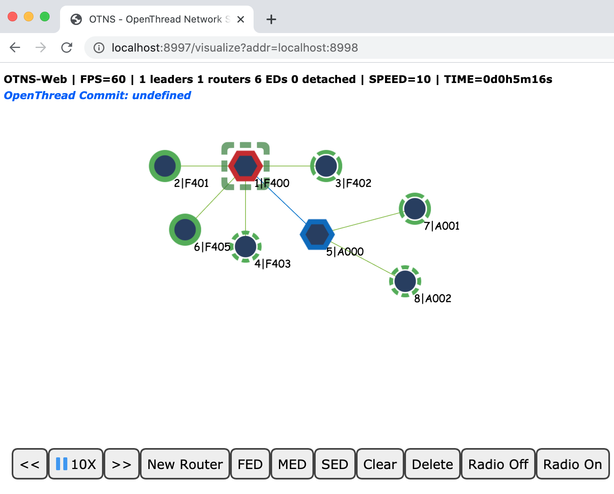

> aside positive
>
> **Tip:** The current selected node is highlighted using a green dashed square.

### Turn off radio

Click the 
button on the Action Bar to turn off the radio of the Leader node:

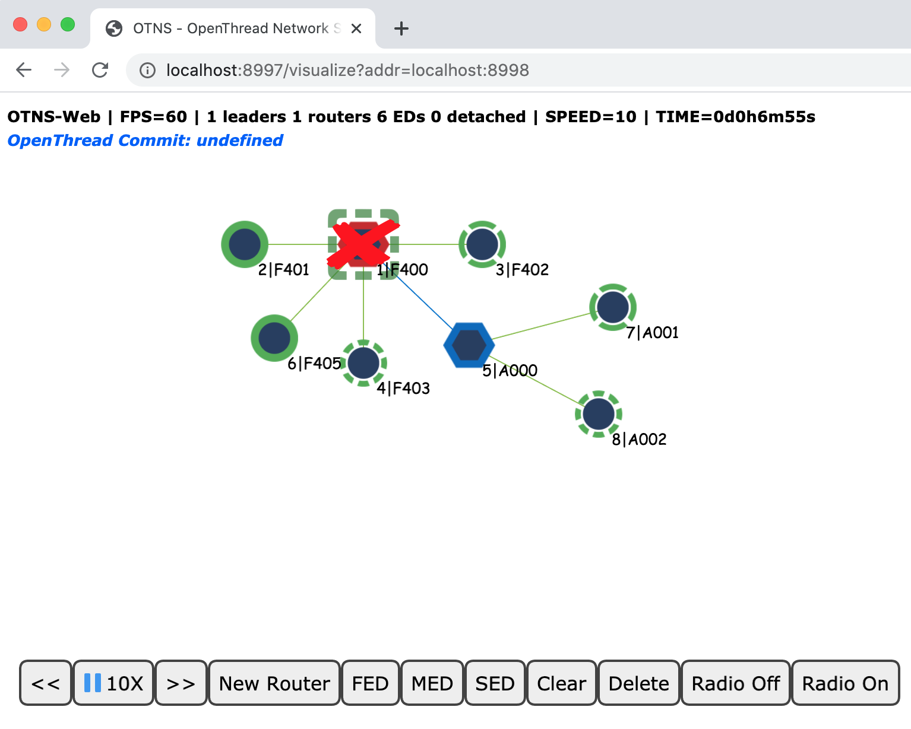

The Leader won't be able to send or receive messages with the radio off.

Wait for about 12s (120s in simulating time) for the other Router to become the
new Leader:

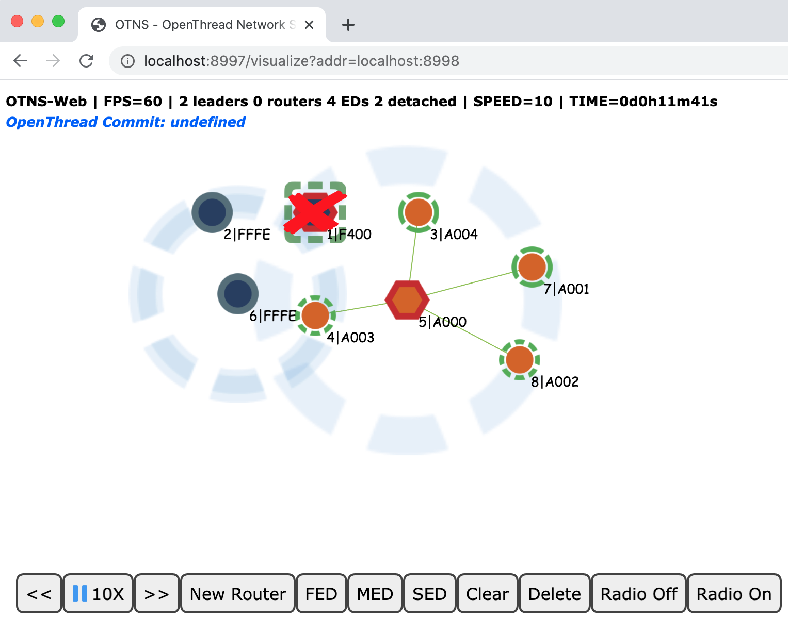

The Thread network recovers from Leader failure automatically by forming a new
partition with a new Leader. The new partition also has a new partition color.

### Turn on radio

Select the Leader whose radio was turned off. Click the

button on `Action Bar` to restore radio connectivity:

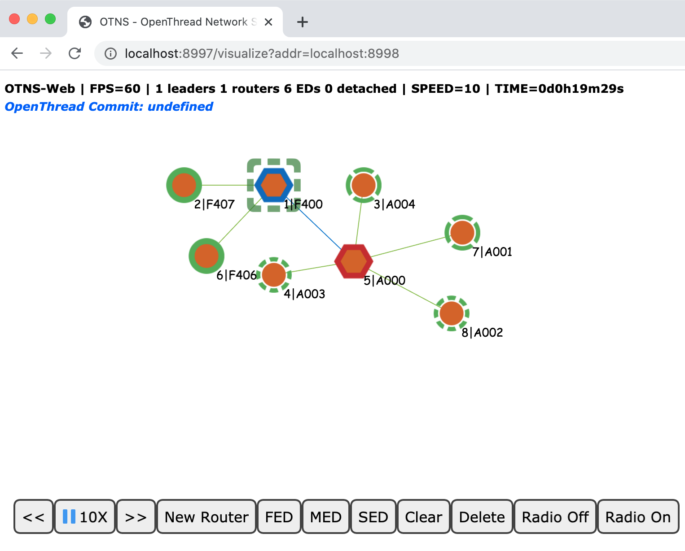

The Leader should reattach to the network after radio connectivity is restored.


## Move Nodes
Duration: 01:00


OTNS enables users to move nodes easily through `OTNS-CLI` or `OTNS-Web`.

### Move node through `OTNS-CLI`

Move node 5 to a new location:

```console
> move 5 600 300
Done
```

Since now node 5 is far from the other Router, they should lose connectivity to
each other, and after about 12s (120s in simulating time) both become Leaders of
their own partition:


> aside positive
>
> **Tip:** Nodes have limited radio transmission range in OTNS simulation.

### Move node through OTNS-Web

Move node 5 back to the original location by dragging. The two partitions should
merge back into one partition:

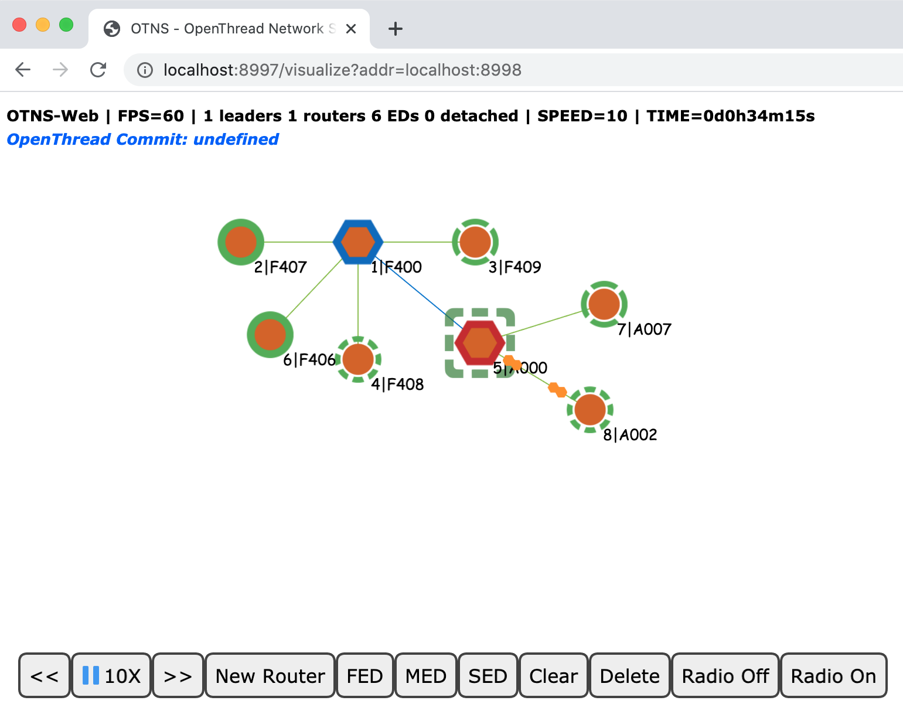


## Delete Nodes
Duration: 01:00


### Delete nodes through `OTNS-CLI`

Delete node 8:

```console
> del 8
Done
```

Node 8 should disappear from the simulation:

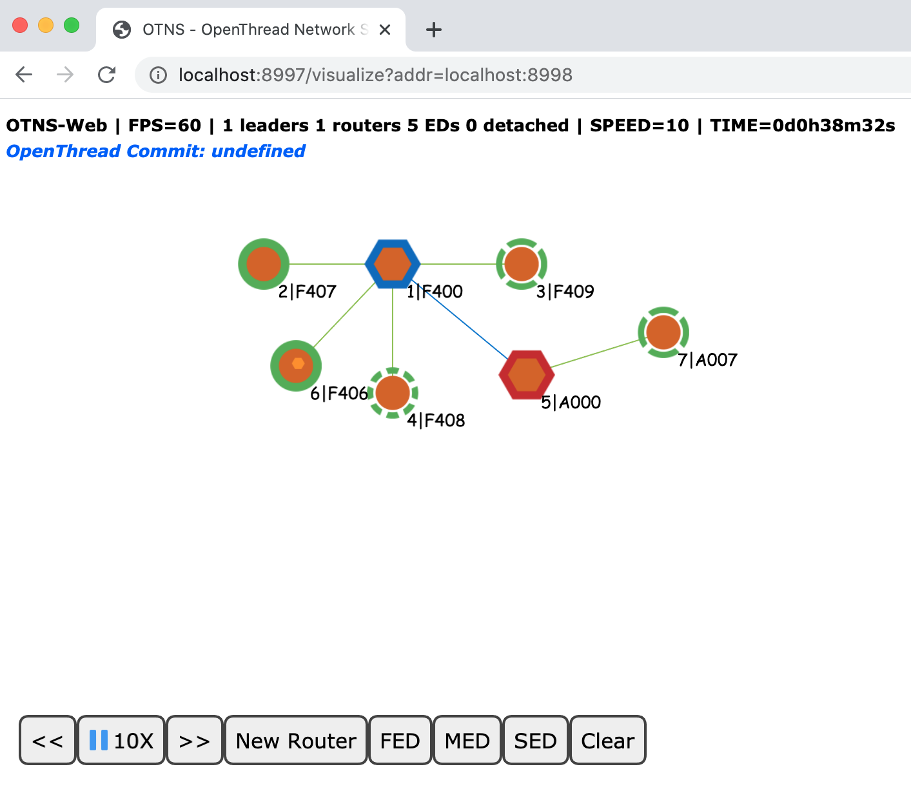

### Delete nodes through `OTNS-Web`

Select node 5 and click the

button on the `Action Bar` to delete node 5:

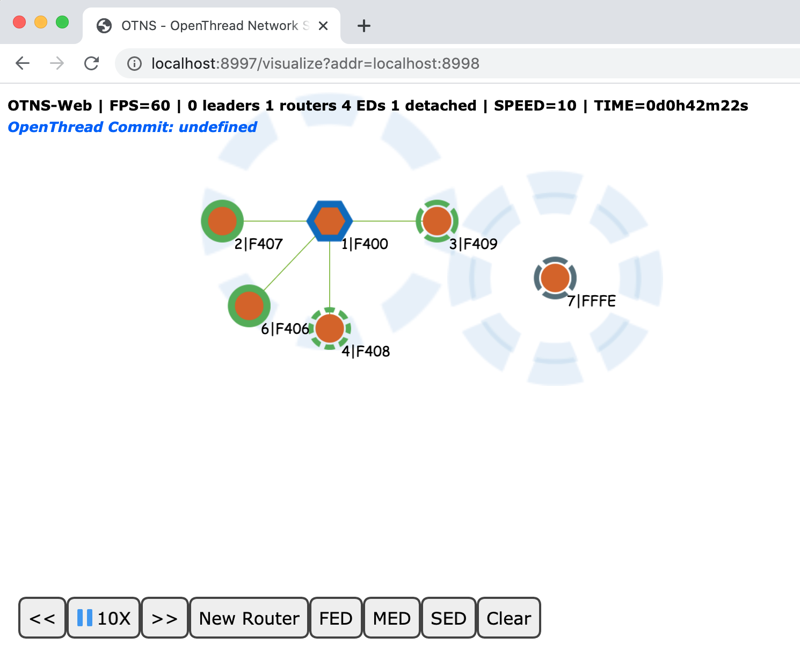

`Node 1` should become Leader and `Node 7` should detach since it can not reach
any Router.

#### Clear simulation (delete all nodes)

You can clear the simulation by deleting all nodes through `OTNS-Web`.

Click 
button on `Action Bar.` All nodes will disappear at once.

### Before continuing...

Add some nodes to the simulation by yourself so that you can continue in this
tutorial.


## OTNS-CLI Node Context
Duration: 02:00


`OTNS-CLI` provides node context mode for easy interaction with nodes to help
developers diagnose a node's status.

### Enter node context mode

Enter the node context of node 1:

```console
> node 1
Done
node 1>
```

The CLI prompt changed to `node 1&gt;` , indicating the current node context.
You can type in
[OpenThread CLI commands](https://github.com/openthread/openthread/blob/main/src/cli/README.md#openthread-command-list)
to be executed on the node as if you are interacting with the node directly.

### Execute commands in node context

```console
node 1> state
leader
Done
node 1> channel
11
Done
node 1> panid
0xface
Done
node 1> networkname
OpenThread
Done
node 1> ipaddr
fdde:ad00:beef:0:0:ff:fe00:fc00
fdde:ad00:beef:0:0:ff:fe00:d800
fdde:ad00:beef:0:2175:8a67:1000:6352
fe80:0:0:0:2075:82c2:e9e9:781d
Done
```

### Switch to another node context

```console
node 1> node 2
Done
node 2> 
```

### Exit node context

```console
node 1> exit
Done
>
```


## Congratulations


Congratulations, you've successfully executed your first OTNS simulation!

You've learned how to install OTNS and its dependencies. You built
[OpenThread](https://github.com/openthread/openthread) for OTNS and started OTNS
simulation with OpenThread simulation instances. You've learned how to
manipulate the simulation in various ways through both `OTNS-CLI` and `OTNS-Web`.

You now know what OTNS is and how you can use OTNS to simulate OpenThread
networks.

### What's next?

Check out some of these codelabs...

*  [Simulating a Thread network with OpenThread](https://openthread.io/codelabs/openthread-simulation-posix/#0)
*  [Simulating a Thread network using OpenThread in Docker](https://openthread.io/codelabs/openthread-simulation/#0)
*  [Build a Thread network with nRF52840 boards and OpenThread](https://openthread.io/codelabs/openthread-hardware/#0)

### Reference docs

*  [Thread Primer](https://openthread.io/guides/thread-primer)
*  [OpenThread Guides](https://openthread.io/guides)
*  [OpenThread CLI Reference](https://github.com/openthread/openthread/blob/main/src/cli/README.md#openthread-cli-reference)

## License

Copyright (c) 2021, The OpenThread Authors.
All rights reserved.

Redistribution and use in source and binary forms, with or without
modification, are permitted provided that the following conditions are met:
1. Redistributions of source code must retain the above copyright
   notice, this list of conditions and the following disclaimer.
2. Redistributions in binary form must reproduce the above copyright
   notice, this list of conditions and the following disclaimer in the
   documentation and/or other materials provided with the distribution.
3. Neither the name of the copyright holder nor the
   names of its contributors may be used to endorse or promote products
   derived from this software without specific prior written permission.

THIS SOFTWARE IS PROVIDED BY THE COPYRIGHT HOLDERS AND CONTRIBUTORS "AS IS"
AND ANY EXPRESS OR IMPLIED WARRANTIES, INCLUDING, BUT NOT LIMITED TO, THE
IMPLIED WARRANTIES OF MERCHANTABILITY AND FITNESS FOR A PARTICULAR PURPOSE
ARE DISCLAIMED. IN NO EVENT SHALL THE COPYRIGHT HOLDER OR CONTRIBUTORS BE
LIABLE FOR ANY DIRECT, INDIRECT, INCIDENTAL, SPECIAL, EXEMPLARY, OR
CONSEQUENTIAL DAMAGES (INCLUDING, BUT NOT LIMITED TO, PROCUREMENT OF
SUBSTITUTE GOODS OR SERVICES; LOSS OF USE, DATA, OR PROFITS; OR BUSINESS
INTERRUPTION) HOWEVER CAUSED AND ON ANY THEORY OF LIABILITY, WHETHER IN
CONTRACT, STRICT LIABILITY, OR TORT (INCLUDING NEGLIGENCE OR OTHERWISE)
ARISING IN ANY WAY OUT OF THE USE OF THIS SOFTWARE, EVEN IF ADVISED OF THE
POSSIBILITY OF SUCH DAMAGE.
