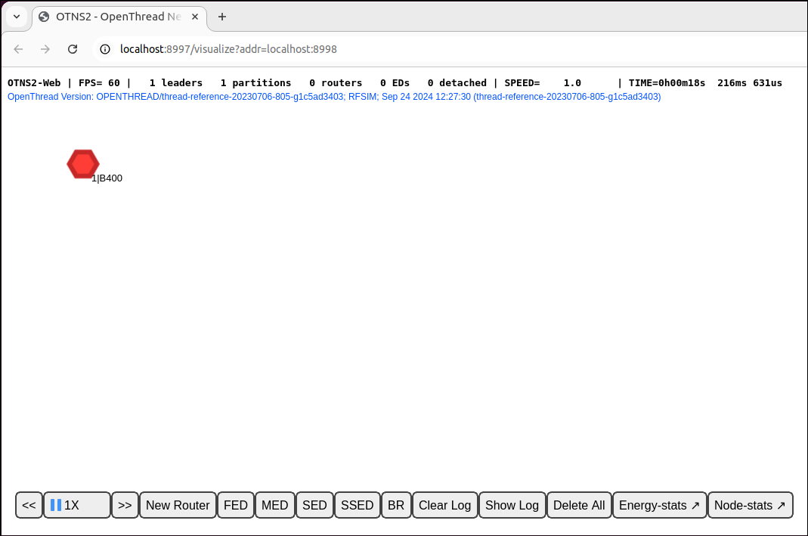
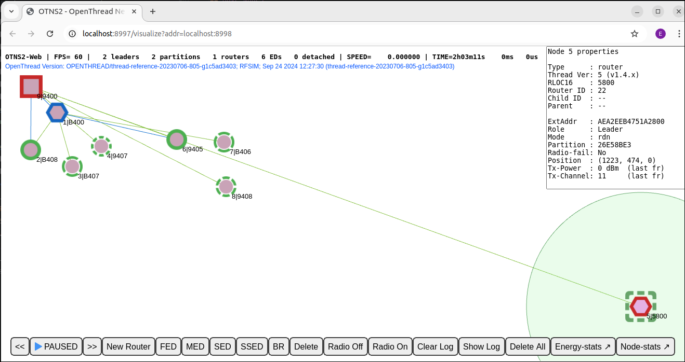

# Simulate Thread Networks using OTNS

[Codelab Feedback](https://github.com/openthread/ot-ns/issues)


## Introduction


### What is Thread & OTNS

Thread is an IP-based low-power wireless mesh networking protocol that enables
secure device-to-device and device-to-cloud communications. Thread networks can
adapt to topology changes to avoid a single point of failure.

> aside positive
>
> **Dive Deeper:** For more information, refer to
[Thread Primer](../../guides/thread-primer/index.md).

[OpenThread](https://openthread.io/) released by Google is an open-source
implementation of Thread. Despite its small code size and memory footprint,
OpenThread supports all features defined in the
[Thread Specification](https://www.threadgroup.org/support#specifications).

[OpenThread Network Simulator (OTNS)](http://github.com/openthread/ot-ns) can be
used to simulate Thread networks by running simulated OpenThread nodes on posix
platforms. OTNS provides an easy-to-use Web interface (OTNS-Web) for visualizing
and operating simulated Thread networks. Scripted simulations (with Python) is 
also possible.

### What you'll learn

* Install OTNS and its dependencies
* Get to know the basics of the OTNS-CLI
* How to add/move/delete OpenThread nodes in OTNS-Web
* Use OTNS-Web's other useful features to control the network simulation
* Verify OpenThread's no-single-point-of-failure
* See the data traffic between OpenThread nodes in Wireshark

This codelab is focused on OTNS-CLI and OTNS-Web for interactive use. OTNS's 
other features, such as Python scripting, are not covered.

### What you'll need

*  Preferably Linux x86_64, or Mac OS with [Homebrew](https://brew.sh/). Ubuntu 22/24 in Windows
   [WSL2](https://learn.microsoft.com/en-us/windows/wsl/install) should also work but may require some manual 
   tweaking of settings.
*  [Git](https://git-scm.com/downloads).
*  Web browser. OTNS-Web uses a web browser for displaying simulations.
*  [Thread Primer](https://openthread.io/guides/thread-primer). You will need to
   know the basic concepts of Thread to understand what is taught in this
   Codelab.

### Terminology

The term "Router" is used as the technical term for the Thread Mesh Extender, which was initially called a 
Thread Router. "Node" refers to any simulated OpenThread device in an OTNS simulation. 

## Installation
Duration: 10:00

### Get OTNS code

```console
$ git clone https://github.com/openthread/ot-ns.git ./otns
$ cd otns
```

All subsequent console commands in this Codelab are run from the `otns` directory. 

### Bootstrap and install

The `bootstrap` script will install dependencies (including Python3 and Go/Golang, if needed) and install OTNS.
It also builds the various OT node types that can be used directly in a simulation, and it performs some basic tests.
Due to the node builds, it can take several minutes.

```console
$ ./script/bootstrap
....
....
OTNS installed - use 'otns' to start it.
$
```

You might be asked to input a password for `sudo`.

### If `otns` is not properly installed

The script may report an error like:

```console
....
OTNS installed - please add ~/go/bin to your PATH variable first, to use it.
$
```

In this case, you need to add `$(go env GOPATH)/bin` to your `$PATH.`

In case of other errors, a [GitHub issue](https://github.com/openthread/ot-ns/issues) can be created.

## Run OTNS for the first time
Duration: 01:00


Run `otns`:

```console
$ otns
>_ ← OTNS-CLI prompt
```

When successfully started, OTNS will enter a CLI console (`OTNS-CLI`) and
launch a web browser for network visualization and management (`OTNS-Web`):


**If you can only see a blank page for OTNS-Web, chances are WebGL is not
enabled in your browser. Please refer to 
[**https://superuser.com/a/836833**](https://superuser.com/a/836833) on how to
enable WebGL.**

In the following sections, you are going to learn to manage OTNS simulations
through `OTNS-CLI` and `OTNS-Web`.


## Get to Know OTNS-CLI & OTNS-Web
Duration: 02:00


### OTNS-CLI

`OTNS-CLI` is the Command Line Interface (CLI) for managing OTNS simulations.

```console
$ otns
>_ ← OTNS-CLI prompt
```

You can type in commands through `OTNS-CLI`. Refer to the
[OTNS CLI reference](https://github.com/openthread/ot-ns/blob/main/cli/README.md#otns-cli-reference)
for a full list of commands. Don't worry, you are only going to use a few of
these commands in this Codelab.

Type the `help` command for an overview of CLI commands. This list is identical to the CLI reference.

```console
> help
add             Add a node to the simulation and get the node ID.
....
....
Done
> 
```

To get more help on a specific command, use the command's name, for example:

```console
> help add
add
  Add a node to the simulation and get the node ID.
  
Definition:
....
....
> 
```

### OTNS-Web

`OTNS-Web` is OTNS's network visualization and management tool. It provides a
visual representation of the nodes, messages, and links of the simulated Thread
network. Note the various elements of `OTNS-Web`:


## Add Nodes
Duration: 05:00


### Add nodes through OTNS-CLI

Add a Thread Router into the simulation:

```console
> add router
1
Done
```

You should see a node created in `OTNS-Web`. The node starts as a Router and
becomes a Leader in a few seconds:



To make it easy to start simulations interactively, each new OpenThread node is by default commissioned with a 
standard set of network parameters.

> aside positive
>
> **Tip:** The red hexagonal border of the node indicates it's a Leader.

### Add more nodes through `OTNS-CLI`

Now we will add some nodes of different types.

```console
> add fed
2
Done
> add med
3
Done
> add sed
4
Done
```

Wait a few seconds for nodes to merge into one partition. You should see the
nodes in `OTNS-Web`:


> aside positive
>
> **Tip:** The green line between nodes indicates that the nodes are linked and
the Leader is the parent of the FED, MED, and SED.

Also in `OTNS-Web`, it's possible to select any of the nodes to get a panel with more information about the node. 
For example, in the below figure node 1 is selected. The "Role" entry in the panel confirms that it is a Leader.


> aside positive
>
> **Tip:** The selected node is highlighted using a green dashed square and green circle.

### Add nodes by `OTNS-Web`

You can also add nodes through `OTNS-Web`. Click the `New Router` button of the
`Action Bar`. You should see a node being created to the right of the selected node.
The new router should join the existing Thread partition:


Also click the FED, MED, SSED, and BR buttons on the Action Bar to create these other types
of nodes. There should now be 9 nodes in total.
If you want, drag some nodes around to other positions, to create a different physical network topology.


> aside positive
>
> **Tip:** A blue line between Leader, Router and FEDs indicates that they're linked.
> Blue indicates it is not a Parent/Child link, but something else, such as a Router-to-Router link.

Now you have created a Thread network of one partition that contains many nodes.
In the next section, we are going to adjust the simulating speed to make the
simulation run faster.


## Adjust Speed
Duration: 02:00


Currently, the simulation should be running at `1X` speed, meaning that the
simulating time elapsed so far is the same as the actual time since we created
the first node.

### Adjust speed through `OTNS-CLI`

You can adjust the simulating speed through `OTNS-CLI`.

#### Set simulating speed to `100X`

```console
> speed 100
Done
```

You should see the nodes send messages much more frequently than before.

#### Set simulating speed to `MAX`

```console
> speed max
Done
```

Now, OTNS is trying it's best to simulate as fast as it can, so you should see
nodes sending a great number of messages.

#### Pause simulation

```console
> speed 0
Done
```

Setting simulating speed to `0` pauses the simulation.

#### Restore simulation at normal speed

```console
> speed 1
Done
```

Setting simulating speed to a value larger than `0` resumes the simulation.

### Adjust speed through `OTNS-Web`

#### Speed control buttons

Find the speed control buttons 
on the `Action Bar`. The buttons show the current simulating
speed and can be used to adjust simulating speed and pause/resume the simulation.

#### Speed up simulation

You can speed up the simulation by clicking the

button until the speed reaches
`MAX`: .

#### Slow down simulation

You can slow down the simulation by clicking the

button.

#### Pause simulation

Click the 
button to pause the simulation when it's running. The button will be changed to
.

#### Resume simulation

Click the

button to resume the simulation when it's paused. The button will be changed
back to
.

### Set simulating speed to `10X`

**In order to save time, use** **`OTNS-CLI`** **to adjust the simulating speed
to** **`10X`** **so that we can observe topology changes in the network much
faster.**

```console
> speed 10
Done
```


## Turn On/Off Radio
Duration: 01:00


Now, the simulation should contain at least 2 Routers (hexagon shape), possibly a Border Router (square shape) and many children,
and runs at 10X speed.

Find the current Leader (red border) of the 2 Routers, single click to select it:


### Turn off radio

Click the 
button on the Action Bar to turn off the radio of the Leader node.
The Leader won't be able to send or receive messages with the radio off.

Wait for about 12s (120s in simulating time) for the other Router or Border Router to become the
new Leader:


The Thread network recovers from Leader failure automatically by forming a new
partition with a new Leader. The new partition also has a new partition color.

### Turn on radio

Select the Leader whose radio was turned off. Click the

button on `Action Bar` to restore radio connectivity:


The Leader should reattach to the network after radio connectivity is restored.


## Move Nodes
Duration: 01:00


OTNS enables users to move nodes easily through `OTNS-CLI` or `OTNS-Web`.

### Move node through `OTNS-CLI`

Move the Border Router node 9 to a new location:

```console
> move 9 50 50
Done
```

### Move node through OTNS-Web

Move node 5 all the way to the bottom right, by dragging. Because node 5 is now out of radio coverage of 
the other Routers, it forms its own partition with a new Partition ID. The Partition IDs can be checked 
on the node information panel by clicking the nodes.



Note that a single green line is still drawn between node 5 and node 9. This is often due to stale information about a 
child, which is still kept in the child table of a former parent. Or it could be stale information about the former 
router-to-router link between node 9 and node 5. (Or possibly, in this case, even a rendering bug.) 
Eventually, stale information is cleaned up on the nodes after the appropriate timeout.

## Delete Nodes
Duration: 01:00


### Delete nodes through `OTNS-CLI`

Delete node 5:

```console
> del 5
Done
```

Node 5 should disappear from the simulation:


### Delete nodes through `OTNS-Web`

Select the Border Router node 9 and click the

button on the `Action Bar` to delete node 9:


`Node 1` should become Leader of a new partition and all remaining nodes will attach as a Child 
to node 1.


## OTNS-CLI Node Context
Duration: 02:00


`OTNS-CLI` provides node context mode for easy interaction with nodes to help
developers diagnose a node's status. Also node actions can be initiated from this mode.

### Enter node context mode

Enter the node context of node 1:

```console
> node 1
Done
node 1>
```

The CLI prompt changed to `node 1&gt;` , indicating the current node context.
You can type in
[OpenThread CLI commands](https://github.com/openthread/openthread/blob/main/src/cli/README.md#openthread-command-list)
to be executed on the node as if you are interacting with the node directly.

### Execute commands in node context

```console
node 1> state
leader
Done
node 1> channel
11
Done
node 1> panid
0xface
Done
node 1> networkname
otns
Done
node 1> ipaddr
fdde:ad00:beef:0:0:ff:fe00:fc00
fdde:ad00:beef:0:0:ff:fe00:b400
fd00:f00d:cafe:0:2505:8719:3685:ebfb
fdde:ad00:beef:0:4fd9:b9ba:44e0:96cb
fe80:0:0:0:e86a:e07:ec97:777
Done
```

### Switch to another node context

```console
node 1> node 2
Done
node 2> 
```

### Exit node context

```console
node 1> exit
Done
>
```

An alternative way to exit node context is the `node 0` command.

## Viewing node logs and packet captures
Duration: 05:00

### OpenThread node logs

By default, OTNS generates detailed log files for all simulated OpenThread nodes. These can be viewed in the `./tmp` 
directory. The filename is `0_<node-number>.log`. For example, a log file excerpt is shown below:

```log
7616488 00:00:06.326 [I] MeshForwarder-: Received IPv6 UDP msg, len:90, chksum:5915, ecn:no, from:ca72650db7b856af, sec:no, prio:net, rss:-58.0
7616488 00:00:06.326 [I] MeshForwarder-:     src:[fe80:0:0:0:c872:650d:b7b8:56af]:19788
7616488 00:00:06.326 [I] MeshForwarder-:     dst:[ff02:0:0:0:0:0:0:1]:19788
7616488 00:00:06.326 [D] Mle-----------: Receive MLE message
7616488 00:00:06.326 [D] Mac-----------: Idle mode: Radio receiving on channel 11
7657544 00:00:06.367 [D] Mac-----------: ==============================[RX len=063]==============================
7657544 00:00:06.367 [D] Mac-----------: | 41 D8 7F CE FA FF FF 46 | 74 5A 33 9E 76 51 4E 7F | A......FtZ3.vQN. |
7657544 00:00:06.367 [D] Mac-----------: | 3B 02 F0 4D 4C 4D 4C 81 | E6 00 15 03 00 00 00 00 | ;..MLML......... |
7657544 00:00:06.367 [D] Mac-----------: | 00 00 00 01 46 86 7D FE | 06 CC DB 94 86 9C 88 0B | ....F.}......... |
7657544 00:00:06.367 [D] Mac-----------: | 1C 1E 26 9B 8D 21 2E 65 | 53 5A 43 4E A2 59 D6    | ..&..!.eSZCN.Y.  |
7657544 00:00:06.367 [D] Mac-----------: ------------------------------------------------------------------------
7657544 00:00:06.367 [I] MeshForwarder-: Received IPv6 UDP msg, len:84, chksum:81e6, ecn:no, from:4e51769e335a7446, sec:no, prio:net, rss:-48.0
7657544 00:00:06.367 [I] MeshForwarder-:     src:[fe80:0:0:0:4c51:769e:335a:7446]:19788
7657544 00:00:06.367 [I] MeshForwarder-:     dst:[ff02:0:0:0:0:0:0:2]:19788
7657544 00:00:06.367 [D] Mac-----------: Idle mode: Radio receiving on channel 11
7833912 00:00:06.543 [I] Mle-----------: AttachState ParentReq -> Idle
7833912 00:00:06.543 [N] RouterTable---: Allocate router id 12
7833912 00:00:06.543 [N] Mle-----------: RLOC16 fffe -> 3000
7833912 set node RLOC16: fffe -> 3000
7833912 00:00:06.543 [D] SubMac--------: RadioShortAddress: 0x3000
7833912 00:00:06.543 [N] Mle-----------: Role detached -> leader
7833912 00:00:06.543 [N] Mle-----------: Partition ID 0x24c35f10
7833912 00:00:06.543 [I] RouterTable---: Route table
7833912 00:00:06.543 [I] RouterTable---:     12 0x3000 - me - leader
```

The absolute simulation time in microseconds is shown on the left. The `hh:mm:ss` timestamp shows the OpenThread node's 
own log timestamp, which may differ from the absolute simulation time. 

### Wireshark packet captures

By default, all transmitted IEEE 802.15.4 frames are captures in the PCAP file `current.pcap`. This file can be read 
by [Wireshark](https://www.wireshark.org/) during or after the simulation. Due to the link-layer encryption of 
Thread, a one-time configuration action in Wireshark is needed to set the decryption key for OTNS properly. By 
default, one well-known Network Key is used so that frame decryption by Wireshark is made easy.

See the below screenshot for an example of OpenThread packet inspection in Wireshark.


To configure the decryption key, select in the menu **Edit -> Preferences**. Then in the preferences window, select 
**Protocols -> IEEE 802.15.4**. Click the **Edit...** button next to "Decryption Keys". Click **+** to create a new entry 
and enter the key `00112233445566778899aabbccddeeff` (32 characters) and select "Thread hash" in the "Key hash" field. 
The "Decryption key index" can be left to `0`. Then click **OK**, and **OK** again. Now the OTNS PCAP file should 
properly decrypt when loaded. 

The timestamps shown in the "Time" column (in seconds) correspond to the absolute simulation time values shown in the 
OpenThread node logs. This makes it easier to correlate log messages with transmitted or received radio frames. 
However, the values are typically not identical up to single microsecond precision: the simulated IEEE 802.15.4 
radio hardware may add some additional delay, after a radio frame is requested to be sent by the OpenThread stack.

## Congratulations


Congratulations, you've successfully executed your first OTNS simulation!

You've learned how to install OTNS and its dependencies. You started an OTNS
simulation with OpenThread simulated nodes. You've learned how to
manipulate the simulation in various ways through both `OTNS-CLI` and `OTNS-Web`.

You now know what OTNS is and how you can use OTNS to simulate OpenThread
networks.

### What's next?

Check out some of these codelabs...

*  [Simulating a Thread network with OpenThread](https://openthread.io/codelabs/openthread-simulation-posix/#0)
*  [Simulating a Thread network using OpenThread in Docker](https://openthread.io/codelabs/openthread-simulation/#0)
*  [Build a Thread network with nRF52840 boards and OpenThread](https://openthread.io/codelabs/openthread-hardware/#0)

### Reference docs

*  [Thread Primer](https://openthread.io/guides/thread-primer)
*  [OpenThread Guides](https://openthread.io/guides)
*  [OpenThread CLI Reference](https://github.com/openthread/openthread/blob/main/src/cli/README.md#openthread-cli-reference)

## License

Copyright (c) 2021-2024, The OpenThread Authors.
All rights reserved.

Redistribution and use in source and binary forms, with or without
modification, are permitted provided that the following conditions are met:
1. Redistributions of source code must retain the above copyright
   notice, this list of conditions and the following disclaimer.
2. Redistributions in binary form must reproduce the above copyright
   notice, this list of conditions and the following disclaimer in the
   documentation and/or other materials provided with the distribution.
3. Neither the name of the copyright holder nor the
   names of its contributors may be used to endorse or promote products
   derived from this software without specific prior written permission.

THIS SOFTWARE IS PROVIDED BY THE COPYRIGHT HOLDERS AND CONTRIBUTORS "AS IS"
AND ANY EXPRESS OR IMPLIED WARRANTIES, INCLUDING, BUT NOT LIMITED TO, THE
IMPLIED WARRANTIES OF MERCHANTABILITY AND FITNESS FOR A PARTICULAR PURPOSE
ARE DISCLAIMED. IN NO EVENT SHALL THE COPYRIGHT HOLDER OR CONTRIBUTORS BE
LIABLE FOR ANY DIRECT, INDIRECT, INCIDENTAL, SPECIAL, EXEMPLARY, OR
CONSEQUENTIAL DAMAGES (INCLUDING, BUT NOT LIMITED TO, PROCUREMENT OF
SUBSTITUTE GOODS OR SERVICES; LOSS OF USE, DATA, OR PROFITS; OR BUSINESS
INTERRUPTION) HOWEVER CAUSED AND ON ANY THEORY OF LIABILITY, WHETHER IN
CONTRACT, STRICT LIABILITY, OR TORT (INCLUDING NEGLIGENCE OR OTHERWISE)
ARISING IN ANY WAY OUT OF THE USE OF THIS SOFTWARE, EVEN IF ADVISED OF THE
POSSIBILITY OF SUCH DAMAGE.
