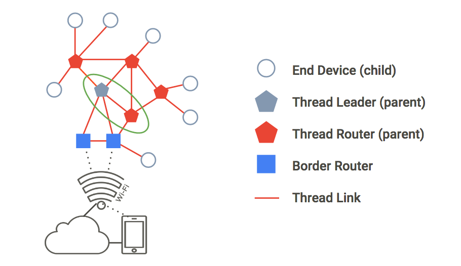
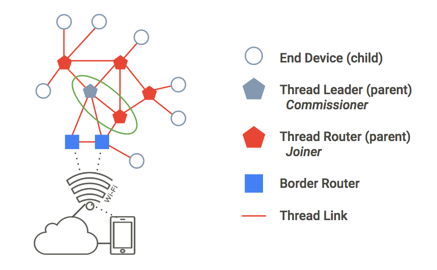

# Simulating a Thread network with OpenThread

[Codelab Feedback](https://github.com/openthread/openthread/issues)


## Introduction


[OpenThread](https://github.com/openthread) released by Google is an open-source
implementation of the [Thread](http://threadgroup.org/) networking protocol.
Google Nest has released OpenThread to make the technology used in Nest products
broadly available to developers to accelerate the development of products for
the connected home.

The [Thread specification](https://www.google.com/url?q=http://threadgroup.org/ThreadSpec&sa=D&ust=1489513620478000&usg=AFQjCNHWiFeZ6NLl4UVZhjCWsaJ2OOaRsA)
defines an IPv6-based reliable, secure and low-power wireless device-to-device
communication protocol for home applications. OpenThread implements all Thread
networking layers including IPv6, 6LoWPAN, IEEE 802.15.4 with MAC security,
Mesh Link Establishment, and Mesh Routing.

This Codelab walks you through simulating a Thread network on simulated devices.

###  What you'll learn 

* How to set up the OpenThread build toolchain
* How to simulate a Thread network
* How to authenticate Thread nodes
* How to manage a Thread network with OpenThread Daemon

###  What you'll need

* git
* Basic knowledge of Linux, network routing


## Set up the build system
Duration: 10:00


###  Git

Git is required to complete this Codelab. Download and install it before
continuing.

<button>[Download Git](https://git-scm.com/downloads)</button>

Once installed, follow the instructions for your specific OS to download and
build OpenThread.

###  XCode for Mac OS X

XCode is required to install and build OpenThread on **Mac OS X**.

<button>[Download XCode](https://developer.apple.com/downloads/)</button>

After XCode is installed, install the XCode Command Line Tools:

```console
$ xcode-select --install
```

###  Build on Linux / Mac OS X 

These installation instructions have been tested on Ubuntu Server 14.04 LTS and
Mac OS X Sierra 10.12.6.

Install OpenThread. The `bootstrap` commands make sure the toolchain is
installed and the environment is properly configured:

```console
$ mkdir -p ~/src
$ cd ~/src
$ git clone --recursive https://github.com/openthread/openthread.git
$ cd openthread
$ ./script/bootstrap
$ ./bootstrap
```

### Using Windows

If you prefer Windows, we recommend trying the Docker version of this Codelab.

<button>[OpenThread Simulation on Docker](https://openthread.io/codelabs/openthread-simulation/#0)</button>


## Build the OpenThread applications
Duration: 01:00


Once your installation is complete, build the example OpenThread application.
For this Codelab we are using the simulation example.

```console
$ cd ~/src/openthread
$ make -f examples/Makefile-simulation
```

Now build OpenThread Daemon:

```console
$ cd ~/src/openthread
$ make -f src/posix/Makefile-posix DAEMON=1
```


## Simulate a Thread network
Duration: 05:00


The example application you'll use for this Codelab demonstrates a minimal
OpenThread application that exposes the OpenThread configuration and management
interfaces via a basic command-line interface (CLI).

This exercise takes you through the minimal steps required to ping one simulated
Thread device from another simulated Thread device.

> aside positive
>
> **Note:** This first exercise does not include any network parameter
configuration, such as the IEEE 802.15.4 PAN ID or the Thread Network Key.
OpenThread currently implements default values for network parameters (which can
be changed later via the CLI).

The figure below describes a basic Thread network topology. For this exercise,
we'll simulate the two nodes within the green circle: a Thread Leader and Thread
Router with a single connection between them.



###  Ping a node 

#### 1. Start Node 1

Navigate to the `openthread` directory and spawn the CLI process for a simulated
Thread device using the `ot-cli-ftd` binary.

```console
$ cd ~/src/openthread
$ ./output/simulation/bin/ot-cli-ftd 1
```

**Note:** If you don't see the `>` prompt after running this command, press `enter`.

This binary implements an OpenThread device simulated on top of POSIX. The
IEEE 802.15.4 radio driver is implemented on top of UDP (IEEE 802.15.4 frames
are passed within UDP payloads).

The argument of `1` is a file descriptor that represents the least-significant
bits of the "factory-assigned" IEEE EUI-64 for the simulated device. This value
is also used when binding to a UDP port for IEEE 802.15.4 radio emulation
(port = 9000 + file descriptor). Each instance of a simulated Thread device in
this Codelab will use a different file descriptor.

**Note:** Only use file descriptors of `1` or greater as noted in this Codelab
when spawning the process for a simulated device. A file descriptor of `0` is
reserved for other use.

Create a new Operational Dataset and commit it as the active one. The
Operational Dataset is the configuration for the Thread network you are creating.

> aside positive
>
> `dataset init new` creates a new Operational Dataset with random values.
**Your values will differ from the values shown in this Codelab.** Replace the
values in the Codelab example commands with the values from your
Operational Dataset.

```console
> dataset init new
Done
> dataset
Active Timestamp: 1
Channel: 20
Channel Mask: 07fff800
Ext PAN ID: d6263b6d857647da
Mesh Local Prefix: fd61:2344:9a52:ede0/64
Network Key: e4344ca17d1dca2a33f064992f31f786
Network Name: OpenThread-c169
PAN ID: 0xc169
PSKc: ebb4f2f8a68026fc55bcf3d7be3e6fe4
Security Policy: 0, onrcb
Done
```

Commit this dataset as the active one:

```console
> dataset commit active
Done
```

Bring up the IPv6 interface:

```console
> ifconfig up
Done
```

Start Thread protocol operation:

```console
> thread start
Done
```

Wait a few seconds and verify that the device has become the Thread Leader.
The Leader is the device responsible for managing router ID assignment.

```console
> state
leader
Done
```

View the IPv6 addresses assigned to Node 1's Thread interface
(your output will be different):

```console
> ipaddr
fd61:2344:9a52:ede0:0:ff:fe00:fc00
fd61:2344:9a52:ede0:0:ff:fe00:5000
fd61:2344:9a52:ede0:d041:c5ba:a7bc:5ce6
fe80:0:0:0:94da:92ea:1353:4f3b
Done
```

Note the specific IPv6 address types:

* Begins with `fd` = mesh-local
* Begins with `fe80` = link-local

Mesh-local address types are classified further:

* Contains `ff:fe00` = Router Locator (RLOC)
* Does not contain `ff:fe00` = Endpoint Identifier (EID)

Identify the EID in your console output make a note of it for later use. In the
sample output above, the EID is:

`fd61:2344:9a52:ede0:d041:c5ba:a7bc:5ce6`

> aside positive
>
> The RLOC will change as the network topology changes and a Thread device
switches between states. The EID is independent of topology changes and will
remain static.

####  2. Start Node 2

Open a new terminal and navigate to the `openthread` directory and spawn the
CLI process. This is your second simulated Thread device:

```console
$ cd ~/src/openthread
$ ./output/simulation/bin/ot-cli-ftd 2
```

**Note:** If you don't see the `>` prompt after running this command, press `enter`.

Configure the Thread Network Key and PAN ID, using the same values as Node 1's
Operational Dataset:

```console
> dataset networkkey e4344ca17d1dca2a33f064992f31f786
Done
> dataset panid 0xc169
Done
```

Commit this dataset as the active one:

```console
> dataset commit active
Done
```

Bring up the IPv6 interface:

```console
> ifconfig up
Done
```

Start Thread protocol operation:

```console
> thread start
Done
```

The device will initialize itself as a Child. A Thread Child is equivalent to an
End Device, which is a Thread device that transmits and receives unicast traffic
only with a Parent device.

```console
> state
child
Done
```

Within 2 minutes you should see the state switch from `child` to `router`. A
Thread Router is capable of routing traffic between Thread devices. It is also
referred to as a Parent.

```console
> state
router
Done
```

###  Verify the network

An easy way to verify the mesh network is to look at the router table.

####  1. Check connectivity

On Node 2, get the RLOC16. The RLOC16 is the last 16 bits of the device's RLOC
IPv6 address.

```console
> rloc16
5800
Done
```

On Node 1, check the router table for Node 2's RLOC16. Make sure Node 2 has
switched to the router state first.

```console
> router table
| ID | RLOC16 | Next Hop | Path Cost | LQI In | LQI Out | Age | Extended MAC  |
+----+--------+----------+----------+-------+---------+-----+------------------+
| 20 | 0x5000 |       63 |         0 |     0 |      0 |   0 | 96da92ea13534f3b |
| 22 | 0x5800 |       63 |         0 |     3 |      3 |  23 | 5a4eb647eb6bc66c |
```

Node 1's RLOC of `0xa800` is found in the table, confirming that it is connected
to the mesh.

#### 2. Ping Node 1 from Node 2

Verify connectivity between the two simulated Thread devices. In Node 2, `ping`
the EID assigned to Node 1:

```console
> ping fd61:2344:9a52:ede0:d041:c5ba:a7bc:5ce6
> 16 bytes from fd61:2344:9a52:ede0:d041:c5ba:a7bc:5ce6: icmp_seq=1
hlim=64 time=12ms
```

Press `enter` to return to the `&gt;` CLI prompt.

### Test the  network 

Now that you can successfully ping between two simulated Thread devices, test
the mesh network by taking one node offline.

Return to Node 1 and stop Thread:

```console
> thread stop
Done
```

Switch to Node 2 and check the state. Within two minutes, Node 2 detects that
the leader (Node 1) is offline, and you should see Node 2 transition to be the
`leader` of the network:

```console
> state
router
Done
...
> state
leader
Done
```

Once confirmed, stop Thread and factory reset Node 2 before exiting. A factory
reset is done to ensure that the Thread network credentials we used in this
exercise are not carried over to the next exercise.

```console
> thread stop
Done
> factoryreset
>
> exit
```

Also factory reset and exit Node 1:

```console
> factoryreset
>
> exit
```

See the
[OpenThread CLI Reference](https://github.com/openthread/openthread/blob/main/src/cli/README.md)
to explore all available CLI commands.


## Authenticate nodes with Commissioning
Duration: 05:00


In the previous exercise, you set up a Thread network with two simulated devices
and verified connectivity. However, this only allows unauthenticated
IPv6 link-local traffic to pass between devices. To route global IPv6 traffic
between them (and the Internet via a Thread border router), nodes must be
authenticated.

In order to authenticate, one device must act as a Commissioner. The
Commissioner is the currently elected authentication server for new
Thread devices, and the authorizer for providing the network credentials
required for the devices to join the network.

In this exercise, we will use the same two-node topology as before. For
authentication, the Thread Leader will act as the Commissioner, the Thread
Router as a Joiner.



> aside positive
> 
> Devices without Thread interfaces may also perform the Commissioner role. For
example, a cell phone or a server in the cloud can provide the interface by
which a human administrator joins a new device to the Thread Network. These
devices are called External Commissioners.

####  1. Create a network

If continuing from the previous exercise, you should already have two terminal
windows open. If not, make sure two are open and ready to use. One will serve
as Node 1, the other as Node 2.

In Node 1, spawn the CLI process:

```console
$ cd ~/src/openthread
$ ./output/simulation/bin/ot-cli-ftd 1
```

**Note:** If you don't see the `>` prompt after running this command, press `enter`.

Create a new Operational Dataset, commit it as the active one, and start Thread:

```console
> dataset init new
Done
> dataset
Active Timestamp: 1
Channel: 12
Channel Mask: 07fff800
Ext PAN ID: e68d05794bf13052
Mesh Local Prefix: fd7d:ddf7:877b:8756/64
Network Key: a77fe1d03b0e8028a4e13213de38080e
Network Name: OpenThread-8f37
PAN ID: 0x8f37
PSKc: f9debbc1532487984b17f92cd55b21fc
Security Policy: 0, onrcb
Done
```

Commit this dataset as the active one:

```console
> dataset commit active
Done
```

Bring up the IPv6 interface:

```console
> ifconfig up
Done
```

Start Thread protocol operation:

```console
> thread start
Done
```

Wait a few seconds and verify that the device has become a Thread Leader:

```console
> state
leader
Done
```

####  2. Start the Commissioner role 

While still on Node 1, start the Commissioner role:

```console
> commissioner start
Done
```

Allow any Joiner (by using the `*` wildcard) with the `J01NME` Joiner Credential
to commission onto the network. A Joiner is a device that is added by a human
administrator to a commissioned Thread Network.

```console
> commissioner joiner add * J01NME
Done
```

> aside positive
>
> `J01NME` is the user-defined Joiner Credential used for this Codelab. You can
choose any Joiner Credential you wish in a different implementation of a Thread
network. The Joiner Credential is a device-specific string of all uppercase
alphanumeric characters (0-9 and A-Y, excluding I, O, Q and Z for readability),
with a length between 6 and 32 characters. For more information, see
[Thread Commissioning](https://openthread.io/guides/building/commissioning).

#### 3. Start the Joiner role

In a second terminal window, spawn a new CLI process. This is Node 2.

```console
$ cd ~/src/openthread
$ ./output/simulation/bin/ot-cli-ftd 2
```

On Node 2, enable the Joiner role using the `J01NME` Joiner Credential.

```console
> ifconfig up
Done
> joiner start J01NME
Done
```

... wait a few seconds for confirmation ...

```console
Join success
```

As a Joiner, the device (Node 2) has successfully authenticated itself with the
Commissioner (Node 1) and received the Thread Network credentials.

> aside positive
> 
> If you get a `Join failed` message, the Commissioner may have timed out
waiting for a Join request. In that case, restart from the `commissioner joiner`
command. Don't wait too long after starting the Commissioner to enable the
Joiner role.
> 
> You may also receive error and/or log messages on both Nodes 1 and 2 after a
successful join. These are normal and can be ignored.

Now that Node 2 is authenticated, start Thread:

```console
> thread start
Done
```

####  4. Validate network authentication 

Check the `state` on Node 2, to validate that it has now joined the network.
Within two minutes, Node 2 transitions from `child` to `router`:

```console
> state
child
Done
...
> state
router
Done
```

####  5. Reset configuration 

To prepare for the next exercise, reset the configuration. On each Node, stop
Thread, do a factory reset, and exit the simulated Thread device:

```console
> thread stop
Done
> factoryreset
>
> exit
```

You may have to press `enter` a few times to bring the `&gt;` prompt back after
a `factoryreset` command.


## Manage the network with OpenThread Daemon
Duration: 05:00


For this exercise, we are going to simulate one CLI instance (a single embedded
SoC Thread device) and one Radio Co-Processor (RCP) instance.

`ot-daemon` is a mode of the OpenThread Posix app that uses a UNIX socket as
input and output, so that OpenThread core can run as a service. A client can
communicate with this service by connecting to the socket using the OpenThread
CLI as the protocol.

`ot-ctl` is a CLI provided by `ot-daemon` to manage and configure the RCP. Using
this, we'll connect the RCP to the network created by the Thread device.

###  Use ot-daemon

This exercise will use three terminal windows, corresponding to the following:

1. CLI instance of simulated Thread device (Node 1)
2. `ot-daemon` process
3. `ot-ctl` CLI instance

If continuing from the previous exercise you should already have two terminal
windows open. Open a third to ensure you have three terminal windows available
for this exercise.

####  1. Start Node 1

In the first terminal window, spawn the CLI process for your simulated Thread
device:

```console
$ cd ~/src/openthread
$ ./output/simulation/bin/ot-cli-ftd 1
```

**Note:** If you don't see the `>` prompt after running this command, press `enter`.

Create a new Operational Dataset, commit it as the active one, and start Thread:

```console
> dataset init new
Done
> dataset
Active Timestamp: 1
Channel: 13
Channel Mask: 07fff800
Ext PAN ID: 97d584bcd493b824
Mesh Local Prefix: fd55:cf34:dea5:7994/64
Network Key: ba6e886c7af50598df1115fa07658a83
Network Name: OpenThread-34e4
PAN ID: 0x34e4
PSKc: 38d6fd32c866927a4dfcc06d79ae1192
Security Policy: 0, onrcb
Done
```

Commit this dataset as the active one:

```console
> dataset commit active
Done
```

Bring up the IPv6 interface:

```console
> ifconfig up
Done
```

Start Thread protocol operation:

```console
> thread start
Done
```

> aside positive
>
> The `channel` is the 2.4 GHz channel as defined in IEEE 802.15.4. Non-reserved
values are in the range of 11-26.

> aside positive
>
> The `networkkey` can be any user-defined 32 hexadecimal character string.
If not specified, the `networkkey` defaults to `00112233445566778899AABBCCDDEEFF`,
and devices will be able to join the network without having to specify the key.

View the IPv6 addresses assigned to Node 1's Thread interface:

```console
> ipaddr
fd55:cf34:dea5:7994:0:ff:fe00:fc00
fd55:cf34:dea5:7994:0:ff:fe00:d000
fd55:cf34:dea5:7994:460:872c:e807:c4ab
fe80:0:0:0:9cd8:aab6:482f:4cdc
Done
>
```

As explained in the **Simulate a Thread network** step, one address is
link-local (`fe80`) and three are mesh-local (`fd`). The EID is the mesh-local
address that does not contain `ff:fe00` in the address. In this sample output,
the EID is `fd55:cf34:dea5:7994:460:872c:e807:c4ab`.

Identify the specific EID from your `ipaddr` output, which will be used to
communicate with the node.

#### 2. Start ot-daemon

In the second terminal window, navigate to the `openthread` directory, and start
`ot-daemon` for an RCP node, which we'll call Node 2. Use the `-v` verbose flag
so you can see log output and confirm that it is running:

```console
$ cd ~/src/openthread
$ ./output/posix/bin/ot-daemon -v \
    'spinel+hdlc+forkpty://output/simulation/bin/ot-rcp?forkpty-arg=2'
```

When successful, `ot-daemon` in verbose mode generates output similar to the
following:

```console
ot-daemon[228024]: Running OPENTHREAD/20191113-00831-gfb399104; POSIX; Jun 7 2020 18:05:15
ot-daemon[228024]: Thread version: 2
ot-daemon[228024]: RCP version: OPENTHREAD/20191113-00831-gfb399104; SIMULATION; Jun 7 2020 18:06:08
```

Leave this terminal open and running in the background. You will not enter
any further commands in it.

####  3. Use ot-ctl to join the network

We haven't commissioned Node 2 (the `ot-daemon` RCP) to any Thread network yet.
This is where `ot-ctl` comes in. `ot-ctl` uses the same CLI as the OpenThread
CLI app. Therefore, you can control `ot-daemon` nodes in the same manner as the
other simulated Thread devices.

In a third terminal window, start `ot-ctl`:

```console
$ ./output/posix/bin/ot-ctl
>
```

You'll use `ot-ctl` in this third terminal window to manage Node 2 (the RCP node)
that you started in the second terminal window with `ot-daemon`. Check the `state` of
Node 2:

```console
> state
disabled
Done
```

Get Node 2's `eui64`, to restrict joining to the specific Joiner:

```console
> eui64
18b4300000000001
Done
```

On Node 1 (first terminal window), start the Commissioner and restrict joining to only
that eui64:

```console
> commissioner start
Done
> commissioner joiner add 18b4300000000001 J01NME
Done
```

On Node 2 (third terminal window), bring up the network interface and join the network:

```console
> ifconfig up
Done
> joiner start J01NME
Done
```

... wait a few seconds for confirmation ...

```console
Join success
```

As a Joiner, the RCP (Node 2) has successfully authenticated itself with the
Commissioner (Node 1) and received the Thread Network credentials.

> aside positive
>
> If you get a `Join failed` message, the Commissioner may have timed out
waiting for a Join request. In that case, restart from the `commissioner joiner`
command. Don't wait too long after starting the Commissioner to enable the
Joiner role.

Now join Node 2 to the Thread network:

```console
> thread start
Done
```

####  4. Validate network authentication 

Check the `state` on Node 2, to validate that it has now joined the network.
Within two minutes, Node 2 transitions from `child` to `router`:

```console
> state
child
Done
...
> state
router
Done
```

####  5. Validate connectivity

Quit `ot-ctl` by using either **Ctrl+D** or `exit` command, and on your host machine's command line,
ping Node 1, using its EID with the `ping6` command. If the `ot-daemon` RCP
instance is successfully joined to and communicating with the Thread network,
the ping succeeds:

```console
$ ping6 -c 4 fd55:cf34:dea5:7994:460:872c:e807:c4ab
PING fd55:cf34:dea5:7994:460:872c:e807:c4ab (fd55:cf34:dea5:7994:460:872c:e807:c4ab): 56 data bytes
64 bytes from fd55:cf34:dea5:7994:460:872c:e807:c4ab: icmp_seq=0 ttl=64 time=4.568 ms
64 bytes from fd55:cf34:dea5:7994:460:872c:e807:c4ab: icmp_seq=1 ttl=64 time=6.396 ms
64 bytes from fd55:cf34:dea5:7994:460:872c:e807:c4ab: icmp_seq=2 ttl=64 time=7.594 ms
64 bytes from fd55:cf34:dea5:7994:460:872c:e807:c4ab: icmp_seq=3 ttl=64 time=5.461 ms
--- fd55:cf34:dea5:7994:460:872c:e807:c4ab ping statistics ---
4 packets transmitted, 4 packets received, 0% packet loss
round-trip min/avg/max/stddev = 4.568/6.005/7.594/1.122 ms
```


## Congratulations!


You've successfully simulated your first Thread network using OpenThread.
Awesome!

In this Codelab you learned how to:

* Set up the OpenThread build toolchain
* Simulate a Thread network
* Authenticate Thread nodes
* Manage a Thread network with OpenThread Daemon

If you want to learn more, explore these references:

*  [Thread Primer on openthread.io](https://openthread.io/guides/thread_primer/)
*  [Thread Specification](http://threadgroup.org/ThreadSpec)
*  [OpenThread GitHub repository](https://github.com/openthread)
*  [OpenThread CLI Reference](https://github.com/openthread/openthread/blob/main/src/cli/README.md)

## License

Copyright (c) 2021, The OpenThread Authors.
All rights reserved.

Redistribution and use in source and binary forms, with or without
modification, are permitted provided that the following conditions are met:
1. Redistributions of source code must retain the above copyright
   notice, this list of conditions and the following disclaimer.
2. Redistributions in binary form must reproduce the above copyright
   notice, this list of conditions and the following disclaimer in the
   documentation and/or other materials provided with the distribution.
3. Neither the name of the copyright holder nor the
   names of its contributors may be used to endorse or promote products
   derived from this software without specific prior written permission.

THIS SOFTWARE IS PROVIDED BY THE COPYRIGHT HOLDERS AND CONTRIBUTORS "AS IS"
AND ANY EXPRESS OR IMPLIED WARRANTIES, INCLUDING, BUT NOT LIMITED TO, THE
IMPLIED WARRANTIES OF MERCHANTABILITY AND FITNESS FOR A PARTICULAR PURPOSE
ARE DISCLAIMED. IN NO EVENT SHALL THE COPYRIGHT HOLDER OR CONTRIBUTORS BE
LIABLE FOR ANY DIRECT, INDIRECT, INCIDENTAL, SPECIAL, EXEMPLARY, OR
CONSEQUENTIAL DAMAGES (INCLUDING, BUT NOT LIMITED TO, PROCUREMENT OF
SUBSTITUTE GOODS OR SERVICES; LOSS OF USE, DATA, OR PROFITS; OR BUSINESS
INTERRUPTION) HOWEVER CAUSED AND ON ANY THEORY OF LIABILITY, WHETHER IN
CONTRACT, STRICT LIABILITY, OR TORT (INCLUDING NEGLIGENCE OR OTHERWISE)
ARISING IN ANY WAY OUT OF THE USE OF THIS SOFTWARE, EVEN IF ADVISED OF THE
POSSIBILITY OF SUCH DAMAGE.
