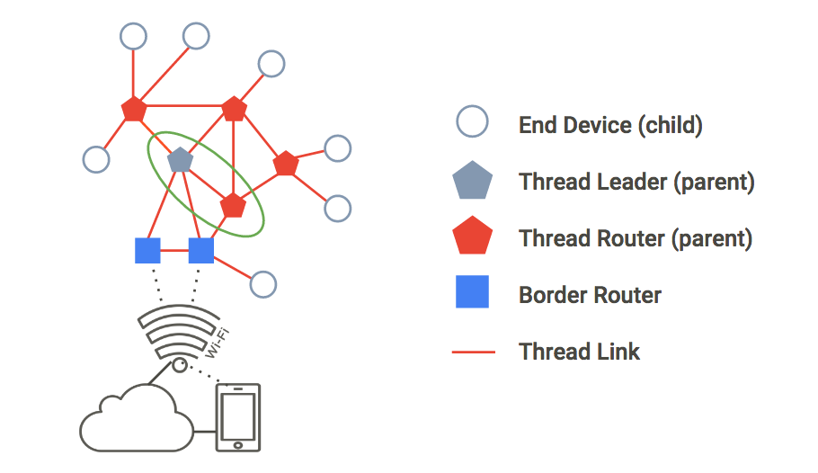
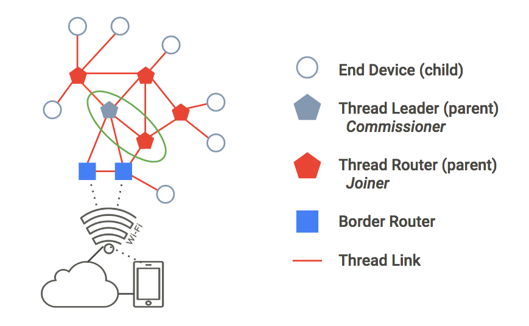

# Simulating a Thread network using OpenThread in Docker

[Codelab Feedback](https://github.com/openthread/openthread/issues)


## Introduction


[OpenThread](https://github.com/openthread) released by Google is an open-source
implementation of the [Thread](http://threadgroup.org/) networking protocol.
Google Nest has released OpenThread to make the technology used in Nest products
broadly available to developers to accelerate the development of products for
the connected home.

The [Thread specification](https://www.google.com/url?q=http://threadgroup.org/ThreadSpec&sa=D&ust=1489513620478000&usg=AFQjCNHWiFeZ6NLl4UVZhjCWsaJ2OOaRsA)
defines an IPv6-based reliable, secure and low-power wireless device-to-device
communication protocol for home applications. OpenThread implements all Thread
networking layers including IPv6, 6LoWPAN, IEEE 802.15.4 with MAC security,
Mesh Link Establishment, and Mesh Routing.

This Codelab will walk you through simulating a Thread network on emulated
devices using Docker.

### What you'll learn

* How to set up the OpenThread build toolchain
* How to simulate a Thread network
* How to authenticate Thread nodes
* How to manage a Thread network with OpenThread Daemon

### What you'll need

* Docker
* Basic knowledge of Linux, network routing


## Set up Docker
Duration: 06:00


This Codelab is designed to use Docker on a Linux, Mac OS X, or Windows machine.
Linux is the recommended environment.

> aside negative
>
> **Note:** This Codelab does not support running Docker in [rootless
mode](https://docs.docker.com/engine/security/rootless/). You must run it as
root with the commands provided in order to create OpenThread nodes. Depending
on your system configuration, you may be able to run the `docker` commands using
`sudo` instead, which is generally preferable.

### Install Docker

Install Docker on the OS of your choice.

<button>[Download Docker](https://store.docker.com/search?type=edition&offering=community)</button>

### Pull the Docker image

Once Docker is installed, open a terminal window and pull the
`openthread/environment` Docker image. This image features OpenThread and
OpenThread Daemon pre-built and ready to use for this Codelab.

```console
$ docker pull openthread/environment:latest
```

Note that it may take a few minutes to completely download.

In a terminal window, start a Docker container from the image and connect to its
`bash` shell:

```console
$ docker run --name codelab_otsim_ctnr -it --rm \
   --sysctl net.ipv6.conf.all.disable_ipv6=0 \
   --cap-add=net_admin openthread/environment bash
```

Note the flags, which are required for this Codelab:

* `--sysctl net.ipv6.conf.all.disable_ipv6=0` — this enables IPv6 within the
container
* `--cap-add=net_admin` — enables the NET_ADMIN capability, which allows you to
execute network-related operations, such as adding IP routes

Once in the container, you should have a prompt similar to this:

```console
root@c0f3912a74ff:/#
```

In the above example, the `c0f3912a74ff` is the Container ID. The Container ID
for your instance of the Docker container will differ from the one shown in the
prompts for this Codelab.

> aside positive
>
> **Note:** Most commands in this Codelab are entered at this Docker
`bash root@&lt;container-id&gt;:/#` prompt.

### Using Docker

This Codelab assumes you know the basics of using Docker.
**You should remain in the Docker container for the entirety of the Codelab.**


## Simulate a Thread network
Duration: 05:00


The example application you'll use for this Codelab demonstrates a minimal
OpenThread application that exposes the OpenThread configuration and management
interfaces via a basic command-line interface (CLI).

This exercise takes you through the minimal steps required to ping one emulated
Thread device from another emulated Thread device.

> aside positive
>
> **Note:** This first exercise does not include any network parameter
configuration, such as the IEEE 802.15.4 PAN ID or the Thread Network Key.
OpenThread currently implements default values for network parameters
(which can be changed later via the CLI).

The figure below describes a basic Thread network topology. For this exercise,
we'll emulate the two nodes within the green circle: a Thread Leader and
Thread Router with a single connection between them.



### Create the network

#### 1. Start Node 1

**If you haven't done so already, in a terminal window, start the Docker**
container and connect to its `bash` shell:

```console
$ docker run --name codelab_otsim_ctnr -it --rm \
   --sysctl net.ipv6.conf.all.disable_ipv6=0 \
   --cap-add=net_admin openthread/environment bash
```

In the Docker container, spawn the CLI process for an emulated Thread device
using the `ot-cli-ftd` binary.

```console
root@c0f3912a74ff:/# /openthread/build/examples/apps/cli/ot-cli-ftd 1
```

**Note:** If you don't see the `>` prompt after running this command, press `enter`.

This binary implements an OpenThread device. The IEEE 802.15.4 radio driver is
implemented on top of UDP (IEEE 802.15.4 frames are passed within UDP payloads).

The argument of `1` is a file descriptor that represents the least-significant
bits of the "factory-assigned" IEEE EUI-64 for the emulated device. This value
is also used when binding to a UDP port for IEEE 802.15.4 radio emulation
(port = 9000 + file descriptor). Each instance of an emulated Thread device in
this Codelab will use a different file descriptor.

**Note:** Only use file descriptors of `1` or greater as noted in this Codelab
when spawning the process for an emulated device. A file descriptor of `0` is
reserved for other use.

Create a new Operational Dataset and commit it as the active one. The
Operational Dataset is the configuration for the Thread network you are creating.

> aside positive
>
> `dataset init new` creates a new Operational Dataset with random values.
**Your values will differ from the values shown in this Codelab.**
Replace the values in the Codelab example commands with the values from your
Operational Dataset.

```console
> dataset init new
Done
> dataset
Active Timestamp: 1
Channel: 20
Channel Mask: 07fff800
Ext PAN ID: d6263b6d857647da
Mesh Local Prefix: fd61:2344:9a52:ede0/64
Network Key: e4344ca17d1dca2a33f064992f31f786
Network Name: OpenThread-c169
PAN ID: 0xc169
PSKc: ebb4f2f8a68026fc55bcf3d7be3e6fe4
Security Policy: 0, onrcb
Done
```

Commit this dataset as the active one:

```console
> dataset commit active
Done
```

Bring up the IPv6 interface:

```console
> ifconfig up
Done
```

Start Thread protocol operation:

```console
> thread start
Done
```

Wait a few seconds and verify that the device has become the Thread Leader. The
Leader is the device responsible for managing router ID assignment.

```console
> state
leader
Done
```

View the IPv6 addresses assigned to Node 1's Thread interface (your output will
be different):

```console
> ipaddr
fd61:2344:9a52:ede0:0:ff:fe00:fc00
fd61:2344:9a52:ede0:0:ff:fe00:5000
fd61:2344:9a52:ede0:d041:c5ba:a7bc:5ce6
fe80:0:0:0:94da:92ea:1353:4f3b
Done
```

Note the specific IPv6 address types:

* Begins with `fd` = mesh-local
* Begins with `fe80` = link-local

Mesh-local address types are classified further:

* Contains `ff:fe00` = Router Locator (RLOC)
* Does not contain `ff:fe00` = Endpoint Identifier (EID)

Identify the EID in your console output make a note of it for later use. In the
sample output above, the EID is:

`fd61:2344:9a52:ede0:d041:c5ba:a7bc:5ce6`

> aside positive
> 
> The RLOC will change as the network topology changes and a Thread device
switches between states. The EID is independent of topology changes and will
remain static.

#### 2. Start Node 2

Open a new terminal and execute a `bash` shell in the currently running Docker
container to use for Node 2.

```console
$ docker exec -it codelab_otsim_ctnr bash
```

At this new `bash` prompt, spawn the CLI process with the argument `2`. This is
your second emulated Thread device:

```console
root@c0f3912a74ff:/# /openthread/build/examples/apps/cli/ot-cli-ftd 2
```

**Note:** If you don't see the `>` prompt after running this command, press
`enter`.

Configure the Thread Network Key and PAN ID, using the same values as Node 1's
Operational Dataset:

```console
> dataset networkkey e4344ca17d1dca2a33f064992f31f786
Done
> dataset panid 0xc169
Done
```

Commit this dataset as the active one:

```console
> dataset commit active
Done
```

Bring up the IPv6 interface:

```console
> ifconfig up
Done
```

Start Thread protocol operation:

```console
> thread start
Done
```

The device will initialize itself as a Child. A Thread Child is equivalent to an
End Device, which is a Thread device that transmits and receives unicast
traffic only with a Parent device.

```console
> state
child
Done
```

Within 2 minutes you should see the state switch from `child` to `router`. A
Thread Router is capable of routing traffic between Thread devices. It is also
referred to as a Parent.

```console
> state
router
Done
```

### Verify the network

An easy way to verify the mesh network is to look at the router table.

#### 1. Check connectivity

On Node 2, get the RLOC16. The RLOC16 is the last 16 bits of the device's
RLOC IPv6 address.

```console
> rloc16
5800
Done
```

On Node 1, check the router table for Node 2's RLOC16. Make sure Node 2 has
switched to the router state first.

```console
> router table
| ID | RLOC16 | Next Hop | Path Cost | LQ In  | LQ Out  | Age | Extended MAC   |
+----+--------+----------+-----------+--------+-------+---+--------------------+
| 20 | 0x5000 |       63 |         0 |      0 |     0 |   0 | 96da92ea13534f3b |
| 22 | 0x5800 |       63 |         0 |      3 |     3 |  23 | 5a4eb647eb6bc66c |
```

Node 2's RLOC of `0x5800` is found in the table, confirming that it is connected
to the mesh.

#### 2. Ping Node 1 from Node 2

Verify connectivity between the two emulated Thread devices. In Node 2, `ping`
the EID assigned to Node 1:

```console
> ping fd61:2344:9a52:ede0:d041:c5ba:a7bc:5ce6
> 16 bytes from fd61:2344:9a52:ede0:d041:c5ba:a7bc:5ce6: icmp_seq=1 hlim=64 time=12ms
```

Press `enter` to return to the `&gt;` CLI prompt.

### Test the network

Now that you can successfully ping between two emulated Thread devices, test the
mesh network by taking one node offline.

Return to Node 1 and stop Thread:

```console
> thread stop
Done
```

Switch to Node 2 and check the state. Within two minutes, Node 2 detects that
the leader (Node 1) is offline, and you should see Node 2 transition to be the
`leader` of the network:

```console
> state
router
Done
...
> state
leader
Done
```

Once confirmed, stop Thread and factory reset Node 2 before exiting back to the
Docker `bash` prompt. A factory reset is done to ensure that the Thread network
credentials we used in this exercise are not carried over to the next exercise.

```console
> thread stop
Done
> factoryreset
>
> exit
root@c0f3912a74ff:/#
```

You may have to press `enter` a few times to bring the `&gt;` prompt back after
a `factoryreset` command. **Do not exit the Docker container.**

Also factory reset and exit Node 1:

```console
> factoryreset
>
> exit
root@c0f3912a74ff:/#
```

See the
[OpenThread CLI Reference](https://github.com/openthread/openthread/blob/main/src/cli/README.md)
to explore all available CLI commands.


## Authenticate nodes with Commissioning
Duration: 05:00


In the previous exercise, you set up a Thread network with two simulated devices
and verified connectivity. However, this only allows unauthenticated
IPv6 link-local traffic to pass between devices. To route global IPv6 traffic
between them (and the Internet via a Thread border router), nodes must be
authenticated.

In order to authenticate, one device must act as a Commissioner. The
Commissioner is the currently elected authentication server for new
Thread devices, and the authorizer for providing the network credentials
required for the devices to join the network.

In this exercise, we will use the same two-node topology as before. For
authentication, the Thread Leader will act as the Commissioner, the
Thread Router as a Joiner.



> aside positive
>
> Devices without Thread interfaces may also perform the Commissioner role.
For example, a cell phone or a server in the cloud can provide the interface by
which a human administrator joins a new device to the Thread Network. These
devices are called External Commissioners.

### Docker

**For each Node (terminal window) in the remaining exercises, make sure you are
running the Docker container with the OpenThread build.** If continuing from the
previous exercise, you should still have two `bash` prompts within the same
Docker container already open. If not, see the **Docker Troubleshooting** step,
or simply redo the **Simulate a Thread network** exercise.

#### 1. Create a network

In Node 1, spawn the CLI process:

```console
root@c0f3912a74ff:/# /openthread/build/examples/apps/cli/ot-cli-ftd 1
```

**Note:** If you don't see the `>` prompt after running this command, press
`enter`.

Create a new Operational Dataset, commit it as the active one, and start Thread:

```console
> dataset init new
Done
> dataset
Active Timestamp: 1
Channel: 12
Channel Mask: 07fff800
Ext PAN ID: e68d05794bf13052
Mesh Local Prefix: fd7d:ddf7:877b:8756/64
Network Key: a77fe1d03b0e8028a4e13213de38080e
Network Name: OpenThread-8f37
PAN ID: 0x8f37
PSKc: f9debbc1532487984b17f92cd55b21fc
Security Policy: 0, onrcb
Done
```

Commit this dataset as the active one:

```console
> dataset commit active
Done
```

Bring up the IPv6 interface:

```console
> ifconfig up
Done
```

Start Thread protocol operation:

```console
> thread start
Done
```

Wait a few seconds and verify that the device has become a Thread Leader:

```console
> state
leader
Done
```

#### 2. Start the Commissioner role

While still on Node 1, start the Commissioner role:

```console
> commissioner start
Done
```

Allow any Joiner (by using the `*` wildcard) with the `J01NME` Joiner Credential
to commission onto the network. A Joiner is a device that is added by a human
administrator to a commissioned Thread Network.

```console
> commissioner joiner add * J01NME
Done
```

> aside positive
>
> `J01NME` is the user-defined Joiner Credential used for this Codelab. You can
choose any Joiner Credential you wish in a different implementation of a Thread
network. The Joiner Credential is a device-specific string of all uppercase
alphanumeric characters (0-9 and A-Y, excluding I, O, Q and Z for readability),
with a length between 6 and 32 characters. For more information, see
[Thread Commissioning](https://openthread.io/guides/building/commissioning).

#### 3. Start the Joiner role

In a second terminal window, in the Docker container, spawn a new CLI process.
This is Node 2.

```console
root@c0f3912a74ff:/# /openthread/build/examples/apps/cli/ot-cli-ftd 2
```

On Node 2, enable the Joiner role using the `J01NME` Joiner Credential.

```console
> ifconfig up
Done
> joiner start J01NME
Done
```

... wait a few seconds for confirmation ...

```console
Join success
```

As a Joiner, the device (Node 2) has successfully authenticated itself with the
Commissioner (Node 1) and received the Thread Network credentials.

> aside positive
>
> If you get a `Join failed` message, the Commissioner may have timed out
waiting for a Join request. In that case, restart from the `commissioner joiner`
command. Don't wait too long after starting the Commissioner to enable the
Joiner role.
>
> You may also receive error and/or log messages on both Nodes 1 and 2 after a
successful join. These are normal and can be ignored.

Now that Node 2 is authenticated, start Thread:

```console
> thread start
Done
```

#### 4. Validate network authentication

Check the `state` on Node 2, to validate that it has now joined the network.
Within two minutes, Node 2 transitions from `child` to `router`:

```console
> state
child
Done
...
> state
router
Done
```

#### 5. Reset configuration

To prepare for the next exercise, reset the configuration. On each Node, stop
Thread, do a factory reset, and exit the emulated Thread device:

```console
> thread stop
Done
> factoryreset
>
> exit
root@c0f3912a74ff:/#
```

You may have to press `enter` a few times to bring the `&gt;` prompt back after
a `factoryreset` command.


## Manage the network with OpenThread Daemon
Duration: 07:00


For this exercise, we are going to simulate one CLI instance
(a single embedded SoC Thread device) and one Radio Co-Processor (RCP) instance.

`ot-daemon` is a mode of the OpenThread Posix app that uses a UNIX socket as
input and output, so that OpenThread core can run as a service. A client can
communicate with this service by connecting to the socket using the OpenThread
CLI as the protocol.

`ot-ctl` is a CLI provided by `ot-daemon` to manage and configure the RCP. Using
this, we'll connect the RCP to the network created by the Thread device.

### Docker

**For each Node (terminal window) in this exercise, make sure you are running
the Docker container with the OpenThread build.** If continuing from the
previous exercise, you should have two `bash` prompts within the same Docker
container already open. If not, see the **Docker Troubleshooting** step.

### Use ot-daemon

This exercise will use three terminal windows, corresponding to the following:

1. CLI instance of simulated Thread device (Node 1)
2. `ot-daemon` process
3. `ot-ctl` CLI instance

#### 1. Start Node 1

In the first terminal window, spawn the CLI process for your emulated Thread
device:

```console
root@c0f3912a74ff:/# /openthread/build/examples/apps/cli/ot-cli-ftd 1
```

**Note:** If you don't see the `>` prompt after running this command, press
`enter`.

Create a new Operational Dataset, commit it as the active one, and start Thread:

```console
> dataset init new
Done
> dataset
Active Timestamp: 1
Channel: 13
Channel Mask: 07fff800
Ext PAN ID: 97d584bcd493b824
Mesh Local Prefix: fd55:cf34:dea5:7994/64
Network Key: ba6e886c7af50598df1115fa07658a83
Network Name: OpenThread-34e4
PAN ID: 0x34e4
PSKc: 38d6fd32c866927a4dfcc06d79ae1192
Security Policy: 0, onrcb
Done
```

Commit this dataset as the active one:

```console
> dataset commit active
Done
```

Bring up the IPv6 interface:

```console
> ifconfig up
Done
```

Start Thread protocol operation:

```console
> thread start
Done
```

> aside positive
>
> The `channel` is the 2.4 GHz channel as defined in IEEE 802.15.4. Non-reserved
values are in the range of 11-26.

> aside positive
>
> The `networkkey` can be any user-defined 32 hexadecimal character string. If
not specified, the `networkkey` defaults to `00112233445566778899AABBCCDDEEFF`,
and devices will be able to join the network without having to specify the key.

View the IPv6 addresses assigned to Node 1's Thread interface:

```console
> ipaddr
fd55:cf34:dea5:7994:0:ff:fe00:fc00
fd55:cf34:dea5:7994:0:ff:fe00:d000
fd55:cf34:dea5:7994:460:872c:e807:c4ab
fe80:0:0:0:9cd8:aab6:482f:4cdc
Done
>
```

As explained in the **Simulate a Thread network** step, one address is
link-local (`fe80`) and three are mesh-local (`fd`). The EID is the mesh-local
address that does not contain `ff:fe00` in the address. In this sample output,
the EID is `fd55:cf34:dea5:7994:460:872c:e807:c4ab`.

Identify the specific EID from your `ipaddr` output, which will be used to
communicate with the node.

#### 2. Start ot-daemon

In the second terminal window, create a `tun` device node and set read/write
permissions:

```console
root@c0f3912a74ff:/# mkdir -p /dev/net && mknod /dev/net/tun c 10 200
root@c0f3912a74ff:/# chmod 600 /dev/net/tun
```

This device is used for packet transmission and receipt in virtual devices. You
may get an error if the device has already been created—this is normal and can
be ignored.

Start `ot-daemon` for an RCP node, which we'll call Node 2. Use the `-v` verbose
flag so you can see log output and confirm that it is running:

```console
root@c0f3912a74ff:/# /openthread/build/posix/src/posix/ot-daemon -v \
'spinel+hdlc+forkpty://openthread/build/examples/apps/ncp/ot-rcp?forkpty-arg=2'
```

When successful, `ot-daemon` in verbose mode generates output similar to the
following:

```console

ot-daemon[31]: Running OPENTHREAD/297a880; POSIX; Feb  1 2022 04:43:39
ot-daemon[31]: Thread version: 3
ot-daemon[31]: Thread interface: wpan0
ot-daemon[31]: RCP version: OPENTHREAD/297a880; SIMULATION; Feb  1 2022 04:42:50
```

> aside negative
>
> **Note:** When using Docker, you may see the `ot-daemon` log output in other
terminal windows connected to the same container. You can ignore that, it is
normal.

Leave this terminal open and running in the background. You will not enter
any further commands in it.

#### 3. Use ot-ctl to join the network

We haven't commissioned Node 2 (the `ot-daemon` RCP) to any Thread network yet.
This is where `ot-ctl` comes in. `ot-ctl` uses the same CLI as the
OpenThread CLI app. Therefore, you can control `ot-daemon` nodes in the same
manner as the other simulated Thread devices.

Open a third terminal window and execute the existing container:

```console
$ docker exec -it codelab_otsim_ctnr bash
```

Once in the container, start `ot-ctl`:

```console
root@c0f3912a74ff:/# /openthread/build/posix/src/posix/ot-ctl
>
```

You'll use `ot-ctl` in this third terminal window to manage Node 2 (the RCP node)
that you started in the second terminal window with `ot-daemon`. Check the `state` of
Node 2:

```console
> state
disabled
Done
```

Get Node 2's `eui64`, to restrict joining to the specific Joiner:

```console
> eui64
18b4300000000001
Done
```

On Node 1 (first terminal window), start the Commissioner and restrict joining to only
that eui64:

```console
> commissioner start
Done
> commissioner joiner add 18b4300000000001 J01NME
Done
```

In the third terminal window, bring up the network interface for Node 2 and join
the network:

```console
> ifconfig up
Done
> joiner start J01NME
Done
```

... wait a few seconds for confirmation ...

```console
Join success
```

As a Joiner, the RCP (Node 2) has successfully authenticated itself with the
Commissioner (Node 1) and received the Thread Network credentials.

> aside positive
>
> If you get a `Join failed` message, the Commissioner may have timed out
waiting for a Join request. In that case, restart from the `commissioner joiner`
command. Don't wait too long after starting the Commissioner to enable the
Joiner role.

Now join Node 2 to the Thread network (again, in the third terminal window):

```console
> thread start
Done
```

#### 4. Validate network authentication

In the third terminal, check the `state` on Node 2, to validate that it has now
joined the network. Within two minutes, Node 2 transitions from `child` to
`router`:

```console
> state
child
Done
...
> state
router
Done
```

#### 5. Validate connectivity

In the third terminal window, quit `ot-ctl` by using either **Ctrl+D** or
`exit` command, and return to the container's `bash` console. From this console,
ping Node 1, using its EID with the `ping6` command. If the `ot-daemon` RCP
instance is successfully joined to and communicating with the Thread network,
the ping succeeds:

```console
root@c0f3912a74ff:/# ping6 -c 4 fd55:cf34:dea5:7994:460:872c:e807:c4ab
PING fd55:cf34:dea5:7994:460:872c:e807:c4ab (fd55:cf34:dea5:7994:460:872c:e807:c4ab): 56 data bytes
64 bytes from fd55:cf34:dea5:7994:460:872c:e807:c4ab: icmp_seq=0 ttl=64 time=4.568 ms
64 bytes from fd55:cf34:dea5:7994:460:872c:e807:c4ab: icmp_seq=1 ttl=64 time=6.396 ms
64 bytes from fd55:cf34:dea5:7994:460:872c:e807:c4ab: icmp_seq=2 ttl=64 time=7.594 ms
64 bytes from fd55:cf34:dea5:7994:460:872c:e807:c4ab: icmp_seq=3 ttl=64 time=5.461 ms
--- fd55:cf34:dea5:7994:460:872c:e807:c4ab ping statistics ---
4 packets transmitted, 4 packets received, 0% packet loss
round-trip min/avg/max/stddev = 4.568/6.005/7.594/1.122 ms
```

## Docker Troubleshooting
Duration: 01:00


**If you have exited the Docker container** **`bash`** **prompts**, you may need
to check if it's running and restart / reenter as needed.

To show which Docker containers are running:

```console
$ docker ps
CONTAINER ID        IMAGE               COMMAND             CREATED             STATUS              PORTS               NAMES
505fc57ffc72        environment       "bash"              10 minutes ago      Up 10 minutes                           codelab_otsim_ctnr
```

To show all Docker containers (both running and stopped):

```console
$ docker ps -a
CONTAINER ID        IMAGE               COMMAND             CREATED             STATUS              PORTS               NAMES
505fc57ffc72        environment       "bash"              10 minutes ago      Up 10 minutes                           codelab_otsim_ctnr
```

> aside negative
>
> If the `codelab_otsim_ctnr` container appears in `docker ps -a` but not
`docker ps`, the container has stopped.

If you don't see container `codelab_otsim_ctnr` in the output of either
`docker ps` command, run it again:

```console
$ docker run --name codelab_otsim_ctnr -it --rm \
   --sysctl net.ipv6.conf.all.disable_ipv6=0 \
   --cap-add=net_admin openthread/environment bash
```

If the container is stopped (listed in `docker ps -a` but not `docker ps`),
restart it:

```console
$ docker start -i codelab_otsim_ctnr
```

If the Docker container is already running (listed in `docker ps`), reconnect to
the container in each terminal:

```console
$ docker exec -it codelab_otsim_ctnr bash
```

### "Operation not permitted" errors

If you run into `Operation not permitted` errors when creating new OpenThread nodes
(using the `mknod` command), make sure you are running Docker as the root user according
to the commands provided in this Codelab. This Codelab does not support running Docker
in [rootless mode](https://docs.docker.com/engine/security/rootless/).


## Congratulations!


You've successfully simulated your first Thread network using OpenThread.
Awesome!

In this Codelab you learned how to:

* Start and manage the OpenThread Simulation Docker container
* Simulate a Thread network
* Authenticate Thread nodes
* Manage a Thread network with OpenThread Daemon

To learn more about Thread and OpenThread, explore these references:

*  [Thread Primer on openthread.io](https://openthread.io/guides/thread_primer/)
*  [Thread Specification](http://threadgroup.org/ThreadSpec)
*  [OpenThread GitHub repository](https://github.com/openthread)
*  [OpenThread CLI Reference](https://github.com/openthread/openthread/blob/main/src/cli/README.md)
*  [Additional OpenThread Docker support](https://github.com/openthread/openthread/tree/main/etc/docker)

Or, try using [OpenThread Border Router in a Docker container](https://openthread.io/guides/border-router/docker)!

## License

Copyright (c) 2021-2022, The OpenThread Authors.
All rights reserved.

Redistribution and use in source and binary forms, with or without
modification, are permitted provided that the following conditions are met:
1. Redistributions of source code must retain the above copyright
   notice, this list of conditions and the following disclaimer.
2. Redistributions in binary form must reproduce the above copyright
   notice, this list of conditions and the following disclaimer in the
   documentation and/or other materials provided with the distribution.
3. Neither the name of the copyright holder nor the
   names of its contributors may be used to endorse or promote products
   derived from this software without specific prior written permission.

THIS SOFTWARE IS PROVIDED BY THE COPYRIGHT HOLDERS AND CONTRIBUTORS "AS IS"
AND ANY EXPRESS OR IMPLIED WARRANTIES, INCLUDING, BUT NOT LIMITED TO, THE
IMPLIED WARRANTIES OF MERCHANTABILITY AND FITNESS FOR A PARTICULAR PURPOSE
ARE DISCLAIMED. IN NO EVENT SHALL THE COPYRIGHT HOLDER OR CONTRIBUTORS BE
LIABLE FOR ANY DIRECT, INDIRECT, INCIDENTAL, SPECIAL, EXEMPLARY, OR
CONSEQUENTIAL DAMAGES (INCLUDING, BUT NOT LIMITED TO, PROCUREMENT OF
SUBSTITUTE GOODS OR SERVICES; LOSS OF USE, DATA, OR PROFITS; OR BUSINESS
INTERRUPTION) HOWEVER CAUSED AND ON ANY THEORY OF LIABILITY, WHETHER IN
CONTRACT, STRICT LIABILITY, OR TORT (INCLUDING NEGLIGENCE OR OTHERWISE)
ARISING IN ANY WAY OUT OF THE USE OF THIS SOFTWARE, EVEN IF ADVISED OF THE
POSSIBILITY OF SUCH DAMAGE.
