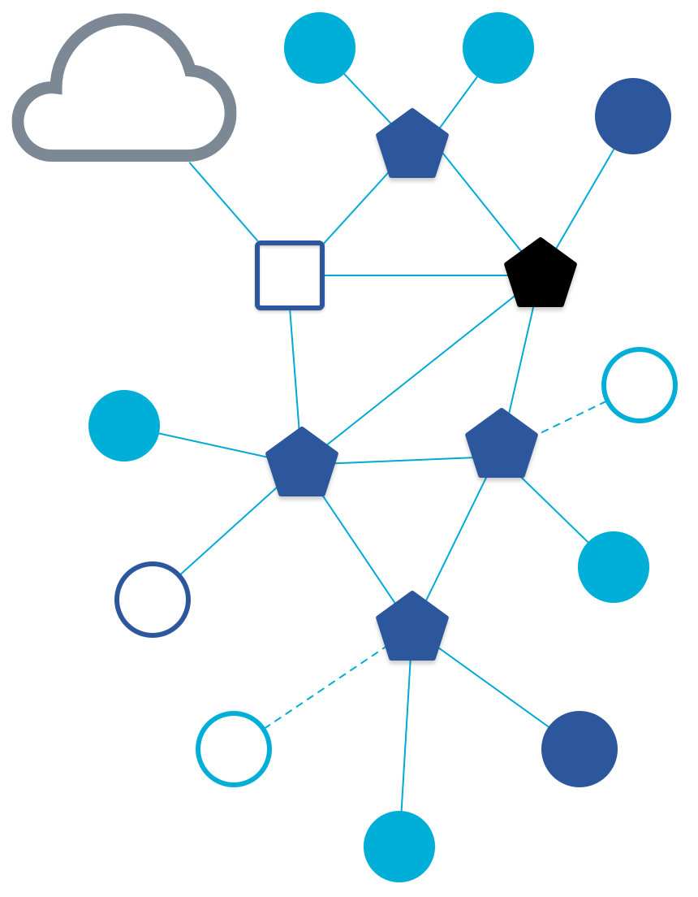
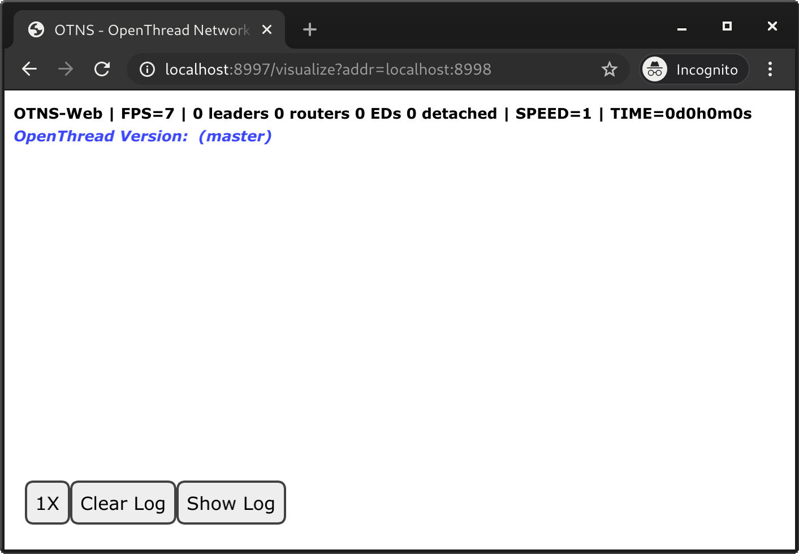
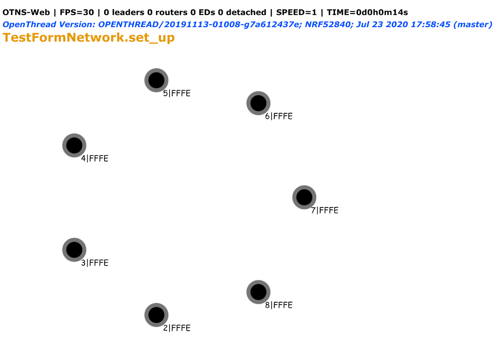
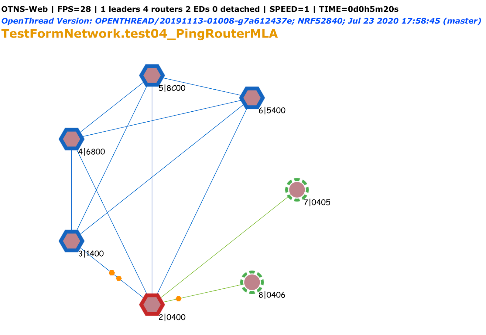

# Testing a Thread Network with Visualization

[Codelab Feedback](https://github.com/openthread/silk/issues)


## Introduction





### What is Thread, OpenThread, OTNS, and Silk?

Thread is an IP-based low-power wireless mesh networking protocol that enables
secure device-to-device and device-to-cloud communications. Thread networks can
adapt to topology changes to avoid single point of failure.

> aside positive
>
> **Dive Deeper:** For more information, refer to
[Thread Primer](../../guides/thread-primer/index.md).

[OpenThread](https://openthread.io/) released by Google is an open-source
implementation of Thread. Despite its small code size and memory footprint,
OpenThread supports all features defined in the
[Thread Specification](https://www.threadgroup.org/support#specifications).

[OpenThread Network Simulator (OTNS)](http://github.com/openthread/ot-ns) can be
used to simulate Thread networks by running simulated OpenThread nodes on posix
platforms. OTNS provides an easy-to-use Web interface (OTNS-Web) for visualizing
and operating simulated Thread networks.

[Silk](https://github.com/openthread/silk) is a fully automated test platform
for validating OpenThread function, feature, and system performance with real
devices.

### What you'll learn

* OpenThread's functionality verification framework: Silk
* Build OpenThread for real devices with the OTNS feature enabled
* Use OTNS-Web interface to monitor the status of the Thread network formed by
  running Silk test cases

This codelab is focused on using Silk with OTNS. Other features of Silk and
OTNS are not covered.

### What you'll need

Hardware:

* 6 Nordic Semiconductor nRF52840 dev boards
* 6 USB to Micro-USB cables to connect the boards
* USB hub

Software:

* Linux x86_64.
*  [Git](https://git-scm.com/downloads).
*  [Go 1.11+](https://golang.org/dl/).
* Web browser. OTNS-Web uses a web browser for displaying simulations.

Prerequisites:

*  [Thread Primer](https://openthread.io/guides/thread-primer).
*  [Build a Thread network with nRF52840 boards and OpenThread](https://openthread.io/codelabs/openthread-hardware).
*  [Simulate Thread Networks using OTNS](https://openthread.io/codelabs/openthread-network-simulator).


## Prerequisites
Duration: 02:00


### Complete prior basic Codelabs

*  [Thread Primer](https://openthread.io/guides/thread-primer).
    You will need to know the basic concepts of Thread to understand what is
    taught in this Codelab.
*  [Build a Thread network with nRF52840 boards and OpenThread](https://openthread.io/codelabs/openthread-hardware).
    This Codelab assumes that you have successfully built a Thread network.
*  [Simulate Thread Networks using OTNS](https://openthread.io/codelabs/openthread-network-simulator). This Codelab assumes that you have successfully run the OTNS tool.

### Checking package prerequisites

Let's make sure all the prerequisites are met.

1. Run `which otns` to check if the `otns` executable is searchable in `$PATH`.
2. Run `which wpantund` to make sure `wpantund` is available.
3. Make sure ARM GNU toolchain, J-Link, and `nrfjprog` packages are all available.
4. Make sure an OpenThread binary can be made, running `make -f
    examples/Makefile-nrf52840` under the `openthread` folder.

***Note:*** Please refer to the linked documentations for set up guidance.
Prerequisite #1 is from [Simulate Thread Networks using OTNS](https://openthread.io/codelabs/openthread-network-simulator)
and others are from [Build a Thread network with nRF52840 boards and OpenThread](https://openthread.io/codelabs/openthread-hardware).


## Silk setup


Duration: 2:00

Environment: web

To clone Silk and set up the environment, run the following commands under your
source directory:

```console
$ git clone https://github.com/openthread/silk.git
$ cd silk
$ ./bootstrap.sh
$ sudo make install-cluster
```

### Define hardware configuration file

To allow Silk to gather the available test hardware resources connected to your
machine, define a `hwconfig.ini` file in the following format:

```console
[DEFAULT]
ClusterID: 0
LayoutCenter: 300, 300
LayoutRadius: 100

[Dev-8A7D]
HwModel: Nrf52840
HwRev: 1.0
InterfaceSerialNumber: E1A5012E8A7D
USBInterfaceNumber: 1
DutSerial: 683536778
```

A tool called `usbinfo` is installed as part of Silk which can be used to find
out the Interface Serial Number and USB Interface Number. DutSerial is the SN
number printed on the chip or displayed by `usbinfo` for J-Link products.

> aside positive
>
> `InterfaceSerialNumber` is visible only after the nRF52840 DevBoards have been
   flashed with `USB=1` switch.

The `LayoutCenter` and `LayoutRadius` fields in the `[DEFAULT]` section defines
the shape of the layout when the devices are visualized on the web UI. Setting
them to the values presented here can be a good starting point.

Following that, it defines a section for each test device and supplies the
relevant hardware information.


## Compile OpenThread with OTNS enabled
Duration: 02:00


### Building image and flashing

By default, OpenThread devices do not emit OTNS related messages. To allow the
dev boards to emit status messages to log interfaces that are essential to OTNS
visualization, run the following command under the OpenThread source directory
to build an FTD image, and convert it to hex format.

```console
$ git clone https://github.com/openthread/ot-nrf528xx.git --recursive
$ cd ot-nrf528xx
$ ./script/bootstrap
$ ./script/build nrf52840 USB_trans -DOT_COMMISSIONER=ON -DOT_JOINER=ON -DOT_OTNS=ON
$ cd ./build/bin
$ arm-none-eabi-objcopy -O ihex ot-ncp-ftd ot-ncp-ftd.hex
```

> aside positive
>
> For more information on building and configuring OpenThread, see
  [Build OpenThread](https://openthread.io/guides/build/).

To flash the boards, follow the instructions in step 4 of the
[Build a Thread network Codelab](https://openthread.io/codelabs/openthread-hardware/#3)
to use `nrfjprog`. After that, connect all the boards via the nRF USB port to
the host machine. The same set of USB to Micro-USB cables can be disconnected
from the J-Link ports and connected to the nRF USB ports of the nRF52840 dev
boards. Thus with just these 6 cables test execution can be carried out. To
avoid the hassle, use 12 cables and connect to both ports.


## Running OTNS server with real mode
Duration: 01:00


Running OTNS with default parameters allows the user to simulate a Thread
network. To use it as a visualization tool for an actual physical network, run
it with:

```
otns -raw -real -ot-cli otns-silk-proxy
```

These arguments tell OTNS to expect gRPC and UDP messages that describe how the
Thread network should be visualized, instead of running multiple `ot-cli`
processes to simulate the network. Your browser should automatically open the
visualization page with an empty canvas.




## Running Silk test cases with OTNS support
Duration: 03:00


Silk is a fully automated test platform for validating OpenThread function,
feature, and system performance with real devices. The instructions in the
project [README](https://github.com/openthread/silk/blob/master/README.md)
covers how to use it.

The `silk_run_test.py` file located at `silk/unit_tests` gives you a headstart.
Silk provides OTNS support when running a test case. Since the OTNS real mode
service is already running locally, we simply need to modify the
`silk_run_test.py` file with the desired locations for an output log file, input
test scripts, and `hwconfig.ini` file. The `-s localhost` argument tells Silk to
send OTNS messages to `localhost`.

For example, one can run the test named `ot_test_form_network.py` using the
following modifications to `silk_run_test.py` file. `/opt/openthread_test/`
is the default path Silk uses for log output and config file, but you can use
any path.

####  [silk_run_test.py](https://github.com/openthread/silk/blob/master/silk/unit_tests/silk_run_test.py)

```
import datetime
import os

from silk.tests import silk_run

RESULT_LOG_PATH = '/opt/openthread_test/results/' + 'silk_run_' + \
                  datetime.datetime.today().strftime('%m-%d') + '/'
CONFIG_PATH = '/opt/openthread_test/'

os.chdir('~/src/silk/silk/tests/')

timestamp = datetime.datetime.today().strftime('%m-%d-%H:%M')

run_log_path = RESULT_LOG_PATH + 'test_run_on_' + timestamp + '/'

argv = [
    'tests/silk_run.py',
    '-v2',
    '-c', CONFIG_PATH + 'hwconfig.ini',
    '-d', run_log_path,
    '-s', 'localhost',
    'ot_test_form_network.py'
]

silk_run.SilkRunner(argv=argv)
```

The topology visualization of the formed network will show up on the OTNS web UI.



The top left corner shows visualization stats, OT version and test title. The
bottom left corner has controls of the log window, which is shown on the right.
Initially, nodes are added but no network is formed. As the test progresses, the
modes and roles of each node change, and links are formed.




## Congratulations


Congratulations, you've successfully run a Silk test on physical Thread devices
and visualized it using OTNS!

You executed a Silk test using development boards that are flashed with
firmwares that have OTNS support. The boards report their status to a Silk
server, which monitors and aggregates all of them, and sends them to the OTNS
service along with other test information. OTNS running in real mode visualizes
the Thread network on the web interface.

### What's next?

Try running other OpenThread test cases included in the Silk package.

### Further reading

Check out [openthread.io](https://openthread.io/) and
[Silk](https://github.com/openthread/silk) for a variety of OpenThread resources.

### Reference docs

*  [OpenThread Guides](https://openthread.io/guides)
*  [OTNS Codelab](https://openthread.io/codelabs/openthread-network-simulator)

## License

Copyright (c) 2021-2022, The OpenThread Authors.
All rights reserved.

Redistribution and use in source and binary forms, with or without
modification, are permitted provided that the following conditions are met:
1. Redistributions of source code must retain the above copyright
   notice, this list of conditions and the following disclaimer.
2. Redistributions in binary form must reproduce the above copyright
   notice, this list of conditions and the following disclaimer in the
   documentation and/or other materials provided with the distribution.
3. Neither the name of the copyright holder nor the
   names of its contributors may be used to endorse or promote products
   derived from this software without specific prior written permission.

THIS SOFTWARE IS PROVIDED BY THE COPYRIGHT HOLDERS AND CONTRIBUTORS "AS IS"
AND ANY EXPRESS OR IMPLIED WARRANTIES, INCLUDING, BUT NOT LIMITED TO, THE
IMPLIED WARRANTIES OF MERCHANTABILITY AND FITNESS FOR A PARTICULAR PURPOSE
ARE DISCLAIMED. IN NO EVENT SHALL THE COPYRIGHT HOLDER OR CONTRIBUTORS BE
LIABLE FOR ANY DIRECT, INDIRECT, INCIDENTAL, SPECIAL, EXEMPLARY, OR
CONSEQUENTIAL DAMAGES (INCLUDING, BUT NOT LIMITED TO, PROCUREMENT OF
SUBSTITUTE GOODS OR SERVICES; LOSS OF USE, DATA, OR PROFITS; OR BUSINESS
INTERRUPTION) HOWEVER CAUSED AND ON ANY THEORY OF LIABILITY, WHETHER IN
CONTRACT, STRICT LIABILITY, OR TORT (INCLUDING NEGLIGENCE OR OTHERWISE)
ARISING IN ANY WAY OUT OF THE USE OF THIS SOFTWARE, EVEN IF ADVISED OF THE
POSSIBILITY OF SUCH DAMAGE.
