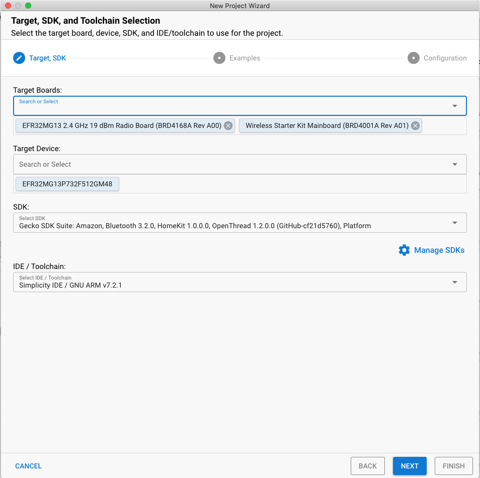
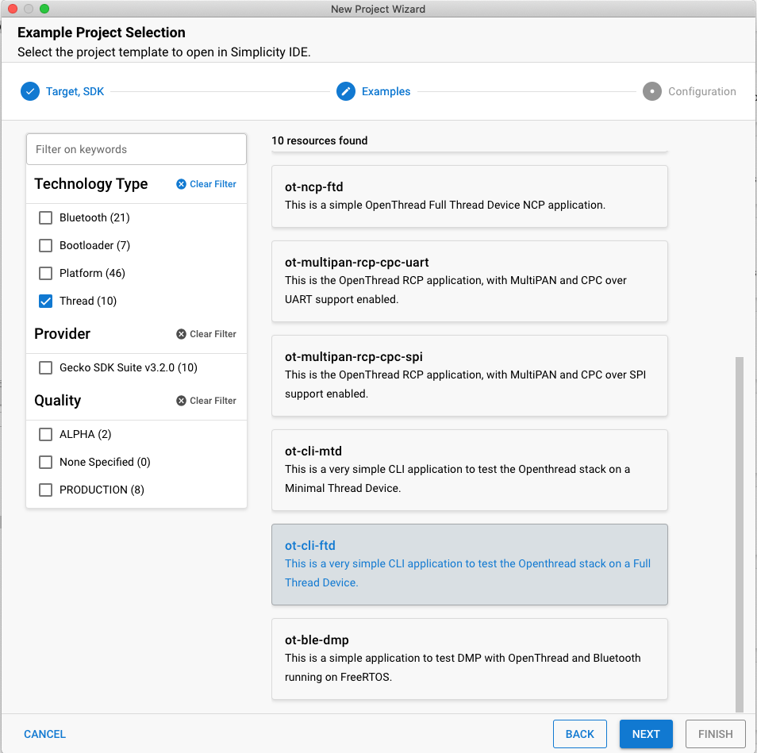
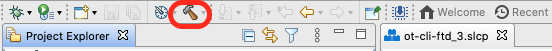
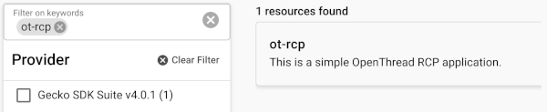

# Build a Thread network with Silicon Labs EFR32 boards and OpenThread using Simplicity Studio v5

[Codelab Feedback](https://github.com/openthread/ot-docs/issues)

## Introduction

Duration: 3:00


Google's [OpenThread](https://openthread.io/) (OT) is an open-source implementation of Thread. Google has released OpenThread to make the networking technology used in Google Nest products more broadly available to developers, in order to accelerate the development of products for the connected home and commercial buildings. With a narrow platform abstraction layer and a small memory footprint, OpenThread is highly portable. It supports both system-on-chip (SoC) and network co-processor (NCP) designs.

The [Thread Specification](https://www.threadgroup.org/support#specifications) defines an IPv6-based reliable, secure, and low-power wireless device-to-device communication protocol for home and commercial building applications.

[Silicon Labs](https://www.silabs.com/) has enhanced OpenThread to work with Silicon Labs hardware. This source code is [available on GitHub](https://github.com/openthread/ot-efr32) and also as a software development kit (SDK) installed with Simplicity Studio 5 (SSv5). The SDK includes a fully tested snapshot of the GitHub source code. It supports a broader range of hardware than does the GitHub version, and includes documentation and example applications not available on GitHub.

This guide describes how to get started developing OpenThread applications using the Silicon Labs OpenThread SDK and Simplicity Studio 5. The image below shows the boards (BRDs) and the hardware set up with an OT Border Router (OTBR) and two Thread devices used in the codelab.

> aside positive
>
> **Note:** You can adapt this codelab to use any of the boards listed under hardware in the prerequisite section.


### What you'll learn

* How to create an OpenThread project using Silicon Labs Simplicity Studio IDE.
* How to build and flash OpenThread CLI binaries to Silicon Labs radio boards.
* How to set up a Raspberry Pi 3B+ or greater as an OpenThread Border Router (OTBR) using Docker.
* How to create a Thread network on the OTBR.
* Out of band commissioning of devices onto a Thread network.
* How to verify Thread communication between the nodes using the ping command.

## Prerequisites

Duration: 3:00

Hardware:

1. 3 EFR32MGxx radio boards - any combination of these devices can be used. This codelab uses a BRD4166A as the RCP and two BRD4168As as Full Thread Devices.

   * EFR32MG12 (BRD**4161A**, BRD**4166A**, BRD**4170A**, BRD**4304**A)
   * EFR32MG13 (BRD**4168A**)
   * EFR32MG21 (BRD**4180A**, BRD**4180B**)

   If you are starting fresh, you can get one of the [EFR32 Thread starter kit](https://www.silabs.com/wireless/thread) which has the boards listed above.

2. BRD4001A: Wireless starter main boards (WSTK) to host the radio boards. Except for BRD4166A, all the radio boards need a starter main board each. Mini USB cables to connect and power the main boards or micro USB cable for BRD4166A.

> aside positive
>
> **Important:** Ensure the 3 way switch on your main board is in AEM position as shown below. The BRD4166A doesn't have this switch.


3. A Raspberry Pi 3B+ or greater with [Raspbian Stretch Lite OS image](http://downloads.raspberrypi.org/raspbian_lite/images/raspbian_lite-2019-04-09/2019-04-08-raspbian-stretch-lite.zip) or [Raspbian Stretch with Desktop](https://downloads.raspberrypi.org/raspbian/images/raspbian-2019-04-09/2019-04-08-raspbian-stretch.zip) which is connected to the internet over Ethernet. We configure this as an OT Border Router.

4. A Windows/Linux/Mac Host system with at least 2 USB ports and an internet connection. Check the hardware and OS requirements at [SSv5](https://www.silabs.com/developers/simplicity-studio).

5. At least one Ethernet cable for connecting the Raspberry Pi to Internet. The WSTKs also support debug and flashing over IP so, optionally, additional Ethernet cables can be used to connect the WSTK to your host system via an Ethernet Switch.

Software:

* Simplicity Studio v5 installed and updated on the Windows/Linux/Mac Host system with

  * GNU ARM toolchain
  * Gecko SDK Suite 3.2.0 or later and Silicon Labs OpenThread SDK.

<button>[Download Simplicity Studio 5](https://www.silabs.com/developers/simplicity-studio)</button>

> aside positive
>
> **Important:** The IAR Embedded Workbench for ARM (IAR EWARM) Compiler is currently not supported with OpenThread.


## Hardware set up

Duration: 3:00

This Codelab was created using

1. EFR32MG12 [BRD4166A Thunderboard Sense 2](https://www.silabs.com/development-tools/thunderboard/thunderboard-sense-two-kit) as shown on the left.
2. Two EFR32MG13 [BRD4168A](https://www.silabs.com/documents/public/user-guides/ug280-brd4168a-user-guide.pdf) as shown on the right. 
3. Simplicity Studio v5 installed on a macOS Catalina 10.15.7 with
   1. Gecko SDK 3.2.0 
   2. GNU ARM v7.2.1

 

> aside positive
>
> **Note:** You can update the GSDK or toolchain from **Studio -> Help -> Update Software -> SDKs/Toolchains**

Connect each Wireless Starter Kit main board to the host computer by USB as shown in the image below. These connections will permit programming and network analysis of the RCP and end devices. We will first use the host computer to program the BRD4166A with the ot-rcp firmware and eventually connect it to the Raspberry Pi. Optionally, end devices may be connected to the host computer via a common Ethernet switch. The starter kits also support programming and network analysis over IPv4.


## Firmware set up

Duration: 10 minutes

There are two ways to get started. Both options allow you to flash the firmwares that are required for this codelab.

1. Projects: (Recommended) Create, build and flash a sample application. This option allows you to customize the application in the project.

   OR

2. Demos: (Optional) Flash the prebuilt demos directly on the radio board for any of the sample applications. Users are encouraged to try the Demos firmware set up as an optional exercise. Please refer the "Optional firmware set up - Demos" section at the end of this codelab for details.

We will use the project based method for this codelab.

### Create projects using examples

We will create two projects. The `ot-rcp` project for BRD4166A and the `ot-cli-ftd` project for the two BRD4168A. Please follow these steps and select the appropriate sample application for your board.

1. Open Studio's **File** menu and select **New > Silicon Labs Project Wizard**. The Target, SDK, and Toolchain Selection dialog opens. Do not change the default Simplicity IDE / GNU toolchain supported by OpenThread. **Click Next**.

   * Target boards: Shows the selected radio board (BRD4168A) along with the main board (BRD4001A)

   * Target Device: This field shows the microcontroller chip (MCU) onboard. The BRD4168A has an EFR32MG13 MCU onboard.

   * SDK: Here you can select the SDK version of OT that you are working with. Suite information includes the SDK tag and the Silicon Labs build of OpenThread, for example `Platform 4.0.1.0` and `OpenThread 2.0.1.0 (GitHub-55af6ce2c)`.

   * IDE/ Toolchain: The toolchain that will be used for compiling the OT project. We use GNU ARM.

> aside positive
>
> **Note:** The IAR Embedded Workbench for ARM (IAR EWARM) Compiler is currently not supported with OpenThread.



2. The Example Project Selection dialog opens. You'll notice a list of Example projects. Use the **Thread** Technology Type and keyword filters to search for a specific example. Make sure to note the **Gecko SDK Suite** version number. You'll need this version tag when you set up the Raspberry Pi as a Border Router. Select **ot-cli-ftd**, then click **NEXT**.



3. The Project Configuration dialog opens. Here you can rename your project, change the default project file location, and determine if you will link to or copy project files. Linked project files point to the SDK and any modifications you make end up being made in the SDK and being used for future projects. Copying project sources, allows you to edit a project-local copy so SDK files remain intact. '**Link sdk and copy project sources**' is the default and the recommended choice. Click **FINISH**.


4. The Simplicity IDE Perspective opens with the Project Configurator open to the **OVERVIEW** tab.


The project is configured from the **Software Components** tab by installing and uninstalling components, and configuring installed components. Installed components are checked. Click **Installed Components** to see a filtered list of components installed by the example application. Any changes you make are autosaved, and project files are autogenerated. Progress is shown in the lower right corner of the Simplicity IDE perspective.


For this demo we are going to use the default configuration of the sample applications. Repeat the above steps to create the `ot-rcp` project for your other board.

### Build and Flash the projects

Build and flash both `ot-rcp` and `ot-cli-ftd` projects.

1. After your project is configured, click the **Build control (hammer icon)** in the top tool bar. Alternatively you can right-click on the project and click build project.



2. Progress is displayed in the **Console** and a progress bar in the lower right. Any errors or warnings related to your project will also appear in this output window.


3. The binaries images are generated after a successful project build. You can flash the binary image from the **Project Explorer view**. Locate the .bin, .hex, or .s37 file in the compiler subdirectory. **Right-click the file** and select **Flash to Device**. If you have more than one devices connected then **select a device** to program, click **OK**. The Flash Programmer opens with the file path populated. Click **PROGRAM**.


## Firmware set up summary

Duration: 1:00

At this point you should have created, compiled and flashed the appropriate firmware on the radio boards. Once `ot-rcp` is flashed to BRD4166A, disconnect it from the host system and connect this board to the Raspberry Pi.

After completing this section, your Thread network hardware set up will look like this.

> aside positive
>
> **Note:** Not shown in the image is the WSTKs connected to a Windows/Linux/Mac Host system via USB and the Raspberry Pi 3B+ is connected to the internet using an Ethernet cable. 


## Set up the Serial console for `ot-cli-ftd` devices

Duration: 1:00

To launch the Console interface, in the Simplicity IDE perspective **right-click on your J-Link device** in the Devices View / Debug Adapters Window. Choose **Launch Console**. To get a prompt on the Console, choose **Serial 1** tab and **press Enter**. Check the state of the FTD node.

> aside positive
>
> **Note:** For convenience, right click and rename the debug adapters as `ot-cli-ftd 1` and `ot-cli-ftd 2`. 


You will notice that we do not yet have a console for `ot-rcp`. In the next step we will configure the Raspberry Pi as an OT border router and set up the console for `ot-rcp`.

## Set up the Raspberry Pi as a Border Router

Duration: 30:00

Silicon Labs recommends deploying the company’s Docker container with the OTBR. Running the OTBR in a container allows for creation of easily deployable artifacts and fast development prototyping and testing.

Silicon Labs OTBR images are hosted on [siliconlabsinc DockerHub](https://hub.docker.com/u/siliconlabsinc), with tags. Each tag corresponds to a GSDK version:

[https://hub.docker.com/r/siliconlabsinc/openthread-border-router/tags](https://hub.docker.com/r/siliconlabsinc/openthread-border-router/tags)

Docker containers must be used with RCPs built using Simplicity Studio 5 for a given release. Make sure to match a container tag version with the GSDK version that you're testing with. For example, if your GDSK version was `Gecko SDK Suite v4.0.1 (140)` when you selected `ot-rcp` from the **Example Project Selection** window, use the `siliconlabsinc/openthread-border-router:gsdk-4.0.1` image.



### Raspberry Pi set up

1. On your SD card, make sure you flash the  [Raspbian Stretch Lite OS image](http://downloads.raspberrypi.org/raspbian_lite/images/raspbian_lite-2019-04-09/2019-04-08-raspbian-stretch-lite.zip) or [Raspbian Stretch with Desktop](https://downloads.raspberrypi.org/raspbian/images/raspbian-2019-04-09/2019-04-08-raspbian-stretch.zip).
2. You can either SSH onto the Raspberry Pi or choose to work with the Raspbian Desktop directly. Open a terminal.
3. Make sure to update your local repositories and package manager (**apt-get update** and **apt-get upgrade** prior to installing Docker).

> aside positive
>
> **Important:** Make sure to reboot the Raspberry Pi after any updates.

### Install Docker image

1. Install Docker with the following command on your RPi. 

   ```console
   curl -sSL https://get.docker.com | sh
   ```

2. Once finished, you can modify the Docker user settings to not require sudo before each command. Reboot required. 

   ```console
   sudo usermod -aG docker $USER
   ```

3. Issue the following commands to install the containers. Note that you can have only one Border Router container running at one time with your RCP. Also, make sure to match your Simplicity Studio GSDK version with the correct [Docker image](https://hub.docker.com/r/siliconlabsinc/openthread-border-router/tags). For example, `gsdk-4.0.1`:

   ```console
   docker pull siliconlabsinc/openthread-border-router:gsdk-4.0.1
   ```

### Configure and run docker

1. You need to configure the TTY port you wish to use for the OTBR to connect your RCP at startup. Look for the TTY port of your RCP device. The easiest way to do this is to look for a `/tty/dev`... entry once the RCP is connected. It should generally either be `/dev/ttyUSB0` or `/dev/ttyACM0`.

2. Run your Docker installation with the following command. Make sure to replace your Docker image name with the matching GSDK version. For example, `gsdk-4.0.1`:

   ```console
   docker run -d --name "otbr" \
    --sysctl "net.ipv6.conf.all.disable_ipv6=0 net.ipv4.conf.all.forwarding=1 net.ipv6.conf.all.forwarding=1" \
    -p 8080:80 --dns=127.0.0.1 -it \
    --volume /dev/ttyACM0:/dev/ttyACM0 \
    --privileged siliconlabsinc/openthread-border-router:gsdk-4.0.1 \
    --radio-url spinel+hdlc+uart:///dev/ttyACM0?uart-baudrate=460800 \
    --backbone-interface eth0
   ```

   - `-d` ensures that the container runs in detached mode.
   - You can see the running logs for the container any time using the `docker logs` command.
   - `--name` is sticky until the docker container is properly closed (or removed).
   - Port 8080 indicates the port of the web server hosting the Border Router management webpage.
   - `?uart-baudrate=460800` is required in the radio url options to get around fragmentation / reassembly issues over UART, with costly operations such as DTLS with long IPv6 packets.

### Interact with the RCP node

Once the docker is running, you can communicate with the RCP node via an interactive shell using this command. Check the state of the RCP node.

```console
$ docker exec -ti otbr sh -c "sudo ot-ctl"
> state 
disabled
Done
```

You can get a list of running container ids

```console
$ docker ps -aq
```

You can check the window running the OTBR Docker container for running log output of the Border Router or follow the container log as follows:

```console
$ docker logs [container-id] -f
```

Optionally, you can stop, remove, or kill your image if the docker container is loaded properly.

```console
$ docker stop otbr
```

```console
$ docker rm otbr
```

```console
$ docker kill otbr
```

Optional: To exit the shell use CNTL + C.

At this point, you should have 3 consoles.

1. Two `ot-cli-ftd` consoles in Simplicity Studio which are set up as Full Thread devices.
2. One `ot-ctl` interactive shell on the Raspberry Pi which is set up as a OT border router.

Now we are ready form a Thread network.

## Create a Thread network

Duration: 10:00

### Set up RCP

To create the network, we start with `ot-ctl` shell on the OTBR which is used to communicate with the RCP node. Enter the following commands in the order as shown below:

| Index | Command                 | Command description                                          | Expected Response                                            |
| :---- | ----------------------- | ------------------------------------------------------------ | ------------------------------------------------------------ |
| 1     | `dataset init new`      | Create a new network configuration.                          | Done                                                         |
| 2     | `dataset commit active` | Commit new dataset to the Active Operational Dataset.        | Done                                                         |
| 3     | `ifconfig up`           | Enable Thread interface.                                     | Done                                                         |
| 4     | `thread start`          | Enable and attach Thread protocol operation.                 | Done                                                         |
|       |                         | Wait 10 seconds for the thread interface to be up.           |                                                              |
| 5     | `state`                 | Check the device state. It should be the leader.<br/>Other possible states: offline, disabled, detached,<br/> child, router, or leader | Leader<br/>Done                                              |
| 6     | `dataset`               | View network configuration.<br/>Your values will differ from this codelab.<br/>Make a note of the channel, network key, <br/>network name and the PAN ID. | Active Timestamp: 1<br/>Channel: 20<br/>Channel Mask: 0x07fff800<br/>Ext PAN ID: 39ba71f7fc367160<br/>Mesh Local Prefix: fd5c:c6b:3a17:40b9::/64<br/>Network Key: 81ae2c2c17368d585dee71eaa8cf1e90<br/>Network Name: OpenThread-008c<br/>PAN ID: 0x008c<br/>PSKc: c98f0193d4236025d22dd0ee614e641f<br/>Security Policy: 0, onrcb<br/>Done |

We will use the channel number and the network key on the `ot-cli-ftd` to join the two FTDs to this thread network.

### Set up and add FTD to our Thread network (out of band method)

With the out-of-band method, we know all security information and add the node manually. In the Simplicity consoles add both FTDs to our network using the following commands in the order shown below.

| Index | Command                                               | Command description                                          | Expected Response |
| :---- | ----------------------------------------------------- | ------------------------------------------------------------ | ----------------- |
| 1     | `dataset channel 20`                                  | Set the channel used by the OTBR.                            | Done              |
| 2     | `dataset networkkey 81ae2c2c17368d585dee71eaa8cf1e90` | Only the Network Key is required for a device to attach to a Thread network. | Done              |
| 3     | `dataset commit active`                               | Commit new dataset to the Active Operational Dataset.        | Done              |
| 4     | `ifconfig up`                                         | Enable Thread interface.                                     | Done              |
| 5     | `thread start`                                        | Enable and attach Thread protocol operation.                 | Done              |
|       |                                                       | Wait 20 seconds while the device joins and configures itself. |                   |
| 6     | `state`                                               | View network configuration.                                  | child<br/>Done    |

> aside positive
>
> **Note:** Because of the self configuring nature of a Thread network and these being Full Thread devices, either or both the FTDs may eventually become  routers. This can be found out using the `state` command.

### Communication between Thread devices

We will use the `ping` command to check if devices can communicate with each other. To use the ping command we need the IPv6 addresses of the devices. These can be obtained using the `ipaddr` command.

```console
> ipaddr
fd5c:c6b:3a17:40b9:0:ff:fe00:fc00		# Leader Anycast Locator (ALOC)
fd5c:c6b:3a17:40b9:0:ff:fe00:1800		# Routing Locator (RLOC)
fd5c:c6b:3a17:40b9:84e2:bae8:bd5b:fa03		# Mesh-Local EID (ML-EID)
fe80:0:0:0:c449:ca4a:101f:5d16			# Link-Local Address (LLA)
```

From both FTDs ping the OTBR using the OTBR's RLOC address.

```console
> ping fd5c:c6b:3a17:40b9:0:ff:fe00:1800
Done
> 
> 16 bytes from fd5c:c6b:3a17:40b9:0:ff:fe00:1800: icmp_seq=3 hlim=64 time=30ms
16 bytes from fd5c:c6b:3a17:40b9:0:ff:fe00:1800: icmp_seq=3 hlim=64 time=52ms
```

The response indicates the payload received and that the communication is successful. Repeat the process to ping FTDs from the OTBR.

## Congratulations

Duration: 1:00

**You've created a Thread network!**

 You now know:

* How to create an OpenThread project using Silicon Labs Simplicity Studio IDE.
* How to build and flash OpenThread CLI binaries to Silicon Labs radio boards.
* How to set up a Raspberry Pi 3B+ or greater as an OpenThread Border Router (OTBR) using Docker.
* How to create a Thread network on the OTBR.
* Out of band commissioning of devices onto a Thread network.
* How to verify Thread communication between the nodes using the ping command.

### Further reading

Check out  [openthread.io](https://openthread.io/) and [GitHub](https://github.com/openthread) for a variety of OpenThread resources, including:

*  [Supported Platforms](https://openthread.io/platforms/)
    — discover all the platforms that support OpenThread
    
*  [Build OpenThread](../../guides/build/index.md)
    — further details on building and configuring OpenThread
    
*  [Thread Primer](../../guides/thread-primer/index.md)
    — covers all the Thread concepts featured in this Codelab
    
* [Silicon Labs OpenThread Training](https://www.silabs.com/support/training/introduction-openthread)

    — an introduction to OpenThread, discusses commissioning and border routers, and a hands-on exercise creating an OpenThread network.

* [QSG170: Silicon Labs OpenThread Quick-Start Guide](https://www.silabs.com/documents/public/quick-start-guides/qsg170-openthread-sdk-quick-start-guide.pdf)

    — covers in detail the getting started process for Silicon Labs Thread development

* [AN1256: Using the Silicon Labs RCP with the OpenThread Border Router](https://www.silabs.com/documents/public/application-notes/an1256-using-sl-rcp-with-openthread-border-router.pdf)

    — Build and Installation Instructions for the Raspberry Pi Border Router Host

## Optional firmware set up - Demos

Duration: 3:00

Demos are prebuilt firmware images that are ready to download to a compatible device. The quickest way to find if a demo is available for your part in Simplicity Studio is by clicking on your part under Debug Adapters view and then navigating to the EXAMPLE PROJECTS & DEMOS tab in the Launcher Perspective. Disable the Example Projects filter and check the Thread radio checkbox under Technology Type.


Precompiled demo application images provided with the OpenThread SDK are compatible with the following boards: 

1. BRD4161a

2. BRD4166a

3. BRD4168a

4. BRD4180a

5. BRD4304a

This list may be updated in the future SDK releases to include more radio boards. Please refer to the Silicon Labs OpenThread SDK release notes under Documentation for a full list of supported parts.

Flash the following demos on the respective boards. To flash, select your board under Debug Adapters on the left and click on RUN for the corresponding sample applications. A pop up window will show the flash progress.

1. BRD4166A: **ot-rcp** — This device will function as a Radio Co Processor to the OT Border Router. We will use this device to create a Thread network and onboard the other two devices on the Thread network. Being a Border Router this device also acts as a gateway for the devices in the Thread network to communicate over the internet.

2. Two BRD4168A: **ot-cli-ftd** — These two devices will act as Full Thread Devices. They will join the Thread network created by the OTBR.

## License

Copyright (c) 2021-2022, The OpenThread Authors.
All rights reserved.

Redistribution and use in source and binary forms, with or without
modification, are permitted provided that the following conditions are met:

1. Redistributions of source code must retain the above copyright
   notice, this list of conditions and the following disclaimer.
2. Redistributions in binary form must reproduce the above copyright
   notice, this list of conditions and the following disclaimer in the
   documentation and/or other materials provided with the distribution.
3. Neither the name of the copyright holder nor the
   names of its contributors may be used to endorse or promote products
   derived from this software without specific prior written permission.

THIS SOFTWARE IS PROVIDED BY THE COPYRIGHT HOLDERS AND CONTRIBUTORS "AS IS"
AND ANY EXPRESS OR IMPLIED WARRANTIES, INCLUDING, BUT NOT LIMITED TO, THE
IMPLIED WARRANTIES OF MERCHANTABILITY AND FITNESS FOR A PARTICULAR PURPOSE
ARE DISCLAIMED. IN NO EVENT SHALL THE COPYRIGHT HOLDER OR CONTRIBUTORS BE
LIABLE FOR ANY DIRECT, INDIRECT, INCIDENTAL, SPECIAL, EXEMPLARY, OR
CONSEQUENTIAL DAMAGES (INCLUDING, BUT NOT LIMITED TO, PROCUREMENT OF
SUBSTITUTE GOODS OR SERVICES; LOSS OF USE, DATA, OR PROFITS; OR BUSINESS
INTERRUPTION) HOWEVER CAUSED AND ON ANY THEORY OF LIABILITY, WHETHER IN
CONTRACT, STRICT LIABILITY, OR TORT (INCLUDING NEGLIGENCE OR OTHERWISE)
ARISING IN ANY WAY OUT OF THE USE OF THIS SOFTWARE, EVEN IF ADVISED OF THE
POSSIBILITY OF SUCH DAMAGE.
