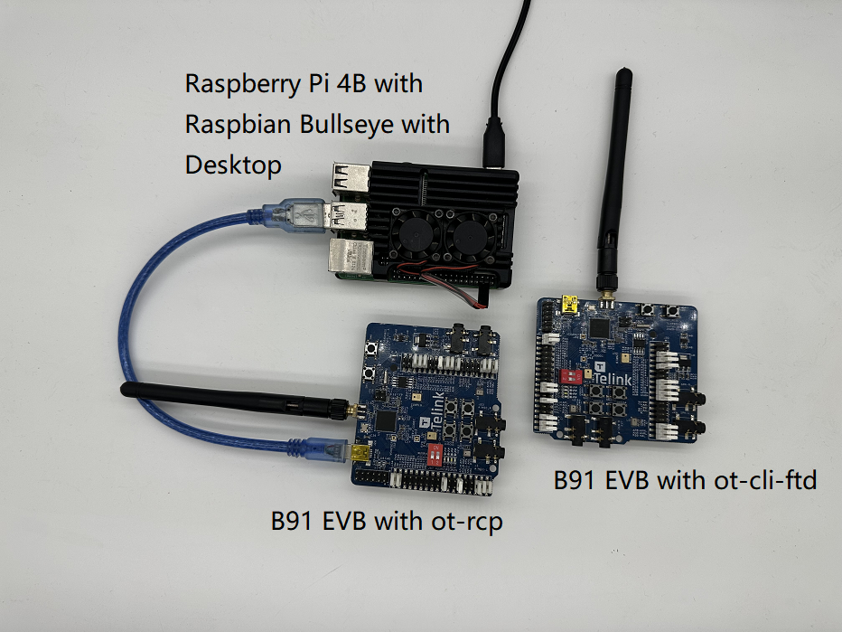
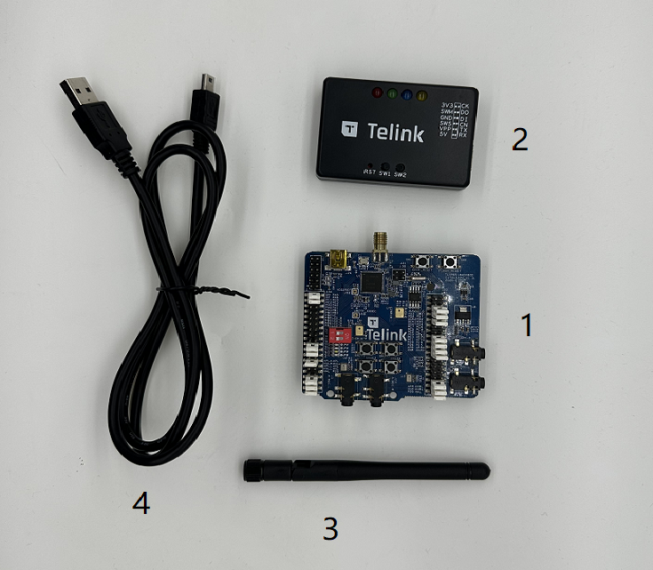
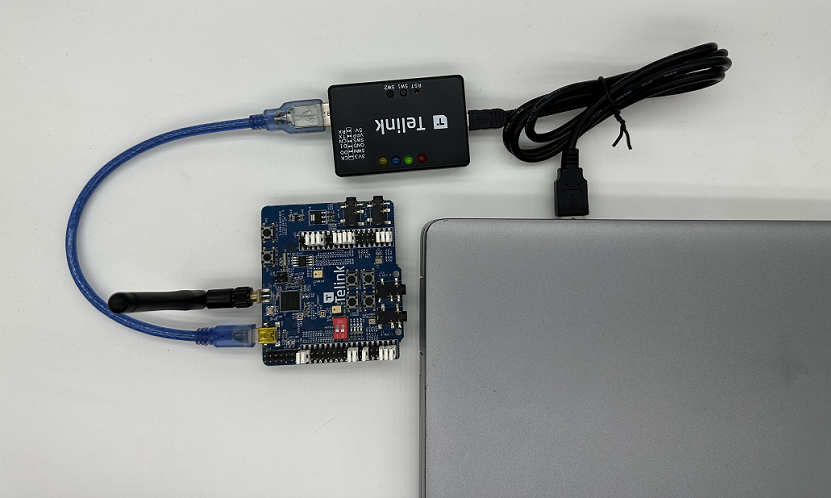
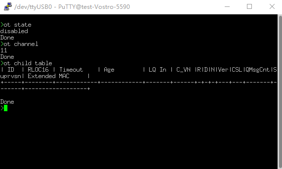
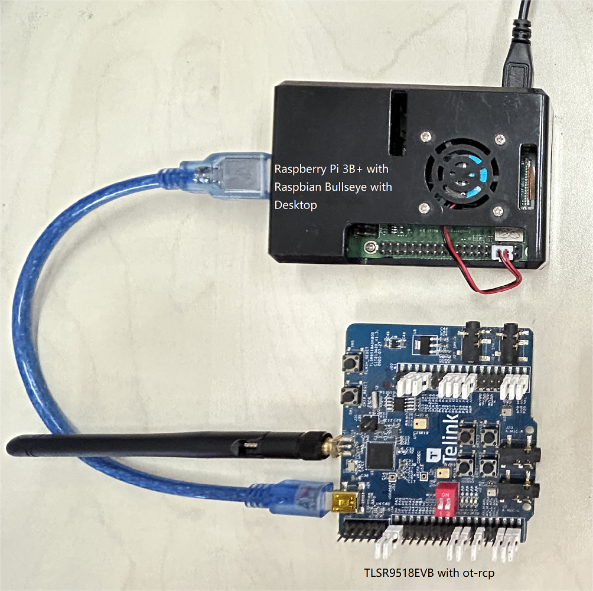
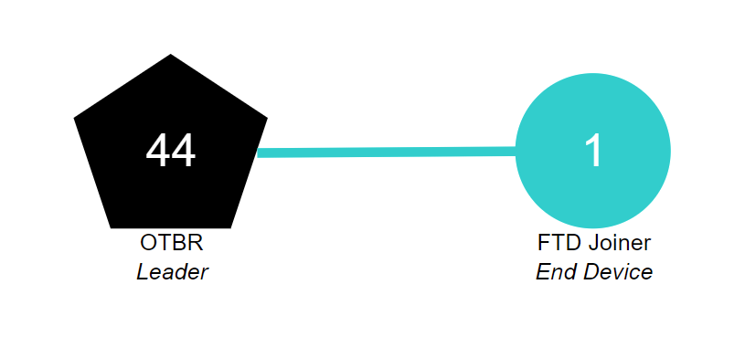

# Build a Thread Network with the TLSR9518 Development Kit and OpenThread

[codelab Feedback](https://github.com/openthread/ot-docs/issues)

## Introduction

Duration: 3:00


[OpenThread](https://openthread.io/) is an open-source implementation of the [Thread®](http://threadgroup.org/) networking protocol, which is a robust and secure wireless mesh networking protocol designed for the Internet of Things (IoT) devices.
OpenThread was developed by Google's Nest team and is freely available to the developer community as an open-source project.

The [Thread Specification](http://threadgroup.org/ThreadSpec) establishes a reliable, secure, and energy-efficient wireless communication protocol for resource-constrained devices commonly found in smart homes and commercial buildings.
OpenThread includes the full network layer scope within Thread, such as IPv6, 6LoWPAN, IEEE 802.15.4 with MAC security, mesh link establishment, and mesh routing.

Telink has integrated the OpenThread implementation into Zephyr RTOS, enabling seamless compatibility with Telink hardware.
The source code for this integration is readily accessible on [GitHub](https://github.com/telink-semi/zephyr), and it is also provided as a software development kit (SDK).

In this codelab, you will program OpenThread on actual hardware, create and manage a Thread network, and exchange messages between nodes.
The image below depicts the hardware setup, featuring an OT Border Router (OTBR) and one Thread device in the codelab.



### What you'll learn

1. To set up OpenThread implementation using the Telink Zephyr development environment.

2. To Build the OpenThread CLI samples (`ot-cli-ftd` and `ot-rcp`) and flash them onto Telink TLSR9518 development kits.

3. To Set up an OpenThread Border Router (OTBR) using Docker on a Raspberry Pi 3B+ or later.

4. To create a Thread network on the OTBR.

5. To Add devices to the Thread network using out-of-band debugging.

6. To validate the connectivity between nodes in the Thread network using CLI.

### What you'll need

Hardware:

* Two TLSR9518 development kits.

* One Raspberry Pi 3B+ or greater with Raspbian OS Image.

* A Linux machine with at least two USB ports.

* A USB to TTL Serial Converter Cable.

* An internet-connected switch (or Router) and several Ethernet cables.

Software:

* Telink Burning and Debugging Tool —— LinuxBDT.

* Serial port terminal tool, such as PuTTY.

* Other tools such as, Git and West.

## Prerequisites

Duration: 4:00

### Thread Concepts and OpenThread CLI

It might be helpful to go through the [OpenThread Simulation codelab](https://openthread.io/codelabs/openthread-simulation/#0) to get familiar with fundamental Thread concepts and the OpenThread CLI before this codelab.

### Linux Machine

The Linux machine (Ubuntu v20.04 LTS or later) acts as the build machine to set up the Telink Zephyr development environment and flash all Thread development boards.
To accomplish these tasks, the Linux machine requires two available USB ports and internet connectivity.

### Serial Port Connection and Terminals

It is recommended to be familiar with establishing connections between devices using a serial port converter cable.
Additionally, you will need a serial port terminal tool to access the devices.

In this codelab, terminal tool PuTTY is used for controlling the FTD Joiner and Raspberry Pi.
It offers an overview of its usage, but other terminal software can also be employed.

### Telink TLSR9518 Development Kit

This codelab needs two TLSR9518 development kits.



One of these kits will be used as RCP (Radio Co-Processor), while the other will function as FTD (Full Thread Device).
If you are not yet in possession of this board, you can acquire more details of TLSR9518 development kit from the [Telink official website](http://wiki.telink-semi.cn/wiki/Hardware/B91_Generic_Starter_Kit_Hardware_Guide/).
Some components to be used are as follows:

| Index | Name                                         |
| :---- | -------------------------------------------- |
| 1     | Telink TLSR9518 Development Kit              |
| 2     | Telink Burning Kit                           |
| 3     | 2.4Ghz Antenna                               |
| 4&5   | USB Cable (USB A to mini USB)                |
| 6     | USB to TTL Serial Cable                      |

> **Note**: Item 6 is not included in the kit for sale.

### Raspberry Pi 3B+ or greater with Raspbian OS Image

In this codelab, a Raspberry Pi 3B+ or greater with [Raspbian Bullseye Lite OS image](https://downloads.raspberrypi.org/raspios_lite_armhf/images/raspios_lite_armhf-2023-05-03/2023-05-03-raspios-bullseye-armhf-lite.img.xz) or [Raspbian Bullseye with Desktop](https://downloads.raspberrypi.org/raspios_armhf/images/raspios_armhf-2023-05-03/2023-05-03-raspios-bullseye-armhf.img.xz) is needed.
It is connected to the internet via Ethernet and will be configured as the host for the OpenThread Border Router (OTBR).

### Network Connection

An internet-connected switch (or router) and several Ethernet cables.
They are used to connect the Raspberry Pi to the Linux machine, facilitating user configuration of the Raspberry Pi via the host.

### LinuxBDT

Telink [Burning and Debugging Tool (BDT)](http://wiki.telink-semi.cn/wiki/IDE-and-Tools/Burning-and-Debugging-Tools-for-all-Series/), which applies to all Telink Chip series, allows you to erase and flash OpenThread firmware onto the Telink TLSR9518 Development Kits.
Install the X86-based linux version [linuxBDT](http://wiki.telink-semi.cn/tools_and_sdk/Tools/BDT/LinuxBDT.tar.bz2) on your Linux machine.

### Others

* Git, for setting up Telink Zephyr Development Environment.
* West, for manage Zephyr project and build OpenThread binaries.

## Set up Firmware

Duration: 12:00

### Set up Telink Zephyr Development Environment

On the Linux machine, open an CLI terminal and start by executing the following commands to ensure that your APT is up-to-date.

```console
$ sudo apt update
$ sudo apt upgrade
```

Once that is done, proceed with the following steps.

1. Install the dependencies.

     ```console
     $ wget https://apt.kitware.com/kitware-archive.sh
     $ sudo bash kitware-archive.sh
     $ sudo apt install --no-install-recommends git cmake ninja-build \
     gperf ccache dfu-util device-tree-compiler python3-dev python3-pip \
     python3-setuptools python3-tk python3-wheel xz-utils file make gcc \
     gcc-multilib g++-multilib libsdl2-dev
     ```

     Zephyr currently requires minimum versions of main dependencies, such as CMake (3.20.0), Python3 (3.6), and Devicetree Compiler (1.4.6).

     ```console
     $ cmake --version
     $ python3 --version
     $ dtc --version
     ```

     Verify the installed versions on your system before proceeding with the next steps.
     If the versions are not correct, switch the APT mirror to a stable and up-to-date mirror, or manually update these dependencies.

2. Install west.

     ```console
     $ pip3 install --user -U west
     $ echo 'export PATH=~/.local/bin:"$PATH"' >> ~/.bashrc
     $ source ~/.bashrc
     ```

     Make sure that `~/.local/bin` is in your `$PATH` environment variable.

3. Get the Zephyr Project source code.

     ```console
     $ west init ~/zephyrproject
     $ cd ~/zephyrproject
     $ west update
     $ west blobs fetch hal_telink
     $ west zephyr-export
     ```

4. Install additional Python dependencies for Zephyr.

     ```console
     $ pip3 install --user -r ~/zephyrproject/zephyr/scripts/requirements.txt
     ```

5. Set up the Zephyr toolchain. Download the Zephyr toolchain (about 1~2 GB) to a local directory to allow you to flash most boards.

     ```console
     $ wget https://github.com/zephyrproject-rtos/sdk-ng/releases/download/v0.16.1/zephyr-sdk-0.16.1_linux-x86_64.tar.xz
     $ wget -O - https://github.com/zephyrproject-rtos/sdk-ng/releases/download/v0.16.1/sha256.sum | shasum --check --ignore-missing
     ```

     Download the Zephyr SDK and place it in the recommended path, as shown below.

     ```console
     $HOME/zephyr-sdk[-x.y.z]
     $HOME/.local/zephyr-sdk[-x.y.z]
     $HOME/.local/opt/zephyr-sdk[-x.y.z]
     $HOME/bin/zephyr-sdk[-x.y.z]
     /opt/zephyr-sdk[-x.y.z]
     /usr/zephyr-sdk[-x.y.z]
     /usr/local/zephyr-sdk[-x.y.z]
     ```

     Where [-x.y.z] is optional text that can be any text, such as -0.16.1. The directory cannot be moved after the SDK is installed.
     Then install the Zephyr toolchain.

     ```console
     $ tar xvf zephyr-sdk-0.16.1_linux-x86_64.tar.xz
     $ cd zephyr-sdk-0.16.1
     $ ./setup.sh -t riscv64-zephyr-elf -h -c
     ```

6. Build the Hello World example. First, verify that the official Zephyr project configuration is correct using the Hello World example, then proceed with setting up your custom project.

     ```console
     $ cd ~/zephyrproject/zephyr
     $ west build -p auto -b tlsr9518adk80d samples/hello_world
     ```

     Use the West build command to build the hello_world example from the root directory of the Zephyr repository.
     You can find the firmware named `zephyr.bin` under the `build/zephyr directory`.

7. Add the Zephyr environment script to `~/.bashrc`. Execute the following commands.

     ```console
     $ echo "source ~/zephyrproject/zephyr/zephyr-env.sh" >> ~/.bashrc
     $ source ~/.bashrc
     ```

8. Add the Telink Zephyr remote repository. Download the Telink repo locally as a development branch and update it.

     ```console
     $ cd ~/zephyrproject/zephyr
     $ git remote add telink-semi https://github.com/telink-semi/zephyr
     $ git fetch telink develop
     $ git checkout develop
     $ west update
     $ west blobs fetch hal_telink
     ```

For more information, you can refer to [Zephyr Doc -- Getting Started Guide](https://docs.zephyrproject.org/latest/getting_started/index.html)

### Set up Telink LinuxBDT

Download the Telink LinuxBDT tool and extract it to a local directory on your Linux machine, such as home directory `~`, enabling to flash firmware onto the TLSR9518 development board.

```console
$ cd ~
$ wget http://wiki.telink-semi.cn/tools_and_sdk/Tools/BDT/LinuxBDT.tar.bz2
$ tar -vxf LinuxBDT.tar.bz2 
```

Connect the Burning Kit to the Linux machine via the USB interface, and then enter the following commands.

```console
$ cd LinuxBDT
$ sudo ./bdt lsusb -v
Bus 002 Device 001: ID 1d6b:0003 xHCI Host Controller
Bus 001 Device 003: ID 0bda:565a Integrated_Webcam_HD
Bus 001 Device 023: ID 413c:301a Dell MS116 USB Optical Mouse
Bus 001 Device 037: ID 248a:826a Telink Web Debugger v3.6
Bus 001 Device 001: ID 1d6b:0002 xHCI Host Controller
```

If you see the message "Telink Web Debugger v3.6", it indicates that the BDT programmer has successfully connected to the Linux machine.

### Firmware Compilation

This codelab will build two types of OpenThread firmware:

* `ot-cli-ftd`,
* and `ot-rcp`.

 The compilation methods are as follows：

1. Radio Co-Processor（`ot-rcp`)

     ```console
     $ cd ~/zephyrproject
     $ rm -rf build_ot_coprocessor
     $ west build -b tlsr9518adk80d -d build_ot_coprocessor zephyr/samples/net/openthread/coprocessor -- -DDTC_OVERLAY_FILE="usb.overlay" -DOVERLAY_CONFIG=overlay-rcp-usb-telink.conf
     ```

2. Full-Featured Thread Device with Interactive Command Line (`ot-cli-ftd`)

     ```console
     $ cd ~/zephyrproject
     $ rm -rf build_ot_cli_ftd
     $ west build -b tlsr9518adk80d -d build_ot_cli_ftd zephyr/samples/net/openthread/cli -- -DOVERLAY_CONFIG=overlay-telink-fixed-mac.conf -DCONFIG_OPENTHREAD_FTD=y
     ```

### Firmware Flash

Connect a TLSR9518 development board to the Burning Kit using a short blue USB cable as illustrated in the figure below.



In the command line, execute the following commands to perform firmware burning (using the flashing of the `ot-cli-ftd` firmware as an example).

```console
$ cd ~/zephyrproject/build_ot_cli_ftd/zephyr
$ cp zephyr.bin ~/LinuxBDT/bin/ot-cli-ftd.bin
$ cd ~/LinuxBDT
$ sudo ./bdt 9518 ac
 Activate OK!
$ sudo ./bdt 9518 wf 0 -i bin/ot-cli-ftd.bin
 EraseSectorsize...
 Total Time: 2181 ms
 Flash writing...
 [100%][-] [##################################################]
 File Download to Flash at address 0x000000: 491700 bytes
 Total Time: 30087 ms
```

The flash method for `ot-rcp` is basically the same as that for `ot-cli-ftd`.
However, there are differences in the firmware paths and names.

After flashing, distinguish the two TLSR9518 development boards by marking them accordingly.
Label the board flashed with `ot-cli-ftd` as "FTD Joiner" and the board flashed with `ot-rcp` as "RCP".

## Configure a Serial Console for the FTD Joiner Device

Duration: 3:00

To control the FTD Joiner device through the CLI, connect a USB to TTL Serial Convertor Cable to the following pins on the TLSR9518 development board：

| Name  | Pin                 |
| :---- | ------------------- |
| RX    | PB3 (pin 15 of J34) |
| TX    | PB2 (pin 18 of J34) |
| GND   | GND (pin 23 of J50) |

> aside positive
>
> **Note:** Baud rate：115200 bits/s

After connecting the Convertor Cable to the Linux machine, Open PuTTY.
Then create a new terminal, set the serial port information, and open the serial port.



 The OpenThread command line reference is here: [OpenThread CLI Reference](https://github.com/openthread/openthread/blob/f7690fe7e9d638341921808cba6a3e695ec0131e/src/cli/README.md).
 Be sure to prefix all commands with `ot`.

Examples：

```console
> ot state
disabled
Done
> ot channel
11
Done
>
```

## Set up the Raspberry Pi as a OpenThread Border Router

Duration: 9:00

An OpenThread Border Router is a device consisting of two main parts：

* **Raspberry Pi** contains all the services and firmware required to act as a Border Router (BR).

* **RCP** is responsible for Thread communication.

### Radio Co-Processor（RCP）

To flash the `ot-rcp` firmware, follow the same steps as the `ot-cli-ftd` firmware flashing process.
Connect the TLSR9518 development kit to a USB port on the Raspberry Pi, as depicted in the figure below.



### Raspberry Pi

1. Ensure that the [Raspbian Bullseye Lite OS image](https://downloads.raspberrypi.org/raspios_lite_armhf/images/raspios_lite_armhf-2023-05-03/2023-05-03-raspios-bullseye-armhf-lite.img.xz) or [Raspbian Bullseye with Desktop](https://downloads.raspberrypi.org/raspios_armhf/images/raspios_armhf-2023-05-03/2023-05-03-raspios-bullseye-armhf.img.xz) is properly written to the SD card.

2. You have the option to either SSH into the Raspberry Pi or work directly with the Raspbian Desktop.
This codelab will use SSH.

3. Before proceeding to install OTBR Docker in the next step, make sure to update the local repository and package manager first.

     ```console
     $ sudo apt-get update
     $ sudp apt-get upgrade
     ```

### Install Docker

If you just update local repository and package manager APT at previous step, reboot Raspberry Pi and then open an SSH terminal window.

1. Install Docker:

     ```console
     $ curl -sSL https://get.docker.com | sh
     ```

2. Put the current account into a Docker group to grant the permission so that `sudo` does not need to be added in front of each command.

     ```console
     $ sudo usermod -aG docker $USER
     ```

     You need to restart Raspberry Pi to take effect.

3. If Docker has not started, start it:

     ```console
     $ sudo dockerd
     ```

4. The OTBR firewall scripts generate rules inside the Docker container. Prior to that, execute `modprobe` to load the kernel module of iptables.

     ```console
     $ sudo modprobe ip6table_filter
     ```

### Configure and Run Docker

This codelab directly pulls the OTBR Docker image from the [OpenThread Docker Hub](https://hub.docker.com/u/openthread/). This image has been tested and verified by the OpenThread team.

1. Pull the latest image:

     ```console
     $ docker pull openthread/otbr:latest
     ```

2. Check the image list in the Docker container:

     ```console
     $ docker images
     REPOSITORY        TAG       IMAGE ID       CREATED      SIZE
     openthread/otbr   latest    db081f4de15f   6 days ago   766MB
     ```

3. Determine the serial port name of the RCP device by checking `/dev`, `ttyACM0` indicates that the RCP is correctly connected.

     ```console
     $ ls /dev/tty*
     ...
     /dev/ttyACM0
     ... 
     ```

4. Run OTBR Docker for the first time, and reference the serial port of RCP (`ttyACM0`).
If you want to continue using this OTBR Docker, use the command **docker start otbr**.

     ```console
     $ docker run --name "otbr" --sysctl "net.ipv6.conf.all.disable_ipv6=0 net.ipv4.conf.all.forwarding=1 net.ipv6.conf.all.forwarding=1" -p 8080:80 --dns=127.0.0.1 -it --volume /dev/ttyACM0:/dev/ttyACM0 --privileged openthread/otbr --radio-url spinel+hdlc+uart:///dev/ttyACM0
     ```

5. Open a new SSH terminal window to test the connectivity between the Raspberry Pi and the RCP.

     ```console
     $ docker exec -ti otbr sh -c "sudo ot-ctl"
     > state 
     disabled
     Done
     ```

Optional docker commands:

* Get information about the running Docker container:

     ```console
     $ docker ps -aq
     ```

* Stop OTBR Docker:

     ```console
     $ docker stop otbr
     ```

* Remove OTBR Docker:

     ```console
     $ docker rm otbr
     ```

* Reload OTBR Docker:

     ```console
     $ docker restart otbr
     ```

At this point, a FTD Joiner device and an OTBR are ready, and you can proceed to the next step to build the Thread network.

## Create a Thread Network

Duration: 6:00

### Create a Thread Network on RCP

We use the **ot-ctl** shell on the OTBR to establish a Thread network.
If you exited the shell in last section, enter the following command to start it again in the SSH terminal:

```console
$ docker exec -ti otbr sh -c "sudo ot-ctl"
```

Next, enter the commands in the order specified in the table, and ensure that each step achieves the expected result before proceeding to the next one.

| Index | Command                 | Introduction                                                                 | Expected Response |
| :---- | ----------------------- | ---------------------------------------------------------------------------- | ----------------- |
| 1     | `dataset init new`      | Create a new random network dataset                                          | Done              |
| 2     | `dataset commit active` | Commit new dataset to the Active Operational Dataset in non-volatile storage | Done              |
| 3     | `ifconfig up`           | Bring up the IPv6 interface                                                  | Done              |
| 4     | `thread start`          | Enable Thread protocol operation and attach to a Thread network              | Done              |
|       |                         | Wait 10 seconds for the thread interface to be up.                           |                   |
| 5     | `state`                 | Check the device state.This command can be called multiple times until it becomes the leader and moves on to the next step                                                                                                             | leader<br/>Done   |
| 6     | `dataset active`        | Check the complete Active Operational Dataset and record network key     | Active Timestamp: 1<br/>Channel: 13<br/>Channel Mask: 0x07fff800<br/>Ext PAN ID: b07476e168eda4fc<br/>Mesh Local Prefix: fd8c:60bc:a98:c7ba::/64<br/>Network Key: c312485187484ceb5992d2343baaf93d<br/>Network Name: OpenThread-599c<br/>PAN ID: 0x599c<br/>PSKc: 04f79ad752e8401a1933486c95299f60<br/>Security Policy: 672 onrc 0<br/>Done               |

The network key randomly generated by OTBR during network creation will be used when `ot-cli-ftd` devices join this Thread network.

### Add the FTD Joiner to Thread through out-of-band commissioning

Out-of-band commissioning refers to the transmission of network credentials to devices waiting to join the network through non-wireless methods (for example, manually entering in the OpenThread CLI).
Enter the following commands in order in the serial console to the FTD Joiner.

| Index | Command                                                  | Introduction                                                                  | Expected Responses |
| :---- | -------------------------------------------------------- | ----------------------------------------------------------------------------- | ------------------ |
| 1     | `ot dataset networkkey c312485187484ceb5992d2343baaf93d` | Only the Network Key is necessary for a device to connect to a Thread network | Done               |
| 2     | `ot dataset commit active`                               | Commit new dataset to the Active Operational Dataset in non-volatile storage  | Done               |
| 3     | `ot ifconfig up`                                         | Bring up the IPv6 interface                                                   | Done               |
| 4     | `ot thread start`                                        | Enable Thread protocol operation and attach to a Thread network               | Done               |
|       |                                                          | Wait 20 seconds while the device joins and configures itself                  |                    |
| 5     | `ot state`                                               | Check the device state                                                        | child/router<br/>Done               |

> aside positive
>
> **Note:** The FTD Joiner starts as a child and will turn into a router after a while, which is normal.

### Topology

Enter commands such as `ipaddr`, `child table`, `router table` in the SSH terminal to get responses like the following code snippets.

```console
> ipaddr rloc
fd8c:60bc:a98:c7ba:0:ff:fe00:b000
Done
> child table
| ID  | RLOC16 | Timeout    | Age        | LQ In | C_VN |R|D|N|Ver|CSL|QMsgCnt|Suprvsn| Extended MAC     |
+-----+--------+------------+------------+-------+------+-+-+-+---+---+-------+-------+------------------+
|   1 | 0xb001 |        240 |         23 |     3 |   51 |1|1|1|  3| 0 |     0 |   129 | 82bc12fbe783468e |

Done
> router table
| ID | RLOC16 | Next Hop | Path Cost | LQ In | LQ Out | Age | Extended MAC     | Link |
+----+--------+----------+-----------+-------+--------+-----+------------------+------+
| 44 | 0xb000 |       63 |         0 |     0 |      0 |   0 | 7ae354109d611f7e |    0 |

Done
...
> child table
| ID  | RLOC16 | Timeout    | Age        | LQ In | C_VN |R|D|N|Ver|CSL|QMsgCnt|Suprvsn| Extended MAC     |
+-----+--------+------------+------------+-------+------+-+-+-+---+---+-------+-------+------------------+

Done
> router table
| ID | RLOC16 | Next Hop | Path Cost | LQ In | LQ Out | Age | Extended MAC     | Link |
+----+--------+----------+-----------+-------+--------+-----+------------------+------+
| 33 | 0x8400 |       63 |         0 |     3 |      3 |  13 | e61487c1cda940a6 |    1 |
| 44 | 0xb000 |       63 |         0 |     0 |      0 |   0 | 7ae354109d611f7e |    0 |

Done
```

The `RLOC16` of OTBR is `0xb000` and the `RLOC16` of the FTD Joiner initially is `0xb001`.
Then the FTD Joiner's `RLOC16` becomes `0x8400` after obtaining the Router ID.
It can be seen that the FTD Joiner has been upgraded from a child to a router.

> aside positive
>
> **Note:** RLOC stands for Routing Locator, which identifies the device based on the position of the Thread device in the network topology.
> It is one of the several IPv6 addresses of the Thread device.
> For a detailed introduction, refer to [IPv6 Addressing](https://openthread.io/guides/thread-primer/ipv6-addressing#routing-locator-rloc)

The current Thread network contains two nodes, and the topology is as shown in the figure below.



## Communication Between Thread Devices

Duration: 6:00

### ICMPv6 Communication

We use the `ping` command to check whether Thread devices in the same network can communicate with each other.
First, use the `ipaddr` command to get the RLOC of the device.

```console
> ipaddr
fd8c:60bc:a98:c7ba:0:ff:fe00:fc11
fdbd:7274:649c:1:1d19:9613:f705:a5af
fd8c:60bc:a98:c7ba:0:ff:fe00:fc10
fd8c:60bc:a98:c7ba:0:ff:fe00:fc38
fd8c:60bc:a98:c7ba:0:ff:fe00:fc00
fd8c:60bc:a98:c7ba:0:ff:fe00:b000       # Routing Locator (RLOC)
fd8c:60bc:a98:c7ba:5249:34ab:26d1:aff6
fe80:0:0:0:78e3:5410:9d61:1f7e
Done
```

Enter the following command in the serial console of the FTD Joiner to execute the ping operation.

```console
> ot ping fd8c:60bc:a98:c7ba:0:ff:fe00:b000
16 bytes from fd8c:60bc:a98:c7ba:0:ff:fe00:b000: icmp_seq=1 hlim=64 time=19ms
1 packets transmitted, 1 packets received. Packet loss = 0.0%. Round-trip min/avg/max = 19/19.0/19 ms.
Done
```

The output response of the serial port indicates that the OTBR side has received the ping request, and the FTD Joiner has received the ping response returned by OTBR.
The communication between the two devices is successful.

### UDP Communication

The application services provided by OpenThread also include UDP.
You can use the UDP API to pass information between nodes in the Thread network, or pass information to external networks through the Border Router.
The detailed introduction of OpenThread's UDP API is in the [OpenThread CLI - UDP Example](https://github.com/openthread/openthread/blob/f7690fe7e9d638341921808cba6a3e695ec0131e/src/cli/README_UDP.md).
This codelab will use some of the APIs in it to transmit information between OTBR and FTD Joiner.

First, get the Mesh-Local EID of OTBR.
This address is also one of the IPv6 addresses of the Thread device, and it can be used to access Thread devices in the same Thread network partition.

```console
> ipaddr mleid
fd8c:60bc:a98:c7ba:5249:34ab:26d1:aff6
Done
```

Enter the following commands in the SSH terminal to enable OTBR UDP and bind the device's 1022 port.

```console
> udp open
Done
> udp bind :: 1022
Done
```

Enter the following commands in the serial console and enable the UDP of the FTD Joiner.
Bind the device's 1022 port, and then send a 5-byte `hello` message to OTBR.

```console
> ot udp open 
Done
> ot udp bind :: 1022
Done
> ot udp send fd8c:60bc:a98:c7ba:5249:34ab:26d1:aff6 1022 hello
Done
```

The SSH terminal outputs the following information.
OTBR receives the `hello` message from the FTD Joiner, which means the UDP communication is successful.

```console
> 5 bytes from fd8c:60bc:a98:c7ba:9386:63cf:19d7:5a61 1022 hello
```

## Congratulations

You've create a simple Thread network and verified the communication within this network.

You now know:

* How to build and use the Telink Zephyr development environment.
* How to build the `ot-cli-ftd` and `ot-rcp` binaries, as well as flash them to the TLSR9518 development kit.
* How to set up a Raspberry Pi 3B+ or higher version as an OpenThread Border Router (OTBR) using Docker.
* How to create a Thread network on OTBR.
* How to add devices to the Thread network through out-of-band commissioning.
* How to verify the connectivity between nodes in the Thread network.

### Further Reading

Check out [openthread.io](https://openthread.io/) and [GitHub](https://github.com/openthread) to learn about various OpenThread resources, including:

* [Supported Platforms](https://openthread.io/platforms/)
    — discover all the platforms that support OpenThread
* [Build OpenThread](../../guides/build/index.md)
    — further details on building and configuring OpenThread
* [Thread Primer](../../guides/thread-primer/index.md)
    — covers all the Thread concepts featured in this codelab

Reference documents:

* [OpenThread CLI reference](https://github.com/openthread/openthread/blob/main/src/cli/README.md)
* [OpenThread UDP CLI reference](https://github.com/openthread/openthread/blob/main/src/cli/README_UDP.md)
* [OpenThread UDP API reference](https://openthread.io/reference/group/api-udp)

## License

Copyright (c) 2021-2023, The OpenThread Authors.
All rights reserved.

Redistribution and use in source and binary forms, with or without
modification, are permitted provided that the following conditions are met:

1. Redistributions of source code must retain the above copyright
   notice, this list of conditions and the following disclaimer.
2. Redistributions in binary form must reproduce the above copyright
   notice, this list of conditions and the following disclaimer in the
   documentation and/or other materials provided with the distribution.
3. Neither the name of the copyright holder nor the
   names of its contributors may be used to endorse or promote products
   derived from this software without specific prior written permission.

THIS SOFTWARE IS PROVIDED BY THE COPYRIGHT HOLDERS AND CONTRIBUTORS "AS IS"
AND ANY EXPRESS OR IMPLIED WARRANTIES, INCLUDING, BUT NOT LIMITED TO, THE
IMPLIED WARRANTIES OF MERCHANTABILITY AND FITNESS FOR A PARTICULAR PURPOSE
ARE DISCLAIMED. IN NO EVENT SHALL THE COPYRIGHT HOLDER OR CONTRIBUTORS BE
LIABLE FOR ANY DIRECT, INDIRECT, INCIDENTAL, SPECIAL, EXEMPLARY, OR
CONSEQUENTIAL DAMAGES (INCLUDING, BUT NOT LIMITED TO, PROCUREMENT OF
SUBSTITUTE GOODS OR SERVICES; LOSS OF USE, DATA, OR PROFITS; OR BUSINESS
INTERRUPTION) HOWEVER CAUSED AND ON ANY THEORY OF LIABILITY, WHETHER IN
CONTRACT, STRICT LIABILITY, OR TORT (INCLUDING NEGLIGENCE OR OTHERWISE)
ARISING IN ANY WAY OUT OF THE USE OF THIS SOFTWARE, EVEN IF ADVISED OF THE
POSSIBILITY OF SUCH DAMAGE.
