# Build a Thread Network with TI SimpleLink F3 and OpenThread

[Codelab Feedback](https://github.com/openthread/ot-docs/issues)

## Introduction

Duration: 3:00


Google's [OpenThread](https://openthread.io/) (OT) is an open-source implementation of Thread. Google has released OpenThread to make the networking technology used in Google Nest products broadly available to developers, accelerating development of products for the connected home and commercial building applications. With a narrow platform abstraction layer and a small memory footprint, OpenThread is highly portable. It supports both system-on-chip (SoC) and network co-processor (NCP) designs.

The [Thread Specification](https://www.threadgroup.org/support#specifications) defines an IPv6-based reliable, secure, and low-power wireless device-to-device communication protocol for home and commercial building applications.

[Texas Instruments](https://www.ti.com) has implemented OpenThread for the SimpleLink™ CC27xx device family. The [ot-ti repository](https://github.com/TexasInstruments/ot-ti) on GitHub contains the platform drivers and example applications needed to run OpenThread on TI SimpleLink Connected MCUs. The [CC2745R10-Q1](https://www.ti.com/product/CC2745R10-Q1) is an automotive-grade (AEC-Q100 qualified), Thread-certified IEEE 802.15.4 wireless MCU from TI's SimpleLink CC27xx family.

This codelab describes how to get started developing OpenThread applications with the [LP-EM-CC2745R10-Q1](https://www.ti.com/tool/LP-EM-CC2745R10-Q1) LaunchPad evaluation board and the TI ot-ti repository. The image below shows the hardware setup used in this codelab, with an OT Border Router (OTBR) and two Thread Full Thread Devices (FTDs).

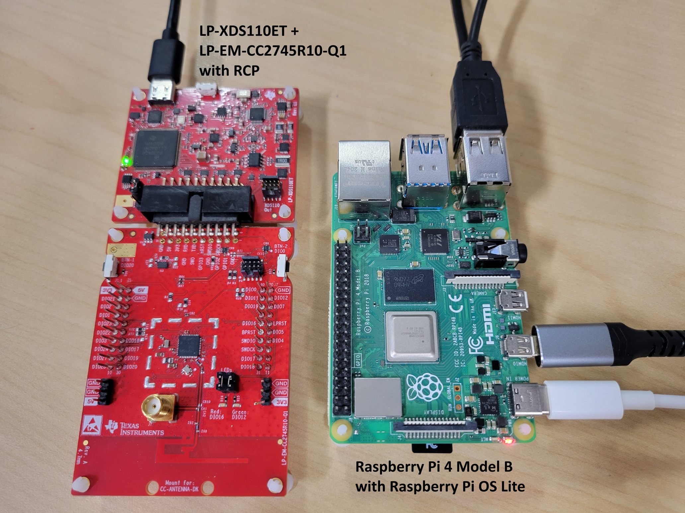

### What you'll learn

* How to set up the TI ot-ti build environment.
* How to build and flash OpenThread CLI binaries to LP-EM-CC2745R10-Q1 boards.
* How to set up a Raspberry Pi as an OpenThread Border Router (OTBR) using ot-br-posix.
* How to create a Thread network on the OTBR.
* Out-of-band commissioning of devices onto a Thread network.
* How to verify Thread communication between nodes using the ping command.

## Prerequisites

Duration: 5:00

### Hardware

1. **3 LP-EM-CC2745R10-Q1 LaunchPad boards**: one configured as an RCP connected to the Border Router, and two configured as Full Thread Devices (FTD).

   * [CC2745R10-Q1 product page](https://www.ti.com/product/CC2745R10-Q1)
   * [LP-EM-CC2745R10-Q1 LaunchPad page](https://www.ti.com/tool/LP-EM-CC2745R10-Q1)

   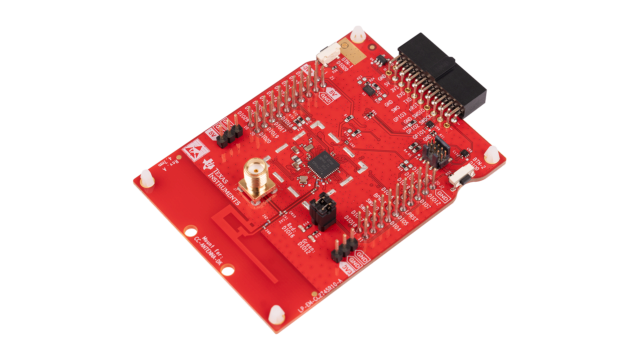

   > aside positive
   >
   > **Note:** The CC2745R10-Q1 is an automotive-grade (AEC-Q100 qualified) Thread-certified IEEE 802.15.4 wireless MCU in TI's SimpleLink CC27xx family. The LP-EM-CC2745R10-Q1 is the corresponding LaunchPad Evaluation Module and supports RCP, FTD, MTD, and NCP Thread roles.
   >
   > **Lower memory alternative:** The [CC2340R5](https://www.ti.com/product/CC2340R5) with the [LP-EM-CC2340R5](https://www.ti.com/tool/LP-EM-CC2340R5) LaunchPad is a lower memory option that can serve as the **RCP only**. It does not support FTD, MTD, or NCP roles. If you substitute an LP-EM-CC2340R5 for Board 1 (RCP), the two FTD boards must still be LP-EM-CC2745R10-Q1.

2. **3 LP-XDS110ET debug probes**: one per LaunchPad board, used for programming and debug over USB.

   * [LP-XDS110ET product page](https://www.ti.com/tool/LP-XDS110ET)

   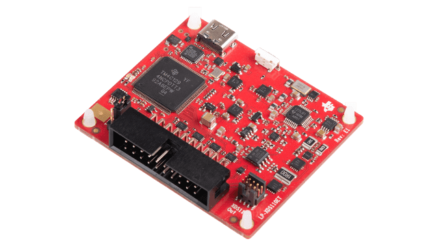

   > aside positive
   >
   > **Note:** The LP-XDS110ET is a separate USB debug probe required for LaunchPads in the LP-EM form factor. It includes [EnergyTrace](https://www.ti.com/tool/ENERGYTRACE) support for power profiling. The [LP-XDS110](https://www.ti.com/tool/LP-XDS110) is a lower-cost alternative that provides the same programming and debug capability but does **not** include EnergyTrace.
   >
   > As a further alternative, a LaunchPad with an on-board XDS110 debug probe (such as the LP-CC2745R10) can be used in place of the LP-EM board and a separate debug probe entirely. See the [LaunchPad debug connectivity guide](https://dev.ti.com/tirex/explore/node?isTheia=false&node=A__AFLJffDDRMNN.R1VCer3oA__lpf3_devtools__FUz-xrs__LATEST) for details.

3. **3 micro-USB cables** to connect and power the LaunchPad boards and debug probes.

4. **A Raspberry Pi 4B or greater** with Raspberry Pi OS connected to the internet over Ethernet. This will be configured as the OT Border Router host.

   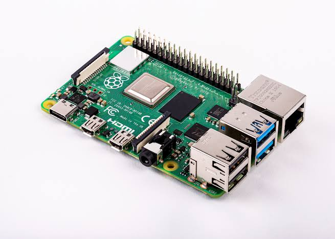

5. **A Linux or macOS host system** with at least 2 USB ports and internet access. The build environment requires a Bash-compatible shell. Windows users should use WSL2 (Windows Subsystem for Linux 2) with Ubuntu.

6. **At least one Ethernet cable** for connecting the Raspberry Pi to the internet.

   > aside positive
   >
   > **Note:** An Ethernet cable is the simplest option. Alternatively, you can connect the Raspberry Pi to Wi-Fi and use `wlan0` as the infrastructure interface — see the OTBR setup step for details.

### Software

* **TI ot-ti repository**:  [https://github.com/TexasInstruments/ot-ti](https://github.com/TexasInstruments/ot-ti)
* **GNU ARM Embedded Toolchain 12.2** (installed automatically by the bootstrap script)
* **SysConfig 1.27.0** (installed automatically by the bootstrap script)
* **TI UniFlash**: for flashing firmware to the LaunchPad boards

<button>[Download UniFlash](https://www.ti.com/tool/UNIFLASH)</button>

* **ot-br-posix**:  [https://github.com/openthread/ot-br-posix](https://github.com/openthread/ot-br-posix)
* **A serial terminal** such as [PuTTY](https://www.chiark.greenend.org.uk/~sgtatham/putty/latest.html) (Windows), minicom (Linux), or screen (macOS/Linux)

## Hardware Setup

Duration: 3:00

This codelab uses three LP-EM-CC2745R10-Q1 boards:

* **Board 1 (RCP):** Runs `ot-rcp` firmware. Connected to the Raspberry Pi via USB as the radio co-processor for the Border Router.
* **Board 2 (FTD 1):** Runs `ot-cli-ftd` firmware as a Full Thread Device.
* **Board 3 (FTD 2):** Runs `ot-cli-ftd` firmware as a Full Thread Device.

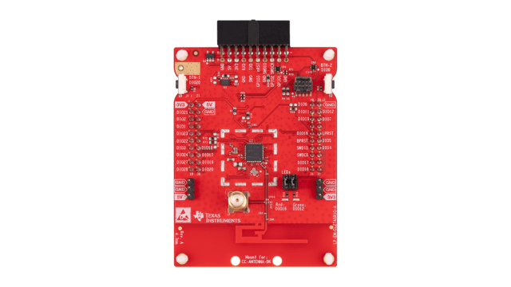

Connect each LaunchPad to your host computer via micro-USB. The USB connection provides both power and debug/programming capability through the onboard XDS110 debug probe.

> aside positive
>
> **Note:** Each LP-EM-CC2745R10-Q1 appears as two virtual serial ports when connected via USB: one for the XDS110 debug interface and one for the application UART. When opening a serial console, connect to the **Application UART** port, not the XDS110 port.

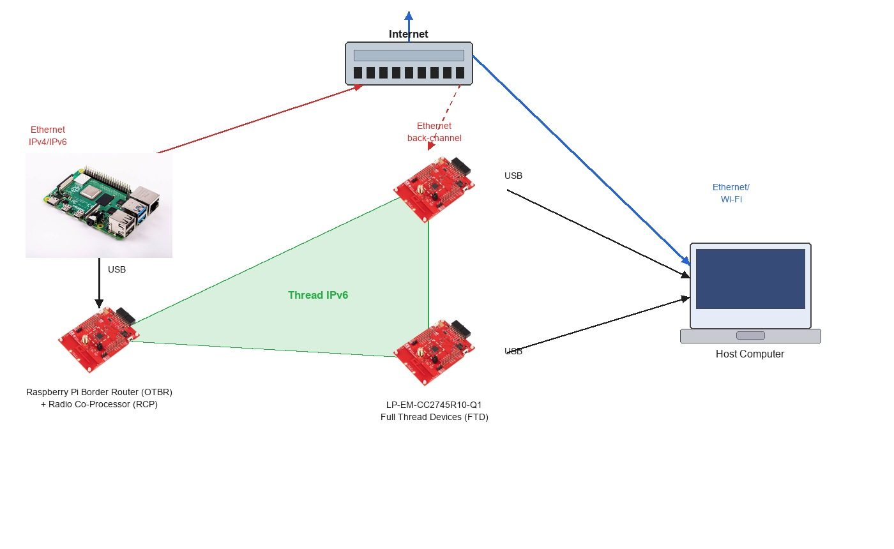

## Repository Setup and Build

Duration: 10:00

The TI ot-ti build system uses CMake and requires a Bash shell. All commands in this section are run on the **Linux or macOS host** (or WSL2 on Windows).

### 1. Clone the repository

```console
$ git clone https://github.com/TexasInstruments/ot-ti.git
$ cd ot-ti
$ git submodule update --init
```

### 2. Run the bootstrap script

The bootstrap script installs required dependencies including the GNU ARM toolchain and SysConfig:

```console
$ ./script/bootstrap
```

> aside positive
>
> **Note:** The bootstrap script requires `cmake`, `git`, `wget`, and standard build tools. On Ubuntu/Debian, install prerequisites with: `sudo apt-get install -y cmake git make wget tar ninja-build`

> aside positive
>
> **Note:** SysConfig 1.27.0 is downloaded and installed automatically to `~/ti/sysconfig_1.27.0/`. The GNU ARM toolchain is also downloaded. This step may take several minutes depending on your internet connection.

### 3. Build firmware for LP_EM_CC2745R10_Q1

Build all firmware images for the LP-EM-CC2745R10-Q1 board:

```console
$ ./script/build LP_EM_CC2745R10_Q1
```

> aside positive
>
> **Note:** The `LP_EM_CC2745R10_Q1` build target corresponds to the CC2745R10-Q1 device in the CC27xx SimpleLink family (Arm Cortex-M33F core). To see all supported boards, run `./script/build` without arguments.

After a successful build, ELF binaries are in `build/bin/`:

```console
$ ls build/bin/
ot-cli-ftd.out  ot-cli-mtd.out  ot-ncp-ftd.out  ot-rcp.out
```

The two images used in this codelab are:

* `ot-rcp.out`: Radio Co-Processor firmware for the Border Router board.
* `ot-cli-ftd.out`: Full Thread Device CLI firmware for the two FTD boards.

> aside positive
>
> **Optional Minimal Thread Device:** If you want to explore a sleepy end device instead of a Full Thread Device, you can flash `ot-cli-mtd.out` in place of `ot-cli-ftd.out` on Boards 2 and 3. An MTD does not route Thread traffic and can enter low-power sleep states, making it well suited for battery-powered applications. The Thread network formation steps in this codelab are the same for both device types.

> aside positive
>
> **Optional Network Co-Processor (NCP):** The `ot-ncp-ftd.out` binary implements the NCP architecture, where the OpenThread stack runs on the device and a host processor drives it via the Spinel protocol. NCP usage is outside the scope of this codelab; refer to the [NCP README](https://github.com/TexasInstruments/ot-ti/blob/main/examples/apps/ncp/README.md) for details.

## Flash Firmware

Duration: 5:00

Use [TI UniFlash](https://www.ti.com/tool/UNIFLASH) to flash the ELF images to the LaunchPad boards.

### Flash using UniFlash

1. Open UniFlash. Connected LaunchPad boards are displayed under **Detected Devices** due to the automatic device detection feature.

   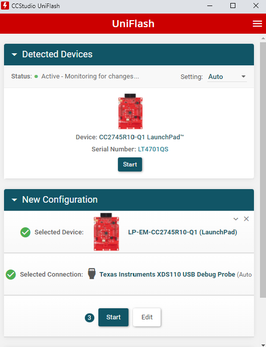

   > aside positive
   >
   > **Note:** If your board is not detected automatically, click **New Configuration**, select the `LP-EM-CC2745R10-Q1` target, and choose the XDS110 USB debug probe.

2. Select **Board 1** (to be flashed with `ot-rcp.out`) and click **Start**.

3. Click the **Browse** button and navigate to `ot-ti/build/bin/ot-rcp.out`.

   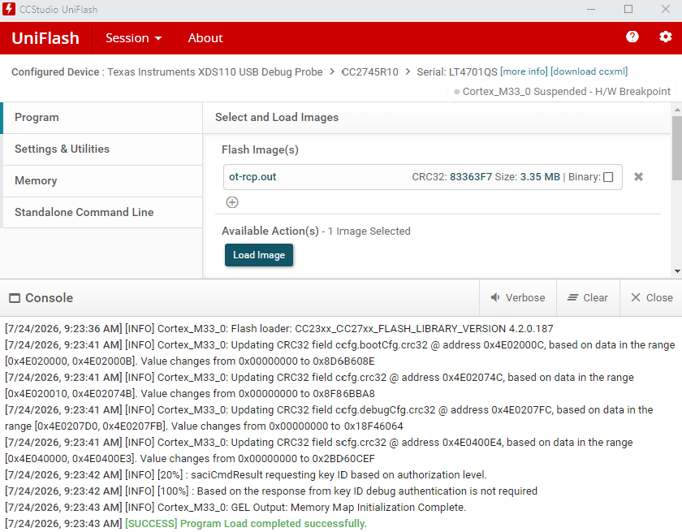

4. Click **Load Image** to flash the firmware. The log area shows progress and confirms completion.

5. Repeat steps 2–4 for **Board 2** and **Board 3**, selecting `ot-ti/build/bin/ot-cli-ftd.out` for each.

### Alternative: Flash using Code Composer Studio (CCS)

Code Composer Studio can be used as an alternative to UniFlash, and additionally provides a full debug environment:

1. Download and install [Code Composer Studio](https://www.ti.com/tool/CCSTUDIO).
2. Create a target connection (CCXML) for the LP-EM-CC2745R10-Q1 with the XDS110 debugger. Refer to the [CCS User's Guide: Manual Method](https://software-dl.ti.com/ccs/esd/documents/users_guide/ccs_debug-main.html#manual-method).
3. Start a project-less debug session as described in [CCS User's Guide: Manual Launch](https://software-dl.ti.com/ccs/esd/documents/users_guide/ccs_debug-main.html#manual-launch).
4. Connect to the Arm Cortex-M33 core and click **Load** to load the ELF image.

> aside positive
>
> **Note:** The default CCXML configuration uses 2-wire cJTAG to match the default LP-EM-CC2745R10-Q1 jumper configuration. After programming via JTAG, power-cycle the board to clear the halt-in-boot flag.

## Program the HSM

Duration: 3:00

The CC2745R10-Q1 contains a Hardware Security Module (HSM) that must be provisioned before running Thread or other secure application firmware. If your LP-EM-CC2745R10-Q1 board has not yet had its HSM programmed, complete this step now.

> aside positive
>
> **Note:** The HSM only needs to be programmed once per device. If your board was purchased as part of a kit that has already been provisioned, you can skip this section. Check the [CC2745R10-Q1 Quick Start Guide](https://dev.ti.com/tirex/explore/node?isTheia=false&node=A__AC7UNBWx3i6iMAUzzhqKwA__com.ti.SIMPLELINK_LOWPOWER_F3_SDK__58mgN04__LATEST) for details on whether your board requires HSM programming.

To program the HSM using UniFlash:

1. Open UniFlash and select your LP-EM-CC2745R10-Q1 board from **Detected Devices**.
2. Navigate to the HSM programming panel and load the HSM firmware image as shown below.

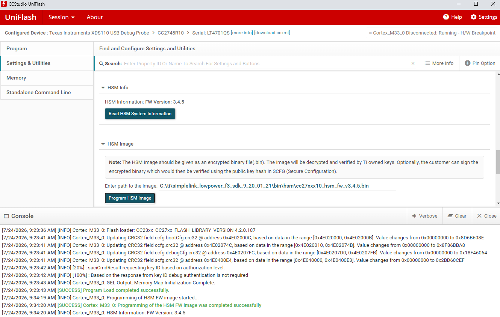

3. Follow the on-screen prompts to complete HSM provisioning. The operation is logged in the UniFlash output console.

Refer to the [CC2745R10-Q1 Quick Start Guide](https://dev.ti.com/tirex/explore/node?isTheia=false&node=A__AC7UNBWx3i6iMAUzzhqKwA__com.ti.SIMPLELINK_LOWPOWER_F3_SDK__58mgN04__LATEST) in TI Resource Explorer for the complete HSM programming procedure, including the required firmware image path within the SimpleLink Low Power F3 SDK.

## Firmware Summary

Duration: 1:00

At this point, all three boards should be flashed:

* **Board 1:** `ot-rcp.out`: Disconnect from the host computer and connect to the Raspberry Pi via USB.
* **Board 2:** `ot-cli-ftd.out`: Keep connected to the host computer.
* **Board 3:** `ot-cli-ftd.out`: Keep connected to the host computer.

Your hardware setup will look like the diagram below. Board 1 connects to the Raspberry Pi as the radio co-processor for the OTBR, while Boards 2 and 3 remain connected to the host computer for serial console access.

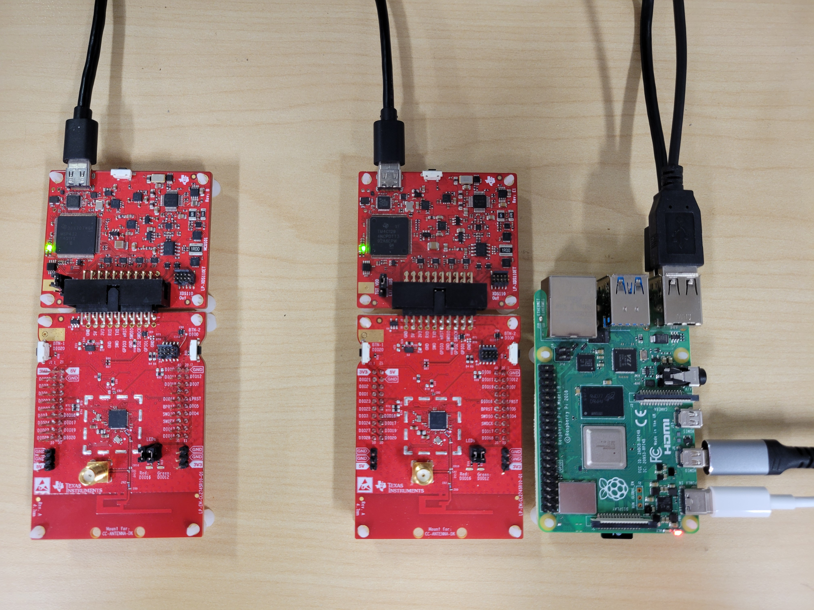

## Set Up Serial Console for ot-cli-ftd Devices

Duration: 3:00

The LP-EM-CC2745R10-Q1 exposes the application UART via USB at **921600 baud**.

Open a serial terminal to the Application UART COM port (Windows) or `/dev/ttyACM*` device (Linux/macOS) for each FTD board using these settings:

| Parameter    | Value    |
| ------------ | -------- |
| Speed (baud) | `921600` |
| Data bits    | `8`      |
| Stop bits    | `1`      |
| Parity       | `None`   |
| Flow control | `None`   |

> aside positive
>
> **Tip (Linux/macOS):** Identify the correct device node by running `ls /dev/ttyACM*` before and after plugging in a board and noting which entry appears. Each LP-EM-CC2745R10-Q1 creates two entries: the lower-numbered port is the XDS110 debug UART and the higher-numbered port is the Application UART. For example, if the board creates `/dev/ttyACM0` and `/dev/ttyACM1`, use `/dev/ttyACM1`.

> aside positive
>
> **Tip (Windows):** Open Device Manager and look under **Ports (COM & LPT)** for two new COM ports when a board is plugged in. The XDS110 debug port typically appears first; use the second (higher-numbered) COM port for the application console.

Press **Enter** in the terminal to get an OpenThread CLI prompt (`>`). For a full list of available commands, see the [OpenThread CLI Reference](https://openthread.io/reference/cli/commands). Verify the FTD is operational:

```console
> state
disabled
Done
```

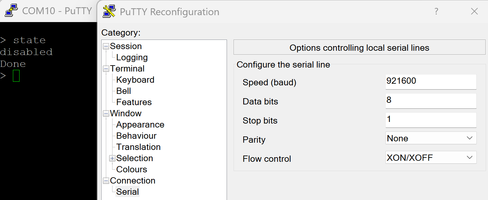

You will not yet set up a serial console for the RCP board. The OTBR on the Raspberry Pi communicates with the RCP directly. In the next step, you will configure the Raspberry Pi as the OpenThread Border Router.

## Set Up the Raspberry Pi as a Border Router

Duration: 30:00

The OTBR is built from [ot-br-posix](https://github.com/openthread/ot-br-posix), the open-source OpenThread Border Router project. The Border Router runs on the Raspberry Pi and uses Board 1 (RCP) as its 802.15.4 radio via USB.

### Raspberry Pi Setup

1. Flash **Raspberry Pi OS** (64-bit Lite or Desktop) to your SD card using [Raspberry Pi Imager](https://www.raspberrypi.com/software/).
2. Boot the Raspberry Pi and open a terminal (via SSH or directly).
3. Update the package manager and upgrade installed packages:

   ```console
   $ sudo apt-get update
   $ sudo apt-get upgrade -y
   ```

> aside positive
>
> **Important:** Reboot the Raspberry Pi after updates before proceeding: `sudo reboot`

### Connect Board 1 (RCP) to the Raspberry Pi

Connect **Board 1** (flashed with `ot-rcp`) to the Raspberry Pi via micro-USB. After connection, verify the device node appears:

```console
$ ls /dev/ttyACM*
/dev/ttyACM0
/dev/ttyACM1
```

The Application UART of the RCP board is typically `/dev/ttyACM1` (the XDS110 debug UART is `/dev/ttyACM0`). Verify which port is the application UART by checking that it responds when the OTBR agent is started in a later step.

> aside positive
>
> **Note:** If other USB serial devices are connected, the device node number may differ. Adjust the path in the OTBR configuration accordingly.

### Build and Install ot-br-posix

On the Raspberry Pi, clone and build ot-br-posix:

```console
$ git clone https://github.com/openthread/ot-br-posix.git
$ cd ot-br-posix
$ ./script/bootstrap
```

Run the setup script, specifying your Ethernet interface as the backbone (infrastructure) interface:

```console
$ INFRA_IF_NAME=eth0 ./script/setup
```

> aside positive
>
> **Note:** `eth0` is the typical name for the wired Ethernet interface. If you are connecting the Raspberry Pi via Wi-Fi instead of Ethernet, replace `eth0` with `wlan0` (and ensure the Pi is already connected to your Wi-Fi network). Verify the active interface name with `ip link show`.

> aside positive
>
> **Note:** The setup script builds ot-br-posix from source, installs the `otbr-agent` and `otbr-web` system services, and configures the networking stack. This process typically takes 10–20 minutes on a Raspberry Pi 4B.

### Configure the OTBR Agent

Edit the OTBR agent configuration file to specify the RCP device path and baud rate:

```console
$ sudo nano /etc/default/otbr-agent
```

Locate the `OTBR_AGENT_OPTS` line and update it to reference the RCP Application UART:

```
OTBR_AGENT_OPTS="-I wpan0 -B eth0 spinel+hdlc+uart:///dev/ttyACM1?uart-baudrate=921600"
```

> aside positive
>
> **Note:** Replace `eth0` with `wlan0` if your Raspberry Pi is connected via Wi-Fi.

> aside positive
>
> **Important:** The LP-EM-CC2745R10-Q1 RCP Application UART operates at **921600 baud**. Verify the device path (`/dev/ttyACM1` in this example) matches the Application UART of your RCP board.

Restart the OTBR agent to apply the configuration:

```console
$ sudo systemctl restart otbr-agent
$ sudo systemctl enable otbr-agent
```

Verify the agent is running:

```console
$ sudo systemctl status otbr-agent
```

### Interact with the RCP Node

Communicate with the RCP node using the `ot-ctl` tool:

```console
$ sudo ot-ctl state
disabled
Done
```

You can monitor the OTBR agent log for connection and status messages:

```console
$ sudo journalctl -u otbr-agent -f
```

Optionally, the OTBR web interface is available at `http://<raspberry-pi-ip>:80` and provides a graphical view of the Thread network.

To stop or restart the OTBR agent:

```console
$ sudo systemctl stop otbr-agent
$ sudo systemctl start otbr-agent
```

At this point you should have three active consoles:

1. Serial terminal for **Board 2** (`ot-cli-ftd 1`) on the host computer.
2. Serial terminal for **Board 3** (`ot-cli-ftd 2`) on the host computer.
3. SSH or terminal session on the Raspberry Pi for `ot-ctl` (OTBR/RCP).

You are now ready to form a Thread network.

## Create a Thread Network

Duration: 10:00

### Set Up RCP (OTBR)

Create a new Thread network from the `ot-ctl` shell on the Raspberry Pi. Enter the following commands in order:

| Index | Command                 | Description                                                  | Expected Response                                                                                                                                                                                                                                                                                                          |
| :---- | ----------------------- | ------------------------------------------------------------ | -------------------------------------------------------------------------------------------------------------------------------------------------------------------------------------------------------------------------------------------------------------------------------------------------------------------------- |
| 1     | `dataset init new`      | Create a new network configuration.                          | Done                                                                                                                                                                                                                                                                                                                       |
| 2     | `dataset commit active` | Commit new dataset to the Active Operational Dataset.        | Done                                                                                                                                                                                                                                                                                                                       |
| 3     | `ifconfig up`           | Enable Thread interface.                                     | Done                                                                                                                                                                                                                                                                                                                       |
| 4     | `thread start`          | Enable and attach Thread protocol operation.                 | Done                                                                                                                                                                                                                                                                                                                       |
|       |                         | Wait 10 seconds for the Thread interface to come up.         |                                                                                                                                                                                                                                                                                                                            |
| 5     | `state`                 | Check the device state. It should be **leader**. Other possible states: offline, disabled, detached, child, router, or leader. | leader<br/>Done                                                                                                                                                                                                                                                                                                            |
| 6     | `dataset`               | View the network configuration. **Your values will differ.** Note the channel, network key, network name, and PAN ID — these are needed to join FTDs to the network. | Active Timestamp: 1<br/>Channel: 20<br/>Channel Mask: 0x07fff800<br/>Ext PAN ID: 39ba71f7fc367160<br/>Mesh Local Prefix: fd5c:c6b:3a17:40b9::/64<br/>Network Key: 81ae2c2c17368d585dee71eaa8cf1e90<br/>Network Name: OpenThread-008c<br/>PAN ID: 0x008c<br/>PSKc: c98f0193d4236025d22dd0ee614e641f<br/>Security Policy: 0, onrcb<br/>Done |

### Add FTDs to the Thread Network (Out-of-Band Method)

Using the out-of-band commissioning method, you provide the network credentials directly. In the serial terminal for **each FTD board**, enter the following commands using the channel and network key from the OTBR dataset output above:

| Index | Command                                               | Description                                                                             | Expected Response |
| :---- | ----------------------------------------------------- | --------------------------------------------------------------------------------------- | ----------------- |
| 1     | `dataset channel 20`                                  | Set the channel to match the OTBR. Replace `20` with your OTBR's channel value.        | Done              |
| 2     | `dataset networkkey 81ae2c2c17368d585dee71eaa8cf1e90` | Set the network key. Replace with your OTBR's network key. Only this key is required to attach. | Done              |
| 3     | `dataset commit active`                               | Commit new dataset to the Active Operational Dataset.                                   | Done              |
| 4     | `ifconfig up`                                         | Enable Thread interface.                                                                | Done              |
| 5     | `thread start`                                        | Enable and attach Thread protocol operation.                                            | Done              |
|       |                                                       | Wait 20 seconds while the device joins and configures itself.                           |                   |
| 6     | `state`                                               | Check device state.                                                                     | child<br/>Done    |

> aside positive
>
> **Note:** Because of the self-configuring nature of Thread networks and these being Full Thread Devices, either or both FTDs may eventually become routers. You can verify the current role at any time with the `state` command.

### Communication Between Thread Devices

Use the `ping` command to verify that devices can communicate. Get the IPv6 addresses of each device with `ipaddr`:

```console
> ipaddr
fd5c:c6b:3a17:40b9:0:ff:fe00:fc00		# Leader Anycast Locator (ALOC)
fd5c:c6b:3a17:40b9:0:ff:fe00:1800		# Routing Locator (RLOC)
fd5c:c6b:3a17:40b9:84e2:bae8:bd5b:fa03		# Mesh-Local EID (ML-EID)
fe80:0:0:0:c449:ca4a:101f:5d16			# Link-Local Address (LLA)
Done
```

From both FTDs, ping the OTBR using its RLOC address:

```console
> ping fd5c:c6b:3a17:40b9:0:ff:fe00:1800
Done
>
> 16 bytes from fd5c:c6b:3a17:40b9:0:ff:fe00:1800: icmp_seq=3 hlim=64 time=30ms
16 bytes from fd5c:c6b:3a17:40b9:0:ff:fe00:1800: icmp_seq=3 hlim=64 time=52ms
```

A successful response confirms the Thread network is operating and devices can communicate. Repeat the process to ping each FTD from the OTBR (`sudo ot-ctl ping <ftd-ipv6-address>`).

## Congratulations

Duration: 1:00

**You've created a Thread network with TI CC2745R10-Q1 boards!**

You now know:

* How to set up the TI ot-ti build environment.
* How to build and flash OpenThread CLI binaries to the LP-EM-CC2745R10-Q1 LaunchPad.
* How to set up a Raspberry Pi as an OpenThread Border Router (OTBR) using ot-br-posix.
* How to create a Thread network on the OTBR.
* Out-of-band commissioning of devices onto a Thread network.
* How to verify Thread communication between nodes using the ping command.

### Further Reading

Check out [openthread.io](https://openthread.io/) and [GitHub](https://github.com/openthread) for a variety of OpenThread resources, including:

* [Supported Platforms](https://openthread.io/platforms/) — discover all the platforms that support OpenThread

* [Build OpenThread](../../guides/build/index.md) — further details on building and configuring OpenThread

* [Thread Primer](../../guides/thread-primer/index.md) — covers all the Thread concepts featured in this codelab

* [TI ot-ti Repository](https://github.com/TexasInstruments/ot-ti) — TI's OpenThread implementation for SimpleLink devices, with build instructions and release notes

* [CC2745R10-Q1 Product Page](https://www.ti.com/product/CC2745R10-Q1) — device datasheet, reference designs, and other documentation

* [LP-EM-CC2745R10-Q1 LaunchPad](https://www.ti.com/tool/LP-EM-CC2745R10-Q1) — evaluation board user guide and hardware files

* [OpenThread CLI Reference](https://openthread.io/reference/cli) — overview of the OpenThread CLI and its usage

* [OpenThread CLI Commands](https://openthread.io/reference/cli/commands) — complete reference for all OpenThread CLI commands

* [TI E2E Community — Thread & Zigbee](https://e2e.ti.com/support/wireless-connectivity/zigbee-and-thread) — technical support community for TI wireless connectivity products

## License

Copyright (c) 2021-2024, The OpenThread Authors.
All rights reserved.

Redistribution and use in source and binary forms, with or without
modification, are permitted provided that the following conditions are met:

1. Redistributions of source code must retain the above copyright
   notice, this list of conditions and the following disclaimer.
2. Redistributions in binary form must reproduce the above copyright
   notice, this list of conditions and the following disclaimer in the
   documentation and/or other materials provided with the distribution.
3. Neither the name of the copyright holder nor the
   names of its contributors may be used to endorse or promote products
   derived from this software without specific prior written permission.

THIS SOFTWARE IS PROVIDED BY THE COPYRIGHT HOLDERS AND CONTRIBUTORS "AS IS"
AND ANY EXPRESS OR IMPLIED WARRANTIES, INCLUDING, BUT NOT LIMITED TO, THE
IMPLIED WARRANTIES OF MERCHANTABILITY AND FITNESS FOR A PARTICULAR PURPOSE
ARE DISCLAIMED. IN NO EVENT SHALL THE COPYRIGHT HOLDER OR CONTRIBUTORS BE
LIABLE FOR ANY DIRECT, INDIRECT, INCIDENTAL, SPECIAL, EXEMPLARY, OR
CONSEQUENTIAL DAMAGES (INCLUDING, BUT NOT LIMITED TO, PROCUREMENT OF
SUBSTITUTE GOODS OR SERVICES; LOSS OF USE, DATA, OR PROFITS; OR BUSINESS
INTERRUPTION) HOWEVER CAUSED AND ON ANY THEORY OF LIABILITY, WHETHER IN
CONTRACT, STRICT LIABILITY, OR TORT (INCLUDING NEGLIGENCE OR OTHERWISE)
ARISING IN ANY WAY OUT OF THE USE OF THIS SOFTWARE, EVEN IF ADVISED OF THE
POSSIBILITY OF SUCH DAMAGE.
