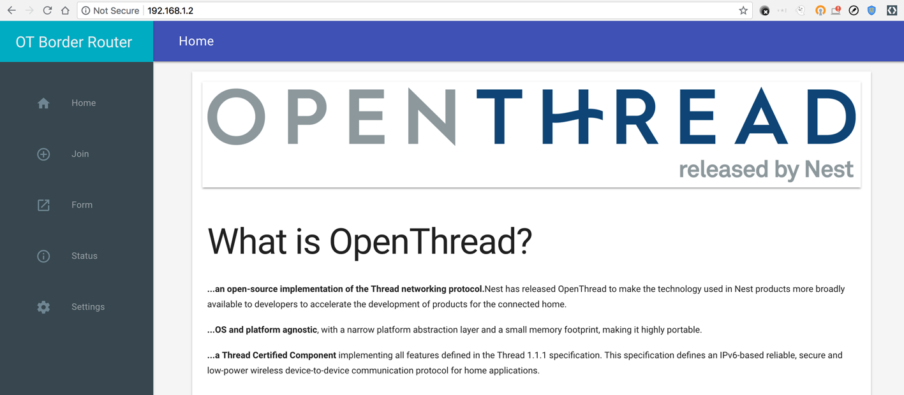

# Test Connectivity

Once you have started OTBR Docker, form a Thread network and test its
connectivity to the internet.

## Step 1: Form the Thread Network

<figure class="attempt-right">

</figure>

On the machine running OTBR Docker:

Open a browser window and navigate to 127.0.0.1:8080. If OTBR Docker is running correctly, the OTBR Web GUI loads.
    
Select the "Form" menu option and change some of the default credentials. We recommend leaving the default Channel and On-Mesh Prefix values. Whatever you use, make a note of them so you can test a separate Thread node later.

| Parameter | Sample Value |
| ---- | ---- |
| Network name | OTBR4444 |
| PAN ID | 0x4444 |
| Network Key | 33334444333344443333444433334444 |
| Extended PAN ID | 3333333344444444 |
| Passphrase | 444444 |
| Channel | 15 |
| On-Mesh Prefix | fd11:22:: |

Select **FORM** to form the Thread network. Check the output in the terminal window running OTBR Docker. You should see `otbr-agent` log output for the addition of the on-mesh prefix and a SLAAC address:

```
otbr-agent[224]: [INFO]-CLI-----: execute command: prefix add fd11:22::/64 pasor
```

This output is required for internet connectivty for the Thread network.

## Step 2: Bring up a second Thread node

With OTBR Docker up and running, add a standalone Thread node to the Thread
network and test that it has connectivity to the internet.

If using a physical RCP with OTBR Docker, use a second physical Thread node to
test. If using a simulated RCP with OTBR Docker, use a second simulated node to
test.

### Physical Thread node

Build and flash a standalone Thread node on the [supported platform](https://openthread.io/platforms)
of your choice. This node does not have to be built with any specific build
switches.

See [Build OpenThread](../../../guides/build.md) for basic building instructions.

See the [Build a Thread network with nRF52840 boards and OpenThread
Codelab](https://codelabs.developers.google.com/codelabs/openthread-hardware/#0) for 
detailed instructions on building and flashing the Nordic nRF52840 platform.

1.  After building and flashing, attach the Thread device to the machine running
    OTBR Docker via USB. Use `screen` in a new terminal window to access the
    CLI. For example, if the device is mounted on port `/dev/ttyACM1`:
    ```
    $ screen /dev/ttyACM1 115200
    ```

1.  Press the **Enter** key to bring up the `>` OpenThread CLI prompt.

### Simulated Thread node

1.  Open a new terminal window on the machine running OTBR Docker.

1.  Start the CLI application to bring up a simulated node:
    ```
    $ cd ~/openthread
    $ ./output/simulation/bin/ot-cli-ftd 2
    ```

1.  Press the **Enter** key to bring up the `>` OpenThread CLI prompt.

## Step 3: Join the second node to the Thread network

Using the OpenThread CLI for your physical or simulated Thread node, join the
node to the Thread network created by OTBR Docker.

> Caution: Only the commissioner included with OTBR is supported with Docker. 
The Thread Commissioning App is not supported.

1.  Update the Thread network credentials for the node, using the minimum
    required values from OTBR Docker:
    ```
    > dataset masterkey 33334444333344443333444433334444
    Done
    > dataset commit active
    Done
    ```
    
1. Bring up the Thread interface and start Thread:
    ```
    > ifconfig up
    Done
    > thread start
    Done
    ```

1.  The node should join the OTBR Thread network automatically. Within two
    minutes its state should be `router`:
    ```
    > state
    router
    ```
    
1.  Check the node's IP addresses to ensure it has an IPv6 address with the
    on-mesh prefix of `fd11:22::/64` as specified during Thread network
    formation:
    ```
    > ipaddr
    fd11:22:0:0:614e:4588:57a1:a473
    fd33:3333:3344:0:0:ff:fe00:f801
    fd33:3333:3344:0:1b5f:db5:ecac:a9e
    fe80:0:0:0:e0c4:5304:5404:5f70:98cd
    ```
    
## Step 4: Ping a public address

You should be able to a ping a public IPv4 address from the standalone Thread
node at this point. Since Thread only uses IPv6, to ping a public IPv4 address
you must translate it to IPv6 and combine it with the well-known prefix of
`64:ff9b::/64` used by Network Address Translation (NAT) in OTBR.

For more information on how NAT is configured in OTBR, see [Configure
NAT](../../../guides/border-router/access-point.md#configure-nat).

1.  To get a translated IPv4 address, use a website like
    [findipv6.com](https://findipv6.com/ipv4-toipv6/).

1.  Translate the IPv4 address you wish to test. For example, `172.217.164.110`
    translated to IPv6 is `::ffff:acd9:a46e`.

1.  Using only the last 4 bytes of the resulting IPv6 address, combine it with
    the well-known prefix of `64:ff9b::/64` to get a new IPv6 address:
    ```
    64:ff9b::acd9:a46e
    ```

1.  Ping this new IPv6 address from the CLI of the standalone Thread node to
    test it's internet connectivity. Pinging this address is akin to pinging the
    original IPv4 address:
    ```
    > ping 64:ff9b::acd9:a46e
    16 bytes from 64:ff9b:0:0:0:0:acd9:a46e: icmp_seq=1 hlim=118 time=45ms
    ```

Success! The second Thread node can now communicate with the internet, through
OTBR Docker.

> Note: This configuration only illustrates public internet connectivity using
IPv4 and NAT64. Direct public connectivity to IPv6 addresses requires
additional configuration of a public IPv6 address or prefix for the OTBR Docker
container, which is out of scope for this guide.

## License

Copyright (c) 2021, The OpenThread Authors.
All rights reserved.

Redistribution and use in source and binary forms, with or without
modification, are permitted provided that the following conditions are met:
1. Redistributions of source code must retain the above copyright
   notice, this list of conditions and the following disclaimer.
2. Redistributions in binary form must reproduce the above copyright
   notice, this list of conditions and the following disclaimer in the
   documentation and/or other materials provided with the distribution.
3. Neither the name of the copyright holder nor the
   names of its contributors may be used to endorse or promote products
   derived from this software without specific prior written permission.

THIS SOFTWARE IS PROVIDED BY THE COPYRIGHT HOLDERS AND CONTRIBUTORS "AS IS"
AND ANY EXPRESS OR IMPLIED WARRANTIES, INCLUDING, BUT NOT LIMITED TO, THE
IMPLIED WARRANTIES OF MERCHANTABILITY AND FITNESS FOR A PARTICULAR PURPOSE
ARE DISCLAIMED. IN NO EVENT SHALL THE COPYRIGHT HOLDER OR CONTRIBUTORS BE
LIABLE FOR ANY DIRECT, INDIRECT, INCIDENTAL, SPECIAL, EXEMPLARY, OR
CONSEQUENTIAL DAMAGES (INCLUDING, BUT NOT LIMITED TO, PROCUREMENT OF
SUBSTITUTE GOODS OR SERVICES; LOSS OF USE, DATA, OR PROFITS; OR BUSINESS
INTERRUPTION) HOWEVER CAUSED AND ON ANY THEORY OF LIABILITY, WHETHER IN
CONTRACT, STRICT LIABILITY, OR TORT (INCLUDING NEGLIGENCE OR OTHERWISE)
ARISING IN ANY WAY OUT OF THE USE OF THIS SOFTWARE, EVEN IF ADVISED OF THE
POSSIBILITY OF SUCH DAMAGE.

