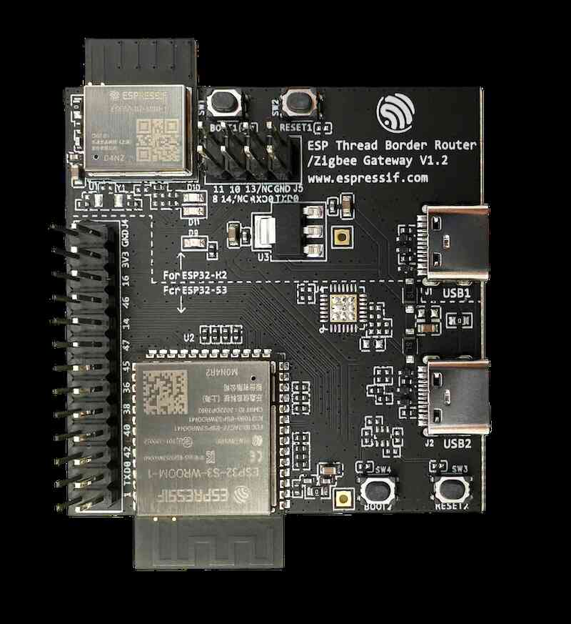

# ESP Thread Border Router

Contributor: https://github.com/gjc13
Contributor: https://github.com/zwx1995esp

ESP Thread border router is a FreeRTOS-based implementation running on a combination of Espressif's Wi-Fi and 802.15.4 SoCs.

Hardware requirements:

Espressif provides an [ESP Border Router Board](https://www.espressif.com/en/news/Thread_Border_Router_Certification) which integrates the host SoC (ESP32-S3) and the RCP (ESP32-H2) into one module.

You only need to connect the board to the ESP32-S3 (main SoC) port. The main SoC automatically programs the Thread co-processor.

## Hardware platforms

<figure>
<a href="../../guides/images/otbr-esp-br-board.jpg"></a><figcaption>ESP Thread Border Router Board</figcaption>
</figure>
<br/>

## Step 1: Set up Repositories

> Note: This guide is specific to Linux/macOS.

To set up the environment and for information specific to Windows, please follow the [official installation guide](https://docs.espressif.com/projects/esp-idf/en/stable/esp32s3/get-started/index.html#installation-step-by-step).

Clone the [esp-idf](https://github.com/espressif/esp-idf) and the [esp-thread-br](https://github.com/espressif/esp-thread-br) repository.

```
$ git clone -b v5.1.2 --recursive https://github.com/espressif/esp-idf.git
$ cd esp-idf
$ ./install.sh
$ . ./export.sh
$ cd ..
$ git clone -b v1.0 --recursive https://github.com/espressif/esp-thread-br.git
```

> Note: The `esp-thread-br` branch v1.0 with the `esp-idf` branch v5.1.2 is one of the release versions. For the latest version of `esp-thread-br`, please refer to [ESP Thread Border Router Codelab: 2.1.1. Set up the Repositories](https://docs.espressif.com/projects/esp-thread-br/en/latest/dev-guide/build_and_run.html#set-up-the-repositories).

## Step 2: Configure the Thread and the Wi-Fi network

The border router will automatically join the Wi-Fi network and create a new Thread network if there is not one in its storage.
The network parameters can be configured in the config menu:

```
$ cd esp-thread-br/examples/basic_thread_border_router
$ idf.py menuconfig
```

The network configuration items are:

* Enable automatic start mode in Thread Border Router: **ESP Thread Border Router Example > Enable the automatic start mode in Thread Border Router.**
* Wi-Fi SSID and PSK: **Example Connection Configuration > connect using Wi-Fi interface**
* Thread network parameters: **Component config > OpenThread > Thread Operational Dataset**


## Step 3: Build and run the border router

Build the `esp-idf/examples/openthread/ot_rcp` example. The firmware doesn't need to be explicitly flashed to a device. It will be included in the Border Router firmware and flashed to the ESP32-H2 chip upon first boot (or the RCP firmware changed).
```
$ cd ${IDF_PATH}/examples/openthread/ot_rcp
$ idf.py set-target esp32h2
$ idf.py build
```

Then go back to the `basic_thread_border_router` example folder.
```
$ cd esp-thread-br/examples/basic_thread_border_router
$ idf.py set-target esp32s3
$ idf.py build
$ idf.py -p <your-local-port> flash monitor
```

Now you'll see the border router output in the ESP32S3 monitor. It also provides an interactive OpenThread command line:

```
> state
leader
Done
>
```

## Supported features

* Border agent for external commissioners.
* IPv6 bidirectional connectivity.
* SRP service registration and advertising proxy.
* mDNS discovery proxy.
* NAT64.
* Multicast forwarding.
* Web GUI based REST API.
* OTA.

For more using of the ESP Thread Border Router, you can refer to [ESP Thread Border Router Codelab](https://docs.espressif.com/projects/esp-thread-br/en/latest/codelab/index.html)

## License

Copyright (c) 2021, The OpenThread Authors.
All rights reserved.

Redistribution and use in source and binary forms, with or without
modification, are permitted provided that the following conditions are met:
1. Redistributions of source code must retain the above copyright
   notice, this list of conditions and the following disclaimer.
2. Redistributions in binary form must reproduce the above copyright
   notice, this list of conditions and the following disclaimer in the
   documentation and/or other materials provided with the distribution.
3. Neither the name of the copyright holder nor the
   names of its contributors may be used to endorse or promote products
   derived from this software without specific prior written permission.

THIS SOFTWARE IS PROVIDED BY THE COPYRIGHT HOLDERS AND CONTRIBUTORS "AS IS"
AND ANY EXPRESS OR IMPLIED WARRANTIES, INCLUDING, BUT NOT LIMITED TO, THE
IMPLIED WARRANTIES OF MERCHANTABILITY AND FITNESS FOR A PARTICULAR PURPOSE
ARE DISCLAIMED. IN NO EVENT SHALL THE COPYRIGHT HOLDER OR CONTRIBUTORS BE
LIABLE FOR ANY DIRECT, INDIRECT, INCIDENTAL, SPECIAL, EXEMPLARY, OR
CONSEQUENTIAL DAMAGES (INCLUDING, BUT NOT LIMITED TO, PROCUREMENT OF
SUBSTITUTE GOODS OR SERVICES; LOSS OF USE, DATA, OR PROFITS; OR BUSINESS
INTERRUPTION) HOWEVER CAUSED AND ON ANY THEORY OF LIABILITY, WHETHER IN
CONTRACT, STRICT LIABILITY, OR TORT (INCLUDING NEGLIGENCE OR OTHERWISE)
ARISING IN ANY WAY OUT OF THE USE OF THIS SOFTWARE, EVEN IF ADVISED OF THE
POSSIBILITY OF SUCH DAMAGE.
