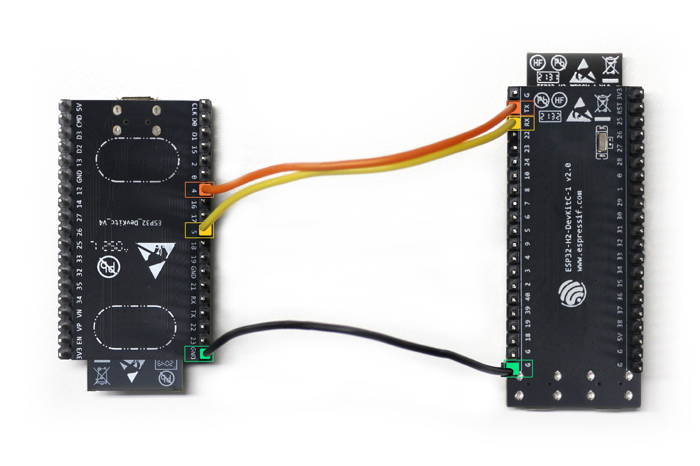

# ESP Thread Border Router

Contributor: https://github.com/gjc13

ESP Thread border router is a FreeRTOS-based implementation running on a combination of Espressif's Wi-Fi and 802.15.4 SoCs.

Hardware requirements:

* An ESP32 series Wi-Fi dev kit. (ESP32, ESP32-C3, ESP32-S2 or ESP32-S3)
* An [ESP32-H2](https://www.espressif.com/en/news/ESP32_H2) dev kit for running RCP.

## Hardware connection

The ESP32-H2 RCP will be connected to the border router via UART.

<figure>
<a href="../../guides/images/otbr-esp-connection.jpg"></a><figcaption>ESP32-H2 UART connection</figcaption>
</figure>
<br/>

* Connect the ground PIN of ESP32 and ESP32-H2
* Connect PIN 4 of ESP32 to PIN TX of ESP32-H2
* Connect PIN 5 of ESP32 to PIN RX of ESP32-H2

## Step 1: Set up ESP-IDF

The code for running the ESP Thread border router is shipped with the Espressif development framework, ESP-IDF.

To set up the environment, please follow the [official installation guide](https://docs.espressif.com/projects/esp-idf/en/stable/esp32/get-started/index.html#installation-step-by-step).

## Step 2: Build and flash the RCP

```
cd ${IDF_PATH}/examples/openthread/ot_rcp
idf.py --preview set-target esp32h2
idf.py build flash
```

## Step 3: Configure the Thread and the Wi-Fi network

The border router will automatically join the Wi-Fi network and create a new Thread network if there is not one in its storage.
The network parameters can be configured in the config menu:

```
cd ${IDF_PATH}/examples/openthread/ot_br
idf.py menuconfig
```

The network configuration items are:
* Wi-Fi SSID and PSK: **Example Connection Configuration > connect using Wi-Fi interface**
* Thread network parameters: **OpenThread network parameters**


## Step 4: Build and run the border router

```
cd ${IDF_PATH}/examples/openthread/ot_br
idf.py build flash monitor
```

Now you'll see the border router output in the ESP32 monitor. It also provides an interactive OpenThread command line:

```
> state
I(23374) OPENTHREAD:[INFO]-CLI-----: execute command: state
leader
Done
>
```

## Supported features

* Border agent for external commissioners.
* IPv6 bidirectional connectivity.
* SRP service registration and advertising proxy.
* mDNS discovery proxy.

To set up a SRP client on a Thread end device and reach it from the Wi-Fi network, follow the border router codelab from [step 4](https://openthread.io/codelabs/openthread-border-router#3).

Note that all the `ot-ctl` commands in the codelab need to be directly entered in the border router's command line.

For instance, for this command:

```
$ sudo ot-ctl dataset active -x
0e080000000000010000000300001235060004001fffe002083d3818dc1c8db63f0708fda85ce9df1e662005101d81689e4c0a32f3b4aa112994d29692030f4f70656e5468726561642d35326532010252e204103f23f6b8875d4b05541eeb4f9718d2f40c0302a0ff
Done
```

You would enter:

```
> dataset active -x
I(13893332) OPENTHREAD:[INFO]-CLI-----: execute command: dataset active -x
0e080000000000010000000300001235060004001fffe002083d3818dc1c8db63f0708fda85ce9df1e662005101d81689e4c0a32f3b4aa112994d29692030f4f70656e5468726561642d35326532010252e204103f23f6b8875d4b05541eeb4f9718d2f40c0302a0ff
Done
```

## License

Copyright (c) 2021, The OpenThread Authors.
All rights reserved.

Redistribution and use in source and binary forms, with or without
modification, are permitted provided that the following conditions are met:
1. Redistributions of source code must retain the above copyright
   notice, this list of conditions and the following disclaimer.
2. Redistributions in binary form must reproduce the above copyright
   notice, this list of conditions and the following disclaimer in the
   documentation and/or other materials provided with the distribution.
3. Neither the name of the copyright holder nor the
   names of its contributors may be used to endorse or promote products
   derived from this software without specific prior written permission.

THIS SOFTWARE IS PROVIDED BY THE COPYRIGHT HOLDERS AND CONTRIBUTORS "AS IS"
AND ANY EXPRESS OR IMPLIED WARRANTIES, INCLUDING, BUT NOT LIMITED TO, THE
IMPLIED WARRANTIES OF MERCHANTABILITY AND FITNESS FOR A PARTICULAR PURPOSE
ARE DISCLAIMED. IN NO EVENT SHALL THE COPYRIGHT HOLDER OR CONTRIBUTORS BE
LIABLE FOR ANY DIRECT, INDIRECT, INCIDENTAL, SPECIAL, EXEMPLARY, OR
CONSEQUENTIAL DAMAGES (INCLUDING, BUT NOT LIMITED TO, PROCUREMENT OF
SUBSTITUTE GOODS OR SERVICES; LOSS OF USE, DATA, OR PROFITS; OR BUSINESS
INTERRUPTION) HOWEVER CAUSED AND ON ANY THEORY OF LIABILITY, WHETHER IN
CONTRACT, STRICT LIABILITY, OR TORT (INCLUDING NEGLIGENCE OR OTHERWISE)
ARISING IN ANY WAY OUT OF THE USE OF THIS SOFTWARE, EVEN IF ADVISED OF THE
POSSIBILITY OF SUCH DAMAGE.
