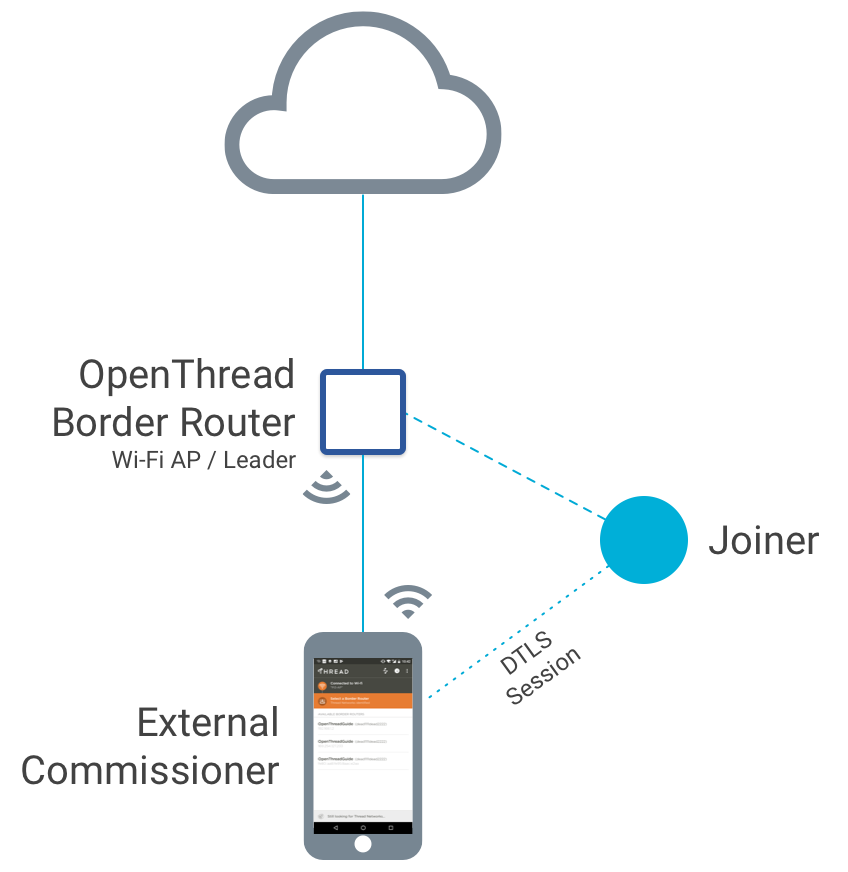

# External Thread Commissioning

<figure class="attempt-right">
<a href="../images/thread-commissioning.png"></a>
</figure>

OpenThread Border Router (OTBR) features a Thread Border Agent, which supports
external Thread Commissioning. In external Thread Commissioning, a device
outside of the Thread network (for example, a mobile phone) commissions new
devices onto the network.

The Thread Commissioner serves to authenticate a user (external Commissioner) or
a Thread device onto the Thread network. After authentication, the Commissioner
instructs the Border Router to transfer Thread network credentials, such as the
network key, to the device directly.

This is an example of in-band commissioning, where Thread network credentials
are transferred between devices over the radio.

**Key Point:** During commissioning, the Thread Commissioner never gains
possession of the network key.

This guide details how to commission an OpenThread device onto a network created
and managed by the OTBR Web GUI, using one of the following external
Commissioners:  

* [OT Commissioner CLI](/guides/commissioner)
* [OT Commissioner App for Android]({{ github_otc }}/android){:target="_blank"}
* [Thread Commissioning App for Android](https://play.google.com/store/apps/details?id=org.threadgroup.commissioner&hl=en){:target="_blank"}

To learn how to commission without an external Commissioner, see
[Thread Commissioning](/guides/build/commissioning).

## Build OTBR 

To commission a device, first you'll need to [build your OTBR](https://openthread.io/guides/border-router/build).

## Form the Thread network

Now that you've set up your border router and verified the OTBR services, it's
time to form the Thread network.

### Web GUI

The recommended way to form a Thread network is via the [OTBR Web
GUI](https://openthread.io/guides/border-router/web-gui). When doing so, change
all the default values on the **Form** menu option, except for the On-Mesh
Prefix.

Make note of the **Passphrase** used. This passphrase is the Commissioner
Credential and is used (along with the Extended PAN ID and Network Name) to
generate the Pre-Shared Key for the Commissioner (PSKc). The PSKc is needed to
authenticate the Thread Commissioner (the external device) to the network.

**Note:** The Commissioner Credential is a user-defined string between 6
and 255 characters, UTF-8 encoded.

### Manual

The Thread network can also be formed manually on the command line of
OpenThread POSIX, using `ot-ctl`.

1.  Initialize a new operational dataset:

    ``` 
    $ sudo ot-ctl dataset init new
    Done
    ```
   
1.  Set the network credentials:

    ```  
    $ sudo ot-ctl dataset panid 0xdead
    Done
    ```
        
    ```
    $ sudo ot-ctl dataset extpanid dead1111dead2222
    Done
    ```
        
    ```
    $ sudo ot-ctl dataset networkname OpenThreadGuide
    Done
    ```
    
    ```       
    $ sudo ot-ctl dataset networkkey 11112233445566778899DEAD1111DEAD
    Done
    ```

1.  Generate a hex-encoded PSKc by using a Passphrase (Commissioner Credential),
    the Extended PAN ID, and the Network Name with the PSKc Generator tool on
    the OTBR. Make sure to use the same Extended PAN ID and Network Name that
    was used in the operational dataset:
    
    ```
    $ cd ~/ot-br-posix/build/otbr/tools
    $ ./pskc J01NME DEAD1111DEAD2222 OpenThreadGuide
    198886f519a8fd7c981fee95d72f4ba7
    ```
    
1.  Set the PSKc:

    ```
    $ sudo ot-ctl dataset pskc 198886f519a8fd7c981fee95d72f4ba7</code>
    Done
    ```
    
1.  Commit the active dataset, set the on-mesh prefix, and form the Thread
    network:

    ```
    $ sudo ot-ctl dataset commit active
    Done
    ```

    ```
    $ sudo ot-ctl prefix add fd11:22::/64 pasor
    Done
    ```
    
    ```
    $ sudo ot-ctl ifconfig up
    Done 
    ```

    ```
    $ sudo ot-ctl thread start
    Done
    ```
    
    ```
    $ sudo ot-ctl netdata register
    Done
    ```
    
1.  Confirm the network configuration:

    ```
    $ sudo ot-ctl state
    leader
    Done
    ```
    
    ```
    $ sudo ot-ctl pskc
    198886f519a8fd7c981fee95d72f4ba7
    Done
    ```

## Prepare the Joiner device

Build and flash a device with OpenThread, to function as the Joiner. For an
overview of building OpenThread, see the [Building Guide](../build/index.md).

Use the `-DOT_JOINER=ON` build option to enable the Joiner role.

For example, to build the CC2538 example platform for use as a Joiner:

```
$ ./script/build -DOT_JOINER=ON
```

Specific instructions on building supported platforms with GNU Autotools can be
found in each example's
[platform folder](https://github.com/openthread/openthread/tree/master/examples/platforms).

Once the Joiner device is ready, obtain its factory-assigned IEEE EUI-64. Use
the `eui64` command in the OpenThread CLI:

```
> eui64
0000b57fffe15d68
Done
```

## Commission the Joiner device

To commission your new device with an external Commissioner, you have several options. You can use the OT Commissioner CLI from the same host machine as your OTBR, or you can commission your Joiner using the OT Commissioner App for Android. To learn more about these options, refer to the following guides:

* [OT Commissioner CLI](/guides/commissioner)
* [OT Commissioner App for Android]({{ github_otc }}/android){:target="_blank"}

If you're running a Thread 1.1 network, you can use Thread Group's Thread 1.1 Commissioning App for Android.
