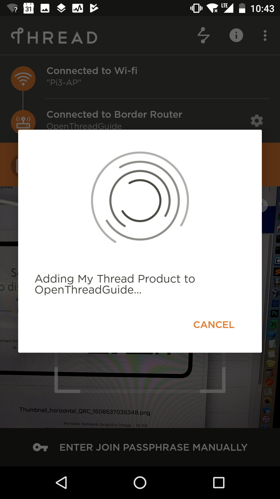

# External Commissioning for Android

External commissioning is supported by the OT Commissioner Android App, available
on the [ot-commissioner GitHub repository](https://github.com/openthread/ot-commissioner/tree/master/android). Follow the instructions
in the README to build and install the app on an Android device.

To use the Thread 1.1 Commissioning App, refer to [Thread Group Android App](#thread-group-android-app).

> Note: The OT Commissioner Android App is only available for Android.

## OT Commissioner Android App

### Connect to the Border Router

<figure class="attempt-right">

</figure>

1.  With both devices on the same network, connect the device with the OT
    Commissioner Android App to the Border Router.
1.  Open the OT Commissioner Android App and select the desired Border
    Router from the available list. The name is the same as the Thread network
    created by the OTBR Web GUI.
1.  Enter the Passphrase (Commissioner Credential) set in the OTBR Web GUI (and
    used to generate the PSKc) when prompted for a password.

### Commission the Joiner

Once connected to the Border Router, the app provides the option to scan a
Connect QR Code or enter a Join Passphrase manually. The Join Passphrase is also
called the Joiner Credential, and is used (along with the Extended PAN ID and
Network Name) to generate the Pre-Shared Key for the Device (PSKd). The PSKd is
then used to authenticate a device during Thread Commissioning. The Joiner
Credential should be unique to each device.

Thread Connect QR Codes are created with the following text string format:

<pre>v=1&&eui=0000b57fffe15d68&&cc=J01NU5</pre>

Where `eui` is the Joiner device's EUI64 value and `cc` is the Joiner
Credential. Use this text string with an online QR Code generator to create a QR
Code for scanning.

> Note: The Joiner Credential is a device-specific string of all uppercase
alphanumeric characters (0-9 and A-Y, excluding I, O, Q, and Z for readability),
with a length between 6 and 32 characters.

<figure class="attempt-right">

</figure>

1.  In the OT Commissioner Android App, scan the Connect QR Code of the Joiner
    device, or enter the EUI64 and Joiner Credential manually. This generates the
    PSKd, propagates the steering data through the Thread network, and establishes
    a DTLS session.
1.  While the app is waiting, enter the OpenThread CLI on the Joiner device and
    start the Joiner role with that same Joiner Credential:
    
        > ifconfig up
        Done
        > joiner start J01NU5
        Done
    
1.  Wait a minute for the DTLS handshake to complete between the Commissioner
    and Joiner:
    
        > 
        Join success!
    
1.  The OT Commissioner Android App also updates with an "Commission Succeed"
    confirmation message.

The Joiner has obtained the Thread network credentials, and can now join the
network.

## Thread Group Android App

Thread 1.1 external commissioning is supported by the [Thread 1.1 Commissioning App](https://play.google.com/store/apps/details?id=org.threadgroup.commissioner&hl=en), available for download at the Google
Play Store for Android devices.

> Note: The Thread 1.1 Commissioning App is only available for Android.

### Connect to the Border Router

<figure class="attempt-right">

</figure>

1.  With both devices on the same network, connect the device with the
    Thread Group Android App to the Border Router.
1.  Open the Thread Group Android App and select the desired Border
    Router from the available list. The name is the same as the Thread network
    created by the OTBR Web GUI.
1.  Enter the Passphrase (Commissioner Credential) set in the OTBR Web GUI (and
    used to generate the PSKc) when prompted for a password.

### Commission the Joiner

Once connected to the Border Router, the app provides the option to scan a
Connect QR Code or enter a Join Passphrase manually. The Join Passphrase is also
called the Joiner Credential, and is used (along with the Extended PAN ID and
Network Name) to generate the Pre-Shared Key for the Device (PSKd). The PSKd is
then used to authenticate a device during Thread Commissioning. The Joiner
Credential should be unique to each device.

Thread Connect QR Codes are created with the following text string format:

<pre>v=1&&eui=0000b57fffe15d68&&cc=J01NU5</pre>

Where `eui` is the Joiner device's EUI64 value and `cc` is the Joiner
Credential. Use this text string with an online QR Code generator to create a QR
Code for scanning.

> Note: The Joiner Credential is a device-specific string of all uppercase
alphanumeric characters (0-9 and A-Y, excluding I, O, Q, and Z for readability),
with a length between 6 and 32 characters.

<figure class="attempt-right">

</figure>

1.  In the Thread Group Android App, scan the Connect QR Code of the Joiner
    device, or enter the EUI64 and Joiner Credential manually. This generates the
    PSKd, propagates the steering data through the Thread network, and establishes
    a DTLS session.
1.  While the app is waiting, enter the OpenThread CLI on the Joiner device and
    start the Joiner role with that same Joiner Credential:
    
        > ifconfig up
        Done
        > joiner start J01NU5
        Done
    
1.  Wait a minute for the DTLS handshake to complete between the Commissioner
    and Joiner:
    
        > 
        Join success!
    
1.  The Thread Group Android App also updates with an "Added My Thread Product"
    confirmation message.

The Joiner has obtained the Thread network credentials, and can now join the
network.

### Thread Commissioning App troubleshooting

You may encounter issues with the Thread Commissioning App, due to changed or
stale network information. The app retains OTBR network information locally and
does not always prompt for updates.

To resolve these issues, delete all local application data, restart the app, and
try the commissioning process again.

To delete local application data:

1.  On the Android device, open the Settings app
1.  Go to **Apps & notifications** > **App info** > **Thread** > **Storage**
1.  Select **CLEAR DATA**
1.  Go back to **App info** and select **FORCE STOP**
1.  Close the Settings app and restart the Thread app

## Join after commissioning

Next, on the Joiner device, [join the Thread network after commissioning](join-after.md) and test network connectivity.

## License

Copyright (c) 2021, The OpenThread Authors.
All rights reserved.

Redistribution and use in source and binary forms, with or without
modification, are permitted provided that the following conditions are met:
1. Redistributions of source code must retain the above copyright
   notice, this list of conditions and the following disclaimer.
2. Redistributions in binary form must reproduce the above copyright
   notice, this list of conditions and the following disclaimer in the
   documentation and/or other materials provided with the distribution.
3. Neither the name of the copyright holder nor the
   names of its contributors may be used to endorse or promote products
   derived from this software without specific prior written permission.

THIS SOFTWARE IS PROVIDED BY THE COPYRIGHT HOLDERS AND CONTRIBUTORS "AS IS"
AND ANY EXPRESS OR IMPLIED WARRANTIES, INCLUDING, BUT NOT LIMITED TO, THE
IMPLIED WARRANTIES OF MERCHANTABILITY AND FITNESS FOR A PARTICULAR PURPOSE
ARE DISCLAIMED. IN NO EVENT SHALL THE COPYRIGHT HOLDER OR CONTRIBUTORS BE
LIABLE FOR ANY DIRECT, INDIRECT, INCIDENTAL, SPECIAL, EXEMPLARY, OR
CONSEQUENTIAL DAMAGES (INCLUDING, BUT NOT LIMITED TO, PROCUREMENT OF
SUBSTITUTE GOODS OR SERVICES; LOSS OF USE, DATA, OR PROFITS; OR BUSINESS
INTERRUPTION) HOWEVER CAUSED AND ON ANY THEORY OF LIABILITY, WHETHER IN
CONTRACT, STRICT LIABILITY, OR TORT (INCLUDING NEGLIGENCE OR OTHERWISE)
ARISING IN ANY WAY OUT OF THE USE OF THIS SOFTWARE, EVEN IF ADVISED OF THE
POSSIBILITY OF SUCH DAMAGE.
