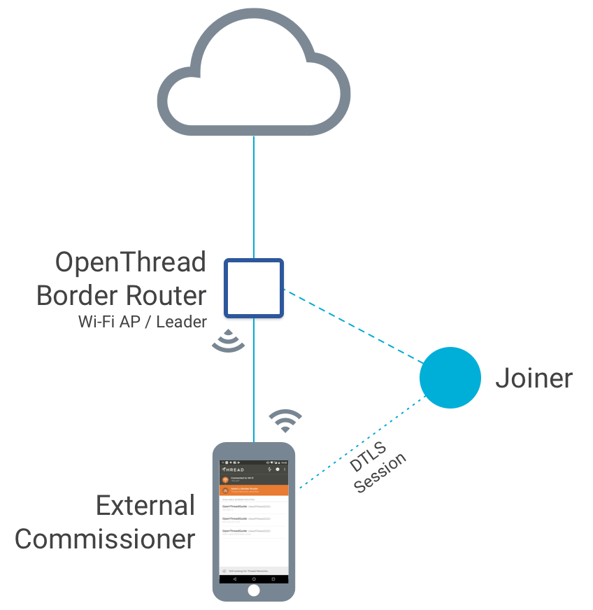

# Overview

<figure class="attempt-right">

</figure>

OpenThread Border Router (OTBR) features a Thread Border Agent, which supports
external Thread Commissioning. In external Thread Commissioning, a device
outside of the Thread network (for example, a mobile phone) commissions new
devices onto the network.

The Thread Commissioner serves to authenticate a user (external Commissioner) or
a Thread device onto the Thread network. After authentication, the Commissioner
instructs the Border Router to transfer Thread network credentials, such as the
network key, to the device directly.

This is an example of in-band commissioning, where Thread network credentials
are transferred between devices over the radio.

**Key Point:** During commissioning, the Thread Commissioner never gains
possession of the network key.

This guide details how to commission an OpenThread device onto a network created
and managed by the OTBR Web GUI. 

To learn how to commission without an external Commissioner, see
[On-Mesh Commissioning](../../build/commissioning.md).

## License

Copyright (c) 2021, The OpenThread Authors.
All rights reserved.

Redistribution and use in source and binary forms, with or without
modification, are permitted provided that the following conditions are met:
1. Redistributions of source code must retain the above copyright
   notice, this list of conditions and the following disclaimer.
2. Redistributions in binary form must reproduce the above copyright
   notice, this list of conditions and the following disclaimer in the
   documentation and/or other materials provided with the distribution.
3. Neither the name of the copyright holder nor the
   names of its contributors may be used to endorse or promote products
   derived from this software without specific prior written permission.

THIS SOFTWARE IS PROVIDED BY THE COPYRIGHT HOLDERS AND CONTRIBUTORS "AS IS"
AND ANY EXPRESS OR IMPLIED WARRANTIES, INCLUDING, BUT NOT LIMITED TO, THE
IMPLIED WARRANTIES OF MERCHANTABILITY AND FITNESS FOR A PARTICULAR PURPOSE
ARE DISCLAIMED. IN NO EVENT SHALL THE COPYRIGHT HOLDER OR CONTRIBUTORS BE
LIABLE FOR ANY DIRECT, INDIRECT, INCIDENTAL, SPECIAL, EXEMPLARY, OR
CONSEQUENTIAL DAMAGES (INCLUDING, BUT NOT LIMITED TO, PROCUREMENT OF
SUBSTITUTE GOODS OR SERVICES; LOSS OF USE, DATA, OR PROFITS; OR BUSINESS
INTERRUPTION) HOWEVER CAUSED AND ON ANY THEORY OF LIABILITY, WHETHER IN
CONTRACT, STRICT LIABILITY, OR TORT (INCLUDING NEGLIGENCE OR OTHERWISE)
ARISING IN ANY WAY OUT OF THE USE OF THIS SOFTWARE, EVEN IF ADVISED OF THE
POSSIBILITY OF SUCH DAMAGE.
