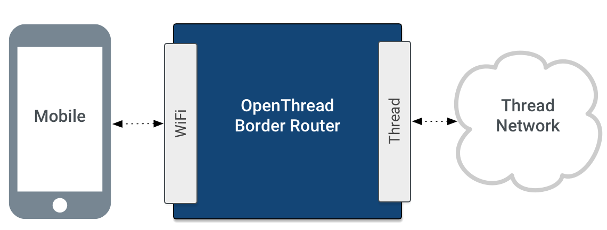

# OpenThread Border Router

A Thread Border Router connects a Thread network to other IP-based networks,
such as Wi-Fi or Ethernet. A Thread network requires a Border Router to connect
to other networks.

<figure>

</figure>

A Thread Border Router minimally supports the following functions:

*   Bidirectional IP connectivity between Thread and Wi-Fi/Ethernet networks.
*   Bidirectional service discovery via mDNS (on a Wi-Fi/Ethernet link) and SRP
    (on a Thread network).
*   Thread-over-infrastructure that merges Thread partitions over IP-based
    links.
*   External Thread Commissioning (for example, a mobile phone) to authenticate
    and join a Thread device to a Thread network.

<figure class="attempt-right">
  </figure>

OpenThread's implementation of a Border Router is called OpenThread Border
Router (OTBR), supporting a [Radio Co-Processor (RCP) design](https://openthread.io/platforms/co-processor).
When choosing your platform, consider the following benefits of using RCP:

*   More resources: OpenThread can take advantage of the host processor's
    resources, which is typically much more than what an 802.15.4 SoC provides.
*   More cost effective: minimize resource requirements on the 802.15.4 SoC,
    which can lead to a more cost-effective solution.
*   Easier to debug: since most of the processing happens on the host processor,
    you can utilize more capable debugging tools on the host processor.
*   More stable 802.15.4 SoC firmware: the RCP only implements the sub-MAC and
    PHY, reducing the frequency at which the 802.15.4 SoC needs firmware
    updates.
*   Easier integration with host IPv6 network stack: having OpenThread run on
    the host allows for more direct integration with the host IPv6 stack.

> Note: OTBR is also a Thread Certified Component on the [Raspberry Pi
3B](raspberry-pi.md) with a [Nordic
nRF52840](https://openthread.io/vendors/nordic-semiconductor) NCP.

## Features and services

OTBR includes a number of features, including:

*   [Web GUI](web-gui.md) for configuration and management
*   Thread Border Agent to support [external
    commissioning](external-commissioning/index.md)
*   DHCPv6 Prefix Delegation to obtain IPv6 prefixes for a Thread network
*   NAT64 for connecting to IPv4 networks
*   DNS64 to allow Thread devices to initiate communications by name to an
    IPv4-only server
*   Thread interface driver using OpenThread's built-in feature
*   [Docker support](docker/index.md)
*   Firewall with ingress filtering

### Border Router services

OTBR provides the following services:

*   [mDNS Publisher](mdns-discovery.md) — Allows an External Commissioner to discover an OTBR and its
    associated Thread network
*   [PSKc Generator](tools.md) — For generation of PSKc keys
*   Web Service — [Web UI](web-gui.md) for management of a Thread network

Third-party components for Border Router Services include Simple Web Server and
Material Design Lite for the framework of the web UI.

## License

Copyright (c) 2021, The OpenThread Authors.
All rights reserved.

Redistribution and use in source and binary forms, with or without
modification, are permitted provided that the following conditions are met:
1. Redistributions of source code must retain the above copyright
   notice, this list of conditions and the following disclaimer.
2. Redistributions in binary form must reproduce the above copyright
   notice, this list of conditions and the following disclaimer in the
   documentation and/or other materials provided with the distribution.
3. Neither the name of the copyright holder nor the
   names of its contributors may be used to endorse or promote products
   derived from this software without specific prior written permission.

THIS SOFTWARE IS PROVIDED BY THE COPYRIGHT HOLDERS AND CONTRIBUTORS "AS IS"
AND ANY EXPRESS OR IMPLIED WARRANTIES, INCLUDING, BUT NOT LIMITED TO, THE
IMPLIED WARRANTIES OF MERCHANTABILITY AND FITNESS FOR A PARTICULAR PURPOSE
ARE DISCLAIMED. IN NO EVENT SHALL THE COPYRIGHT HOLDER OR CONTRIBUTORS BE
LIABLE FOR ANY DIRECT, INDIRECT, INCIDENTAL, SPECIAL, EXEMPLARY, OR
CONSEQUENTIAL DAMAGES (INCLUDING, BUT NOT LIMITED TO, PROCUREMENT OF
SUBSTITUTE GOODS OR SERVICES; LOSS OF USE, DATA, OR PROFITS; OR BUSINESS
INTERRUPTION) HOWEVER CAUSED AND ON ANY THEORY OF LIABILITY, WHETHER IN
CONTRACT, STRICT LIABILITY, OR TORT (INCLUDING NEGLIGENCE OR OTHERWISE)
ARISING IN ANY WAY OUT OF THE USE OF THIS SOFTWARE, EVEN IF ADVISED OF THE
POSSIBILITY OF SUCH DAMAGE.
