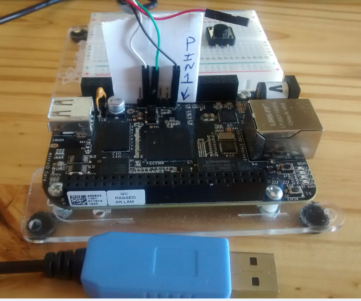
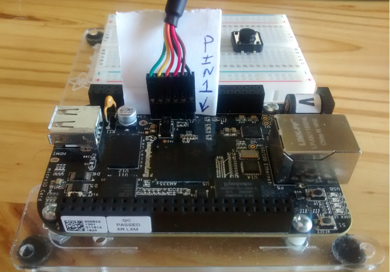

# Connecting a USB Serial Cable to the Border Router

Contributor: https://github.com/DuaneEllis-TI

Use a USB serial cable to connect to your Border Router serial port for
debugging purposes.

## BeagleBone Black

The BeagleBone Black (BBB) uses the following serial port settings:

*   Baudrate: 115200
*   Data Bits: 8
*   Parity: None
*   Stop Bits: 1

Recommended cables:

*   [Adafruit USB to TTL Serial Cable](https://www.adafruit.com/product/954)
*   [FTDI USB to TTL Serial 3.3V
    Cable](https://www.digikey.com/products/en?keywords=768-1015-ND)

### How to connect

For detailed information on connecting serial cables to the BBB, see the
[Beagleboard Wiki](https://elinux.org/Beagleboard:BeagleBone_Black_Serial). For
both cables, the black wire should be connected to Pin 1 (GND), which is
closest to the Ethernet port.

> Warning: To avoid hardware damage, always ensure cables are properly connected
before use.

<figure>
<figcaption>Adafruit serial cable</figcaption>
</figure>
 
<figure>
<figcaption>FTDI serial cable</figcaption>
</figure>

## Raspberry Pi

The Raspberry Pi (RPi) uses the following serial port settings:

*   Baudrate: 115200
*   Data Bits: 8
*   Parity: None
*   Stop Bits: 1

Recommended cable: [Adafruit USB to TTL Serial
Cable](https://www.adafruit.com/product/954)

To learn how to connect and enable the serial console on your RPi, see
[Adafruit's Using a Console Cable guide](https://learn.adafruit.com/adafruits-raspberry-pi-lesson-5-using-a-console-cable/overview).

## License

Copyright (c) 2021, The OpenThread Authors.
All rights reserved.

Redistribution and use in source and binary forms, with or without
modification, are permitted provided that the following conditions are met:
1. Redistributions of source code must retain the above copyright
   notice, this list of conditions and the following disclaimer.
2. Redistributions in binary form must reproduce the above copyright
   notice, this list of conditions and the following disclaimer in the
   documentation and/or other materials provided with the distribution.
3. Neither the name of the copyright holder nor the
   names of its contributors may be used to endorse or promote products
   derived from this software without specific prior written permission.

THIS SOFTWARE IS PROVIDED BY THE COPYRIGHT HOLDERS AND CONTRIBUTORS "AS IS"
AND ANY EXPRESS OR IMPLIED WARRANTIES, INCLUDING, BUT NOT LIMITED TO, THE
IMPLIED WARRANTIES OF MERCHANTABILITY AND FITNESS FOR A PARTICULAR PURPOSE
ARE DISCLAIMED. IN NO EVENT SHALL THE COPYRIGHT HOLDER OR CONTRIBUTORS BE
LIABLE FOR ANY DIRECT, INDIRECT, INCIDENTAL, SPECIAL, EXEMPLARY, OR
CONSEQUENTIAL DAMAGES (INCLUDING, BUT NOT LIMITED TO, PROCUREMENT OF
SUBSTITUTE GOODS OR SERVICES; LOSS OF USE, DATA, OR PROFITS; OR BUSINESS
INTERRUPTION) HOWEVER CAUSED AND ON ANY THEORY OF LIABILITY, WHETHER IN
CONTRACT, STRICT LIABILITY, OR TORT (INCLUDING NEGLIGENCE OR OTHERWISE)
ARISING IN ANY WAY OUT OF THE USE OF THIS SOFTWARE, EVEN IF ADVISED OF THE
POSSIBILITY OF SUCH DAMAGE.

