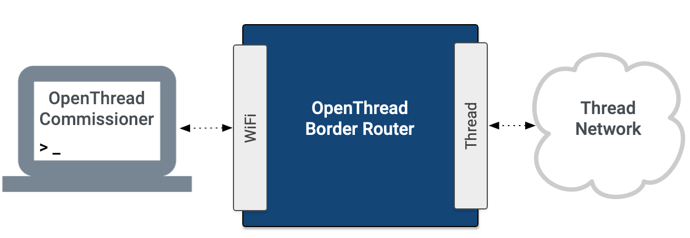

# OpenThread Commissioner

A Thread Commissioner connects to and manages a Thread network. A Thread network
requires a Commissioner to commission new Joiner devices.

<figure>

</figure>

A Thread Commissioner minimally supports the following functions:

*   Connecting to a Thread network through a Thread Border Agent
*   Steering and commissioning new devices
*   Getting and setting Thread network datasets

OpenThread's implementation of a Thread Commissioner is called OpenThread
Commissioner (OT Commissioner).

## Get started

The quickest way to get started with OT Commissioner is to build it from the
source:

1.  Get the source code from the [OpenThread Commissioner GitHub
    repository](https://github.com/openthread/ot-commissioner)
1.  [Build and configure OT Commissioner](build.md)

You can contribute to the ongoing development of OpenThread Commissioner by
submitting bug reports and feature requests to the [Issue
Tracker](https://github.com/openthread/ot-commissioner/issues).

## Features

OT Commissioner features include:

*   Implements both the Thread 1.1 and 1.2 Commissioner (with Commercial
    Extension)
*   Cross-platform (Linux, macOS, Android) Commissioner library
*   Interactive Commissioner CLI Tool (Linux, macOS)
*   [Android App](https://github.com/openthread/ot-commissioner/tree/master/android) for Thread Commissioning

## License

Copyright (c) 2021, The OpenThread Authors.
All rights reserved.

Redistribution and use in source and binary forms, with or without
modification, are permitted provided that the following conditions are met:
1. Redistributions of source code must retain the above copyright
   notice, this list of conditions and the following disclaimer.
2. Redistributions in binary form must reproduce the above copyright
   notice, this list of conditions and the following disclaimer in the
   documentation and/or other materials provided with the distribution.
3. Neither the name of the copyright holder nor the
   names of its contributors may be used to endorse or promote products
   derived from this software without specific prior written permission.

THIS SOFTWARE IS PROVIDED BY THE COPYRIGHT HOLDERS AND CONTRIBUTORS "AS IS"
AND ANY EXPRESS OR IMPLIED WARRANTIES, INCLUDING, BUT NOT LIMITED TO, THE
IMPLIED WARRANTIES OF MERCHANTABILITY AND FITNESS FOR A PARTICULAR PURPOSE
ARE DISCLAIMED. IN NO EVENT SHALL THE COPYRIGHT HOLDER OR CONTRIBUTORS BE
LIABLE FOR ANY DIRECT, INDIRECT, INCIDENTAL, SPECIAL, EXEMPLARY, OR
CONSEQUENTIAL DAMAGES (INCLUDING, BUT NOT LIMITED TO, PROCUREMENT OF
SUBSTITUTE GOODS OR SERVICES; LOSS OF USE, DATA, OR PROFITS; OR BUSINESS
INTERRUPTION) HOWEVER CAUSED AND ON ANY THEORY OF LIABILITY, WHETHER IN
CONTRACT, STRICT LIABILITY, OR TORT (INCLUDING NEGLIGENCE OR OTHERWISE)
ARISING IN ANY WAY OUT OF THE USE OF THIS SOFTWARE, EVEN IF ADVISED OF THE
POSSIBILITY OF SUCH DAMAGE.
