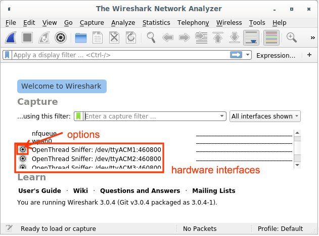
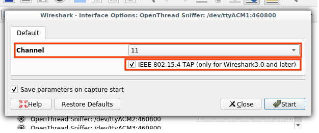
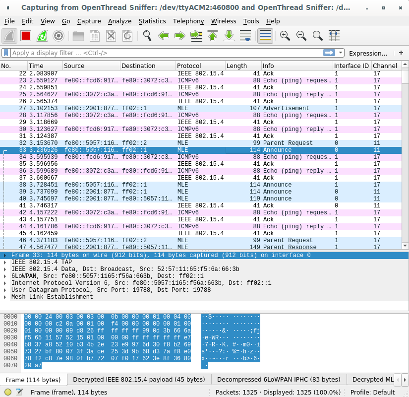

# Packet Sniffing using Extcap

This guide covers how to configure extcap for Wireshark to sniff packets from a
Thread network.

To use Pyspinel for packet sniffing without extcap, refer to [Packet Sniffing with
Pyspinel](../pyspinel/sniffer.md).

## Set up the sniffer environment

Before you begin, complete the following steps:

*   Review the [Packet Sniffing Requirements](requirements.md).
*   [Install and Configure Wireshark](wireshark.md).
*   [Install Pyspinel and dependencies with extcap](install-pyspinel.md).

### Verification

This guide was verified with the Zolertia Firefly ([Texas Instruments CC2538
SoC](https://openthread.io/vendors/texas-instruments#cc2538)) on the following host systems:

*   Debian 4.19.37 — Wireshark 3.0.4
*   macOS Mojave 10.14.6 — Wireshark 3.0.5
*   64-bit Windows 10 version 17134 — Wireshark 3.0.6

## Build and flash the sniffer

Build and flashing instructions vary based on platform.

For instructions on building and flashing the CC2538, refer to the [CC2538 example
README](https://github.com/openthread/openthread/tree/master/examples/platforms/cc2538/README.md) on GitHub.

For general build instructions, refer to [How to build OpenThread](../build/index.md).

## Use the sniffer

The Wireshark capture screen is displayed when Wireshark is first launched. It
should list hardware interfaces connected to an OpenThread sniffer.

### Capture from a single interface

If this is your first time using an interface, click on the **Options** button
to the left of the interface:



1.  Set the **Channel** to the desired value.
1.  Check **IEEE 802.15.4 TAP** to ensure that the channel information is
    included in the pcap output and can be displayed in the Wireshark GUI.
1.  Check **Save parameters on capture start** to ensure that these
    parameters are saved after the start of the capture, to avoid having to
    set it again the next time you use the interface (unless you need to
    change the channel).
1.  Click **Start**.



If your parameters are already saved, start sniffing by selecting the hardware
interface and clicking the Wireshark icon in the top left.

### Capture from multiple interfaces

Select all hardware interfaces listed in the capture screen and click the
Wireshark icon on the top left.

Use these fields to identify individual sniffers when capturing from multiple
interfaces:

*   **Interface ID** (frame.interface_id) — Interface Identifier used by Wireshark
    to identify a capture interface
*   **Interface name** (frame.interface_name) — Interface name used by
    Wireshark to identify a capture interface
*   **Channel** (wpan-tap.ch_num) — IEEE 802.15.4 capture channel (range: 11-26)



## Troubleshooting

#### The OpenThread sniffer is not listed as a Wireshark interface

1.  If you have multiple Python interpreters installed, ensure that Python 3
    interpreter is used by the extcap script. Pyspinel doesn't support Python 2.
1.  Check if the hardware is enumerated on USB and the drivers are loaded.
1.  Check that the correct firmware (NCP or RCP) has been flashed to the
    hardware.
1.  Verify that the Python script located in the extcap path is executable.
    *   For OS X and Linux:
        1.  Verify that the execute permission is present for the `extcap_ot.py`
            file:

                $ ls -l extcap_ot.py

        1.  If the execute (x) permission is missing, modify the permissions:

                $ chmod +x extcap_ot.py

        1.  Verify the interface is listed:

                $ extcap_ot.py --extcap-interfaces

    *   For Windows:
        1.  Verify the interface is listed:

                C:\> extcap_ot.bat --extcap-interfaces

        1.  If this exits with a Python error, verify the Python version is 3.x:

                C:\> py -3 --version

#### Wireshark only allows the root user to capture packets

During Wireshark installation on Ubuntu the user will be prompted to choose one
of the following options:

1.  Create the `wireshark` user group and allow all members of that group to
    capture packets.
1.  Only allow the `root` user to capture packets.

Using the Wireshark as the `root` user is strongly discouraged. If you chose
that option, change the setting:

```
$ sudo dpkg-reconfigure wireshark-common
```

If Wireshark was configured to restrict the capture to members of the
`wireshark` group, you may need to add the correct user to the group:

```
$ sudo usermod -a -G wireshark {user}
```

Also add the correct user to the `dialout` group:

```
$ sudo usermod -a -G dialout {user}
```

Close and restart Wireshark to apply the new user group settings.

#### Wireshark format error when capturing on multiple USB interfaces on Windows

This is a [known issue](https://bugs.wireshark.org/bugzilla/show_bug.cgi?id=13653)
for some old versions of Wireshark. Make sure you are using Wireshark 3.0.6 or
later.

## License

Copyright (c) 2021, The OpenThread Authors.
All rights reserved.

Redistribution and use in source and binary forms, with or without
modification, are permitted provided that the following conditions are met:
1. Redistributions of source code must retain the above copyright
   notice, this list of conditions and the following disclaimer.
2. Redistributions in binary form must reproduce the above copyright
   notice, this list of conditions and the following disclaimer in the
   documentation and/or other materials provided with the distribution.
3. Neither the name of the copyright holder nor the
   names of its contributors may be used to endorse or promote products
   derived from this software without specific prior written permission.

THIS SOFTWARE IS PROVIDED BY THE COPYRIGHT HOLDERS AND CONTRIBUTORS "AS IS"
AND ANY EXPRESS OR IMPLIED WARRANTIES, INCLUDING, BUT NOT LIMITED TO, THE
IMPLIED WARRANTIES OF MERCHANTABILITY AND FITNESS FOR A PARTICULAR PURPOSE
ARE DISCLAIMED. IN NO EVENT SHALL THE COPYRIGHT HOLDER OR CONTRIBUTORS BE
LIABLE FOR ANY DIRECT, INDIRECT, INCIDENTAL, SPECIAL, EXEMPLARY, OR
CONSEQUENTIAL DAMAGES (INCLUDING, BUT NOT LIMITED TO, PROCUREMENT OF
SUBSTITUTE GOODS OR SERVICES; LOSS OF USE, DATA, OR PROFITS; OR BUSINESS
INTERRUPTION) HOWEVER CAUSED AND ON ANY THEORY OF LIABILITY, WHETHER IN
CONTRACT, STRICT LIABILITY, OR TORT (INCLUDING NEGLIGENCE OR OTHERWISE)
ARISING IN ANY WAY OUT OF THE USE OF THIS SOFTWARE, EVEN IF ADVISED OF THE
POSSIBILITY OF SUCH DAMAGE.
