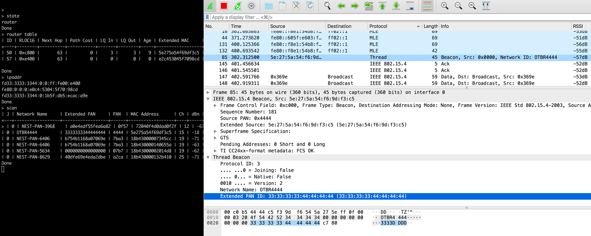

# Packet Sniffing with Pyspinel

This guide covers how to configure Wireshark and run Pyspinel to sniff packets
from a Thread network.

To use the Wireshark extcap plugin for packet sniffing, refer to [Packet Sniffing
using extcap](sniffer-extcap.md).

## Set up the sniffer environment

Before you begin, complete the following steps:

*   Review the [Packet Sniffing Requirements](requirements.md).
*   [Install Pyspinel and dependencies without extcap](install-pyspinel.md).
*   [Install and Configure Wireshark](wireshark.md).

## Build the sniffer

> Note: This guide was tested with and written for the [Nordic Semiconductor
nRF52840 DK](https://openthread.io/platforms/nrf52840) connected to the host machine by its debug
port.

Build and flash an NCP device to serve as the sniffer, using the `ot-rcp` binary output.

### Nordic nRF52840

To set up the Nordic nRF52840 example for use as a sniffer, clone
`openthread/ot-nrf528xx` and set up the build environment:

```
$ git clone https://github.com/openthread/ot-nrf528xx --recursive
$ ./script/bootstrap
```

Set baud rate as 460800. Find the line `#define UART_BAUDRATE NRF_UARTE_BAUDRATE_115200`
in `src/nrf52840/transport-config.h`, and replace it with `#define UART_BAUDRATE NRF_UARTE_BAUDRATE_460800`.

> Note: Using a UART baud rate of 460800 is optional, but highly recommended
for optimal sniffer capability on the Nordic nRF52840.

Build the binary:

```
$ ./script/build nrf52840 UART_trans
```

Convert the `ot-rcp` binary output to hex:

```
$ arm-none-eabi-objcopy -O ihex build/bin/ot-rcp ot-rcp.hex
```

Flash the `ot-rcp.hex` file to the nRF52840 board as detailed in
[Flash the nRF52840](https://openthread.io/platforms/co-processor/firmware#flash_the_nrf52840).

Disable Mass Storage Device (MSD) on the nRF52840 to avoid issues with data
corruption or drops when using the debug port:

<pre>
$ expect &lt;&lt;EOF
> spawn JLinkExe
> expect "J-Link>"
> send "msddisable\n"
> expect "Probe configured successfully."
> exit
> EOF
</pre>

<pre>
spawn JLinkExe
SEGGER J-Link Commander V6.42b (Compiled Feb  5 2019 17:35:31)
DLL version V6.42b, compiled Feb  5 2019 17:35:20
 
Connecting to J-Link via USB...O.K.
Firmware: J-Link OB-SAM3U128-V2-NordicSemi compiled Jan  7 2019 14:07:15
Hardware version: V1.00
S/N: 683411111
VTref=3.300V
 
Type "connect" to establish a target connection, '?' for help
J-Link&gt;msddisable
Probe configured successfully.
</pre>

## Thread network properties

Before continuing, get the following properties for the Thread network you wish
to sniff. You'll need them for Wireshark configuration and running the Pyspinel
sniffer.

### Mesh Local Prefix

To get the Mesh Local Prefix from a device in the target Thread network:

1.  Using the OpenThread CLI:
    ```
    > dataset active
    Mesh Local Prefix: fd33:3333:3344:0/64
    ```

1.  Using `wpanctl` with an NCP:
    ```
    $ wpanctl getprop IPv6:MeshLocalPrefix
    IPv6:MeshLocalPrefix = "fd33:3333:3344:0::/64"
    ```

1.  Using the OTBR Web GUI, select **Status**. The Mesh Local Prefix is listed
    as **IPv6:MeshLocalPrefix** similar to `wpanctl`.

### Channel

To get the Channel from a device in the target Thread network:

1.  Using the OpenThread CLI:
    ```
    > channel
    15
    ```

1.  Using `wpanctl` with an NCP:
    ```
    $ wpanctl getprop NCP:Channel
    NCP:Channel = 15
    ```

1.  Using the OTBR Web GUI, select **Status**. The Channel is listed as
    **NCP:Channel** similar to `wpanctl`.

### Network Key

The Thread Network Key is used by Wireshark to decrypt packets after
capture. To get the Network Key from a device in the target Thread network:

1.  Using the OpenThread CLI:
    ```
    > networkkey
    33334444333344443333444433334444
    ```

1.  Using `wpanctl` with an NCP:
    ```
    $ wpanctl getprop Network:Key
    Network:Key = [33334444333344443333444433334444]
    ```

The Thread Network Key is not available in the OTBR Web GUI.

## Sniffer options

> Key Point: This list of options are relevant to using the nRF52840 DK as a
sniffer. For information on all options, refer to the [Spinel sniffer
reference](https://github.com/openthread/pyspinel/tree/master/SNIFFER.md).

<table class="details responsive">
  <thead>
    <th colspan="2">Options</th>
  </thead>
  <tbody>
    <tr>
      <td id="uart"><code>-u or --uart</code></td>
      <td>
        <table class="function param responsive">
          <tbody>
            <tr>
              <td>
                <b>Default value</b>
              </td>
              <td>
                <div>None - must be provided if you are using a device with a
                  serial connection and not a socket connection.</div>
              </td>
            </tr>
            <tr>
              <td>
                <b>Description</b>
              </td>
              <td>
                <div>The <code>-u</code> or <code>--uart</code> flag followed by
                  a device path such as <code>/dev/ttyUSB0</code>.</div>
              </td>
            </tr>
          </tbody>
        </table>
      </td>
    </tr>
    <tr>
      <td id="channel"><code>-c or --channel</code></td>
      <td>
        <table class="function param responsive">
          <tbody>
            <tr>
              <td><b>Default value</b></td>
              <td>
                <div>11</div>
              </td>
            </tr>
            <tr>
              <td>
                <b>Description</b>
              </td>
              <td>
                <div>The <code>-c</code> or <code>--channel</code> flag followed
                  by the channel configured on your Thread Network, upon which
                  to sniff packets.</div>
              </td>
            </tr>
          </tbody>
        </table>
      </td>
    </tr>
    <tr>
      <td id="noreset"><code>--no-reset</code></td>
      <td>
        <table class="function param responsive">
          <tbody>
            <tr>
              <td><b>Default value</b></td>
              <td>
                <div>This flag overrides the default behavior.</div>
              </td>
            </tr>
            <tr>
              <td>
                <b>Description</b>
              </td>
              <td>
                <div>The <code>--no-reset</code> flag is needed if your NCP
                  device is connected to the host with the native USB
                  connection.</div>
              </td>
            </tr>
          </tbody>
        </table>
      </td>
    </tr>
    <tr>
      <td id="crc"><code>--crc</code></td>
      <td>
        <table class="function param responsive">
          <tbody>
            <tr>
              <td><b>Default value</b></td>
              <td>
                <div>This flag overrides the default behavior.</div>
              </td>
            </tr>
            <tr>
              <td>
                <b>Description</b>
              </td>
              <td>
                <div>The <code>--crc</code> flag is needed for platforms such as
                  TI and Nordic Semiconductor Thread boards. The flag
                  recalculates the CRC to avoid a ‘Bad FCS' (frame check
                  sequence) warning in Wireshark.</div>
              </td>
            </tr>
          </tbody>
        </table>
      </td>
    </tr>
    <tr>
      <td id="baudrate"><code>-b or --baudrate</code></td>
      <td>
        <table class="function param responsive">
          <tbody>
            <tr>
              <td><b>Default value</b></td>
              <td>
                <div>115200</div>
              </td>
            </tr>
            <tr>
              <td>
                <b>Description</b>
              </td>
              <td>
                <div>The <code>-b</code> or <code>--baudrate</code> flag is used
                  to override the default baud rate. Set this value to the same
                  baud rate used with your <a href="#build_the_sniffer">NCP
                  build</a> (we recommend 460800).
                </div>
              </td>
            </tr>
          </tbody>
        </table>
      </td>
    </tr>
    <tr>
      <td id="rssi"><code>--rssi</code></td>
      <td>
        <table class="function param responsive">
          <tbody>
            <tr>
              <td><b>Default value</b></td>
              <td>
                <div>This flag overrides the default behavior.</div>
              </td>
            </tr>
            <tr>
              <td>
                <b>Description</b>
              </td>
              <td>
                <div>The <code>--rssi</code> flag is used to ensure the RSSI is
                  included in the pcap output. You must use this flag if the
                  <a href="#wireshark_configuration_-_rssi">TI CC24xx FCS
                    format</a> option is enabled in Wireshark.</div>
              </td>
            </tr>
          </tbody>
        </table>
      </td>
    </tr>
    <tr>
      <td id="tap"><code>--tap</code></td>
      <td>
        <table class="function param responsive">
          <tbody>
            <tr>
              <td><b>Default value</b></td>
              <td>
                <div>This flag overrides the default behavior.</div>
              </td>
            </tr>
            <tr>
              <td>
                <b>Description</b>
              </td>
              <td>
                <div>The <code>--tap</code> flag specifies
                  <code>DLT_IEEE802_15_4_TAP(283)</code> for the frame format,
                  with a pseudo-header containing TLVs with metadata (such as
                  FCS, RSSI, LQI, Channel). If not specified,
                  <code>DLT_IEEE802_15_4_WITHFCS(195)</code> would be used by
                  default with the additional RSSI and LQI following the PHY
                  frame directly, as in TI CC24xx FCS format. You must use this flag if the
                  <a href="#wireshark_configuration_-_rssi">ITU-T CRC-16</a>
                  option is enabled in Wireshark. If that option is not enabled
                  in Wireshark, do not use this flag.</div>
              </td>
            </tr>
          </tbody>
        </table>
      </td>
    </tr>
  </tbody>
</table>

## Run the sniffer

Make sure to use the specific device path for your NCP and the channel for the
Thread network you are attempting to sniff.

If following this guide, the nRF52840 DK should be attached the host machine by
the debug port, as described in [Flash the
nRF52840](https://openthread.io/guides/ncp/firmware#flash_the_nrf52840). To run the Pyspinel sniffer,
use the `-b` flag to specify the baud rate (if it was changed from the default)
and omit the `--no-reset` flag.

If you [Configure Wireshark](configure-wireshark.md) to display RSSI, you must also include the `--rssi`
flag when you run the sniffer tool. For example, to sniff on Channel 15 using a
device mounted at `/dev/ttyACM0` with RSSI included in the Wireshark output:

```
$ cd {path-to-pyspinel}
$ python sniffer.py -c 15 -u /dev/ttyACM0 --crc --rssi -b 460800 | wireshark -k -i -
```

You should now be able to view the packets and related protocols for this
configuration in Wireshark:

<a href="../images/ot-sniffer-wireshark-output_2x.png"></a>

Refer to the [Spinel sniffer
reference](https://github.com/openthread/pyspinel/tree/master/SNIFFER.md) for
more information on running the Pyspinel sniffer.

### Native USB connection

Using the nRF52840 DK USB port requires the OpenThread `ot-rcp` binary to
be built with `USB_trans`:

$ ./script/build nrf52840 USB_trans

Flash the nRF52840 DK, [connect it to the host machine by the USB
port](https://openthread.io/platforms/co-processor/firmware#connect_the_nrf52840), then use the `--no-reset` flag
but omit the `-b` flag when running the sniffer:

```
$ python sniffer.py -c 15 -u /dev/ttyACM0 --crc --no-reset --rssi | wireshark -k -i -
```

## Nordic Resources

For additional tools, refer to [Nordic Semiconductor &mdash; Thread
Sniffer based on nRF52840 with Wireshark](https://www.nordicsemi.com/Software-and-tools/Development-Tools/nRF-Sniffer-for-802154).

## License

Copyright (c) 2021, The OpenThread Authors.
All rights reserved.

Redistribution and use in source and binary forms, with or without
modification, are permitted provided that the following conditions are met:
1. Redistributions of source code must retain the above copyright
   notice, this list of conditions and the following disclaimer.
2. Redistributions in binary form must reproduce the above copyright
   notice, this list of conditions and the following disclaimer in the
   documentation and/or other materials provided with the distribution.
3. Neither the name of the copyright holder nor the
   names of its contributors may be used to endorse or promote products
   derived from this software without specific prior written permission.

THIS SOFTWARE IS PROVIDED BY THE COPYRIGHT HOLDERS AND CONTRIBUTORS "AS IS"
AND ANY EXPRESS OR IMPLIED WARRANTIES, INCLUDING, BUT NOT LIMITED TO, THE
IMPLIED WARRANTIES OF MERCHANTABILITY AND FITNESS FOR A PARTICULAR PURPOSE
ARE DISCLAIMED. IN NO EVENT SHALL THE COPYRIGHT HOLDER OR CONTRIBUTORS BE
LIABLE FOR ANY DIRECT, INDIRECT, INCIDENTAL, SPECIAL, EXEMPLARY, OR
CONSEQUENTIAL DAMAGES (INCLUDING, BUT NOT LIMITED TO, PROCUREMENT OF
SUBSTITUTE GOODS OR SERVICES; LOSS OF USE, DATA, OR PROFITS; OR BUSINESS
INTERRUPTION) HOWEVER CAUSED AND ON ANY THEORY OF LIABILITY, WHETHER IN
CONTRACT, STRICT LIABILITY, OR TORT (INCLUDING NEGLIGENCE OR OTHERWISE)
ARISING IN ANY WAY OUT OF THE USE OF THIS SOFTWARE, EVEN IF ADVISED OF THE
POSSIBILITY OF SUCH DAMAGE.
