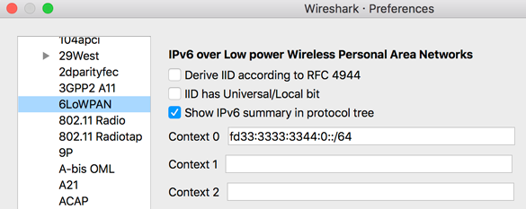
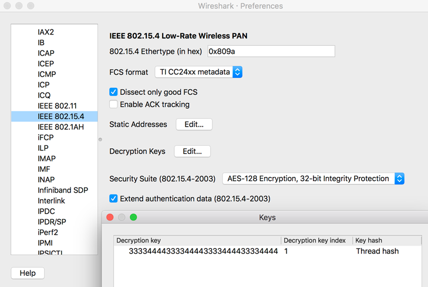

# Install and Configure Wireshark

[Wireshark](https://wireshark.org) is an open-source tool that can decode network protocols in the Thread
stack, such as IEEE 802.15.4, 6LoWPAN, IPv6, MLE (Mesh Link Establishment), UDP,
and CoAP.

The Pyspinel sniffer tool connects to a Thread NCP or RCP device and converts it
into a promiscuous packet sniffer, generating a pcap (packet capture) stream to
be saved or piped directly into Wireshark.

To use Wireshark with Pyspinel, refer to the installation recommendations in the
next step. You'll also need to configure Wireshark to properly show Thread packets
and receive RSSI measurements.

## Step 1: Install Wireshark

### Linux

Open a terminal and run the following commands to download and install Wireshark:

```
$ sudo add-apt-repository ppa:wireshark-dev/stable
$ sudo apt-get update
$ sudo apt-get install wireshark
```

We recommend running Wireshark as a non-`root` user. To do so, reconfigure the package:

```
$ sudo dpkg-reconfigure wireshark-common
```

When you get the dialog asking "Should non-superusers be able to capture packets?",
select **Yes**, then add the `wireshark` user and update file permissions:

```
$ sudo adduser $USER wireshark
$ sudo chmod +x /usr/bin/dumpcap
```

### macOS and Windows

[Download and install Wireshark](https://wireshark.org/#download). To optimize security for your operating
system, refer to [Wireshark &mdash; platform-specific information about capture privileges](https://gitlab.com/wireshark/wireshark/-/wikis/CaptureSetup/CapturePrivileges).

## Step 2: Configure Wireshark Protocols

To configure protocols, select **Preferences...** in Wireshark and expand the
**Protocols** section.

### 6LoWPAN

Select **6LoWPAN** from the list of protocols and verify or change the following
  settings:

1.  Uncheck **Derive ID according to RFC 4944**.
1.  Update **Context 0** with the Mesh Local Prefix for the target Thread
    network.



Wireshark uses context configurations to parse the compressed IPv6 address and
display the IPv6 source and destination addresses correctly.

To show the addresses for other on-mesh prefixes configured on the gateway,
update other Context IDs with those prefixes.

To get the Context ID for a specific on-mesh prefix, view the Thread Network Data
TLV in any MLE Data response message. For example:

`Context 1:  fd00:7d03:7d03:7d03::/64`

### CoAP

Select **CoAP** from the list of protocols and set **CoAP UDP Port**
to 61631. This ensures TMF messages (like address solicit) are displayed.

### IEEE 802.15.4

Select **IEEE 802.15.4** from the list of protocols and verify or change the
following settings:

1.  Set **802.15.4 Ethertype (in hex)** to "0x809a".
1.  Set the **Security Suite** to "AES-128 Encryption, 32-bit Integrity
    Protection".
1.  Click the **Edit...** button next to **Decryption Keys**, which is where you
    add the Thread network Master Key for packet decryption.

    1.  Click **+** to add a **Decryption key**.
    1.  Enter the Thread network Master Key into the **Decryption key** column.
    1.  Enter "1" as the **Decryption key index**.
    1.  Select **Thread hash** from the **Key hash** column listbox.

        

    1. Click **OK** to save the decryption key.

### Thread

Select **Thread** from the list of protocols and verify or change the following
settings:

* Enter "00000000" for the **Thread sequence counter**.
* Uncheck **Use PAN ID as first two octets of master key**.
* Check **Automatically acquire Thread sequence counter**.

Click the **OK** button to save any protocol changes.

Some Thread traffic might be analyzed as the ZigBee protocol. To correctly
display these two protocols, edit the enabled protocols in Wireshark:

1.  In Wireshark, go to **Analyze**, then click **Enabled Protocols**.
2.  Uncheck the following protocols:

    1.  **LwMesh**
    1.  **ZigBee**
    1.  **ZigBee Green Power**

## Step 3: Configure Wireshark RSSI

To display RSSI in Wireshark:

1.  Select **Preferences...** and expand the **Protocols** section, then click
    **IEEE 802.15.4**.
1.  Set the **FCS Format**:

    * If IEEE 802.15.4 TAP disabled: **TI CC24xx metadata**.
    * If IEEE 802.15.4 TAP enabled: **ITU-T CRC-16**. If you're following
      the [Packet Sniffing](sniffer.md) guide for the Nordic Semiconductor nRF52840
      DK, refer to the `--tap` [flag](sniffer.md#tap) for more information.

1.  Click **OK** to save and return to the **Preferences** menu.
1.  From **Preferences**, select **Appearance**, then **Columns**.
1.  Add a new entry:

    * Title: RSSI
    * Type: Custom
    * Fields: wpan.rssi


## License

Copyright (c) 2021, The OpenThread Authors.
All rights reserved.

Redistribution and use in source and binary forms, with or without
modification, are permitted provided that the following conditions are met:
1. Redistributions of source code must retain the above copyright
   notice, this list of conditions and the following disclaimer.
2. Redistributions in binary form must reproduce the above copyright
   notice, this list of conditions and the following disclaimer in the
   documentation and/or other materials provided with the distribution.
3. Neither the name of the copyright holder nor the
   names of its contributors may be used to endorse or promote products
   derived from this software without specific prior written permission.

THIS SOFTWARE IS PROVIDED BY THE COPYRIGHT HOLDERS AND CONTRIBUTORS "AS IS"
AND ANY EXPRESS OR IMPLIED WARRANTIES, INCLUDING, BUT NOT LIMITED TO, THE
IMPLIED WARRANTIES OF MERCHANTABILITY AND FITNESS FOR A PARTICULAR PURPOSE
ARE DISCLAIMED. IN NO EVENT SHALL THE COPYRIGHT HOLDER OR CONTRIBUTORS BE
LIABLE FOR ANY DIRECT, INDIRECT, INCIDENTAL, SPECIAL, EXEMPLARY, OR
CONSEQUENTIAL DAMAGES (INCLUDING, BUT NOT LIMITED TO, PROCUREMENT OF
SUBSTITUTE GOODS OR SERVICES; LOSS OF USE, DATA, OR PROFITS; OR BUSINESS
INTERRUPTION) HOWEVER CAUSED AND ON ANY THEORY OF LIABILITY, WHETHER IN
CONTRACT, STRICT LIABILITY, OR TORT (INCLUDING NEGLIGENCE OR OTHERWISE)
ARISING IN ANY WAY OUT OF THE USE OF THIS SOFTWARE, EVEN IF ADVISED OF THE
POSSIBILITY OF SUCH DAMAGE.
