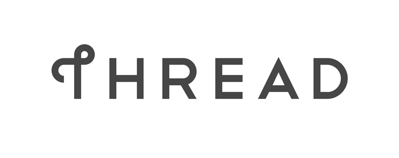

# What is Thread?

<figure class="attempt-right">

</figure>

<a href="http://threadgroup.org/">Thread®</a> is an IPv6-based
networking protocol designed for low-power Internet of Things devices in an IEEE
802.15.4-2006 wireless mesh network, commonly called a Wireless Personal Area
Network (WPAN). Thread is independent of other 802.15 mesh networking
protocols, such a ZigBee, Z-Wave, and Bluetooth LE.

Thread's primary features include:

*   Simplicity — Simple installation, start up, and operation
*   Security — All devices in a Thread network are authenticated and all
    communications are encrypted
*   Reliability — Self-healing mesh networking, with no single point of failure,
    and spread-spectrum techniques to provide immunity to interference
*   Efficiency — Low-power Thread devices can sleep and operate on battery power
    for years
*   Scalability — Thread networks can scale up to hundreds of devices

If you're new to Thread, understanding the basics are critical to using
OpenThread in your own applications. The goal of this primer is to explain the
concepts behind Thread and how it works, and provide a springboard to OpenThread
development.

It is assumed you have good working knowledge of the following:

*   IEEE 802.15.4
*   Networking and routing concepts
*   IPv6

This primer is based on version 1.1.1 of the Thread Specification. It does not
cover the full specification, which is available at
[threadgroup.org](http://threadgroup.org/ThreadSpec).

## License

Copyright (c) 2022, The OpenThread Authors.
All rights reserved.

Redistribution and use in source and binary forms, with or without
modification, are permitted provided that the following conditions are met:
1. Redistributions of source code must retain the above copyright
   notice, this list of conditions and the following disclaimer.
2. Redistributions in binary form must reproduce the above copyright
   notice, this list of conditions and the following disclaimer in the
   documentation and/or other materials provided with the distribution.
3. Neither the name of the copyright holder nor the
   names of its contributors may be used to endorse or promote products
   derived from this software without specific prior written permission.

THIS SOFTWARE IS PROVIDED BY THE COPYRIGHT HOLDERS AND CONTRIBUTORS "AS IS"
AND ANY EXPRESS OR IMPLIED WARRANTIES, INCLUDING, BUT NOT LIMITED TO, THE
IMPLIED WARRANTIES OF MERCHANTABILITY AND FITNESS FOR A PARTICULAR PURPOSE
ARE DISCLAIMED. IN NO EVENT SHALL THE COPYRIGHT HOLDER OR CONTRIBUTORS BE
LIABLE FOR ANY DIRECT, INDIRECT, INCIDENTAL, SPECIAL, EXEMPLARY, OR
CONSEQUENTIAL DAMAGES (INCLUDING, BUT NOT LIMITED TO, PROCUREMENT OF
SUBSTITUTE GOODS OR SERVICES; LOSS OF USE, DATA, OR PROFITS; OR BUSINESS
INTERRUPTION) HOWEVER CAUSED AND ON ANY THEORY OF LIABILITY, WHETHER IN
CONTRACT, STRICT LIABILITY, OR TORT (INCLUDING NEGLIGENCE OR OTHERWISE)
ARISING IN ANY WAY OUT OF THE USE OF THIS SOFTWARE, EVEN IF ADVISED OF THE
POSSIBILITY OF SUCH DAMAGE.
