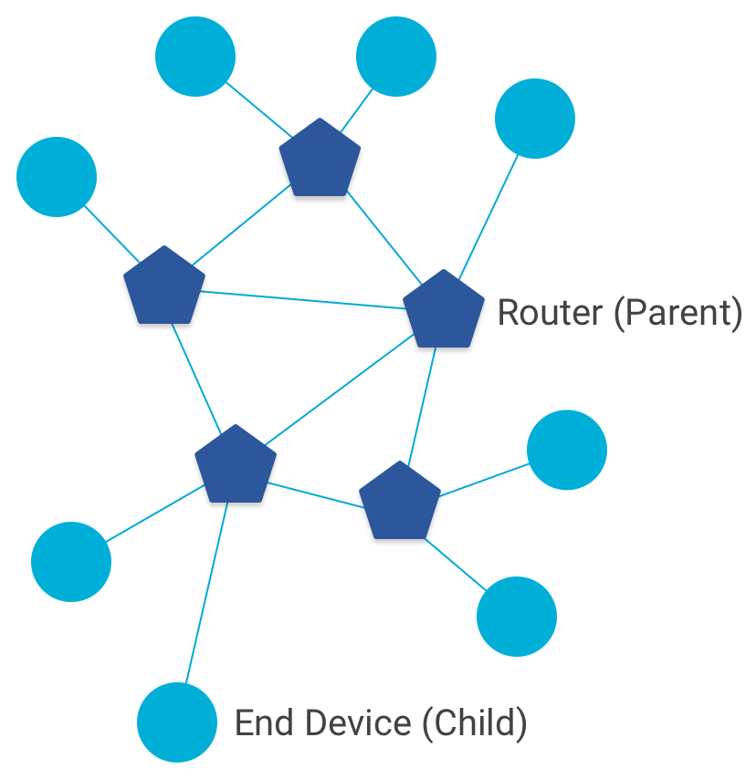
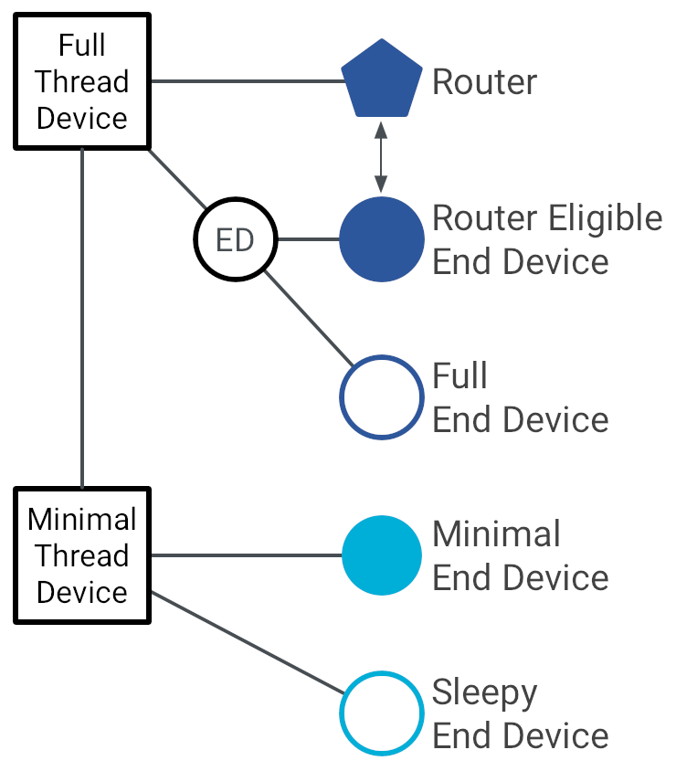
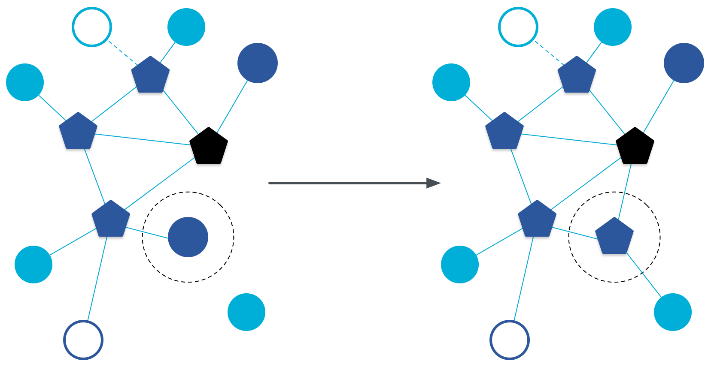
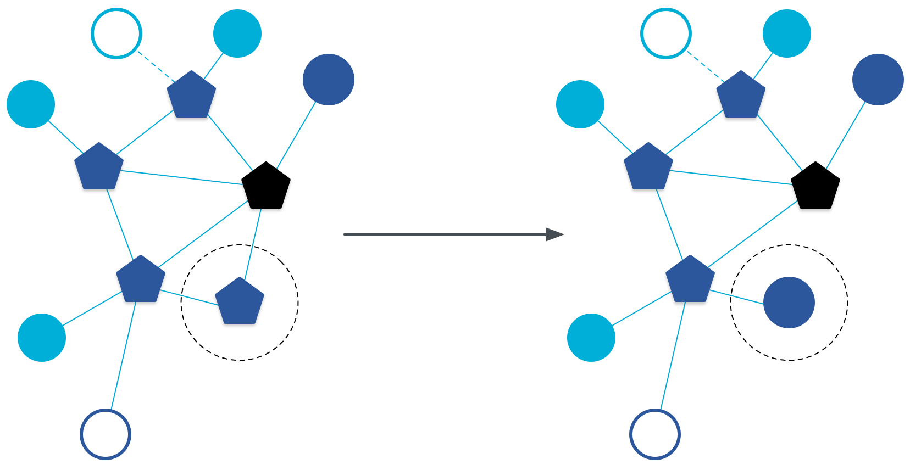
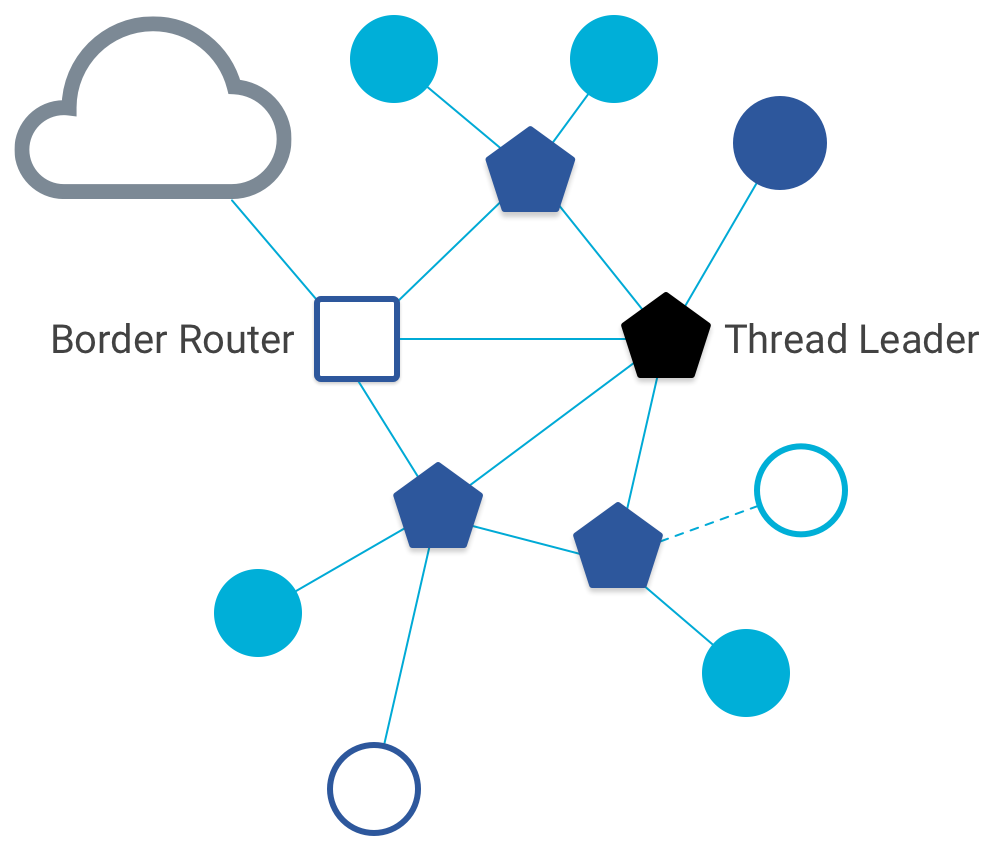
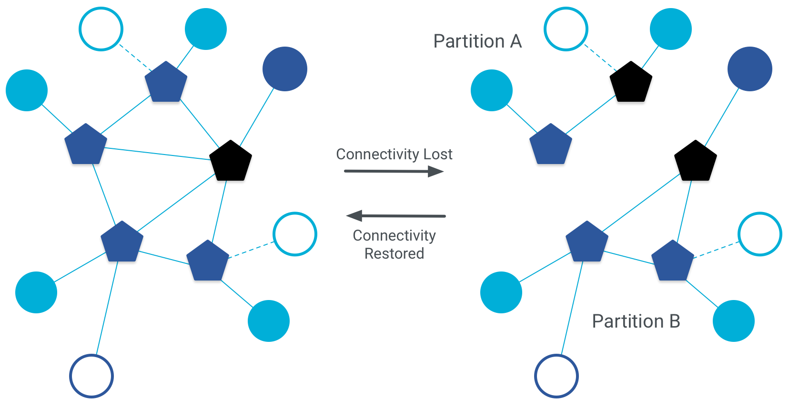

# Node Roles and Types

## Forwarding roles

<figure class="attempt-right">

</figure>

In a Thread network, nodes are split into two forwarding roles:

### Router

A Router is a node that:

*   forwards packets for network devices
*   provides secure commissioning services for devices trying to join the network
*   keeps its transceiver enabled at all times

### End Device

An End Device (ED) is a node that:

*   communicates primarily with a single Router
*   does not forward packets for other network devices
*   can disable its transceiver to reduce power

Key Point: The relationship between Router and End Device is a Parent-Child
relationship. An End Device attaches to exactly one Router. The Router is always
the Parent, the End Device the Child.

## Device types

Furthermore, nodes comprise a number of types.

<figure class="attempt-right">

</figure>

### Full Thread Device

A Full Thread Device (FTD) always has its radio on, subscribes to the
all-routers multicast address, and maintains IPv6 address mappings. There are
three types of FTDs:

*   Router
*   Router Eligible End Device (REED) — can be promoted to a Router
*   Full End Device (FED) — cannot be promoted to a Router

An FTD can operate as a Router (Parent) or an End Device (Child).

### Minimal Thread Device

A Minimal Thread Device does not subscribe to the all-routers
multicast address and forwards all messages to its Parent. There are
two types of MTDs:

*   Minimal End Device (MED) — transceiver always on, does not need to poll for
    messages from its parent
*   Sleepy End Device (SED) — normally disabled, wakes on occasion to poll for
    messages from its parent

An MTD can only operate as an End Device (Child).

### Upgrading and downgrading

When a REED is the only node in reach of a new End Device wishing to join the
Thread network, it can upgrade itself and operate as a Router:

<figure>

</figure>

Conversely, when a Router has no children, it can downgrade itself and operate
as an End Device:

<figure>

</figure>

## Other roles and types

### Thread Leader

<figure class="attempt-right">

</figure>

The Thread Leader is a Router that is responsible for managing the set of
Routers in a Thread network. It is dynamically self-elected for fault tolerance,
and aggregates and distributes network-wide configuration information.

Note: There is always a single Leader in each Thread network
[partition](#partitions).

### Border Router

A Border Router is a device that can forward information between a Thread
network and a non-Thread network (for example, Wi-Fi). It also configures a
Thread network for external connectivity.

Any device may serve as a Border Router.

Note: There can be multiple Border Routers in a Thread network.

## Partitions

<figure class="attempt-right">

</figure>

A Thread network might be composed of partitions. This occurs when a group of
Thread devices can no longer communicate with another group of Thread devices.
Each partition logically operates as a distinct Thread network with its own
Leader, Router ID assignments, and network data, while retaining the same
security credentials for all devices across all partitions.

Partitions in a Thread network do not have wireless connectivity between each
other, and if partitions regain connectivity, they automatically merge into a
single partition.

Key Point: Security credentials define the Thread network. Physical radio
connectivity defines partitions within that Thread network.

Note that the use of "Thread network" in this primer assumes a single partition.
Where necessary, key concepts and examples are clarified with the term "partition."
Partitions are covered in-depth later in this primer.

## Device limits

There are limits to the number of device types a single Thread network supports.

Role | Limit
----|----
Leader | 1
Router | 32
End Device | 511 per Router

Thread tries to keep the number of Routers between 16 and 23. If a REED attaches
as an End Device and the number of Routers in the network is below 16, it
automatically promotes itself to a Router.

## Recap

What you learned:

*   A Thread device is either a Router (Parent) or an End Device (Child)
*   A Thread device is either a Full Thread Device (maintains IPv6 address
    mappings) or a Minimal Thread Device (forwards all messages to its Parent)
*   A Router Eligible End Device can promote itself to a Router, and vice versa
*   Every Thread network partition has a Leader to manage Routers
*   A Border Router is used to connect Thread and non-Thread networks
*   A Thread network might be composed of multiple partitions

## Check Your Understanding

  <devsite-multiple-choice>
    
A Thread device fulfills one of which two roles?

    

      
Child Node

      
Incorrect.

    

    

      
Router

      
Correct.

    

    

      
End Device

      
Correct.

    

    

      
Gateway

      
Incorrect.

    

  </devsite-multiple-choice>

  <devsite-multiple-choice>
    
What are the two classifications of Thread device?

    

      
Minimal Thread Device (MTD)

      
Correct.

    

    

      
Full Thread Device (FTD)

      
Correct.

    

    

      
Semi-End Device (SED)

      
Incorrect.

    

    

      
Miniscule Thread Device (MTD)

      
Incorrect.

    

    

      
Sleepy End Device (SED)

      
Incorrect.

    

  </devsite-multiple-choice>

  <devsite-multiple-choice>
    
What are the three subtypes of FTD?

    

      
Router

      
Correct.

    

    

      
Thread Gateway Device (TGD)

      
Incorrect.

    

    

      
Router Eligible End Device (REED)

      
Correct.

    

    

      
Full End Device (FED)

      
Correct.

    

    

      
Half Thread Device (HTD)

      
Incorrect.

    

  </devsite-multiple-choice>

  <devsite-multiple-choice>
    
What are the two subtypes of Minimal Thread Device (MTD)?

    

      
Semi-End Device (SED)
      

      
Incorrect.

    

    

      
Half Thread Device (HTD)

      
Incorrect.

    

    

      
Minimal End Device (MED)

      
Correct.

    

    

      
Miniscule Thread Device (MTD)

      
Incorrect.

    

    

      
Sleepy End Device (SED)

      
Correct.

    

</devsite-multiple-choice>

  <devsite-multiple-choice>
    
A Router is a node that (select all that apply)

    

      
can disable its transceiver to reduce power

      
Devices that are functioning as Routers do not disable their transceiver while fulfilling the Router role.

    

    

      
communicates primarily with a single Router 

      
That would be an End Device (ED).

    

    

      
does not forward packets for other network devices 

      
By definition, Routers forward packets for other network devices.

    

    

      
forwards packets for network devices

      
Correct.

    

    

      
keeps its transceiver enabled at all times

      
Correct. In order to function properly as a Router, a device must keep its transceiver online at all times.

    

    

      
provides secure commissioning services for devices trying to join the network

      
Correct. This is an important function of a Thread Router.

    

  </devsite-multiple-choice>

  <devsite-multiple-choice>
    

      
An End Device (ED) is a node that  (select all that apply)

    

    

      
can disable its transceiver to reduce its power consumption

      
An End Device can do this, but a Router cannot.

    

    

      
communicates primarily with a single Router

      
End Devices communicate primarily with one Router.

    

    

      
does not forward packets for other network devices

      
This is a function of a Router, not an End Device.

    

    

      
forwards packets for network devices

      
This is a function of a Router, not an End Device.

    

    

      
keeps its transceiver enabled at all times

      
Incorrect. End Devices do not need to keep their transceivers enabled all the time, and doing so would waste power.

    

    

      
provides secure commissioning services for devices trying to join the network

      
Incorrect. This is a function of a Router, not an End Device.

    

  </devsite-multiple-choice>

  <devsite-multiple-choice>
    
A REED is a

    

      
Router Eligible End Device

      
Correct.

    

    

      
Regional Elliptic End Device

      
There is no such thing.

    

    

      
Routing Electronic Exfiltration Device

      
There is no such thing.

    

    

      
Router Eligible Edge Device

      
There is no such thing.

    

  </devsite-multiple-choice>

  <devsite-multiple-choice>
    
When can a device upgrade itself?

    

      
when it is a REED and it is the only node in reach of a new End Device seeking to join the Thread network

      
That's right. Under these circumstances, a REED can promote itself to a Router.

    

    

      
when it is an End Device seeking to join the Thread network

      
Incorrect.

    

    

      
when it is a REED and the Thread network has merged with a larger network

      
Incorrect.

    

  </devsite-multiple-choice>

  <devsite-multiple-choice>
    
When can a device downgrade itself?

    

      
when it is a Router and has no children

      
That's correct. A Router with no children is allowed to revert to an End Device on its own.

    

    

      
when it is a Router and a new End Device is seeking to join the Thread network

      
A Router cannot revert to an End Device in this scenario.

    

    

      
when it is an End Device and is seeking to leave the Thread network

      
A Router cannot revert to an End Device in this scenario.

    

  </devsite-multiple-choice>

  <devsite-multiple-choice>
    
What is a accurate description of a Thread network partition?

    

      
A group of nodes within a Thread network that is walled off from the rest of the network

      
That is not right.

    

    

      
A distinct subsection of a network, with its own Leader, Router ID assignments, and network data, using the same security credentials as the rest of the larger network.

      
That's right. Partitions are formed based on ability to intercommunicate. If one or more groups of nodes within a Thread network do not have radio connectivity with one another, you can be sure that there is more than one partition in that network.

    

    

      
A group of nodes within a Thread network whose members all share the same Group Name

      
Incorrect. Partitioning is not based on naming.

    

  </devsite-multiple-choice>

  <devsite-multiple-choice>
    
Every Thread network partition has &lowbar;&lowbar;&lowbar;&lowbar;&lowbar;&lowbar;&lowbar;&lowbar;&lowbar; to manage Routers

    

      
a Gateway

      
Incorrect. Thread networks do not have Gateways.

    

    

      
a Parent

      
Incorrect. A Parent is a term that is applied to Thread Routers, and a Thread network can have more than one Router.

    

    

      
a Leader

      
This is the correct term. A Thread Leader manages Routers on a network, and gathers and disseminates network-wide configuration information.

    

  </devsite-multiple-choice>

  <devsite-multiple-choice>
    
What device is used to connect Thread and non-Thread networks?

    

      
a Gateway

      
Although the term 'Gateway', in traditional networking, refers to a device that connects two networks, this is the wrong term for a Thread device that serves this role.

    

    

      
a Border Router

      
Correct. A Border Router is used to connect Thread and non-Thread networks.

    

    

      
a Firewall

      
That is not right.

    

    

      
a Bridge

      
This term refers to a similar concept in traditional networking, but it's not correct in the context of Thread networks. A bridge connects two LANs that use the same network protocol.

    

  </devsite-multiple-choice>

  <devsite-multiple-choice>
    
A network may have &lowbar;&lowbar;&lowbar;&lowbar;&lowbar; Leader

    

      
either none or exactly one

      
This is wrong.

    

    

      
one and only one

      
Correct.

    

    

      
more than one

      
Wrong; a Thread network cannot have multiple Leaders.

    

  </devsite-multiple-choice>

  <devsite-multiple-choice>
    
The optimal number of routers on a Thread network is &lowbar;&lowbar;&lowbar;&lowbar;

    

      
exactly one

      
Incorrect.

    

    

      
between 8 and 16

      
Incorrect.

    

    

      
between 16 and 23

      
That's right!

    

    

      
between 24 and 32

      
Incorrect.

    

    

      
between 96 and 128

      
Incorrect.

    

  </devsite-multiple-choice>

## License

Copyright (c) 2022, The OpenThread Authors.
All rights reserved.

Redistribution and use in source and binary forms, with or without
modification, are permitted provided that the following conditions are met:
1. Redistributions of source code must retain the above copyright
   notice, this list of conditions and the following disclaimer.
2. Redistributions in binary form must reproduce the above copyright
   notice, this list of conditions and the following disclaimer in the
   documentation and/or other materials provided with the distribution.
3. Neither the name of the copyright holder nor the
   names of its contributors may be used to endorse or promote products
   derived from this software without specific prior written permission.

THIS SOFTWARE IS PROVIDED BY THE COPYRIGHT HOLDERS AND CONTRIBUTORS "AS IS"
AND ANY EXPRESS OR IMPLIED WARRANTIES, INCLUDING, BUT NOT LIMITED TO, THE
IMPLIED WARRANTIES OF MERCHANTABILITY AND FITNESS FOR A PARTICULAR PURPOSE
ARE DISCLAIMED. IN NO EVENT SHALL THE COPYRIGHT HOLDER OR CONTRIBUTORS BE
LIABLE FOR ANY DIRECT, INDIRECT, INCIDENTAL, SPECIAL, EXEMPLARY, OR
CONSEQUENTIAL DAMAGES (INCLUDING, BUT NOT LIMITED TO, PROCUREMENT OF
SUBSTITUTE GOODS OR SERVICES; LOSS OF USE, DATA, OR PROFITS; OR BUSINESS
INTERRUPTION) HOWEVER CAUSED AND ON ANY THEORY OF LIABILITY, WHETHER IN
CONTRACT, STRICT LIABILITY, OR TORT (INCLUDING NEGLIGENCE OR OTHERWISE)
ARISING IN ANY WAY OUT OF THE USE OF THIS SOFTWARE, EVEN IF ADVISED OF THE
POSSIBILITY OF SUCH DAMAGE.
