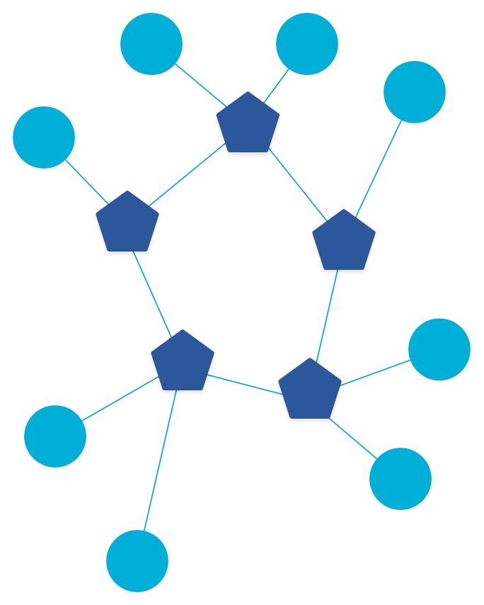
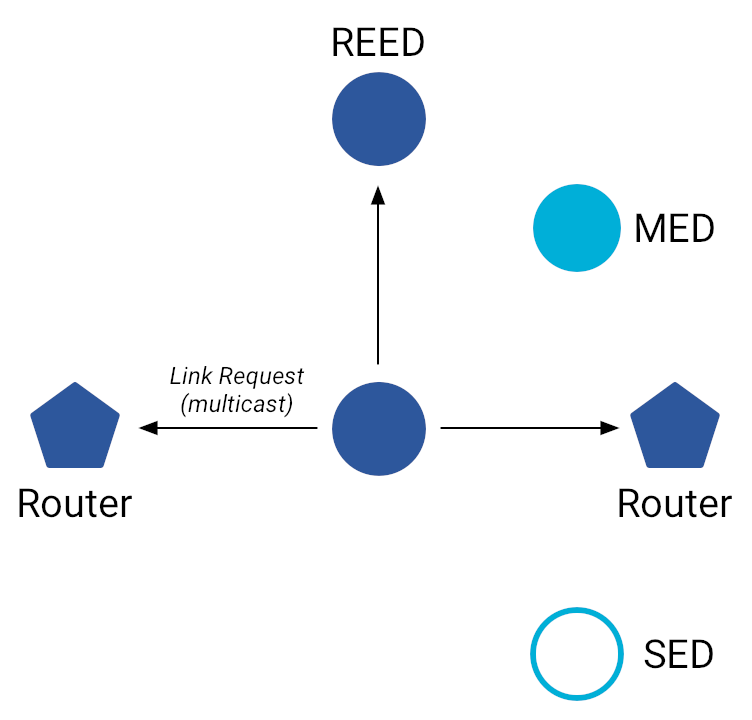
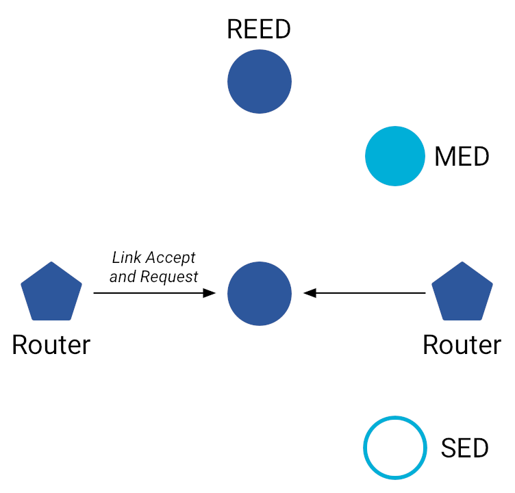
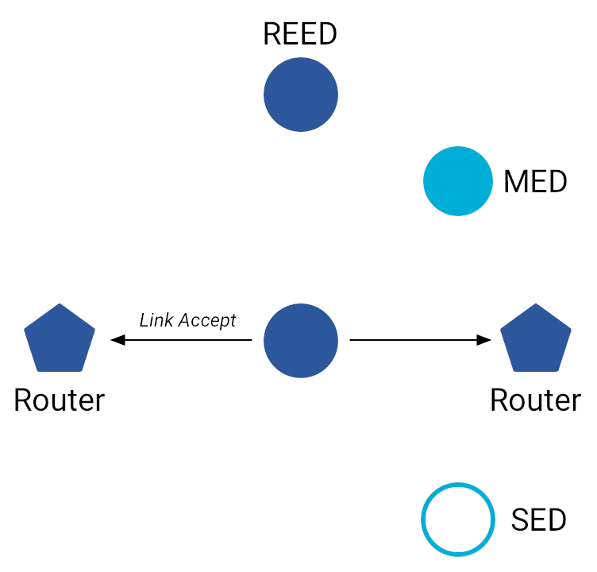

# Router Selection

## Connected Dominating Set

<figure class="attempt-right">
<figcaption style="text-align: center"><i>Example of a Connected Dominating Set</i></figcaption>
</figure>

Routers must form a Connected Dominating Set (CDS), which means:

1.  There is a Router-only path between any two Routers.
1.  Any one Router in a Thread network can reach any other Router by staying
    entirely within the set of Routers.
1.  Every End Device in a Thread network is directly connected to a Router.

A distributed algorithm maintains the CDS, which ensures a minimum level of
redundancy. Every device initially attaches to the network as an End Device
(Child). As the state of the Thread network changes, the algorithm adds or
removes Routers to maintain the CDS.

Thread adds Routers to:

*   Increase coverage if the network is below the Router threshold of 16
*   Increase path diversity
*   Maintain a minimum level of redundancy
*   Extend connectivity and support more Children

Thread removes Routers to:

*   Reduce the Routing state below the maximum of 32 Routers
*   Allow new Routers in other parts of the network when needed

## Upgrade to a Router

After attaching to a Thread network, the Child device may elect to become a
Router. Before initiating the MLE Link Request process, the Child sends an
Address Solicit message to the Leader, asking for a Router ID. If the Leader
accepts, it responds with a Router ID and the Child upgrades itself to a Router.

The MLE Link Request process is then used to establish bi-directional
Router-Router links with neighboring Routers.

1.  The new Router sends a multicast [Link Request](#1_link_request) to
    neighboring Routers.
1.  Routers respond with [Link Accept and Request](#2_link_accept_and_request)
    messages.
1.  The new Router responds to each Router with a unicast [Link
    Accept](#3_link_accept) to establish the Router-Router link.

### 1. Link Request

A Link Request is a request from the Router to all other Routers in the Thread
network. When first becoming a Router, the device sends a multicast Link Request
to `ff02::2`. Later, after discovering the other Routers via MLE Advertisements,
the devices send unicast Link Requests.

<figure>

</figure>

<table>
  <tbody>
    <tr>
      <th colspan=2>Link Request Message Contents</th>
    </tr>
    <tr>
      <td width="25%"><b>Version</b></td>
      <td>Thread protocol version</td>
    </tr>
    <tr>
      <td width="25%"><b>Challenge</b></td>
      <td>Tests the timeliness of the Link Response to prevent replay
        attacks</td>
    </tr>
    <tr>
      <td width="25%"><b>Source
        Address</b></td>
      <td>RLOC16 of the sender</td>
    </tr>
    <tr>
      <td width="25%"><b>Leader
        Data</b></td>
      <td>Information about the Router's Leader, as stored on the sender (RLOC,
        Partition ID, Partition weight)</td>
    </tr>
  </tbody>
</table>

### 2. Link Accept and Request

A Link Accept and Request is a combination of the Link Accept and Link Request
messages. Thread uses this optimization in the MLE Link Request process to
reduce the number of messages from four to three.

<figure>

</figure>

### 3. Link Accept

A Link Accept is a unicast response to a Link Request from a neighboring Router
that provides information about itself and accepts the link to the neighboring
Router.

<figure>

</figure>

<table>
  <tbody>
    <tr>
      <th colspan=2>Link Accept Message Contents</th>
    </tr>
    <tr>
      <td width="25%"><b>Version</b></td>
      <td>Thread protocol version</td>
    </tr>
    <tr>
      <td width="25%"><b>Response</b></td>
      <td>Tests the timeliness of the Link Response to prevent replay
        attacks</td>
    </tr>
    <tr>
      <td width="25%"><b>Link Frame
        Counter</b></td>
      <td>802.15.4 Frame Counter on the sender</td>
    </tr>
    <tr>
      <td width="25%"><b>MLE Frame
        Counter</b></td>
      <td>MLE Frame Counter on the sender</td>
    </tr>
    <tr>
      <td width="25%"><b>Source
        Address</b></td>
      <td>RLOC16 of the sender</td>
    </tr>
    <tr>
      <td width="25%"><b>Leader
        Data</b></td>
      <td>Information about the Router's Leader, as stored on the sender (RLOC,
        Partition ID, Partition weight)</td>
    </tr>
  </tbody>
</table>

## Downgrade to a REED

When a Router downgrades to a REED, its Router-Router links are disconnected,
and the device initiates the MLE Attach process to establish a Child-Parent
link.

See [Join an existing
network](network-discovery.md)
for more information on the MLE Attach process.

## One-way receive links

In some scenarios, it may be necessary to establish a one-way receive link.

After a Router reset, neighboring Routers may still have a valid receive link
with the reset Router. In this case, the reset Router sends a Link Request
message to re-establish the Router-Router link.

An End Device may also wish to establish a receive link with neighboring
non-Parent Routers to improve multicast reliability. We'll learn more about this
when we get to Multicast Routing.

## Recap

What you've learned:

*   Routers in a Thread network must form a Connected Dominating Set (CDS)
*   Thread devices are upgraded to Routers or downgraded to End Devices to
    maintain the CDS
*   The MLE Link Request process is used to establish Router-Router links

## Check your understanding

  <devsite-multiple-choice>
    
Which of these rules are not enforced by a Connected Dominating Set
    (CDS)?

    

      
There is a Router-only path between any two Routers.

      
Incorrect.

    

    

      
Any one Router in a Thread network can reach any other Router by
        staying entirely within the set of Routers.

      
Incorrect.

    

    

      
Every End Device in a Thread network is directly connected to a
        Router.

      
Incorrect.

    

    

      
Only one Router in a Thread network may be a Border Router.

      
Correct. A Thread network may have multiple Border Routers.

    

  </devsite-multiple-choice>

  <devsite-multiple-choice>
    
Why might a router be removed from a Thread network?

    

      
To reduce the Routing state below the maximum of 32 Routers.

      
Correct. Thread networks strive to maintain an optimal number of
        Routers. 32 Routers is the most that any Thread network should have.
      

    

    

      
To free up channels.

      
Incorrect. The number of routers has no relation to channel usage
      or capacity.

    

    

      
To allow the election of new Routers in other parts of the network
      when needed.

      
Correct. Reducing the number of active Routers in one part of a
      Thread network increases its ability to ramp up routing capacity
      elsewhere.

    

  </devsite-multiple-choice>

  <devsite-multiple-choice>
    
Which of the following statements correctly describe what happens when
      a Child device upgrades to a Router?

    

      
The device remains on the network with the same address.

      
That's right. The device stays connected to the network. Only its
        role changes.

    

    

      
The device must initiate the MLE Attach process to establish a new
        network connection.

      
Incorrect. The MLE Attach process is used when a device joins
        a Thread network. The process followed by a device upgrading to a Router
        is called the MLE Link Request Process.

    

    

      
The other Routers 'vote' to decide whether to allow the device to
        become a Router.

      
Incorrect. The Leader decides whether to allow the device to become a
      Router, based on the distributed algorithm that maintains the CDS.

    

</devsite-multiple-choice>

  <devsite-multiple-choice>
    
Which of the following statements accurately describes what happens
      when a Router downgrades?

    

      
The device automatically remains on the network but as a Child (REED)
      

      
Wrong. There are more steps involved when a Router downgrades.

    

    

      
The device must initiate the MLE Attach process to establish a new
        connection to the network.

      
Correct. A device that downgrades from Router to REED is
        disconnected and must renegotiate its connection to the network.

    

  </devsite-multiple-choice>

  <devsite-multiple-choice>
    
What process is used to establish Router-Router links?

    

      
The MLE Link Request process.

      
Correct.

    

    

      
The Link Accept and Request process.

      
Incorrect. There's no such thing as a Link Accept and Request process.
        Link Accept and Request messages are sent by Routers in
        response to Link Request messages as part of the MLE Link Request
        process.

    

    

      
Link Request process

      
Close, but still wrong. A Link Request is a request from the
        Router to all other Routers in the Thread network.

    

    

      
MLE Attach process

      
Incorrect. The MLE Attach process is the process by which a device
        joins an existing Thread network.

    

  </devsite-multiple-choice>

## License

Copyright (c) 2021, The OpenThread Authors.
All rights reserved.

Redistribution and use in source and binary forms, with or without
modification, are permitted provided that the following conditions are met:
1. Redistributions of source code must retain the above copyright
   notice, this list of conditions and the following disclaimer.
2. Redistributions in binary form must reproduce the above copyright
   notice, this list of conditions and the following disclaimer in the
   documentation and/or other materials provided with the distribution.
3. Neither the name of the copyright holder nor the
   names of its contributors may be used to endorse or promote products
   derived from this software without specific prior written permission.

THIS SOFTWARE IS PROVIDED BY THE COPYRIGHT HOLDERS AND CONTRIBUTORS "AS IS"
AND ANY EXPRESS OR IMPLIED WARRANTIES, INCLUDING, BUT NOT LIMITED TO, THE
IMPLIED WARRANTIES OF MERCHANTABILITY AND FITNESS FOR A PARTICULAR PURPOSE
ARE DISCLAIMED. IN NO EVENT SHALL THE COPYRIGHT HOLDER OR CONTRIBUTORS BE
LIABLE FOR ANY DIRECT, INDIRECT, INCIDENTAL, SPECIAL, EXEMPLARY, OR
CONSEQUENTIAL DAMAGES (INCLUDING, BUT NOT LIMITED TO, PROCUREMENT OF
SUBSTITUTE GOODS OR SERVICES; LOSS OF USE, DATA, OR PROFITS; OR BUSINESS
INTERRUPTION) HOWEVER CAUSED AND ON ANY THEORY OF LIABILITY, WHETHER IN
CONTRACT, STRICT LIABILITY, OR TORT (INCLUDING NEGLIGENCE OR OTHERWISE)
ARISING IN ANY WAY OUT OF THE USE OF THIS SOFTWARE, EVEN IF ADVISED OF THE
POSSIBILITY OF SUCH DAMAGE.
