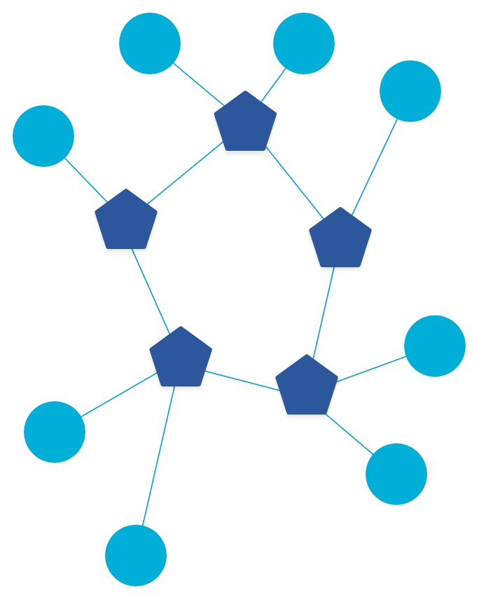
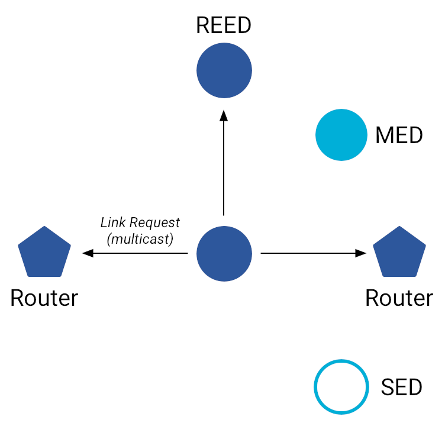
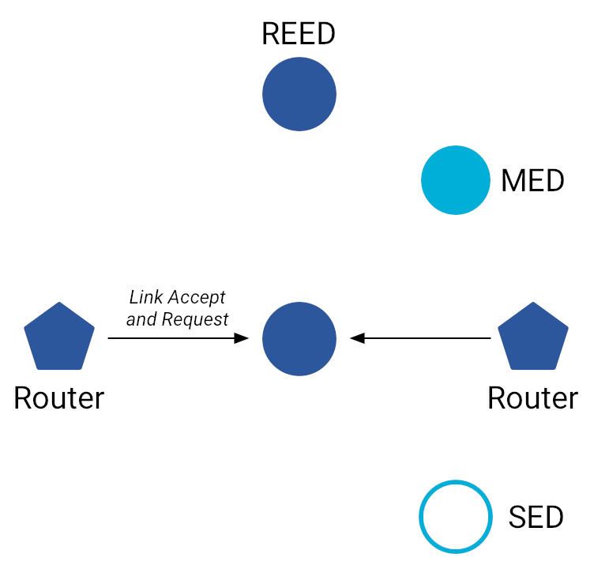
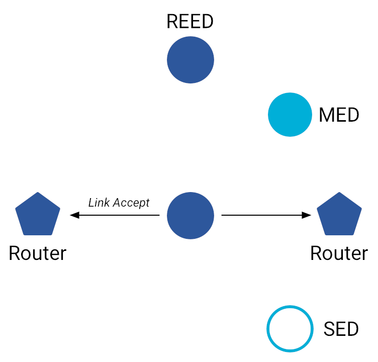

# Active Mesh Extender Selection

## Connected Dominating Set

<figure class="attempt-right">
<figcaption style="text-align: center"><i>Example of a Connected Dominating Set</i></figcaption>
</figure>

Active Mesh Extenders must form a Connected Dominating Set (CDS), which means:

1.  There is an Active Mesh Extender-only path between any two Active Mesh Extenders.
1.  Any one Active Mesh Extender in a Thread network can reach any other Active Mesh Extender by staying
    entirely within the set of Active Mesh Extenders.
1.  Every End Device in a Thread network is directly connected to an Active Mesh Extender.

A distributed algorithm maintains the CDS, which ensures a minimum level of
redundancy. Every device initially attaches to the network as an End Device
(Child). As the state of the Thread network changes, the algorithm adds or
removes Active Mesh Extenders to maintain the CDS.

Thread adds Active Mesh Extenders to:

*   Increase coverage if the network is below the Active Mesh Extender threshold of 16
*   Increase path diversity
*   Maintain a minimum level of redundancy
*   Extend connectivity and support more Children

Thread removes Active Mesh Extenders (switching them to Standby Mesh Extenders) to:

*   Keep the Routing state below the maximum of 32 Active Mesh Extenders
*   Allow new Active Mesh Extenders in other parts of the network when needed

## Upgrade to an Active Mesh Extender

After attaching to a Thread network, a Child device that is a Standby Mesh Extender may elect to
become an Active Mesh Extender. Before initiating the MLE Link
Request process, the Child sends an Address Solicit message to the
Leader, asking for a Router ID. If the Leader accepts, it responds
with a Router ID and the Child upgrades itself from a Standby Mesh Extender to an Active Mesh
Extender.

The MLE Link Request process is then used to establish bi-directional
Active Mesh Extender links with neighboring Active Mesh Extenders.

1.  The new Active Mesh Extender sends a multicast [Link Request](#1_link_request) to
    neighboring Active Mesh Extenders.
1.  Active Mesh Extenders respond with [Link Accept and Request](#2_link_accept_and_request)
    messages.
1.  The new Active Mesh Extender responds to each Active Mesh Extender with a unicast [Link
    Accept](#3_link_accept) to establish the Active Mesh Extender link.

### 1. Link Request

A Link Request is a request from the Active Mesh Extender to all other
Active Mesh Extenders in the Thread network. When first becoming an
Active Mesh Extender, the device sends a multicast Link Request to
`ff02::2`. Later, after discovering the other Active Mesh Extenders
via MLE Advertisements, the devices send unicast Link Requests.

<figure>

</figure>

<table>
  <tbody>
    <tr>
      <th colspan=2>Link Request Message Contents</th>
    </tr>
    <tr>
      <td width="25%"><b>Version</b></td>
      <td>Thread protocol version</td>
    </tr>
    <tr>
      <td width="25%"><b>Challenge</b></td>
      <td>Tests the timeliness of the Link Response to prevent replay
        attacks</td>
    </tr>
    <tr>
      <td width="25%"><b>Source
        Address</b></td>
      <td>RLOC16 of the sender</td>
    </tr>
    <tr>
      <td width="25%"><b>Leader
        Data</b></td>
      <td>Information about the Active Mesh Extender's Leader, as stored on the sender (RLOC,
        Partition ID, Partition weight)</td>
    </tr>
  </tbody>
</table>

### 2. Link Accept and Request

A Link Accept and Request is a combination of the Link Accept and Link Request
messages. Thread uses this optimization in the MLE Link Request process to
reduce the number of messages from four to three.

<figure>

</figure>

### 3. Link Accept

A Link Accept is a unicast response to a Link Request from a neighboring Active Mesh Extender
that provides information about itself and accepts the link to the neighboring
Active Mesh Extender.

<figure>

</figure>

<table>
  <tbody>
    <tr>
      <th colspan=2>Link Accept Message Contents</th>
    </tr>
    <tr>
      <td width="25%"><b>Version</b></td>
      <td>Thread protocol version</td>
    </tr>
    <tr>
      <td width="25%"><b>Response</b></td>
      <td>Tests the timeliness of the Link Response to prevent replay
        attacks</td>
    </tr>
    <tr>
      <td width="25%"><b>Link Frame
        Counter</b></td>
      <td>802.15.4 Frame Counter on the sender</td>
    </tr>
    <tr>
      <td width="25%"><b>MLE Frame
        Counter</b></td>
      <td>MLE Frame Counter on the sender</td>
    </tr>
    <tr>
      <td width="25%"><b>Source
        Address</b></td>
      <td>RLOC16 of the sender</td>
    </tr>
    <tr>
      <td width="25%"><b>Leader
        Data</b></td>
      <td>Information about the Active Mesh Extender's Leader, as stored on the sender (RLOC,
        Partition ID, Partition weight)</td>
    </tr>
  </tbody>
</table>

## Downgrade to a Standby Mesh Extender

When an Active Mesh Extender downgrades to a Standby Mesh Extender,
its Active Mesh Extender links are disconnected, and the device initiates the
MLE Attach process to establish a Child-Parent link.

See [Join an existing
network](network-discovery.md)
for more information on the MLE Attach process.

## One-way receive links

In some scenarios, it may be necessary to establish a one-way receive link.

After an Active Mesh Extender reset, neighboring Active Mesh Extenders
may still have a valid receive link with the reset Active Mesh
Extender. In this case, the reset Active Mesh Extender sends a Link
Request message to re-establish the existing valid link.

An End Device may also wish to establish a receive link with
neighboring non-Parent Active Mesh Extenders to improve multicast
reliability. We'll learn more about this when we get to Multicast
Routing.

## Recap

What you've learned:

*   Active Mesh Extenders in a Thread network must form a Connected Dominating Set (CDS)
*   Thread devices (of the Mesh Extender device type) can be upgraded to Active Mesh Extenders or downgraded to Standby Mesh Extenders to
    maintain the CDS
*   The MLE Link Request process is used to establish Active Mesh Extender links

## Check your understanding

  <devsite-multiple-choice>
    
Which of these rules are not enforced by a Connected Dominating Set
    (CDS)?

    

      
There is an Active Mesh Extender-only path between any two Active Mesh Extenders.

      
Incorrect.

    

    

      
Any one Active Mesh Extender in a Thread network can reach any other Active Mesh Extender by
        staying entirely within the set of Active Mesh Extenders.

      
Incorrect.

    

    

      
Every End Device in a Thread network is directly connected to an
        Active Mesh Extender.

      
Incorrect.

    

    

      
Only one Active Mesh Extender in a Thread network may be a Border Router.

      
Correct. A Thread network may have multiple Border Routers.

    

  </devsite-multiple-choice>

  <devsite-multiple-choice>
    
Why might an Active Mesh Extender be removed (i.e. downgraded to a Standby Mesh Extender) from a Thread network?

    

      
To keep the Routing state below the maximum of 32 Active Mesh Extenders.

      
Correct. Thread networks strive to maintain an optimal number of
        Active Mesh Extenders. The most Active Mesh Extenders that any Thread network should have is 32.
      

    

    

      
To free up channels.

      
Incorrect. The number of Active Mesh Extenders has no relation to channel usage
      or capacity.

    

    

      
To allow the election of new Active Mesh Extenders in other parts of the network
      when needed.

      
Correct. Reducing the number of Active Mesh Extenders in one part of a
      Thread network increases its ability to ramp up routing capacity
      elsewhere.

    

  </devsite-multiple-choice>

  <devsite-multiple-choice>
    
What must happen before a Standby Mesh Extender that is attempting to become
    an Active Mesh Extender can establish direct links with the other Active Mesh Extenders?

    

      
The Standby Mesh Extender must send an Address Solicit message to the network Leader.
      

      
Correct.

    

    

      
The Leader must grant a Router ID to the Standby Mesh Extender.

      
Correct. Without a Router ID, the Standby Mesh Extender remains an End Device (Child).

    

    

      
The Standby Mesh Extender must send an MLE Link Request.

      
Wrong. The MLE Link Request is how the device establishes links to
      other Active Mesh Extenders once it has become an Active Mesh Extender.

    

  </devsite-multiple-choice>

  <devsite-multiple-choice>
    
Which of the following statements accurately describes what happens
      when an Active Mesh Extender downgrades?

    

      
The device automatically remains on the network but as a Child (Standby Mesh Extender).
      

      
Wrong. There are more steps involved when an Active Mesh Extender downgrades.

    

    

      
The device must initiate the MLE Attach process to establish a new
        connection to the network.

      
Correct. A device that downgrades from an Active Mesh Extender to a Standby Mesh Extender is
        disconnected and must renegotiate its connection to the network.

    

  </devsite-multiple-choice>

  <devsite-multiple-choice>
    
What process is used to establish Active Mesh Extender links?

    

      
The MLE Link Request process.

      
Correct.

    

    

      
The Link Accept and Request process.

      
Incorrect. There's no such thing as a Link Accept and Request process.
        Link Accept and Request <em>messages</em> are sent by Active Mesh Extenders in
        response to Link Request messages as part of the MLE Link Request
        process.

    

    

      
The MLE Attach process.

      
Incorrect. The MLE Attach process is the process by which a device
        joins an existing Thread network.

    

  </devsite-multiple-choice>

## License

Copyright (c) 2021-2022, The OpenThread Authors.
All rights reserved.

Redistribution and use in source and binary forms, with or without
modification, are permitted provided that the following conditions are met:
1. Redistributions of source code must retain the above copyright
   notice, this list of conditions and the following disclaimer.
2. Redistributions in binary form must reproduce the above copyright
   notice, this list of conditions and the following disclaimer in the
   documentation and/or other materials provided with the distribution.
3. Neither the name of the copyright holder nor the
   names of its contributors may be used to endorse or promote products
   derived from this software without specific prior written permission.

THIS SOFTWARE IS PROVIDED BY THE COPYRIGHT HOLDERS AND CONTRIBUTORS "AS IS"
AND ANY EXPRESS OR IMPLIED WARRANTIES, INCLUDING, BUT NOT LIMITED TO, THE
IMPLIED WARRANTIES OF MERCHANTABILITY AND FITNESS FOR A PARTICULAR PURPOSE
ARE DISCLAIMED. IN NO EVENT SHALL THE COPYRIGHT HOLDER OR CONTRIBUTORS BE
LIABLE FOR ANY DIRECT, INDIRECT, INCIDENTAL, SPECIAL, EXEMPLARY, OR
CONSEQUENTIAL DAMAGES (INCLUDING, BUT NOT LIMITED TO, PROCUREMENT OF
SUBSTITUTE GOODS OR SERVICES; LOSS OF USE, DATA, OR PROFITS; OR BUSINESS
INTERRUPTION) HOWEVER CAUSED AND ON ANY THEORY OF LIABILITY, WHETHER IN
CONTRACT, STRICT LIABILITY, OR TORT (INCLUDING NEGLIGENCE OR OTHERWISE)
ARISING IN ANY WAY OUT OF THE USE OF THIS SOFTWARE, EVEN IF ADVISED OF THE
POSSIBILITY OF SUCH DAMAGE.
